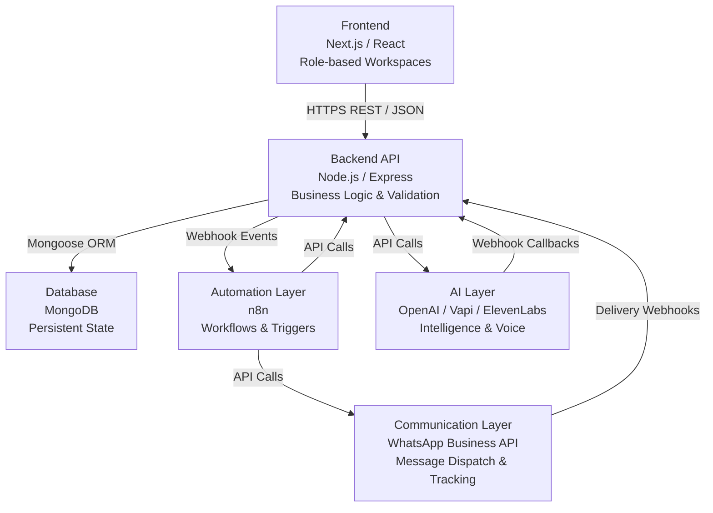

# 01 — SchoolOS AI: Product Bible

> **Document Status:** Living Foundation Document — v1.0  
> **Classification:** Engineering Design Document (EDD)  
> **Audience:** Frontend Engineers, Backend Engineers, AI Engineers, Automation Engineers, UI/UX Designers, QA Engineers, Product Managers, Future CTOs  
> **Last Updated:** 2026-06-27  
> **Maintained by:** Principal Architecture Team

---

## Table of Contents

1. [Executive Summary](#1-executive-summary)
2. [Product Identity](#2-product-identity)
3. [Product Philosophy](#3-product-philosophy)
4. [Product Design Principles](#4-product-design-principles)
5. [Target Users](#5-target-users)
6. [MVP Scope](#6-mvp-scope)
7. [Out of Scope](#7-out-of-scope)
8. [Workspace Philosophy](#8-workspace-philosophy)
9. [Communication Engine Vision](#9-communication-engine-vision)
10. [AI Voice Engine Vision](#10-ai-voice-engine-vision)
11. [Automation Philosophy](#11-automation-philosophy)
12. [Product Architecture Philosophy](#12-product-architecture-philosophy)
13. [User Experience Rules](#13-user-experience-rules)
14. [Product Quality Standards](#14-product-quality-standards)
15. [Non-Functional Requirements](#15-non-functional-requirements)
16. [Success Metrics](#16-success-metrics)
17. [Future Roadmap](#17-future-roadmap)
18. [Engineering Rules](#18-engineering-rules)
19. [Acceptance Criteria](#19-acceptance-criteria)

---

## 1. Executive Summary

SchoolOS AI is an enterprise-grade School Operating System designed to replace the inefficient, fragmented, and passive tools that currently run most K–12 institutions. It is not a traditional School ERP. It does not exist to store records and generate reports. It exists to help every person inside a school — admin, reception staff, and teachers — complete their daily operational work faster, with fewer errors, and with full accountability.

The product is built on a single foundational belief: **a school is a living organization, and its software should behave like one.**

Every screen in SchoolOS AI is a workspace. Every card is an action. Every workflow is automated where possible and AI-assisted where judgment is needed. Every piece of communication is tracked, templated, and auditable.

SchoolOS AI is positioned as the operating layer between school staff and the outcomes they are responsible for — student admissions, attendance, parent communication, appointment scheduling, and daily operations. It brings together a Communication Engine, an AI Voice Engine, an Automation Layer, and role-specific Workspaces into a single coherent product experience.

This document defines that product permanently. It is the single source of truth for every architectural, product, and design decision made on this platform.

---

## 2. Product Identity

### 2.1 What SchoolOS AI Is

SchoolOS AI is a **School Operating System** — a unified, AI-assisted, automation-first platform through which school staff manage every aspect of school operations that touches people: students, parents, teachers, and prospects.

It is:

- A **workflow platform** — every module exists to complete real work, not to display information
- A **communication hub** — every interaction with a parent or student is tracked, templated, and orchestrated through a single engine
- An **AI-augmented workspace** — AI handles repetitive judgment tasks so staff can focus on human decisions
- An **automation backbone** — workflows that would normally require manual steps are triggered automatically, audited, and surfaced to the right person
- An **operational record** — everything that happens in the platform is stored, timestamped, and retrievable

### 2.2 What SchoolOS AI Is Not

SchoolOS AI is explicitly **not**:

- A traditional School ERP (MIS system focused on data storage and printed reports)
- A learning management system (LMS)
- A student-facing academic platform
- A timetable generator or exam management tool
- A decorative analytics dashboard
- A product full of vanity metrics, dummy charts, and fake activity feeds

### 2.3 The Central Distinction

Traditional school software asks: *"What data do we have?"*

SchoolOS AI asks: ***"What does this person need to do right now, and how do we make it effortless?"***

This distinction informs every product decision — what gets built, how screens are designed, what buttons exist, what AI does, and what gets cut.

---

## 3. Product Philosophy

### 3.1 SchoolOS AI Is an Operating System

The name is intentional. An operating system does not just store files — it orchestrates resources, manages processes, provides interfaces to capabilities, and ensures that applications running on top of it behave correctly.

SchoolOS AI does the same for a school:

- It manages **people** (students, staff, parents, prospects)
- It orchestrates **processes** (admissions, attendance, communication, appointments)
- It provides **interfaces** (role-specific workspaces) to the school's operational capabilities
- It ensures **consistency** across all workflows through automation and audit

### 3.2 Every Workspace Exists to Complete Work

There are no screens in SchoolOS AI that exist purely for display. Every workspace is designed around a specific user with specific tasks to complete in a specific time window.

If a screen cannot be tied to a workflow — a real action that changes state, triggers communication, updates a record, or produces an output — that screen should not exist.

### 3.3 No Fake Dashboards

A fake dashboard is one where the numbers are visible but not actionable. Where a chart shows "attendance rate: 83%" but no person is accountable for improving it and no workflow helps them do so.

SchoolOS AI prohibits fake dashboards by design. Every metric displayed must:

1. Be owned by a specific role
2. Link directly to the list of records that comprise it
3. Offer at least one action to change it

### 3.4 No Decorative Analytics

Analytics exist in SchoolOS AI only when they drive decisions. A graph showing WhatsApp delivery rates is useful only because a reception staff member can use it to identify campaigns that failed and re-send them.

If a chart cannot be acted upon within the same screen, it does not belong in the MVP.

### 3.5 No Dummy Buttons

Every button in the interface must trigger a real backend workflow. Buttons that are greyed out indefinitely, that show "coming soon" in production, or that open modals that do nothing are a product failure. They destroy trust.

### 3.6 No Placeholder Widgets

Placeholder widgets — empty cards that say "add data to see insights" — should not exist on any production screen. If data is not available, the empty state must describe a clear action the user can take to generate that data.

### 3.7 No Vanity Metrics

Vanity metrics include total registered students, total messages sent all-time, and aggregate numbers that look impressive but have no operational use. SchoolOS AI tracks what matters operationally: today's pending tasks, today's absent students, this week's unanswered inquiries, and this month's campaign open rates.

### 3.8 Automation Reduces Manual Effort

The most expensive resource in any school is staff time. Automation in SchoolOS AI exists to reclaim that time. When an inquiry form is submitted, a WhatsApp message should be sent automatically. When a student is absent three days in a row, the parent should be notified without a teacher needing to initiate it. When a meeting is booked, a confirmation should be dispatched without reception staff touching anything.

### 3.9 AI Assists — It Does Not Replace

AI in SchoolOS AI is an assistant. It drafts a follow-up message for a parent — the reception staff reviews and sends it. It transcribes a phone call — the teacher reviews and adds notes. It suggests the next action — the admin approves it.

AI never acts on behalf of the school without a human in the loop. This is a non-negotiable product principle.

### 3.10 Users Never See the Infrastructure

No user of SchoolOS AI should ever encounter the word "n8n," "webhook," "workflow trigger," or "API endpoint." These are implementation details. Users see business language: "Send Follow-up," "Trigger Reminder," "Re-engage Campaign," "Schedule Call."

The infrastructure is invisible. The outcome is the product.

---

## 4. Product Design Principles

### 4.1 Apple-Inspired Simplicity

Every element on screen must justify its existence. If removing an element does not break the user's ability to complete their task, it should be removed. Whitespace is not wasted space — it is intentional visual breathing room that focuses the user's attention on what matters.

Complexity must be absorbed by the system, not exposed to the user.

### 4.2 Minimal Clicks, Maximum Clarity

The path from a user's intent to a completed action should require as few clicks as possible. This is not about shortcuts — it is about designing workflows where the next step is always obvious and immediately accessible from where the user currently is.

Clarity means the user never has to think about where to find something. Navigation, labels, and hierarchy must match how school staff actually think about their work — not how developers have organized the database.

### 4.3 Accessibility First

SchoolOS AI is used by school staff who range in age, technical literacy, and visual acuity. Accessibility is not an afterthought:

- Minimum contrast ratio of 4.5:1 for all text
- Touch targets no smaller than 44×44 points
- All interactive elements must be keyboard-navigable
- No information conveyed by color alone
- Error messages must describe what went wrong and what to do next

### 4.4 Large Touch Targets

Reception staff and teachers frequently use the platform on tablets and mobile devices in fast-paced environments. Touch targets must be generous. Interactive elements that are too small to tap accurately without zooming represent a design failure.

### 4.5 Premium SaaS Quality

SchoolOS AI competes visually and functionally with world-class SaaS products like Notion, Linear, and Stripe. Every screen should feel like it belongs to that tier of product. This means:

- Consistent type hierarchy
- Precisely defined spacing scale
- Purposeful use of motion and transition
- States for loading, empty, error, and success on every component
- Dark mode support from day one

### 4.6 Glassmorphism and Liquid Glass Aesthetic

The SchoolOS AI design language uses a controlled glassmorphic visual style — frosted translucent surfaces, subtle border glow, depth through blur — to communicate hierarchy and priority without adding cognitive noise. This is not a trend choice; it is a functional one. Glassmorphism allows layered information (sidebars, modals, floating actions) to coexist without visual collision.

The term "Liquid Glass" refers to surfaces that feel responsive — elements that subtly react to hover, focus, and state change with micro-animations that communicate system response without distracting from the task.

### 4.7 Enterprise Usability

SchoolOS AI must work in schools that have 1,000+ students, 50+ staff members, and thousands of parent records. UI choices must account for high-volume scenarios:

- Long lists must be searchable, filterable, and paginatable
- Bulk operations must be available wherever relevant
- Actions that affect many records must require confirmation
- No UI pattern that works at 10 records but breaks at 10,000

### 4.8 Production-Ready Quality

No feature should ever be shipped in a half-built state. A feature that exists in the UI but does nothing is worse than no feature at all. The product must only expose functionality that is fully backed by a working API, a working automation workflow, and a tested user path.

### 4.9 Operational Workflows Over Content Management

SchoolOS AI is a tool for operational work, not a CMS. Screens should be designed around the tasks users complete, not around the data objects in the database. The question for every screen design is not "what fields does this entity have?" but "what is this user trying to accomplish, and how do we make that effortless?"

### 4.10 Real-World Usability

Design decisions are validated against real school workflows, not abstract use cases. A reception staff member processing 20 admission inquiries on a Tuesday morning is the reference scenario. A teacher marking attendance for 35 students while standing in a classroom is the reference scenario. Designs must hold up under those conditions.

---

## 5. Target Users

### 5.1 MVP Roles

#### 5.1.1 Admin

**Who they are:** The school administrator is the person responsible for the overall operations of the institution. They may be the principal, operations head, or a senior administrator. They have authority over all staff, all students, and all communications.

**Responsibilities:**
- Overseeing student admissions from inquiry to enrollment
- Managing school staff and their roles
- Monitoring communication campaigns and their effectiveness
- Reviewing audit logs for compliance and quality
- Configuring system-wide settings: templates, variables, user roles
- Approving high-stakes workflows that require authorization

**Goals:**
- Complete visibility into what is happening across the school without needing to ask staff
- Ability to identify and resolve operational bottlenecks quickly
- Confidence that all communications are consistent, on-brand, and auditable
- Reduction in time spent on status updates and manual coordination

**Daily Workflow:**
The admin begins their day in the Admin Workspace where they review a prioritized operational view. They check outstanding admission inquiries, review any flagged student communications, monitor campaign performance from the previous day, audit any errors in automated workflows, and assign tasks where human judgment is needed. They may configure a new campaign for a fee deadline reminder, review a call transcript from the AI Voice Engine, or update the admission inquiry template for the new term.

**Pain Points (Before SchoolOS AI):**
- Information scattered across WhatsApp groups, spreadsheets, and email threads
- No single view of the school's operational state
- Staff completing tasks inconsistently with no audit trail
- Campaigns built manually by copying and pasting into WhatsApp Web
- No way to know which parent was contacted, when, and with what outcome

**How SchoolOS AI Solves Them:**
- Unified Admin Workspace with operational priorities surfaced at the top
- Full Communication History with timestamps, delivery status, and staff attribution
- Audit Log for every action taken in the system
- Campaign Engine with audience builder, template selection, and scheduled dispatch
- Role-based access so staff only see and do what their role permits

---

#### 5.1.2 Reception

**Who they are:** Reception staff are the operational frontline of the school. They process inquiries, schedule appointments, manage parent communications, handle walk-in visitors, and coordinate admissions. They are typically non-technical users with very high daily task volume.

**Responsibilities:**
- Receiving and qualifying admission inquiries
- Scheduling parent appointments
- Sending follow-up messages and reminders to parents
- Updating student and parent contact records
- Processing admission applications through the workflow stages
- Answering phone calls and logging outcomes

**Goals:**
- Process every inquiry without anything falling through the cracks
- Send the right message to the right parent at the right time, with minimal effort
- Know exactly which parents are pending follow-up and when
- Complete appointment booking and confirmation in under two minutes

**Daily Workflow:**
Reception staff arrive and open the Reception Workspace. Their first view is a prioritized task list — inquiries that arrived overnight, parents who have not received a follow-up in 48 hours, appointments scheduled for today, and any tasks assigned by the admin. They process inquiries one by one: reviewing the parent's information, updating their stage in the admission pipeline, and sending a templated WhatsApp message with one click. They confirm appointments using the scheduling module. At the end of the day, they review any pending communications and ensure nothing is outstanding.

**Pain Points (Before SchoolOS AI):**
- Inquiries coming from multiple channels with no unified inbox
- Follow-ups tracked manually in a notebook or spreadsheet
- Messages written from scratch every time with inconsistent quality
- No record of whether a parent received a message or opened it
- Appointment scheduling done through WhatsApp back-and-forth

**How SchoolOS AI Solves Them:**
- Unified Inquiry Inbox with stage-based pipeline view
- Follow-up queue showing every parent pending action, sorted by urgency
- Template Engine with one-click message dispatch
- WhatsApp delivery and read status visible per parent
- Appointment booking with automated confirmation messaging

---

#### 5.1.3 Teacher

**Who they are:** Teachers are responsible for managing their class, marking attendance, communicating with parents about student performance and behavior, and completing administrative tasks assigned by the school.

**Responsibilities:**
- Marking daily attendance for their class
- Communicating with parents about individual student matters
- Completing tasks assigned by the admin or reception
- Reviewing student profiles when needed

**Goals:**
- Complete attendance in under one minute per class
- Send a parent communication without leaving the student's profile
- Receive and complete assigned tasks without switching between tools
- Access student information without navigating complex menus

**Daily Workflow:**
The teacher opens the Teacher Workspace at the start of class. They access their class list and mark attendance — present, absent, or late — for each student with a single tap. The system automatically identifies students who have been absent multiple times and surfaces them. The teacher sends a WhatsApp message to the parent of an absent student using a pre-approved template, customized with the student's name. They complete any tasks assigned to them and check if any admin communications need their input.

**Pain Points (Before SchoolOS AI):**
- Attendance taken on paper and then entered into a digital system later
- Parent communication through personal WhatsApp, creating informal and untracked records
- Tasks communicated verbally or through group chats with no tracking
- Student information stored in a separate system requiring separate login

**How SchoolOS AI Solves Them:**
- One-screen attendance interface optimized for speed
- Parent messaging directly from student profile, using approved templates
- Task module with assigned tasks, deadlines, and completion tracking
- Unified student profile with all relevant information in one place

---

### 5.2 Future Roles (Out of MVP Scope)

The following roles are planned for future versions of SchoolOS AI. They are listed here to establish architectural awareness — the system must be built with extensible role management from day one — but none of these roles' workspaces will be built in the MVP.

- **Principal** — Strategic oversight, staff performance, cross-department reporting
- **Accountant** — Fee collection, outstanding payments, financial reporting
- **Transport Manager** — Route management, vehicle tracking, student transport records
- **Librarian** — Book inventory, issue and return tracking, overdue notifications
- **Hostel Warden** — Resident management, room allocation, incident tracking
- **Parent** — Self-service portal for viewing attendance, fee status, and communications
- **Student** — Self-service portal for academic schedule, assignments, and attendance

---

## 6. MVP Scope

This section defines the exact scope of Version 1 of SchoolOS AI. Every feature listed here must be fully functional, fully tested, and fully connected to the backend before the product ships.

### 6.1 Authentication

- Email and password authentication
- Role-based login routing (each role lands in their respective workspace on login)
- Session management with secure token handling
- Password reset via email
- Single active session enforcement per user

### 6.2 Role Management

- Predefined roles: Admin, Reception, Teacher
- Role assignment by Admin only
- Role-based permissions enforced at the API level, not just the UI level
- Admin can create, deactivate, and reassign staff accounts
- Role changes take effect immediately without requiring re-login

### 6.3 Student Management

- Student profile with personal details, parent/guardian links, class assignment, and enrollment status
- Student timeline showing all communications, attendance records, and notes
- Student search with filter by class, status, and admission stage
- Bulk import via CSV for initial school data migration
- Student status transitions: Inquiry → Applied → Enrolled → Alumni → Withdrawn

### 6.4 Parent Management

- Parent profile linked to one or more students
- Parent communication history (WhatsApp messages, AI calls, notes)
- Parent contact verification (phone number validation)
- Opt-out management for communication preferences
- Multiple contact numbers per parent with primary contact designation

### 6.5 Admissions

- Inquiry intake: manual entry and (future) form submission
- Pipeline view: stage-based admission workflow (Inquiry → Follow-up → Visit Scheduled → Applied → Decision → Enrolled)
- Stage-based automated triggers for communication
- Admission notes per inquiry
- Source tracking (how did the parent hear about the school)
- Conversion rate visibility per stage for Admin

### 6.6 Appointments

- Appointment scheduling linked to student or parent record
- Available time slot management by Admin
- Appointment confirmation via automated WhatsApp message
- Appointment reminder dispatch (24 hours before)
- Appointment outcome logging (attended, no-show, rescheduled)
- Calendar view for Admin and Reception

### 6.7 Attendance

- Class-level attendance marking (present, absent, late)
- Daily attendance view per teacher
- Student-level attendance history
- Consecutive absence detection with alert trigger
- Attendance percentage calculation per student
- Attendance report accessible to Admin

### 6.8 Communication Engine

The Communication Engine is a first-class module. See [Section 9](#9-communication-engine-vision) for full architectural vision.

MVP features include:
- Manual WhatsApp message dispatch from any student or parent record
- Template-based message composition
- Variable substitution in templates
- Delivery and read status tracking
- Communication history per parent and student
- Bulk messaging via Campaign Engine

### 6.9 Campaign Engine

- Audience builder: filter students/parents by class, stage, status, tag, or date criteria
- Campaign creation: select audience, choose template, schedule dispatch time
- Campaign dispatch via WhatsApp
- Campaign performance: sent, delivered, read, replied counts
- Campaign history with full audit trail
- Re-engagement: resend to unread recipients

### 6.10 WhatsApp Messaging

- Official WhatsApp Business API integration
- Template message support (pre-approved by Meta)
- Session message support (within 24-hour window)
- Delivery status webhook processing
- Read receipt capture
- Reply capture and routing to Communication History
- Opt-out handling

### 6.11 AI Voice Calling

See [Section 10](#10-ai-voice-engine-vision) for full architectural vision.

MVP features include:
- Manual AI call initiation from parent record
- Pre-call prompt selection (from approved prompt library)
- Post-call transcript
- Post-call summary (AI-generated)
- Intent detection from transcript
- Follow-up task generation based on call outcome
- Call history per parent
- Call budget monitoring per school

### 6.12 Notifications

- In-app notifications for assigned tasks, campaign completion, call completion, and system alerts
- WhatsApp notification dispatch for appointment confirmations and reminders
- Notification preferences manageable by Admin
- Notification history with read/unread state

### 6.13 Tasks

- Task creation by Admin or Reception
- Task assignment to specific staff members (by role or by name)
- Task priority: high, medium, low
- Task due date and reminder
- Task completion logging
- Task history per staff member
- Tasks linked to student, parent, or standalone

### 6.14 Reports

- Attendance report: by class, by student, by date range
- Admission pipeline report: conversion rates by stage
- Communication report: messages sent, delivery rates, reply rates
- Campaign report: per-campaign performance
- Call report: calls made, outcomes, follow-up completion rate
- All reports are exportable to CSV

### 6.15 Audit Logs

- System-wide audit log accessible to Admin only
- Every record creation, update, deletion is logged
- Every message dispatched is logged with sender, recipient, timestamp, content, and delivery status
- Every login and logout is logged
- Audit log is immutable — no user can delete or modify entries
- Audit log is searchable and filterable by date, user, action type, and entity

### 6.16 Template Engine

- Admin-managed library of message templates
- Templates categorized by use case: admission, appointment, attendance, campaign, follow-up
- Templates support variable placeholders
- Template approval workflow for WhatsApp-regulated templates
- Template version history

### 6.17 Variable Engine

- System-defined variables: student name, parent name, class, date, school name, appointment time
- Admin-defined custom variables tied to student or parent records
- Variable preview in template editor
- Variable validation before message dispatch (flags missing variable values)

### 6.18 Communication History

- Unified timeline per parent showing all interactions: WhatsApp messages, AI calls, notes, appointment logs
- Filterable by communication type, date range, and staff member
- Each entry shows content, outcome, and the staff member responsible
- Communication timeline visible from student profile, parent profile, and Admin dashboard

---

## 7. Out of Scope

The following features and modules are explicitly excluded from Version 1. They are listed to prevent scope creep and to communicate intentional boundaries to the engineering team. Requests to include these features in the MVP must be escalated to the product lead with a written business case.

### 7.1 Excluded Modules

| Module | Reason for Exclusion |
|---|---|
| Transport Management | Requires GPS integration, route optimization, and a separate driver-facing interface. Planned for v2. |
| Library Management | Requires inventory management and a librarian-specific workflow. Planned for v2. |
| Hostel Management | Requires room allocation, maintenance tracking, and warden-specific workflows. Planned for v3. |
| Inventory Management | Requires warehouse-level tracking and procurement workflows. Planned for future. |
| Payroll Management | Requires HR integration, tax computation, and compliance reporting. Planned for future. |
| Timetable Generator | Requires constraint-based scheduling algorithms and teacher availability mapping. Planned for v2. |
| Exam Management | Requires mark entry, result computation, grade card generation, and academic calendar integration. Planned for v2. |
| Learning Management System | Requires content management, assignment submission, and student-facing interfaces. Planned for v3. |
| Realtime Collaboration (Socket.IO) | Adds infrastructure complexity without proportional MVP value. Planned for v2. |
| Advanced Analytics / Predictive AI | Requires sufficient historical data that only accumulates post-launch. Planned for v3. |
| Visitor Management | Requires physical access control integration. Planned for future. |
| Email Communication Channel | Communication Engine will add email after WhatsApp is stable and adoption is confirmed. |
| SMS Communication Channel | Delivery rates and cost model need validation post-launch. |
| Parent Portal / App | Requires separate product surface, authentication flow, and UX. Planned for v2. |
| Student App | Same rationale as Parent Portal. Planned for v2. |
| Fee Management | Requires payment gateway integration, receipt generation, and financial audit trails. Planned for v2. |

### 7.2 Technical Exclusions

- No public API documentation (v1 is an internal-only platform)
- No multi-tenant architecture switching in the UI (single school instance per deployment in MVP; SaaS multi-tenancy is a v2 infrastructure concern)
- No offline mode
- No native mobile application (web-responsive only)

---

## 8. Workspace Philosophy

### 8.1 Why Workspaces Instead of Dashboards

A dashboard is a passive surface. It shows information. It asks nothing of the user and guides them nowhere. A dashboard is useful for a manager reviewing end-of-month reports. It is useless for a reception staff member who has 30 inquiries to process before noon.

A workspace is an active surface. It shows information in the context of action. Every piece of data on a workspace screen is there because it needs to be acted upon. The user arrives at their workspace and immediately knows what to do.

SchoolOS AI replaces all dashboards with workspaces. The architectural difference is:

- **Dashboard:** "Here is the data. Decide what to do."
- **Workspace:** "Here is what you need to do. Here is the data to do it. Here is the action."

This is not a UI preference. It is the product's core value proposition to the school staff who use it every day.

### 8.2 Admin Workspace

**Purpose:** Give the school administrator complete operational awareness and the ability to resolve blockers across all modules without switching contexts.

**Primary Workflows:**
1. Review the daily operational summary: pending inquiries, today's appointments, recent campaign performance, outstanding staff tasks
2. Manage staff accounts and role assignments
3. Configure templates, variables, and communication settings
4. Review audit logs for compliance
5. Initiate or review AI voice campaigns
6. Manage the admission pipeline at a strategic level (conversion rates, bottlenecks)

**Expected Daily Usage:** 1–3 hours, typically in the morning (operational review) and afternoon (configuration and review).

**Problems Solved:**
- Eliminates the need to ask staff for status updates
- Provides a single point of authority for system configuration
- Ensures all communications are on-brand and auditable
- Surfaces operational bottlenecks before they become crises

**Key Components:**
- Priority Action List — tasks and alerts requiring Admin attention today
- Admission Pipeline Overview — live stage counts with conversion percentages
- Communication Health — delivery rate, pending replies, failed messages
- Campaign Status — in-flight and recently completed campaigns
- Staff Activity Log — recent actions by staff members
- Quick Actions — trigger campaign, assign task, create template, view audit log

---

### 8.3 Reception Workspace

**Purpose:** Equip reception staff to process every inquiry, appointment, and parent communication within a single screen with no context switching.

**Primary Workflows:**
1. Process the inquiry queue — review new inquiries, update stage, send templated message, log notes
2. Confirm and manage today's appointments
3. Follow up with parents who haven't been contacted in 48+ hours
4. Send WhatsApp messages using templates with one click
5. Log outcomes of parent conversations
6. Complete tasks assigned by Admin

**Expected Daily Usage:** 6–8 hours (primary daily tool for reception staff).

**Problems Solved:**
- Eliminates missed follow-ups through a visible, sortable pending queue
- Eliminates manual message composition through the template engine
- Eliminates appointment scheduling friction through the booking and confirmation module
- Creates a complete, auditable record of every parent interaction

**Key Components:**
- Inquiry Queue — all open inquiries sorted by last contact date and urgency
- Today's Appointments — schedule view with confirmation and outcome logging
- Follow-up Queue — parents requiring contact sorted by time since last contact
- Quick Message Panel — inline template selection and dispatch from the queue
- Task List — tasks assigned to reception staff
- Search — immediate access to any student or parent record

---

### 8.4 Teacher Workspace

**Purpose:** Allow teachers to complete all administrative responsibilities — primarily attendance and parent communication — in the shortest time possible so they can return to teaching.

**Primary Workflows:**
1. Mark class attendance in under 60 seconds
2. View absent or late students and initiate parent communication
3. Review student profiles when needed for parent conversations
4. Complete assigned tasks

**Expected Daily Usage:** 15–30 minutes across two to three sessions (morning attendance, parent communication, task completion).

**Problems Solved:**
- Eliminates paper-based attendance that requires double entry
- Eliminates personal WhatsApp use for parent communication by providing an approved, tracked channel
- Gives teachers access to student information without requiring them to navigate a complex ERP

**Key Components:**
- Class Attendance Panel — student list with one-tap present/absent/late marking
- Alert Panel — students with consecutive absences or pending parent contact
- Quick Communication — send pre-approved template to parent from student record
- Assigned Tasks — list with due dates and completion marking
- Student Look-up — rapid access to any student profile with communication history

---

## 9. Communication Engine Vision

### 9.1 Why Communication Is a First-Class Module

Most school ERP systems treat communication as a secondary feature — an "announcement" module or a WhatsApp export. SchoolOS AI inverts this. Communication is one of the two core value drivers of the product (the other being the Workspace model).

Schools live and die by parent communication. Admission conversions depend on timely follow-up. Parent trust depends on proactive updates about their child. Fee collection depends on effective reminders. Retention depends on parents feeling heard and informed.

The Communication Engine is therefore not a feature. It is a platform — a complete system for composing, targeting, dispatching, tracking, and analyzing every message the school sends to parents and students.

### 9.2 Campaign Engine

The Campaign Engine allows Admin and Reception to send structured, targeted communications to defined groups of parents or students.

**Audience Builder:** Campaigns target a dynamic audience defined by filters:
- Student class, section, or grade
- Admission stage (e.g., all parents in "Applied" stage)
- Enrollment status
- Last contact date (e.g., not contacted in 7 days)
- Custom tags applied to student or parent records
- Geographic or demographic fields (future)

Audiences are computed at campaign dispatch time, not at creation time, to ensure the list is always current.

**Campaign Composition:** A campaign contains:
- Audience definition
- Template selection (from the Template Engine)
- Variable binding (confirming how template variables will be populated)
- Dispatch schedule: immediate or scheduled (date + time)
- Optional exclusion list (parents who have already received this message this month)

**Campaign Dispatch:** Dispatch is handled by the Automation Layer, which manages rate limiting, retry logic for failed deliveries, and status reporting back to the platform.

**Campaign Tracking:** Every campaign tracks:
- Total audience size
- Messages sent
- Messages delivered
- Messages read
- Replies received
- Failed deliveries with error codes

**Campaign History:** Every campaign is stored permanently with its exact audience snapshot, template content, dispatch timestamp, and performance metrics. This creates a full audit trail and allows comparison between campaigns.

**Re-engagement:** After a campaign completes, the system identifies recipients who did not read the message and allows a targeted resend with a modified template or a follow-up call trigger.

---

### 9.3 Template Engine

Templates are pre-approved message structures used across all communication channels. They eliminate ad-hoc messaging, ensure consistent school voice, and — for WhatsApp — satisfy Meta's template approval requirements.

**Template Categories:**
- Admission: initial inquiry response, visit invitation, acceptance letter
- Appointment: booking confirmation, 24-hour reminder, post-visit follow-up
- Attendance: absence notification, consecutive absence alert, weekly attendance summary
- Campaign: fee reminder, event announcement, re-enrollment prompt, general announcement
- Follow-up: generic follow-up, inquiry re-engagement, no-response follow-up

**Template Structure:**
- Subject (for future email support)
- Body with variable placeholders in `{{variable_name}}` syntax
- Optional media attachment (image, PDF)
- Channel suitability flags (WhatsApp / Email / SMS)

**Template Approval:**
WhatsApp Business API requires templates to be pre-approved by Meta before use. The Template Engine manages this submission workflow — an Admin submits a template for approval, its status is tracked (pending, approved, rejected), and only approved templates are available for dispatch.

**Template Versioning:**
Every edit to an approved template creates a new version. Previous versions are retained for audit purposes. Campaigns that used an older version display the version content, not the current content.

---

### 9.4 Variable Engine

Variables allow templates to be personalized at dispatch time without manual editing.

**System Variables (always available):**
- `{{student_name}}` — full name of the student
- `{{parent_name}}` — full name of the parent/guardian
- `{{class_name}}` — student's class and section
- `{{school_name}}` — name of the school
- `{{appointment_date}}` — scheduled appointment date
- `{{appointment_time}}` — scheduled appointment time
- `{{fee_amount}}` — outstanding fee amount (when linked to fee record)
- `{{admission_stage}}` — current admission stage name
- `{{date_today}}` — current date formatted per school locale

**Admin-Defined Variables:**
Admin can define custom variables tied to student or parent records — for example, `{{class_teacher_name}}` or `{{stream_name}}`. These are populated from custom fields in the student record.

**Variable Validation:**
Before any message is dispatched (manual or campaign), the system validates that all variables in the template have resolvable values for the target recipient. If a variable cannot be resolved, the system flags the record and excludes it from the batch, adding it to a resolution queue.

---

### 9.5 Communication Timeline

Every parent and student record contains a unified Communication Timeline — a chronological log of every interaction the school has had with them.

Each timeline entry contains:
- Timestamp (date and time)
- Channel (WhatsApp, AI Call, Note, Appointment)
- Content (message body, call summary, or note text)
- Outcome (delivered, read, replied, no-answer, completed)
- Staff member who initiated the action
- Link to full record (call transcript, campaign record, appointment record)

The Communication Timeline is immutable. Staff can add notes; they cannot edit or delete existing entries.

---

### 9.6 Future Communication Channels

The Communication Engine is architected to support additional channels in future versions:

- **Email** — HTML email via SendGrid or similar; planned for v2
- **SMS** — Plain text SMS via Twilio or regional gateway; planned for v2
- **Push Notifications** — For the future Parent App; planned for v3

All channels will use the same Template Engine, Variable Engine, and Campaign Engine. The channel-specific dispatch layer will be plugged in behind a consistent abstraction.

---

### 9.7 AI Follow-ups

The Communication Engine integrates with the AI layer to generate follow-up recommendations. After a campaign completes, or after a manual message is sent with no reply after a defined window, the AI can draft a personalized follow-up message for staff review. Staff review the draft and send it with one click — or discard it.

AI-generated follow-ups are flagged as such in the Communication Timeline.

---

## 10. AI Voice Engine Vision

### 10.1 Purpose and Positioning

The AI Voice Engine allows school staff to trigger an AI-powered phone call to a parent, where the AI conducts a structured conversation based on a pre-approved script (prompt). This is used for scenarios where a text message is insufficient: admission follow-up conversations, sensitive attendance matters, fee reminder calls, and re-engagement of long-silent prospects.

The AI Voice Engine is positioned as a high-value, high-effort tool — not a mass-dialing system. It is designed for targeted, meaningful conversations, not robocall campaigns.

### 10.2 Technology Stack

| Component | Technology | Purpose |
|---|---|---|
| Call Orchestration | Vapi | Manages call lifecycle, audio streaming, and webhook events |
| Voice Synthesis | ElevenLabs | Generates natural, human-quality voice from text |
| Language Understanding | OpenAI (GPT-4o) | Processes conversation, generates responses, detects intent |

### 10.3 Manual AI Calls

A staff member (Admin or Reception) can initiate an AI call from a parent record:

1. Select the parent from the record
2. Choose a call prompt from the approved prompt library
3. Review the prompt and confirm the call
4. The call is initiated; the parent receives a call from the school's registered number
5. The AI conducts the conversation using the selected prompt
6. Upon completion, the call summary, transcript, and detected intent are immediately available on the parent's Communication Timeline

The staff member who triggered the call is attributed in the record. The call is auditable end-to-end.

### 10.4 Campaign Queue (Future within MVP)

In addition to manual calls, the system supports AI call campaigns — a targeted group of parents who will receive an AI call in sequence. Campaign calls are dispatched by the Automation Layer, respecting call windows (no calls before 9 AM or after 7 PM), retry logic for unanswered calls, and campaign-level spending limits.

### 10.5 Call Summary

After each AI call, the system generates a structured summary containing:
- Call outcome: reached, voicemail, no-answer, call-failed
- Conversation summary: 2–5 sentence plain-English description of what was discussed
- Key information gathered: parent's stated intent, questions asked, decisions made
- Recommended next action: generated by the AI based on conversation content

### 10.6 Call Transcript

The full transcript of every AI call is stored and accessible from the Communication Timeline. Transcripts are:
- Speaker-labeled (AI Agent vs. Parent)
- Timestamped per utterance
- Searchable across all transcripts at the Admin level (future audit feature)

### 10.7 Intent Detection

After processing the transcript, the AI identifies the parent's primary intent:
- Interested — wants to proceed with admission
- Needs Information — has specific questions not yet answered
- Not Interested — not moving forward at this time
- Requested Callback — wants to speak with a human staff member
- Voicemail — call was not answered

Detected intent is displayed on the Communication Timeline entry and is used by the Automation Layer to trigger the appropriate next action.

### 10.8 Follow-up Task Generation

Based on detected intent, the Automation Layer creates a follow-up task:
- "Requested Callback" → task assigned to Reception: "Call back [Parent Name] today"
- "Needs Information" → task with specific questions the parent asked
- "Not Interested" → no task; parent is marked as declined
- "Interested" → move parent to next admission stage and send confirmation WhatsApp

Follow-up tasks are visible in the reception workspace and in the Admin task overview.

### 10.9 Knowledge Base

The AI Voice Engine is backed by a school-specific knowledge base — structured information about the school that the AI can draw on during conversations: admission requirements, fee structure, academic programs, school timings, facilities, and frequently asked questions.

The knowledge base is maintained by the Admin through the platform. It is versioned so that changes to fee structures or programs do not retroactively alter how past calls are interpreted.

### 10.10 Prompt Management

Call prompts define the AI agent's objective, persona, tone, and fallback behavior during a call. Prompts are authored and managed by Admin. Each prompt is:
- Named and categorized by use case
- Tested in a sandbox call environment before production use
- Versioned so that prompt changes do not affect in-progress campaigns
- Associated with specific call intents for follow-up routing

### 10.11 Call Budget

AI Voice calls have a direct per-minute cost. The system implements a school-level call budget:
- Monthly budget configured by Admin (in currency or minutes)
- Budget consumption tracked in real time
- Alert triggered when 80% of budget is consumed
- System blocks new calls when budget is exhausted, with an alert to Admin

Budget overrides require explicit Admin action.

### 10.12 Usage Philosophy

AI calls are not a replacement for human communication. They serve scenarios where:
- Staff volume makes individual outreach impractical (large re-enrollment campaigns)
- The conversation is structured enough to be scripted (admission inquiry, fee reminder)
- Speed of response matters more than personal touch (initial inquiry follow-up)

For sensitive or complex situations — disciplinary matters, family emergencies, enrollment decisions — human calls are always preferred. The system should never auto-initiate AI calls for situations where the intent detection from previous interactions suggests sensitivity.

---

## 11. Automation Philosophy

### 11.1 Why Automation Exists in SchoolOS AI

The average school reception team handles dozens of parent interactions daily. Without automation, each interaction requires:
- Manual lookup of the parent record
- Manual composition or copying of a message
- Manual dispatch via WhatsApp Web or a personal device
- Manual logging of the outcome in a spreadsheet

Automation eliminates every "manual" step that does not require human judgment. What remains — the judgment calls, the escalations, the exceptions — is what staff are paid to do.

### 11.2 What Automation Does

Automation in SchoolOS AI handles:

**Trigger-based Communication:**
When an inquiry is submitted, an automatic WhatsApp acknowledgment is dispatched. When an appointment is booked, a confirmation message is sent. When a student is absent for the third consecutive day, a parent alert is triggered. None of these require staff intervention.

**Follow-up Task Generation:**
After an AI call completes, the system creates a follow-up task based on intent detection. After a campaign dispatches, the system creates a follow-up queue for non-readers. After a meeting is recorded as a no-show, a rescheduling message is automatically sent.

**Record Updates:**
When a parent replies to a campaign message with "confirmed," the system can update the relevant student record's status. When a payment webhook is received (future), the fee status updates automatically.

**Staff Notifications:**
When a task approaches its deadline without completion, the assigned staff member is notified. When a campaign finishes dispatching, the Admin receives a summary notification. When an AI call fails to connect after three attempts, a task is created for manual outreach.

**Operational Auditing:**
Automation logs every action it takes — trigger, condition evaluated, action taken, outcome — into the Audit Log. This makes the automation behavior transparent and debuggable.

### 11.3 How Automation Is Implemented (Architecturally)

Automation workflows are implemented using n8n — a self-hostable workflow automation platform. n8n workflows are triggered by events from the SchoolOS AI backend (via webhooks) or on schedules, and they call back into the backend API to create records, dispatch messages, and generate tasks.

### 11.4 The Invisible Infrastructure Principle

**Users never interact with n8n.** They never see workflow diagrams, trigger configurations, or automation logs in their interface.

What they see:
- A parent received a message after submitting an inquiry → "Automatic acknowledgment sent"
- A task appeared after a no-show appointment → "Follow-up task created"
- A WhatsApp message was sent at 9 AM to absent students' parents → "Daily attendance alert dispatched"

The system surfaces the outcome of automation in human language. The mechanism — n8n, webhooks, scheduled triggers — is invisible. This is non-negotiable.

### 11.5 Automation Guardrails

Automation is powerful and requires guardrails to prevent runaway behavior:

- All automated communication uses approved templates only — no AI-generated free-form messages are sent automatically
- Automation respects opt-out flags — no messages to parents who have opted out
- Automation respects communication windows — no messages dispatched between 9 PM and 8 AM
- Automation does not override manual decisions — if a staff member has manually moved a record to "Not Interested," automation will not re-engage that parent
- Every automated action is reversible by Admin (records can be corrected; communication cannot be unsent, but a clarification can be dispatched)

---

## 12. Product Architecture Philosophy

### 12.1 Layered Architecture

SchoolOS AI is built on a strict layered architecture. Each layer has a defined responsibility and a defined interface. Layers do not bypass each other.

### 12.2 Frontend

The frontend is a web application built for production-grade usability. Its responsibilities are:

- Render role-specific workspaces based on the authenticated user's role
- Display data returned by the backend API
- Capture user inputs and trigger backend actions
- Present loading, error, empty, and success states for every interaction
- Enforce no business logic — all validation, authorization, and computation happens in the backend

The frontend is a display and interaction layer. It is not an orchestration layer. It does not call external services directly. It does not maintain application state beyond what is needed for the current session. It trusts the backend to be the authority on what is true.

### 12.3 Backend API

The backend is the system's authority on business logic. Every rule, validation, permission check, and workflow decision lives in the backend. It owns:

- Authentication and session management
- Role-based access control enforcement
- Business entity management (students, parents, staff, campaigns, templates)
- Audit log writing
- Webhook event emission to the Automation Layer
- Direct API calls to the AI Layer when needed synchronously
- Delivery status processing from the Communication Layer

The backend never delegates business decisions to the frontend, to n8n, or to an AI model. AI models are called for language tasks; business rules are evaluated in the backend.

### 12.4 Database

MongoDB is the persistent state store. It holds:

- All entity records (students, parents, staff, campaigns, templates, calls, tasks)
- The Audit Log (append-only)
- Communication History (append-only)
- Configuration and school settings

The schema is designed for the access patterns of the application — not for relational normalization. Embedding is preferred over joining where the embedded data is always accessed together. References are used where many-to-many relationships exist or where the embedded entity is large and occasionally accessed.

### 12.5 Automation Layer

The Automation Layer (n8n) handles asynchronous, multi-step workflows that cross multiple system boundaries. Its responsibilities are:

- Listen for webhook events from the backend
- Execute multi-step workflows (e.g., dispatch WhatsApp → wait for delivery → update record → create task if not delivered)
- Call back into the backend API to update state
- Schedule time-based triggers (morning attendance alerts, appointment reminders)

The Automation Layer is a consumer and producer of backend events. It does not own data — the backend does. It does not enforce business rules — the backend does. It orchestrates sequences of calls that the backend does not manage directly.

### 12.6 AI Layer

The AI Layer provides language intelligence. It is called by the backend for:

- Call transcript processing (summary, intent detection, follow-up generation)
- Draft message generation for staff review
- Knowledge base query resolution during AI voice calls

The AI Layer never updates records directly. It returns structured outputs to the backend, which applies business logic and updates the database.

### 12.7 Communication Layer

The Communication Layer handles the actual dispatch and tracking of messages. In MVP, this is the WhatsApp Business API. Future channels (Email, SMS) will be added as additional integrations behind the same abstraction.

The Communication Layer is called by the Automation Layer for campaign dispatch and by the backend for manual message dispatch. Delivery and read webhooks from the Communication Layer are processed by the backend, which updates the Communication History.

---

## 13. User Experience Rules

These rules are permanent. They apply to every screen, every component, and every interaction in SchoolOS AI. They cannot be overridden by feature requests, delivery pressure, or stakeholder preferences.

### 13.1 Every Button Performs a Real Action

No button in the interface is decorative, disabled indefinitely, or connected to a non-functional flow. If a feature is not ready, the button does not exist. If a feature is planned but not built, it is not referenced in the UI.

### 13.2 No Fake KPIs

KPIs displayed on any workspace must be:
- Sourced from real, current data in the database
- Linked to the list of records that comprise the metric
- Owned by a specific role who can act on them
- Actionable from the same screen or with one navigation step

If a KPI cannot meet all four criteria, it is not displayed.

### 13.3 No Decorative Widgets

No widget exists solely for visual appeal. Empty state cards that say "your data will appear here" are not acceptable on a production screen. If a workspace section has no data, the empty state describes exactly what the user must do to generate data for that section.

### 13.4 No Empty Analytics

Analytics charts and graphs are only present when the data they represent is available and the chart can be acted upon. A chart that shows "no data yet" is removed until it can show real data. A chart that shows data but offers no action is replaced with a table.

### 13.5 No Unnecessary Graphs

Data that can be communicated as a number or a table does not need a graph. Graphs are used when visual comparison, trend, or distribution adds understanding that a number alone cannot communicate. Graphs for the sake of looking "data-driven" are prohibited.

### 13.6 No Duplicate Navigation

Every screen is reachable through exactly one primary navigation path. Aliases and shortcuts may exist, but the navigation hierarchy is unambiguous. Staff should never be able to reach the same screen through two meaningfully different paths that suggest different mental models for the same entity.

### 13.7 Every Page Answers "What Should This User Do Next?"

Before any screen is considered complete, the designer and engineer must answer: "If a user lands on this screen with no prior instruction, do they immediately understand what to do?" If the answer is no, the screen is not complete.

This does not mean every screen needs an onboarding tooltip. It means the layout, hierarchy, and empty states must communicate purpose intrinsically.

### 13.8 Error States Are Actionable

Error messages tell the user:
1. What went wrong (in plain language, not an error code)
2. Why it happened (if known and relevant)
3. What they should do next

"An error occurred. Please try again." is not an acceptable error message.

### 13.9 Loading States Are Informative

Loading indicators communicate that the system is working. Skeleton screens are preferred over blank states. Long operations (campaign dispatch, AI call initiation) show progress feedback.

### 13.10 Confirmation for Destructive Actions

Any action that cannot be undone — deleting a record, canceling an appointment, sending a campaign — requires explicit confirmation. Confirmation dialogs state what will happen and the scope of the impact. They do not ask "Are you sure?" — they state "This will delete the student record and all associated communication history."

---

## 14. Product Quality Standards

### 14.1 Production-Ready

Every feature that ships is production-ready. This means:
- All happy path flows work without manual intervention
- All error cases are handled gracefully
- All edge cases identified in QA have been addressed
- The feature has been tested under realistic data volumes

### 14.2 Scalable

The system is designed for schools with up to 5,000 students and 500 concurrent users in v1. Architectural decisions must not create ceilings below this threshold. Database indexes, API pagination, and background job processing must be implemented for all list and bulk-operation endpoints.

### 14.3 Secure

Security is non-negotiable:
- All API endpoints require authentication
- All endpoints enforce role-based authorization
- All inputs are validated and sanitized at the API layer
- No sensitive data is logged in plaintext (phone numbers, parent details)
- All external API credentials are stored in environment variables, never in code
- HTTPS is enforced for all traffic
- MongoDB connections use authentication and are not publicly exposed

### 14.4 Auditable

Every state change in the system is auditable. The Audit Log is an append-only record that captures who did what, to which record, at what time. This is required for school compliance and for debugging production issues.

### 14.5 Maintainable

Code is written for the next engineer who will read it, not for the engineer who wrote it. This means:
- Consistent naming conventions across the codebase
- No magic numbers or hardcoded strings outside of configuration
- Separation of concerns enforced at module and function level
- Dependencies are explicit; implicit global state is prohibited

### 14.6 Enterprise Architecture

The codebase follows enterprise patterns:
- Layered architecture with clear separation (routes, controllers, services, repositories)
- Dependency injection for services
- Configuration management via environment variables
- Centralized error handling
- Structured logging with consistent log levels and formats

### 14.7 Modular

Every major feature area is a module. Modules have defined APIs and do not reach into each other's internals. A change in the Attendance module does not require changes to the Communication module — they communicate through well-defined interfaces.

### 14.8 Reusable

Common patterns — template rendering, variable substitution, audit log writing, WhatsApp dispatch — are implemented once and reused everywhere. Duplication of logic is treated as a bug, not a style choice.

### 14.9 Future-Proof

Architectural decisions anticipate the future roadmap. The Role Management system supports future roles. The Communication Engine supports future channels. The Template Engine supports future content types. Decisions that create dead ends for the roadmap must be escalated and justified before implementation.

---

## 15. Non-Functional Requirements

### 15.1 Performance

| Metric | Target |
|---|---|
| Page load time (initial) | < 2 seconds on a 10 Mbps connection |
| API response time (P95) | < 500 ms for all read endpoints |
| API response time (P95) | < 1 second for all write endpoints |
| Campaign dispatch initiation | < 3 seconds from user confirmation to first message queued |
| Attendance marking | < 100 ms per tap (client-side; server sync is background) |
| Search results | < 300 ms for student/parent search across up to 10,000 records |

### 15.2 Scalability

- The backend must handle 100 concurrent API requests without degradation
- Campaign dispatch must support audiences of up to 5,000 recipients
- The Communication History must remain performant with up to 100,000 entries per school
- MongoDB collections must have appropriate indexes for all query patterns used in production

### 15.3 Security

- OWASP Top 10 compliance verified at launch
- All authentication tokens expire after 24 hours of inactivity
- API rate limiting enforced per user and per IP
- All file uploads validated for type, size, and content
- No PII written to application logs
- Third-party API keys rotated on a defined schedule

### 15.4 Maintainability

- Unit test coverage > 80% for all service layer functions
- Integration test coverage for all API endpoints
- Zero production hotfixes that bypass the review process
- All configuration changes documented in the change log

### 15.5 Reliability

- Target uptime: 99.5% (measured monthly, excluding planned maintenance)
- Automated health checks for all critical services every 60 seconds
- Automated alerting to on-call engineer within 5 minutes of downtime detection
- Database backups every 24 hours with 30-day retention

### 15.6 Accessibility

- WCAG 2.1 Level AA compliance
- Screen reader compatibility for all primary workflows
- No reliance on color alone for status communication
- All form fields have visible, descriptive labels
- Focus management correct across all modal and drawer interactions

### 15.7 Responsiveness

- Full functionality on desktop (1440px and above)
- Optimized layout for tablet (768px–1280px) — primary device for teachers
- Usable on mobile (375px and above) for key workflows (attendance marking, quick messaging)
- No horizontal scrolling at any supported viewport

### 15.8 Auditability

- Audit log entries created synchronously with the operations they record — no async audit log writes
- Audit log entries are immutable — no update or delete operations permitted on audit records
- Audit log accessible to Admin within 3 seconds for the most recent 1,000 entries
- Full audit log export available as CSV

### 15.9 Logging

- Structured JSON logging across all services
- Log levels: DEBUG (development only), INFO (normal operations), WARN (recoverable issues), ERROR (system failures)
- Every request logs: timestamp, method, path, status code, response time, authenticated user ID
- Every automation trigger logs: trigger event, workflow ID, input data (PII-scrubbed), outcome

### 15.10 Error Handling

- All unhandled exceptions caught at the top-level middleware with a structured error response
- No stack traces exposed in API responses in production
- Client-facing errors categorized: validation (400), unauthorized (401), forbidden (403), not found (404), server error (500)
- All 5xx errors generate an alert to the engineering team

---

## 16. Success Metrics

The MVP is considered successful when all of the following thresholds are met by the end of the 60-day post-launch evaluation period.

### 16.1 Operational Efficiency

| Metric | Target |
|---|---|
| Reception staff completes daily inquiry processing from the Reception Workspace | ≥ 90% of tasks without leaving the workspace |
| Teacher completes full class attendance marking | < 60 seconds per class |
| Time to configure and dispatch a new campaign | < 3 minutes from start to confirmation |
| Time to initiate and confirm an AI voice call | < 90 seconds |
| Follow-up task completion rate by reception staff | ≥ 80% within the defined deadline |

### 16.2 Communication Quality

| Metric | Target |
|---|---|
| WhatsApp message delivery rate | ≥ 95% |
| Admission inquiry response time (automated acknowledgment) | < 5 minutes from submission |
| Communication Timeline completeness | 100% of sent messages appear in the timeline |
| Template usage rate | ≥ 85% of messages sent use an approved template |

### 16.3 Data Integrity and Auditability

| Metric | Target |
|---|---|
| Percentage of actions captured in Audit Log | 100% |
| Communication History completeness | 100% of dispatched messages stored |
| Zero missing records in communication history | Verified by QA post-launch |

### 16.4 Platform Stability

| Metric | Target |
|---|---|
| API error rate (5xx) | < 0.1% of requests |
| Platform uptime | ≥ 99.5% |
| Critical bug count in first 30 days | 0 blocker bugs; < 5 high-severity |
| Mean time to resolve production incidents | < 4 hours |

### 16.5 User Adoption

| Metric | Target |
|---|---|
| Reception staff daily active usage | ≥ 90% of working days |
| Teacher attendance marking via platform | ≥ 95% of classes |
| Admin workspace engagement | ≥ 4 sessions per week |

---

## 17. Future Roadmap

This section describes the planned evolution of SchoolOS AI beyond the MVP. Features listed here are not in scope for v1 but inform architectural decisions made today. The system must be built in a way that accommodates this roadmap without requiring foundational rewrites.

### 17.1 Version 2 — School Expansion

**Multi-School SaaS Architecture**
SchoolOS AI evolves from a single-school deployment to a multi-tenant SaaS platform. Each school has an isolated data context. A super-admin layer manages school onboarding, billing, and cross-school reporting.

**Real-Time Updates**
Socket.IO or a managed real-time service is introduced for live workspace updates — new inquiry notifications, real-time attendance counts, live campaign dispatch progress.

**Fee Management**
Integration with payment gateways for fee collection, receipt generation, payment reminders, and outstanding fee tracking. The Accountant role workspace is introduced.

**Timetable Generator**
Constraint-based scheduling for class timetables, teacher allocation, and room assignment.

**Transport Management**
Route management, vehicle tracking, and student transport records with a Transport Manager workspace.

**Email Channel**
The Communication Engine gains an email channel. Templates support both WhatsApp and email variants. Campaign Engine dispatches to both channels with unified tracking.

---

### 17.2 Version 3 — Student and Parent Surfaces

**Parent Portal**
A web-based self-service portal for parents to view their child's attendance, fee status, communication history, appointment schedule, and school announcements. Parents can reply to communications and book appointments.

**Student App**
A mobile-first interface for enrolled students: academic schedule, homework assignments, attendance summary, and school announcements.

**Learning Management System**
A lightweight LMS for teachers to assign and track homework, upload resources, and communicate with students about academic matters.

**Hostel Management**
Resident management, room allocation, meal tracking, and incident reporting for boarding schools.

---

### 17.3 Version 4 — Intelligence Layer

**Advanced AI**
AI-powered insight surfaces in the Admin Workspace: admission conversion predictions, attendance risk identification, parent engagement scoring.

**Predictive Analytics**
Models that predict which prospects are most likely to convert, which students are at risk of dropping out, and which communication channels produce the best outcomes for specific parent segments.

**AI Copilot**
A conversational assistant embedded in the Admin Workspace that answers operational questions ("Which classes have below 80% attendance this week?"), drafts communications ("Write a fee reminder for parents of Grade 10 students"), and generates reports on demand.

**Exam Management**
Mark entry, result computation, grade card generation, and academic performance tracking across terms and years.

**Visitor Management**
Reception-facing visitor log with ID capture, host notification, and visit duration tracking.

---

### 17.4 Platform Vision

SchoolOS AI's long-term vision is to become the operating system for every school in South Asia — a platform so deeply embedded in daily school operations that it is as fundamental as electricity. To achieve this, every version of the product must uphold the philosophy established in this document: every screen is a workspace, every button is an action, every feature earns its place by reducing the time school staff spend on work that can be automated or assisted.

---

## 18. Engineering Rules

These rules are permanent constraints on how SchoolOS AI is built. They are not suggestions. They are enforced at code review and architecture review.

### 18.1 Backend Owns Business Logic

No business logic lives in the frontend, in automation workflows, or in AI models. Business logic includes: permission rules, state transition rules, validation rules, calculation rules, and workflow decision rules.

If a frontend engineer finds themselves writing a condition that determines whether a user is allowed to perform an action, that logic belongs in the backend.

### 18.2 Frontend Only Displays and Triggers

The frontend renders what the backend tells it to render and triggers actions when the user requests them. It does not compute business outcomes, evaluate permissions, or orchestrate multi-step workflows. Complex UI state (filtering, sorting, search) is acceptable in the frontend; business decisions are not.

### 18.3 Automation Owns Workflows

Multi-step, asynchronous workflows live in n8n. If a user action must trigger a sequence of operations across multiple time intervals or multiple systems, that sequence is an automation workflow — not a frontend polling loop, not a backend synchronous chain, not a frontend setTimeout.

### 18.4 MongoDB Owns Data

The database is the system of record. No external system (n8n, AI models, frontend) caches or stores application data outside of MongoDB. When data is needed, it is fetched from the API. When data changes, the change is committed to MongoDB first and then propagated.

### 18.5 Never Expose Internal Infrastructure

No internal infrastructure concept is exposed in the user interface or in user-facing language. Users never see:
- "Webhook triggered"
- "n8n workflow failed"
- "OpenAI API error"
- "Vapi call ID"

Users see business language. Internal errors are logged, alerted on, and resolved by engineers — not surfaced to users as technical details.

### 18.6 Never Hardcode Business Logic in the Frontend

Business rules change. Hardcoded rules in the frontend create inconsistency between what the frontend enforces and what the backend enforces. All validation, authorization, and business constraints are implemented once — in the backend — and the frontend reflects the result of backend evaluation.

### 18.7 All External API Keys in Environment Variables

No API key, secret, or credential appears in source code. All secrets are managed through environment variables, accessed via configuration service, and never logged.

### 18.8 All Endpoints Require Authorization

No API endpoint is accessible without a valid authentication token. No endpoint performs an action without verifying that the authenticated user's role has permission to perform that action on that resource. Role-permission mappings are defined in configuration, not scattered through individual endpoint handlers.

### 18.9 Every Feature Has an Audit Trail

Every user action that creates, modifies, or deletes a record — or dispatches a communication — must produce an audit log entry. Audit log entries are created synchronously in the same database transaction as the primary operation. Audit log entries are immutable.

### 18.10 No Direct Database Access from n8n

n8n workflows interact with the system exclusively through the backend API. They do not have direct database credentials. This ensures that all business logic — including validation and audit logging — is applied regardless of whether an action is initiated by a human via the frontend or by automation via a workflow.

---

## 19. Acceptance Criteria

This document is accepted as the Product Bible when:

### 19.1 Document Completeness

- [ ] All sections are populated with specific, actionable content — no placeholder text, no TODO items
- [ ] All user roles are described with sufficient depth that a UI/UX designer can begin wireframing without asking clarifying questions
- [ ] All MVP features are described with sufficient depth that a backend engineer can begin database schema design without asking clarifying questions
- [ ] All out-of-scope items are listed with explicit rationale
- [ ] All non-functional requirements have measurable targets

### 19.2 Architectural Clarity

- [ ] The layered architecture is described with clear responsibilities for each layer
- [ ] The boundary between frontend, backend, automation, and AI is unambiguous
- [ ] Any engineer reading this document can explain what should happen when an inquiry form is submitted, an appointment is booked, a campaign is dispatched, or an AI call completes — without referring to implementation documentation

### 19.3 Product Philosophy Alignment

- [ ] Every product decision described in this document is consistent with the philosophies in Section 3
- [ ] No feature described in the MVP scope contradicts the Out of Scope section
- [ ] No UX rule in Section 13 contradicts a design principle in Section 4

### 19.4 Future-Readiness

- [ ] The architecture described supports the v2 and v3 roadmap without requiring foundational rewrites
- [ ] The role management system accommodates future roles without schema changes
- [ ] The communication engine accommodates future channels without template redesign

### 19.5 Organizational Adoption

- [ ] This document has been reviewed and approved by the lead engineer, product manager, and lead designer
- [ ] This document is version-controlled and stored in the primary engineering repository
- [ ] This document is the first document given to every new engineer joining the project
- [ ] Any change to this document requires a written decision record explaining the rationale and impact of the change

---

> **End of Document — SchoolOS AI Product Bible v1.0**
>
> *This document is the permanent product foundation for SchoolOS AI. Every engineering, design, and product decision made on this platform must be consistent with the philosophy, scope, and rules defined here. When in doubt, refer back to Section 3.*
>
> *Document history is maintained in version control. To propose a change to this document, open a Product Decision Record (PDR) and submit it for review by the architecture team.*
