# 02 — System Architecture
### SchoolOS AI · Enterprise Engineering Design Document
**Version:** 1.1.0
**Status:** Approved — Permanent Technical Blueprint
**Date:** 2026-06-27
**Revised:** 2026-06-27 — Version 1.1 Architecture Review Enhancement
**Authors:** Principal Software Architect · Enterprise Solution Architect · AI Systems Architect

> **Version 1.1 Change Summary:** Added API Gateway Layer (§24), Internal Backend Module Architecture (§25), File Storage Architecture (§26), Cache Layer (§27), Campaign Queue Architecture (§28), Real-Time Update Strategy (§29), AI Prompt Management Architecture (§30), Global Settings Architecture (§31), Multi-Tenant Ready Architecture (§32), Standard Event Flow (§33), Expanded ADRs (§34), Engineering Principles (§35), and Architecture Quality Review (§36). All Version 1.0 content is preserved unchanged.

---

## Table of Contents

1. [Document Purpose](#1-document-purpose)
2. [Technology Stack — Final Decisions](#2-technology-stack--final-decisions)
3. [Product Overview](#3-product-overview)
4. [High-Level Architecture Diagram](#4-high-level-architecture-diagram)
5. [System Components](#5-system-components)
   - 5.1 Frontend
   - 5.2 Backend API
   - 5.3 MongoDB Atlas
   - 5.4 Campaign Engine
   - 5.5 Communication Engine
   - 5.6 Automation Layer (n8n)
   - 5.7 AI Voice Layer
   - 5.8 WhatsApp Integration
   - 5.9 Notification System
   - 5.10 Task Engine
   - 5.11 Audit Engine
   - 5.12 Authentication Layer
   - 5.13 Role Management
   - 5.14 Logging
   - 5.15 Scheduler
6. [Responsibility Matrix](#6-responsibility-matrix)
7. [Complete Data Flow Diagrams](#7-complete-data-flow-diagrams)
   - 7.1 Fee Reminder
   - 7.2 PTM Reminder
   - 7.3 Admission Follow-up
   - 7.4 Holiday Notice
   - 7.5 General Broadcast
   - 7.6 Manual AI Call
   - 7.7 Reply Processing
   - 7.8 Campaign Tracking
   - 7.9 Task Generation
   - 7.10 Notification Creation
8. [Campaign Engine Architecture](#8-campaign-engine-architecture)
9. [Communication Engine Architecture](#9-communication-engine-architecture)
10. [AI Voice Architecture](#10-ai-voice-architecture)
11. [API Communication Architecture](#11-api-communication-architecture)
12. [Authentication Architecture](#12-authentication-architecture)
13. [User Roles and Permissions](#13-user-roles-and-permissions)
14. [Error Handling Strategy](#14-error-handling-strategy)
15. [Logging Architecture](#15-logging-architecture)
16. [Security Architecture](#16-security-architecture)
17. [Scalability Strategy](#17-scalability-strategy)
18. [Performance Strategy](#18-performance-strategy)
19. [Modular Architecture](#19-modular-architecture)
20. [Project Folder Structure](#20-project-folder-structure)
21. [Engineering Decision Records (ADR)](#21-engineering-decision-records-adr)
22. [Future Extensibility](#22-future-extensibility)
23. [Acceptance Criteria](#23-acceptance-criteria)
24. [API Gateway Layer](#24-api-gateway-layer)
25. [Internal Backend Module Architecture](#25-internal-backend-module-architecture)
26. [File Storage Architecture](#26-file-storage-architecture)
27. [Cache Layer — Future](#27-cache-layer--future)
28. [Campaign Queue Architecture](#28-campaign-queue-architecture)
29. [Real-Time Update Strategy](#29-real-time-update-strategy)
30. [AI Prompt Management Architecture](#30-ai-prompt-management-architecture)
31. [Global Settings Architecture](#31-global-settings-architecture)
32. [Multi-Tenant Ready Architecture](#32-multi-tenant-ready-architecture)
33. [Standard Event Flow](#33-standard-event-flow)
34. [Architecture Decision Records — Expanded Format](#34-architecture-decision-records--expanded-format)
35. [Engineering Principles](#35-engineering-principles)
36. [Architecture Quality Review](#36-architecture-quality-review)

---

## 1. Document Purpose

This document is the **single source of truth** for the technical architecture of SchoolOS AI. It defines every component, every communication pattern, every responsibility boundary, and every design decision.

This document answers the following fundamental questions that every engineer on this project must be able to answer without ambiguity:

| Question | Where It Is Answered |
|---|---|
| How does the system work end-to-end? | Section 4, 7 |
| How do all services communicate? | Section 5, 11 |
| Why was each technology chosen? | Section 2, 21 |
| Which component owns which responsibility? | Section 5, 6 |
| How can the system scale without redesign? | Section 17 |
| How is authentication handled? | Section 12 |
| How are errors handled? | Section 14 |
| How is security enforced? | Section 16 |
| How do new modules integrate? | Section 22 |
| What is the API Gateway responsibility? | Section 24 |
| How are internal backend modules structured? | Section 25 |
| How is file storage handled? | Section 26 |
| How are large campaigns queued safely? | Section 28 |
| How does real-time update work now and in future? | Section 29 |
| How are AI prompts and knowledge managed? | Section 30 |
| How is school configuration centralised? | Section 31 |
| How is multi-tenancy enforced architecturally? | Section 32 |
| What is the standard event lifecycle? | Section 33 |
| What are the core engineering principles? | Section 35 |

**Audience:** Frontend Engineers, Backend Engineers, DevOps Engineers, AI Engineers, Automation Engineers, UI Engineers, QA Engineers, and future CTOs.

**This document must not be changed without a formal Architecture Review.** Any deviation from this document in implementation must be documented as an ADR addendum.

---

## 2. Technology Stack — Final Decisions

These decisions are **final and non-negotiable** for the current implementation scope. Do not propose alternatives.

### 2.1 Frontend

| Technology | Role |
|---|---|
| React | UI component model |
| Vite | Build tooling and local dev server |
| TypeScript | Type safety across all components and services |
| Tailwind CSS | Utility-first styling system |
| Shadcn UI | Accessible, composable component library |
| React Router | Client-side routing |
| TanStack Query | Server state, caching, polling, and mutations |
| Lucide Icons | Iconography system |

### 2.2 Backend

| Technology | Role |
|---|---|
| Node.js | JavaScript runtime for server-side logic |
| Express.js | HTTP routing and middleware framework |

### 2.3 Database

| Technology | Role |
|---|---|
| MongoDB Atlas | Primary data persistence — fully managed cloud deployment |

### 2.4 Automation

| Technology | Role |
|---|---|
| n8n (Self-Hosted) | Workflow automation, scheduling, retry logic, long-running jobs |

### 2.5 Messaging

| Technology | Environment | Role |
|---|---|---|
| Twilio WhatsApp Sandbox | Development | WhatsApp message delivery in dev/staging |
| WhatsApp Cloud API (Meta) | Production | WhatsApp message delivery at scale |

### 2.6 AI Voice

| Technology | Role |
|---|---|
| Vapi | AI voice call orchestration platform |
| ElevenLabs | High-quality neural voice synthesis |
| OpenAI | Intent classification, conversation understanding, summarisation |

### 2.7 Authentication

| Technology | Role |
|---|---|
| JWT (Access Token) | Short-lived session credential |
| Refresh Tokens | Silent session renewal |
| RBAC | Role-Based Access Control — controls which modules are accessible |

### 2.8 Deployment

| Technology | Role |
|---|---|
| Docker | Containerisation of all services |
| VPS | Production hosting environment |
| Nginx | Reverse proxy, SSL termination, routing |
| GitHub | Version control and deployment trigger |

### 2.9 Future (Not MVP)

| Technology | Role |
|---|---|
| Socket.IO | Real-time push events to frontend |

---

## 3. Product Overview

SchoolOS AI is not a School ERP. It is a **School Operating System**.

Traditional ERPs are passive data stores — users enter data, run reports, and perform manual follow-ups. SchoolOS AI is fundamentally different.

**SchoolOS AI is an AI-powered operational command centre.**

Every entity in the system — a student, a fee record, an admission inquiry, a parent contact — is a living operational object that can trigger workflows, generate communications, initiate AI voice calls, and produce audit trails **automatically**.

### Core Operational Principles

1. **Everything is a campaign.** Every communication sent through SchoolOS AI — whether a fee reminder, a parent message, or a holiday notice — is modelled as a campaign. This provides consistent lifecycle management, delivery tracking, and retry logic for all communication types.

2. **Backend owns all business logic.** The frontend is a pure rendering layer. No business rules exist in the frontend. Every decision about data shape, access control, and workflow initiation is made in the backend.

3. **Automation is not optional.** n8n handles all long-running and scheduled operations. The backend never performs blocking long-running work.

4. **AI is a first-class citizen.** Voice calling, reply classification, intent detection, and content generation are built into the system's core — not bolted on.

5. **Users never interact with infrastructure.** A reception staff member clicking "Send Fee Reminder" should never think about WhatsApp, n8n, or Vapi. The system abstracts all complexity behind clean operational workspaces.

---

## 4. High-Level Architecture Diagram

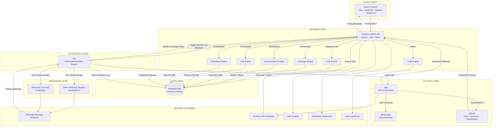

### Connection Explanations

| Connection | Protocol | Direction | Purpose |
|---|---|---|---|
| Frontend → Backend | HTTPS REST | Outbound | All user-initiated actions and data reads |
| Backend → MongoDB | MongoDB Driver | Read/Write | Persistent storage of all application data |
| Backend → n8n | HTTPS Webhook | Outbound | Trigger long-running automation workflows |
| n8n → Twilio | HTTPS API | Outbound | WhatsApp message delivery (development) |
| n8n → WhatsApp Cloud API | HTTPS API | Outbound | WhatsApp message delivery (production) |
| n8n → Backend | HTTPS Webhook | Outbound | Status updates, completion signals |
| n8n → MongoDB | MongoDB Driver | Write | Automation logs and state persistence |
| n8n → Vapi | HTTPS API | Outbound | Initiate AI voice calls |
| Vapi → ElevenLabs | Internal | Outbound | Voice synthesis for AI caller |
| Vapi → OpenAI | Internal | Outbound | Conversational reasoning and classification |
| Vapi → Backend | HTTPS Webhook | Inbound | Call transcript, outcome, intent signals |
| Backend → Frontend | Polling Response | Inbound | UI state refresh via TanStack Query |
| WhatsApp → n8n | Webhook | Inbound | Incoming reply processing |

---

## 5. System Components

---

### 5.1 Frontend

**Purpose:** The frontend is the exclusive user-facing interface of SchoolOS AI. It renders operational workspaces, displays data, and sends all user-initiated instructions to the backend.

**Core Principle:** The frontend is a rendering layer. It contains zero business logic.

**Responsibilities:**
- Render operational dashboards, tables, forms, and modals
- Handle route-level authentication guards
- Manage local UI state (open/closed modals, form values)
- Send API requests to the backend for all data operations
- Poll the backend for updated campaign and delivery state
- Display toast notifications and in-app alerts
- Handle form validation at the input layer (not business validation)

**Inputs:**
- User interactions (clicks, form submissions, navigation)
- Backend API JSON responses
- Polling results from TanStack Query

**Outputs:**
- HTTPS requests to the backend REST API
- Rendered HTML/DOM to the browser

**Dependencies:**
- Backend API (all data operations)

**Does NOT:**
- Call external APIs directly (no direct Twilio, Vapi, n8n, or WhatsApp calls)
- Make database operations
- Contain business logic or validation rules
- Store sensitive tokens in localStorage beyond refresh token (httpOnly cookie preferred)

**Future Scalability:**
- Socket.IO will replace polling for live campaign updates
- Additional route modules can be added without touching existing components
- TanStack Query cache invalidation allows optimistic UI updates without structural changes

---

### 5.2 Backend API

**Purpose:** The backend is the intelligence layer of SchoolOS AI. It owns all business logic, enforces all rules, coordinates all services, and acts as the exclusive gateway to the database and external systems.

**Technology:** Node.js + Express.js

**Responsibilities:**
- Accept, validate, and authenticate all incoming HTTP requests
- Apply RBAC permissions before executing any action
- Perform all CRUD operations against MongoDB
- Orchestrate the Campaign Engine for communication workflows
- Trigger n8n workflows via webhook calls
- Receive and process webhook callbacks from n8n, Vapi, Twilio, and WhatsApp
- Generate access tokens and refresh tokens
- Write all audit events
- Return structured JSON responses to the frontend

**Inputs:**
- HTTP requests from the React frontend
- Webhook callbacks from n8n
- Webhook callbacks from Vapi (call transcripts and outcomes)
- Webhook callbacks from WhatsApp Cloud API (incoming replies)

**Outputs:**
- JSON responses to the frontend
- Webhook triggers to n8n
- MongoDB read/write operations
- Audit log entries
- Notification records

**Internal Modules (Logical, Not Separate Services):**
- `auth/` — JWT issue, validation, refresh
- `campaigns/` — Campaign lifecycle management
- `communications/` — Template rendering, audience resolution
- `voice/` — Call queue, call records, transcript storage
- `tasks/` — Task creation and management
- `notifications/` — In-app notification generation
- `audit/` — Audit trail writes
- `webhooks/` — Inbound webhook receivers
- `scheduler/` — Cron-triggered backend jobs
- `roles/` — Permission definitions and checks

**Does NOT:**
- Render HTML or UI
- Contain long-running blocking processes (delegates to n8n)
- Accept direct calls from external services without webhook validation

**Future Scalability:**
- Express.js modules can be extracted into microservices without changing interfaces
- Campaign Engine, Voice Engine, and Communication Engine are designed as internal modules but can be deployed as separate services later
- Rate limiting and API gateways can be introduced at the Nginx layer without backend changes

---

### 5.3 MongoDB Atlas

**Purpose:** MongoDB Atlas is the primary data persistence layer for all SchoolOS AI data.

**Responsibilities:**
- Persist all application data (students, staff, fees, campaigns, messages, calls, tasks, logs)
- Serve read queries from the backend
- Accept write operations from the backend and n8n (automation logs only)
- Provide indexing for high-frequency query patterns

**Primary Collections (MVP):**

| Collection | Purpose |
|---|---|
| `users` | Platform user accounts and credentials |
| `roles` | Role definitions and permission maps |
| `students` | Student master records |
| `parents` | Parent contact records |
| `staff` | Staff records |
| `fees` | Fee records and payment status |
| `admissions` | Admission inquiry records |
| `campaigns` | Campaign definitions and lifecycle state |
| `campaign_recipients` | Per-recipient delivery records |
| `messages` | Individual WhatsApp message records |
| `calls` | AI voice call records and transcripts |
| `tasks` | Task records generated from AI or manual action |
| `notifications` | In-app notification records |
| `audit_logs` | Immutable audit trail |
| `automation_logs` | n8n workflow execution logs |
| `templates` | Message and call script templates |
| `settings` | School-level configuration |

**Does NOT:**
- Contain business logic (stored procedures not used)
- Accept direct connections from the frontend
- Accept direct connections from n8n except for automation log writes (controlled via backend webhook)

**Future Scalability:**
- MongoDB Atlas supports horizontal sharding for multi-school SaaS
- Collection partitioning by `schoolId` allows data isolation without separate databases
- Atlas Search can replace in-memory filtering as data grows

---

### 5.4 Campaign Engine

**Purpose:** The Campaign Engine is the orchestration layer responsible for the complete lifecycle of every outbound communication in SchoolOS AI.

**Core Principle:** Every outbound communication is a campaign — regardless of whether it is a single message or a bulk notification. This makes the system consistent, traceable, and retryable.

**Responsibilities:**
- Create campaign records when a user initiates a communication action
- Resolve audience segments (who receives this campaign)
- Render message content using the Template Engine (variable substitution)
- Transition campaign state through the defined lifecycle
- Trigger n8n workflows with the resolved payload
- Track per-recipient delivery status
- Handle retry logic for failed deliveries
- Produce campaign-level reports

**Inputs:**
- Campaign creation requests from the backend API
- Delivery status webhooks from n8n
- Retry signals from error handlers

**Outputs:**
- Campaign records in MongoDB
- Per-recipient delivery records
- n8n webhook triggers with resolved audience and rendered content
- Campaign status updates on completion or failure

**Dependencies:**
- MongoDB (state persistence)
- n8n (execution)
- Communication Engine (audience resolution and template rendering)

**Campaign Lifecycle States:**

| State | Meaning |
|---|---|
| `draft` | Campaign defined but not triggered |
| `queued` | Campaign submitted to n8n, awaiting execution |
| `running` | n8n actively processing deliveries |
| `completed` | All deliveries attempted |
| `archived` | Completed campaign moved to historical record |
| `failed` | Critical failure preventing execution |
| `retrying` | Partial failure — n8n retrying failed recipients |

---

### 5.5 Communication Engine

**Purpose:** The Communication Engine handles the construction, targeting, and rendering of all outbound communications.

**Responsibilities:**
- Resolve audience segments from MongoDB based on campaign criteria (grade, section, fee status, admission stage, etc.)
- Render message templates by substituting dynamic variables per recipient
- Validate that recipient contact information is available and valid
- Build the resolved payload (audience + rendered messages) for n8n
- Track communication timeline per recipient
- Process incoming WhatsApp replies
- Classify replies using OpenAI and route to task generation

**Sub-Components:**

| Sub-Component | Responsibility |
|---|---|
| Audience Builder | Query MongoDB to resolve the list of recipients based on campaign criteria |
| Variable Engine | Replace template placeholders with per-recipient values |
| Template Engine | Load, validate, and render message templates |
| Campaign Scheduler | Determine execution timing (immediate vs. scheduled) |
| Reply Processor | Receive inbound WhatsApp messages and route them |
| Communication Timeline | Record each communication event per student/parent |
| Delivery Tracker | Update per-recipient delivery status from n8n callbacks |
| Retry Handler | Identify and re-queue failed deliveries |
| AI Reply Classification | Use OpenAI to classify reply intent and generate follow-up tasks |

**Future Extensions:**
- Email channel (same audience/template/delivery pattern)
- SMS channel
- Push notifications
- In-app messaging

---

### 5.6 Automation Layer (n8n)

**Purpose:** n8n is the execution engine for all long-running, scheduled, and multi-step workflows. The backend triggers n8n; n8n never initiates actions the backend doesn't know about.

**Deployment:** Self-hosted on VPS, networked with the backend via private HTTPS webhooks.

**Responsibilities:**
- Receive webhook triggers from the backend
- Iterate over recipient lists and deliver individual messages
- Apply per-recipient rate limiting and delay to comply with WhatsApp API policies
- Retry failed deliveries with exponential backoff
- Report delivery success/failure back to the backend via callback webhooks
- Execute scheduled jobs (daily reminders, weekly reports)
- Trigger AI voice calls via Vapi
- Handle incoming WhatsApp webhook events and forward to backend

**Why n8n Handles Long-Running Work:**
The backend API must respond to HTTP requests in milliseconds. Sending 500 WhatsApp messages is not a millisecond operation. n8n decouples this work from the request cycle, allowing the backend to respond immediately ("campaign queued") while n8n processes the work asynchronously.

**Inputs:**
- Webhook triggers from the backend (`POST /webhook/campaign/send`)
- Scheduled cron triggers
- WhatsApp incoming message webhooks

**Outputs:**
- WhatsApp messages via Twilio (dev) or WhatsApp Cloud API (prod)
- Vapi call initiations
- Delivery status callbacks to the backend
- Automation logs to MongoDB

**Does NOT:**
- Make product decisions (no business logic)
- Modify campaign state directly in MongoDB (callbacks backend, which updates state)
- Access student or financial data directly except via backend API

---

### 5.7 AI Voice Layer

**Purpose:** The AI Voice Layer provides automated and AI-assisted voice calling capabilities for parent engagement, follow-up, and notifications.

**Components:**

| Component | Technology | Role |
|---|---|---|
| Call Orchestration | Vapi | Manages the call lifecycle, routes audio, handles interruptions |
| Voice Synthesis | ElevenLabs | Generates a natural-sounding voice from script text |
| Conversation AI | OpenAI | Understands parent responses, drives multi-turn dialogue |

**Responsibilities:**
- Accept call requests from the backend (manual calls) or n8n (campaign calls)
- Initiate calls to parent phone numbers via Vapi
- Serve ElevenLabs-generated voice through Vapi
- Process parent speech via OpenAI
- Record conversation transcripts
- Generate call summaries using OpenAI
- Classify call outcomes (answered, no answer, callback requested, objection, confirmation)
- Return call results to the backend via Vapi webhook
- Trigger follow-up task creation based on call outcome

**Call Types:**

| Type | Initiated By | Volume |
|---|---|---|
| Manual Call | Reception/Admin via frontend | Single call |
| Campaign Call | n8n workflow | Bulk — rate-limited |

**All calls are initiated via the backend API — never directly from the frontend or n8n without backend authorisation.**

---

### 5.8 WhatsApp Integration

**Purpose:** Manages inbound and outbound WhatsApp message delivery.

**Development:** Twilio WhatsApp Sandbox (for testing, no approval required)
**Production:** Meta WhatsApp Cloud API (requires business account approval)

**Responsibilities:**
- Receive outbound message requests from n8n
- Deliver messages to parent/student WhatsApp numbers
- Receive delivery status webhooks (sent, delivered, read, failed)
- Receive inbound reply messages
- Forward inbound messages to the backend via webhook

**Outbound Flow:**
```
n8n → Twilio/WhatsApp API → WhatsApp Network → Parent Device
```

**Inbound Flow:**
```
Parent Device → WhatsApp Network → WhatsApp API Webhook → n8n → Backend → Reply Processor
```

**Environment Switching:**
The n8n workflow configuration determines which delivery channel is active. Switching from Twilio to WhatsApp Cloud API requires only n8n workflow node reconfiguration — no backend or frontend code changes.

---

### 5.9 Notification System

**Purpose:** Delivers in-app notifications to users when important system events occur.

**Responsibilities:**
- Generate notification records when campaigns complete, tasks are assigned, or errors occur
- Persist notifications in the `notifications` collection
- Serve unread notification counts via polling API
- Mark notifications as read when acknowledged by the user

**Notification Triggers:**
- Campaign completed
- Campaign failed
- New reply received from parent
- Task assigned to user
- AI call completed
- System error requiring attention

**Delivery Mechanism (MVP):** Polling via TanStack Query
**Delivery Mechanism (Future):** Socket.IO push events

---

### 5.10 Task Engine

**Purpose:** Generates and manages actionable tasks for school staff based on system events, AI call outcomes, parent replies, and manual creation.

**Responsibilities:**
- Create task records with title, description, assignee, due date, priority, and source
- Assign tasks to the correct user role based on task type
- Track task status (open, in progress, completed, cancelled)
- Surface tasks in the relevant user's workspace
- Generate tasks automatically from AI call classifications and reply processing

**Task Sources:**

| Source | Example |
|---|---|
| AI Call Outcome | Parent requested callback → Task: "Call back Mr. Sharma by 3pm" |
| Reply Classification | Parent replied "when is the last date?" → Task: "Clarify fee deadline to parent" |
| Manual Creation | Reception staff creates a follow-up task |
| System Alert | Fee overdue by 30 days → Task: "Contact parent about fee defaulter" |

---

### 5.11 Audit Engine

**Purpose:** Creates an immutable, tamper-evident record of every significant action performed in SchoolOS AI.

**Responsibilities:**
- Record every write operation with user identity, timestamp, resource, and change delta
- Record every authentication event (login, logout, token refresh, failed login)
- Record every campaign creation, execution, and outcome
- Record every AI call initiation and outcome
- Record every role change
- Record every settings modification

**Audit Record Schema:**

```
{
  timestamp: ISODate,
  userId: ObjectId,
  userEmail: String,
  userRole: String,
  action: String,         // CREATE, UPDATE, DELETE, LOGIN, TRIGGER
  resource: String,       // collection or system area
  resourceId: ObjectId,
  before: Object,         // state before change (for updates)
  after: Object,          // state after change
  ip: String,
  userAgent: String,
  schoolId: ObjectId
}
```

**Audit records are never deleted and never modified.**

---

### 5.12 Authentication Layer

**Purpose:** Handles identity verification, session management, and token lifecycle.

**See Section 12 for complete authentication architecture.**

---

### 5.13 Role Management

**Purpose:** Defines what each user role can see and do inside SchoolOS AI.

**See Section 13 for complete role architecture.**

---

### 5.14 Logging

**Purpose:** Captures operational, diagnostic, and error information for all system components.

**See Section 15 for complete logging architecture.**

---

### 5.15 Scheduler

**Purpose:** Triggers time-based operations such as daily fee reminders, upcoming event notices, and weekly reports.

**Implementation:** n8n cron nodes (primary) + backend cron jobs (lightweight)

**Scheduled Jobs (MVP):**

| Job | Frequency | Handler |
|---|---|---|
| Daily Fee Reminder Campaign Check | Daily 8am | n8n |
| Upcoming PTM Reminder | As configured | n8n |
| Campaign Status Sweep | Every 5 minutes | Backend cron |
| Token Cleanup | Daily midnight | Backend cron |
| Audit Log Archival | Weekly | n8n |

---

## 6. Responsibility Matrix

| Area | Owner | Detail |
|---|---|---|
| UI Rendering | Frontend | Components, pages, layouts, forms, tables, modals |
| User Input Handling | Frontend | Form state, input validation (format only), submission |
| API Request Execution | Frontend | TanStack Query mutations and queries |
| Route Guards | Frontend | Redirect unauthenticated users |
| Business Logic | Backend | All rules, decisions, computations |
| Input Validation (Business) | Backend | Required fields, ranges, cross-field rules |
| Authentication | Backend | JWT issue, validation, refresh |
| Authorisation | Backend | RBAC permission checks before every action |
| Database Operations | Backend | All reads, writes, updates, deletes via Mongoose |
| Campaign Orchestration | Backend → Campaign Engine | Lifecycle management, state transitions |
| Audience Resolution | Backend → Communication Engine | Query MongoDB, resolve recipient list |
| Template Rendering | Backend → Communication Engine | Variable substitution per recipient |
| Long-Running Delivery | n8n | Bulk message sending, retry logic, scheduling |
| WhatsApp Delivery | n8n + Twilio/Meta | Message transport |
| AI Call Execution | Vapi | Call lifecycle, audio routing |
| Voice Generation | ElevenLabs | Neural voice synthesis |
| Conversation AI | OpenAI | Intent, summary, classification |
| Data Persistence | MongoDB Atlas | All primary application data |
| Audit Trail | Backend → Audit Engine | Immutable write on every significant action |
| Webhook Ingestion | Backend | Process all inbound webhooks securely |
| Error Handling | Backend | Structured error responses, retry triggers |
| Scheduled Automation | n8n | Cron-based workflow triggers |
| Notification Generation | Backend → Notification Engine | Generate on system events |
| Task Creation | Backend → Task Engine | Manual and automated task records |
| Logging | Backend + n8n | Operational and automation logs |
| Infrastructure | Docker + Nginx + VPS | Container orchestration and routing |
| SSL / TLS | Nginx | Certificate management |

---

## 7. Complete Data Flow Diagrams

### 7.1 Fee Reminder

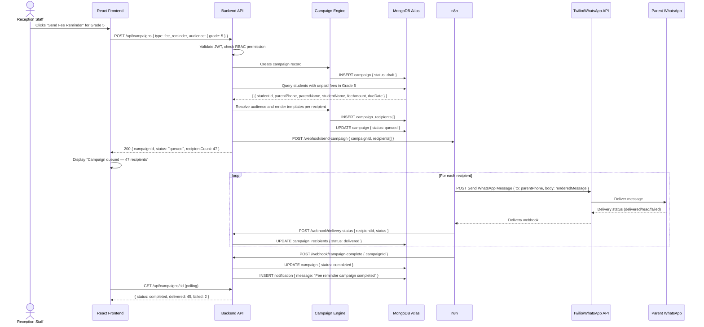

---

### 7.2 PTM Reminder

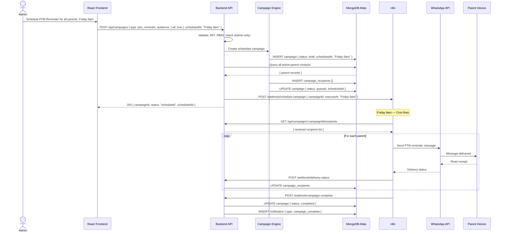

---

### 7.3 Admission Follow-up

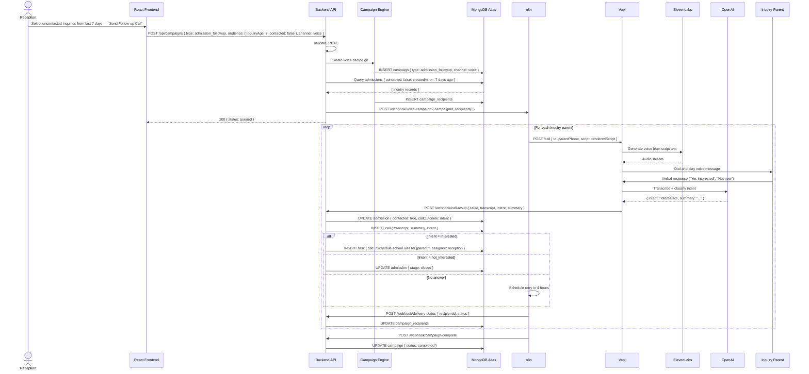

---

### 7.4 Holiday Notice

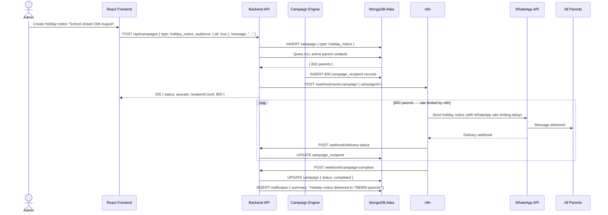

---

### 7.5 General Broadcast

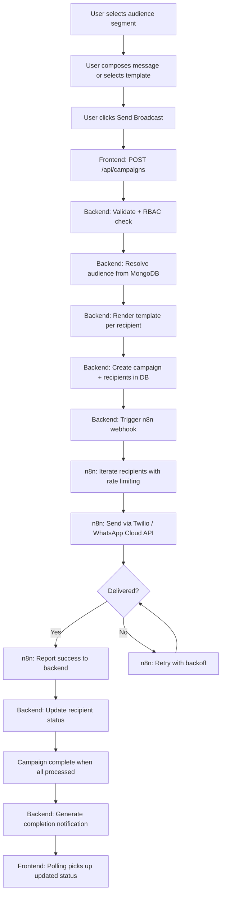

---

### 7.6 Manual AI Call

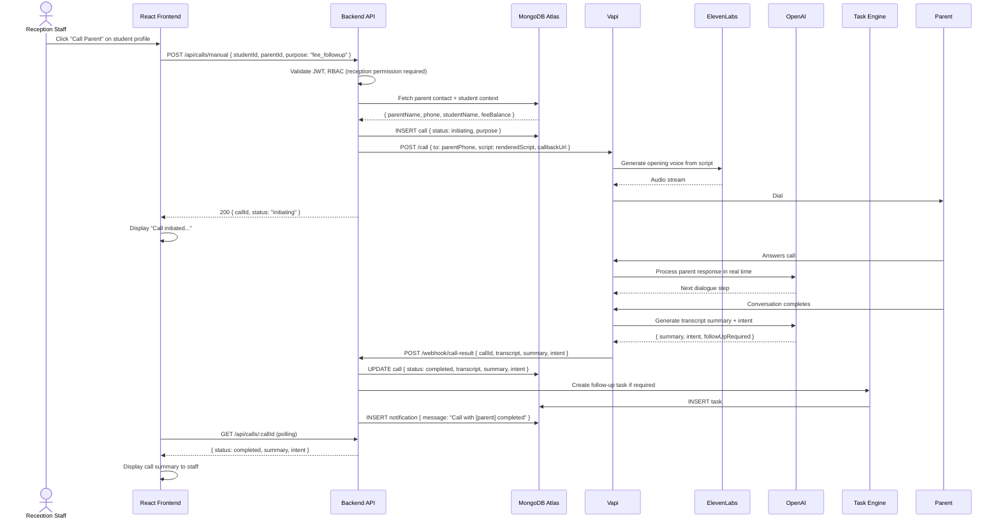

---

### 7.7 Reply Processing

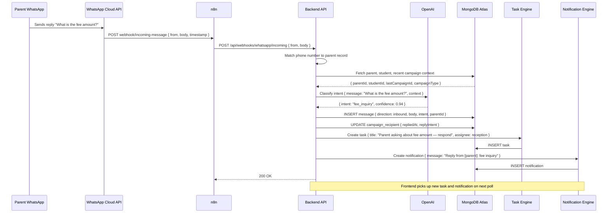

---

### 7.8 Campaign Tracking

```mermaid
flowchart LR
    subgraph FE["Frontend — TanStack Query Polling"]
        A[GET /api/campaigns/:id — every 5s while running]
    end

    subgraph BE["Backend"]
        B[Read campaign + aggregate recipient stats]
        C[Return { total, delivered, failed, pending, status }]
    end

    subgraph DB["MongoDB"]
        D[(campaign)] 
        E[(campaign_recipients)]
    end

    A --> B
    B --> D
    B --> E
    D --> C
    E --> C
    C --> A
```

---

### 7.9 Task Generation

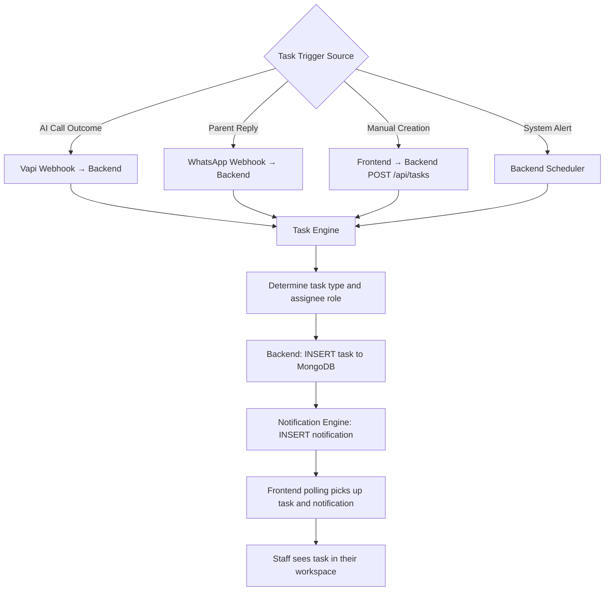

---

### 7.10 Notification Creation

```mermaid
flowchart TD
    A{Notification Trigger}
    A -->|Campaign Completed| B[Backend: Campaign complete handler]
    A -->|Campaign Failed| C[Backend: Error handler]
    A -->|Reply Received| D[Backend: Reply processor]
    A -->|Task Assigned| E[Backend: Task engine]
    A -->|Call Completed| F[Backend: Vapi webhook handler]

    B --> G[Notification Engine]
    C --> G
    D --> G
    E --> G
    F --> G

    G --> H[INSERT notification { userId, type, title, body, read: false }]
    H --> I[(MongoDB notifications collection)]
    I --> J[Frontend polls GET /api/notifications/unread]
    J --> K[Bell icon badge updated]
    K --> L[User opens notification panel]
    L --> M[Frontend: PATCH /api/notifications/:id/read]
    M --> N[Backend: UPDATE notification { read: true }]
```

---

## 8. Campaign Engine Architecture

### 8.1 Why Everything Is a Campaign

Every outbound communication in SchoolOS AI — a fee reminder, a PTM notice, a single parent message, or a bulk announcement — is modelled as a **campaign**. This is a deliberate architectural decision, not a UI label.

**Benefits of the Campaign Model:**
1. **Consistent lifecycle** — every communication has a known state at all times
2. **Auditability** — every message is traceable to a campaign, a user, and a timestamp
3. **Retry logic** — failed deliveries can be retried at the campaign level
4. **Reporting** — campaign-level analytics (delivery rate, open rate, reply rate) are built-in
5. **Future-proof** — adding email or push notifications requires only a new delivery channel — the campaign model remains unchanged

### 8.2 Campaign Lifecycle

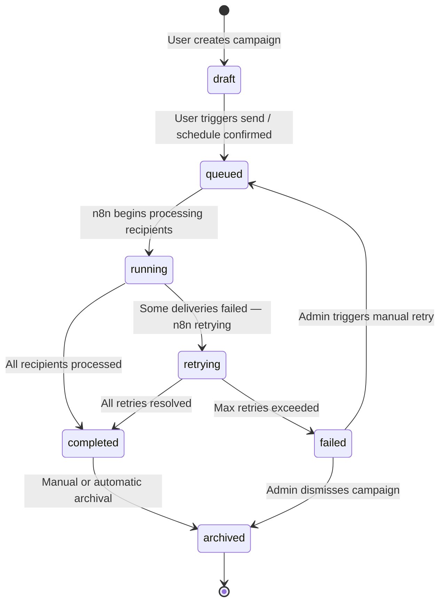

### 8.3 State Transition Rules

| From | To | Trigger | Owner |
|---|---|---|---|
| `draft` | `queued` | User clicks Send or schedule time reached | Backend |
| `queued` | `running` | n8n begins first delivery | n8n → Backend webhook |
| `running` | `completed` | All recipients in terminal state | n8n → Backend webhook |
| `running` | `retrying` | Some failed, retries in progress | n8n internal |
| `retrying` | `completed` | Retries resolved | n8n → Backend webhook |
| `retrying` | `failed` | Max retry exhausted | n8n → Backend webhook |
| `failed` | `queued` | Admin triggers retry | Backend |
| `completed` | `archived` | TTL or manual archival | Backend scheduler |
| `failed` | `archived` | Admin dismisses | Backend |

### 8.4 Campaign Record Schema

```
Campaign {
  _id: ObjectId
  schoolId: ObjectId
  createdBy: ObjectId (userId)
  type: Enum [fee_reminder, ptm_reminder, admission_followup, holiday_notice, general_broadcast, voice_call]
  channel: Enum [whatsapp, voice, email, sms]
  status: Enum [draft, queued, running, completed, archived, failed, retrying]
  audience: {
    segment: Enum [all, grade, section, fee_status, admission_stage, custom]
    filters: Object
    resolvedCount: Number
  }
  template: {
    templateId: ObjectId
    renderedSample: String
  }
  scheduledAt: ISODate (null = immediate)
  startedAt: ISODate
  completedAt: ISODate
  stats: {
    total: Number
    delivered: Number
    failed: Number
    read: Number
    replied: Number
  }
  n8nExecutionId: String
  createdAt: ISODate
  updatedAt: ISODate
}
```

### 8.5 Scalability Design

The Campaign Engine is designed to scale to multi-school SaaS without redesign:
- All campaign records contain `schoolId` — queries are always tenant-scoped
- n8n execution is stateless — adding more n8n workers increases throughput linearly
- Campaign recipients are stored per-record — processing can be parallelised
- The backend campaign API is stateless — horizontal scaling requires only a load balancer

---

## 9. Communication Engine Architecture

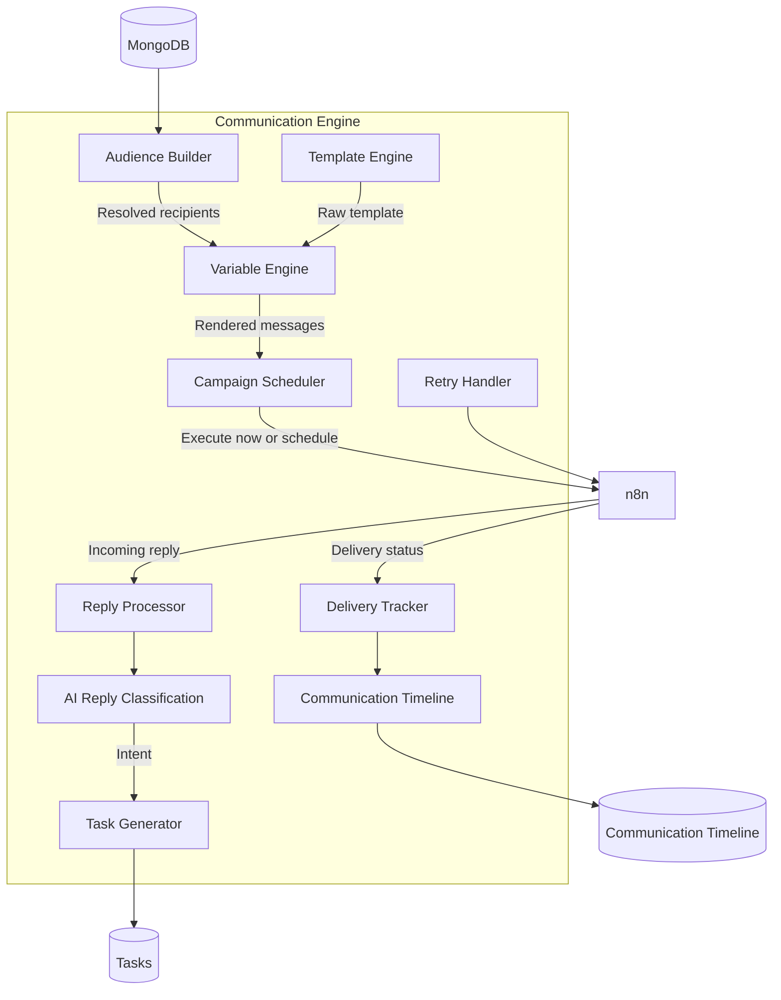

### 9.1 Audience Builder

The Audience Builder translates campaign criteria into a MongoDB query and returns the resolved recipient list.

**Supported Segments:**

| Segment | Query Basis |
|---|---|
| All Parents | All active parent records |
| Grade | Students in a specific grade, resolve to parent contacts |
| Grade + Section | Students in a specific grade and section |
| Fee Status | Students with `feeStatus: unpaid` or `dueDate: overdue` |
| Admission Stage | Inquiries in a specific stage (e.g., application received, visit scheduled) |
| Custom Filter | Arbitrary MongoDB filter expression (Admin only) |

### 9.2 Variable Engine

The Variable Engine substitutes template placeholders with per-recipient values.

**Supported Variables:**

| Variable | Value |
|---|---|
| `{{parentName}}` | Parent's full name |
| `{{studentName}}` | Student's full name |
| `{{grade}}` | Student's grade |
| `{{section}}` | Student's section |
| `{{feeAmount}}` | Outstanding fee amount |
| `{{dueDate}}` | Fee due date |
| `{{schoolName}}` | School name from settings |
| `{{ptmDate}}` | PTM event date |
| `{{ptmTime}}` | PTM event time |

### 9.3 Template Engine

Templates are stored in the `templates` collection. Each template has:
- A unique key (e.g., `fee_reminder_v1`)
- A message body with variable placeholders
- An approved status (WhatsApp requires pre-approved templates for production)
- A channel type (whatsapp, voice, email)

### 9.4 Reply Processor

When an inbound WhatsApp message arrives:
1. n8n forwards it to `POST /api/webhooks/whatsapp/incoming`
2. The backend matches the sender's phone number to a parent record
3. The context of the most recent campaign to that parent is loaded
4. OpenAI classifies the reply intent with campaign context
5. A task is generated for the school staff
6. The inbound message is stored in the `messages` collection

---

## 10. AI Voice Architecture

### 10.1 Call Architecture

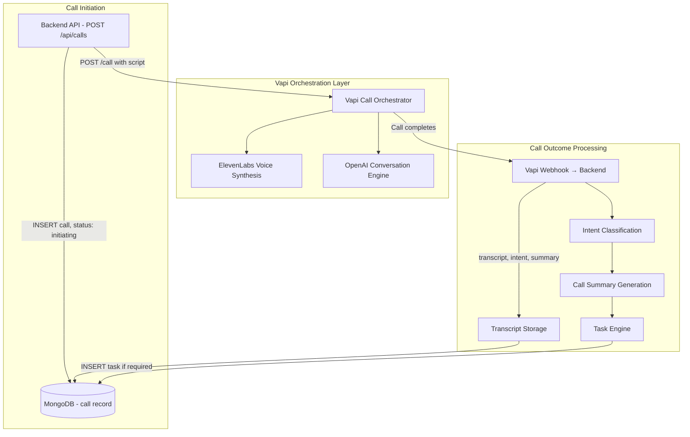

### 10.2 Call Queue (MVP)

In MVP, calls are not queued separately — n8n manages the rate-limiting of campaign calls to avoid Vapi API rate limits.

For manual calls, the backend initiates the Vapi call directly and returns a `callId` to the frontend immediately.

### 10.3 Call Record Schema

```
Call {
  _id: ObjectId
  schoolId: ObjectId
  campaignId: ObjectId (null for manual calls)
  initiatedBy: ObjectId (userId — null for automated campaign calls)
  type: Enum [manual, campaign]
  purpose: Enum [fee_followup, admission_followup, ptm_reminder, general]
  parentId: ObjectId
  studentId: ObjectId
  phone: String
  status: Enum [initiating, ringing, in_progress, completed, no_answer, failed]
  vapiCallId: String
  duration: Number (seconds)
  transcript: String
  summary: String
  intent: String
  followUpRequired: Boolean
  createdAt: ISODate
  completedAt: ISODate
}
```

### 10.4 Why Calls Pass Through the Backend

Calls must always be initiated via the backend API — never directly from the frontend or n8n without backend authorisation. This ensures:

1. **Authorisation** — RBAC checks are performed before any call is initiated
2. **Call record creation** — every call is logged before it begins
3. **Budget control** — the backend can enforce call limits per day/school
4. **Audit trail** — the user who initiated the call is recorded
5. **Webhook routing** — call results return to the backend, which owns the outcome logic

### 10.5 Knowledge Base (Future)

The AI caller will be augmented with a school-specific knowledge base allowing it to answer common parent questions about fees, admissions, and school policies without staff involvement.

---

## 11. API Communication Architecture

### 11.1 The Golden Rule

**The frontend never calls external services directly.**

All external API calls (WhatsApp, Vapi, ElevenLabs, OpenAI, n8n) are made exclusively by the backend.

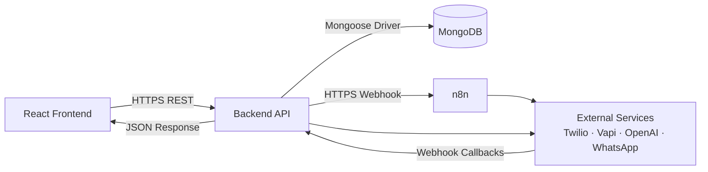

### 11.2 Why This Architecture

| Benefit | Explanation |
|---|---|
| **Security** | API keys and secrets never leave the server. The frontend cannot expose them even if compromised |
| **Auditability** | Every external call is logged server-side with the user identity attached |
| **Scalability** | External service integrations can be changed or swapped without touching the frontend |
| **Maintainability** | A single backend module owns each external service integration |
| **Rate Limiting** | The backend can enforce rate limits before calls reach external APIs |
| **Future Migration** | Replacing Twilio with WhatsApp Cloud API required only n8n reconfiguration — zero frontend changes |
| **Error Handling** | External errors are caught, logged, and returned as structured API errors — not raw third-party error formats |

### 11.3 API Versioning

All API routes are versioned: `/api/v1/...`

This allows future breaking changes to be introduced as `/api/v2/...` while legacy clients continue working.

### 11.4 Standard API Response Format

All backend responses follow this envelope:

```json
// Success
{
  "success": true,
  "data": { ... },
  "meta": { "page": 1, "total": 120 }
}

// Error
{
  "success": false,
  "error": {
    "code": "CAMPAIGN_NOT_FOUND",
    "message": "The requested campaign does not exist.",
    "statusCode": 404
  }
}
```

---

## 12. Authentication Architecture

### 12.1 Overview

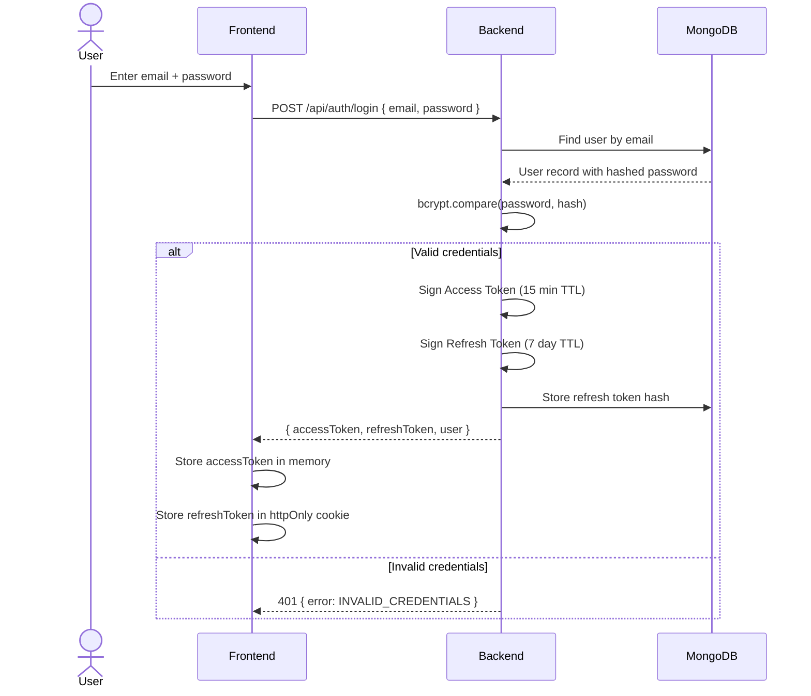

### 12.2 Token Lifecycle

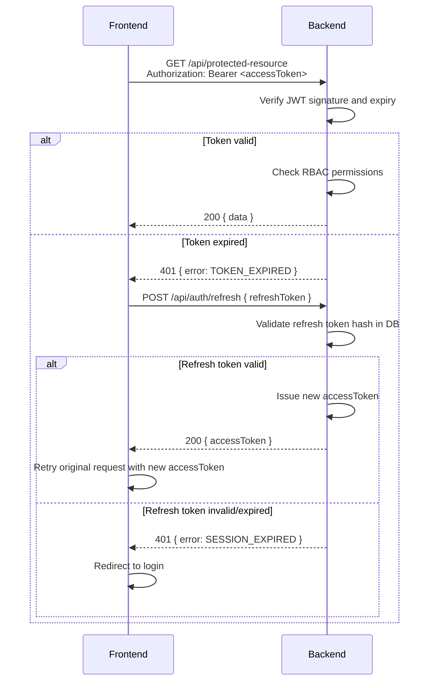

### 12.3 JWT Payload Structure

```json
{
  "sub": "userId",
  "email": "user@school.com",
  "role": "reception",
  "schoolId": "schoolObjectId",
  "permissions": ["campaign.create", "student.read", "call.initiate"],
  "iat": 1234567890,
  "exp": 1234568790
}
```

### 12.4 RBAC Permission Check Flow

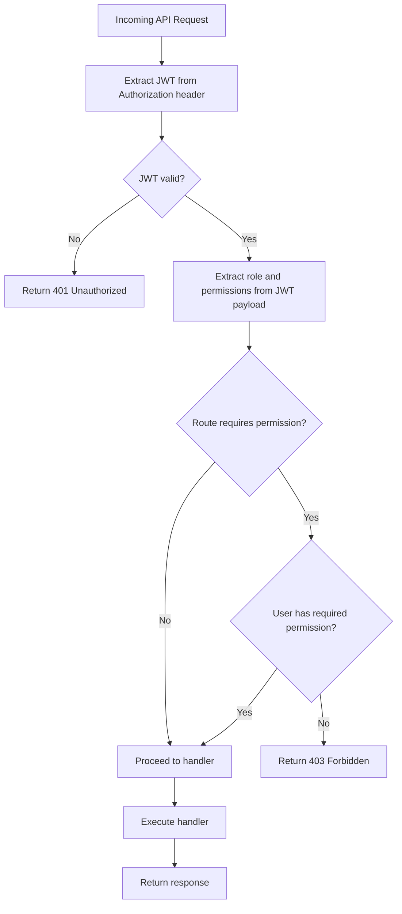

### 12.5 Session Security

- Access tokens stored in JavaScript memory (not localStorage) to prevent XSS theft
- Refresh tokens stored in `httpOnly`, `Secure`, `SameSite=Strict` cookies
- Refresh tokens are single-use and rotated on every refresh call
- Failed login attempts are rate-limited (5 attempts / 15 minutes per IP)
- All authentication events are written to the audit log

---

## 13. User Roles and Permissions

### 13.1 MVP Roles

#### Admin

**Description:** Full system access. Manages school configuration, users, and all operational modules.

| Area | Permissions |
|---|---|
| Students | Create, Read, Update, Delete |
| Fees | Create, Read, Update, Delete |
| Admissions | Create, Read, Update, Delete |
| Campaigns | Create, Read, Update, Trigger, Archive |
| AI Calls | Initiate, Read, Review |
| Tasks | Create, Read, Update, Assign, Delete |
| Settings | Read, Update |
| Users | Create, Read, Update, Deactivate |
| Roles | Read, Assign |
| Audit Logs | Read |
| Reports | Read, Export |

#### Reception

**Description:** Day-to-day operational access. Manages admissions, student contacts, campaigns, and parent communication.

| Area | Permissions |
|---|---|
| Students | Read, Update (contact info only) |
| Fees | Read |
| Admissions | Create, Read, Update |
| Campaigns | Create (whatsapp only), Read, Trigger |
| AI Calls | Initiate (manual only), Read |
| Tasks | Create, Read, Update (own tasks) |
| Settings | No Access |
| Users | No Access |
| Audit Logs | No Access |
| Reports | Read (own actions only) |

#### Teacher

**Description:** Read-only access to student data relevant to their class. No communication or financial access.

| Area | Permissions |
|---|---|
| Students | Read (own class only) |
| Fees | No Access |
| Admissions | No Access |
| Campaigns | No Access |
| AI Calls | No Access |
| Tasks | Read (assigned to self), Update (status only) |
| Settings | No Access |
| Users | No Access |
| Audit Logs | No Access |

### 13.2 Permission Enforcement

Permissions are enforced at two levels:

1. **Route Level:** Express middleware checks if the user's role has permission for the requested route
2. **Data Level:** Queries are automatically scoped to `schoolId` and, where applicable, `assignedClass` or `userId`

### 13.3 Future Roles

| Role | Primary Access Area |
|---|---|
| Principal | All read + approval workflows |
| Accountant | Fee management + financial reports |
| Parents | View own child's records + receive communications |
| Students | View own academic records |
| Transport Manager | Transport module |
| Librarian | Library module |
| Hostel Warden | Hostel module |

---

## 14. Error Handling Strategy

### 14.1 Error Classification

| Type | Source | Handling Strategy |
|---|---|---|
| Validation Error | User input fails validation | 400 response with field-level error details |
| Authentication Error | Invalid or expired token | 401 response, trigger client-side refresh |
| Authorisation Error | Insufficient permissions | 403 response with permission name |
| Not Found Error | Resource does not exist | 404 response with resource type |
| Business Logic Error | Rule violation (e.g., duplicate campaign) | 422 response with descriptive message |
| External API Error | Twilio, Vapi, OpenAI failure | 502 response — log external failure, trigger retry |
| Automation Failure | n8n workflow error | n8n reports to backend — backend marks campaign retrying/failed |
| WhatsApp Delivery Failure | Message undeliverable | Per-recipient status: failed — trigger n8n retry |
| Voice Call Failure | Vapi cannot reach number | Call status: no_answer — schedule retry or create task |
| Database Error | MongoDB connection failure | 503 response — alert via logging system |
| Unhandled Exception | Unexpected runtime error | 500 response — full error logged, user sees generic message |

### 14.2 Error Response Format

```json
{
  "success": false,
  "error": {
    "code": "VALIDATION_ERROR",
    "message": "The request contains invalid fields.",
    "statusCode": 400,
    "details": [
      { "field": "phone", "message": "Phone number must be 10 digits" },
      { "field": "templateId", "message": "Template not found" }
    ]
  }
}
```

### 14.3 Retry Strategy

| Failure Type | Retry Mechanism | Max Attempts | Backoff |
|---|---|---|---|
| WhatsApp message delivery | n8n retry node | 3 | Exponential (5m, 15m, 1h) |
| AI voice call no-answer | n8n retry node | 2 | Fixed (4 hours) |
| Vapi API error | n8n retry node | 2 | Exponential (1m, 5m) |
| n8n webhook to backend | n8n retry | 5 | Exponential |
| Backend → n8n trigger | Backend retry logic | 3 | Exponential |

### 14.4 Dead Letter Queue (Future)

When maximum retries are exhausted, failed campaign recipients will be moved to a dead letter collection. An admin dashboard will allow manual review and re-trigger of failed deliveries.

### 14.5 User-Facing Errors

Users must never see internal error messages, stack traces, or technical identifiers.

All user-facing error messages follow this pattern:
- **Clear:** Tell the user what happened
- **Actionable:** Tell the user what to do
- **Non-technical:** No jargon, no codes

**Example:** Instead of "Mongoose CastError: Cast to ObjectId failed for value undefined at path _id", the user sees: "We couldn't find that record. Please refresh and try again."

---

## 15. Logging Architecture

### 15.1 Log Categories

| Category | What It Captures | Storage |
|---|---|---|
| API Logs | Every incoming request: method, route, status, duration, userId | MongoDB `api_logs` + console |
| Authentication Logs | Login, logout, refresh, failed attempts | MongoDB `audit_logs` |
| Automation Logs | n8n workflow executions, node success/failure | MongoDB `automation_logs` |
| Communication Logs | Every message sent, delivery status, delivery time | MongoDB `messages` + `campaign_recipients` |
| Voice Logs | Every call initiated, duration, outcome, transcript | MongoDB `calls` |
| Audit Logs | All write operations with before/after state | MongoDB `audit_logs` |
| System Logs | Server startup, crashes, unhandled exceptions | Console + file (VPS) |
| Error Logs | All 4xx and 5xx responses with stack traces | Console + file (VPS) |

### 15.2 Log Levels

| Level | Usage |
|---|---|
| `INFO` | Normal operational events (request received, campaign started) |
| `WARN` | Non-critical issues (slow query, rate limit approaching) |
| `ERROR` | Failures requiring attention (delivery failure, API error) |
| `DEBUG` | Developer diagnostic information (disabled in production) |

### 15.3 API Log Schema

```
APILog {
  timestamp: ISODate
  method: String
  route: String
  statusCode: Number
  duration: Number (ms)
  userId: ObjectId
  schoolId: ObjectId
  ip: String
  userAgent: String
  requestBody: Object (sensitive fields redacted)
  errorCode: String (if error)
}
```

### 15.4 Log Retention

| Log Type | Retention Period |
|---|---|
| API Logs | 30 days |
| Communication Logs | 1 year |
| Voice Logs | 1 year |
| Audit Logs | Permanent (never deleted) |
| System Logs | 7 days (file rotation) |
| Automation Logs | 90 days |

---

## 16. Security Architecture

### 16.1 Password Security

- Passwords hashed with `bcrypt` at cost factor 12
- Passwords never stored in plaintext or reversible encryption
- Passwords never logged under any circumstances
- Password reset uses time-limited signed tokens (15 minutes)

### 16.2 JWT Security

- Signed with RS256 (asymmetric) algorithm in production
- Access token TTL: 15 minutes
- Refresh token TTL: 7 days
- Refresh tokens are hashed before storage (not stored plaintext)
- Token revocation on logout (refresh token invalidated in DB)

### 16.3 Role Permission Enforcement

- Every API route has an explicit permission requirement
- Permissions are checked after authentication and before handler execution
- Data queries are always scoped to `schoolId` — cross-school data leakage is structurally impossible
- No route defaults to "allow all authenticated users"

### 16.4 Input Validation

- All request bodies validated with `express-validator` or `Joi`
- String inputs sanitised to prevent NoSQL injection (`$where`, `$gt` in user input rejected)
- File uploads validated for type and size (future — when file upload is added)
- All ObjectId inputs validated as valid MongoDB ObjectIds before database queries

### 16.5 Rate Limiting

| Endpoint | Limit |
|---|---|
| POST /api/auth/login | 5 requests / 15 minutes per IP |
| POST /api/auth/refresh | 10 requests / minute per user |
| POST /api/campaigns | 20 requests / hour per school |
| POST /api/calls/manual | 10 calls / hour per user |
| All other API routes | 200 requests / minute per user |

Rate limiting is implemented via `express-rate-limit` with MongoDB-backed storage.

### 16.6 Webhook Security

All inbound webhooks (from n8n, Vapi, Twilio, WhatsApp) are verified by:
1. **Shared Secret Header:** Requests must include a shared secret in a custom header (`X-SchoolOS-Secret`)
2. **IP Allowlist:** Webhook endpoints only accept requests from known IP ranges (n8n VPS IP, Twilio IP ranges, Meta IP ranges)
3. **Signature Verification:** Where the provider offers it (Twilio signature, Meta webhook signature), signatures are verified

### 16.7 Environment Variables and Secrets

- All secrets (JWT secret, database URI, Twilio credentials, Vapi key, OpenAI key) stored as environment variables
- `.env` files are never committed to version control
- Docker secrets or VPS-level environment injection used in production
- A `.env.example` file documents required variables without values

### 16.8 MongoDB Security

- MongoDB Atlas connected via connection string with username/password authentication
- Network access restricted to VPS IP only (Atlas IP allowlist)
- Separate database users for production and development environments
- No direct public internet access to MongoDB

### 16.9 Nginx Security

- HTTPS enforced — all HTTP redirected to HTTPS
- TLS 1.2 minimum, TLS 1.3 preferred
- HSTS headers enabled
- Security headers: `X-Frame-Options`, `X-Content-Type-Options`, `Content-Security-Policy`
- Direct access to internal services (n8n, MongoDB) blocked at Nginx level

---

## 17. Scalability Strategy

### 17.1 Current State — Single School

The current MVP is designed for a single school. All data belongs to one `schoolId`. The application runs on a single VPS with:
- One backend Node.js instance
- One n8n instance
- One MongoDB Atlas cluster

### 17.2 Multi-School SaaS — Future State

The architecture supports multi-school SaaS **without redesign** because:

1. **schoolId is on every record** — all queries are already scoped to `schoolId`. Adding a second school requires no schema changes.
2. **Backend is stateless** — horizontal scaling requires only adding a load balancer and additional Node.js instances. No shared session state.
3. **n8n is self-contained** — additional n8n instances can handle increased workflow volume. Each campaign execution is independent.
4. **MongoDB Atlas scales horizontally** — Atlas supports sharding by `schoolId` for multi-tenant data isolation at scale.
5. **Nginx routes by domain** — `school1.schoolos.ai` and `school2.schoolos.ai` can route to the same backend with different `schoolId` contexts determined by the JWT.

### 17.3 Scaling Milestones

| Scale Point | What Changes | What Does NOT Change |
|---|---|---|
| 1 → 10 schools | Load balancer, additional backend instances | API, database schema, frontend |
| 10 → 100 schools | MongoDB Atlas M30+ tier, n8n horizontal scaling | Application code |
| 100+ schools | MongoDB sharding by schoolId, CDN for frontend | Business logic, API contracts |
| Campaign volume 10k+ msgs | n8n worker scaling, WhatsApp throughput tier increase | Campaign Engine design |
| Voice calls 1000+ / day | Vapi plan upgrade, call queue management | Call architecture |

---

## 18. Performance Strategy

### 18.1 Current: Polling

In MVP, the frontend uses TanStack Query polling to refresh campaign status, notifications, and task counts.

| Data Type | Poll Interval | Condition |
|---|---|---|
| Active campaign status | 5 seconds | While campaign `status = running` |
| Notification count | 30 seconds | Always when authenticated |
| Task list | 60 seconds | Always when task panel is open |
| Dashboard stats | 5 minutes | While dashboard is active |

TanStack Query's `refetchInterval` handles this automatically. Polling stops when the component unmounts or the window loses focus.

### 18.2 Future: Socket.IO

Socket.IO will replace polling for real-time updates. The backend will emit events on:
- Campaign status changes
- New notification created
- New task assigned
- New incoming reply

The frontend will react immediately without waiting for the next poll cycle.

### 18.3 Database Indexes

Critical indexes defined at application start:

| Collection | Indexed Fields |
|---|---|
| `students` | `schoolId`, `grade`, `section`, `status` |
| `parents` | `schoolId`, `phone` |
| `fees` | `schoolId`, `studentId`, `status`, `dueDate` |
| `campaigns` | `schoolId`, `status`, `type`, `createdAt` |
| `campaign_recipients` | `campaignId`, `status`, `parentId` |
| `messages` | `schoolId`, `parentId`, `direction`, `createdAt` |
| `calls` | `schoolId`, `parentId`, `status`, `createdAt` |
| `tasks` | `schoolId`, `assignee`, `status`, `createdAt` |
| `notifications` | `userId`, `read`, `createdAt` |
| `audit_logs` | `schoolId`, `userId`, `action`, `timestamp` |

### 18.4 Pagination

All list endpoints paginate results:
- Default page size: 20 records
- Maximum page size: 100 records
- Response includes `{ data, meta: { page, pageSize, total, totalPages } }`

### 18.5 Query Optimisation

- Aggregation pipelines used for campaign statistics (not in-application computation)
- Projections specified on all queries (never `SELECT *` equivalent)
- `lean()` used on Mongoose queries where Mongoose documents are not needed
- Campaign recipient lists processed in batches by n8n — never loaded entirely into backend memory

---

## 19. Modular Architecture

### 19.1 Module Boundaries

SchoolOS AI is built around independent internal modules. Each module owns its domain and communicates with other modules only through the backend's internal service layer — never directly.

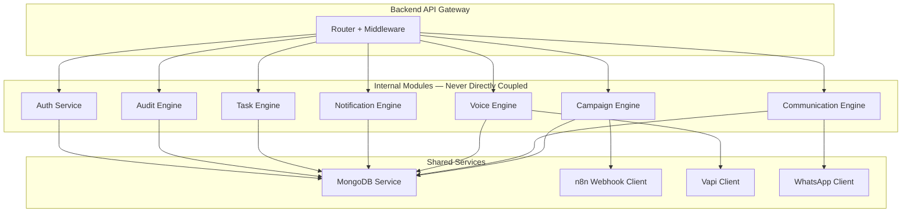

### 19.2 Module Independence Rules

1. **No module imports from another module directly.** Module A never `require('../notification/notificationService')` inside its own handlers.
2. **Modules communicate through the service registry.** The backend orchestrator calls modules in sequence.
3. **Each module has its own folder, router, service, and model.** No shared model files.
4. **Modules may emit events (future: EventEmitter or message bus) that other modules consume.** This is preferable to direct calls.

### 19.3 Why Module Independence Matters

If the Notification Engine and the Campaign Engine are directly coupled, changing the Notification Engine's interface breaks the Campaign Engine. With strict module independence:
- Each module can be tested in isolation
- Each module can be refactored without touching other modules
- Each module can eventually be extracted into a microservice without application-wide changes

---

## 20. Project Folder Structure

### 20.1 Frontend Structure

```
frontend/
├── public/                         # Static assets served directly
│   ├── favicon.ico
│   └── logo.svg
├── src/
│   ├── api/                        # All API call functions — one file per resource
│   │   ├── campaigns.api.ts
│   │   ├── calls.api.ts
│   │   ├── students.api.ts
│   │   ├── fees.api.ts
│   │   ├── tasks.api.ts
│   │   └── auth.api.ts
│   ├── components/                 # Reusable UI components
│   │   ├── common/                 # Buttons, inputs, badges, modals, tables
│   │   ├── campaigns/              # Campaign-specific components
│   │   ├── calls/                  # Voice call components
│   │   ├── students/               # Student-specific components
│   │   ├── fees/                   # Fee-specific components
│   │   ├── tasks/                  # Task-specific components
│   │   ├── notifications/          # Notification bell, panel
│   │   └── layout/                 # Sidebar, topbar, shell
│   ├── hooks/                      # Custom React hooks
│   │   ├── useAuth.ts
│   │   ├── useCampaign.ts
│   │   ├── useNotifications.ts
│   │   └── usePolling.ts
│   ├── pages/                      # Route-level page components
│   │   ├── auth/
│   │   │   └── LoginPage.tsx
│   │   ├── dashboard/
│   │   │   └── DashboardPage.tsx
│   │   ├── students/
│   │   │   ├── StudentsPage.tsx
│   │   │   └── StudentDetailPage.tsx
│   │   ├── fees/
│   │   │   └── FeesPage.tsx
│   │   ├── admissions/
│   │   │   └── AdmissionsPage.tsx
│   │   ├── campaigns/
│   │   │   ├── CampaignsPage.tsx
│   │   │   └── CampaignDetailPage.tsx
│   │   ├── calls/
│   │   │   └── CallsPage.tsx
│   │   └── tasks/
│   │       └── TasksPage.tsx
│   ├── store/                      # Global client state (auth context, theme)
│   │   └── authStore.ts
│   ├── router/                     # Route definitions and guards
│   │   ├── AppRouter.tsx
│   │   └── ProtectedRoute.tsx
│   ├── types/                      # TypeScript type definitions
│   │   ├── campaign.types.ts
│   │   ├── student.types.ts
│   │   ├── call.types.ts
│   │   └── api.types.ts
│   ├── lib/                        # Utility functions and configuration
│   │   ├── axios.ts                # Axios instance with interceptors
│   │   ├── queryClient.ts          # TanStack Query client config
│   │   └── utils.ts
│   ├── styles/
│   │   └── globals.css             # Tailwind base styles
│   ├── App.tsx
│   └── main.tsx
├── .env.local
├── .env.example
├── vite.config.ts
├── tailwind.config.ts
├── tsconfig.json
└── package.json
```

### 20.2 Backend Structure

```
backend/
├── src/
│   ├── modules/                    # Feature modules — one folder per domain
│   │   ├── auth/
│   │   │   ├── auth.router.ts
│   │   │   ├── auth.service.ts
│   │   │   ├── auth.middleware.ts
│   │   │   └── auth.validators.ts
│   │   ├── campaigns/
│   │   │   ├── campaign.router.ts
│   │   │   ├── campaign.service.ts
│   │   │   ├── campaign.model.ts
│   │   │   └── campaign.validators.ts
│   │   ├── communications/
│   │   │   ├── audience.builder.ts
│   │   │   ├── template.engine.ts
│   │   │   ├── variable.engine.ts
│   │   │   ├── reply.processor.ts
│   │   │   └── delivery.tracker.ts
│   │   ├── students/
│   │   │   ├── student.router.ts
│   │   │   ├── student.service.ts
│   │   │   └── student.model.ts
│   │   ├── fees/
│   │   │   ├── fee.router.ts
│   │   │   ├── fee.service.ts
│   │   │   └── fee.model.ts
│   │   ├── admissions/
│   │   │   ├── admission.router.ts
│   │   │   ├── admission.service.ts
│   │   │   └── admission.model.ts
│   │   ├── voice/
│   │   │   ├── call.router.ts
│   │   │   ├── call.service.ts
│   │   │   └── call.model.ts
│   │   ├── tasks/
│   │   │   ├── task.router.ts
│   │   │   ├── task.service.ts
│   │   │   └── task.model.ts
│   │   ├── notifications/
│   │   │   ├── notification.router.ts
│   │   │   ├── notification.service.ts
│   │   │   └── notification.model.ts
│   │   ├── audit/
│   │   │   ├── audit.service.ts
│   │   │   └── audit.model.ts
│   │   ├── webhooks/
│   │   │   ├── webhook.router.ts
│   │   │   ├── whatsapp.webhook.ts
│   │   │   ├── vapi.webhook.ts
│   │   │   └── n8n.webhook.ts
│   │   └── roles/
│   │       ├── roles.config.ts
│   │       └── permission.guard.ts
│   ├── shared/                     # Shared services and utilities
│   │   ├── clients/
│   │   │   ├── n8n.client.ts       # n8n webhook trigger client
│   │   │   ├── vapi.client.ts      # Vapi API client
│   │   │   ├── openai.client.ts    # OpenAI client
│   │   │   └── whatsapp.client.ts  # WhatsApp Cloud API client
│   │   ├── database/
│   │   │   └── mongodb.ts          # MongoDB connection and index setup
│   │   ├── middleware/
│   │   │   ├── authenticate.ts     # JWT validation middleware
│   │   │   ├── authorize.ts        # RBAC permission check middleware
│   │   │   ├── rateLimiter.ts      # Rate limiting middleware
│   │   │   ├── requestLogger.ts    # API request logging
│   │   │   └── errorHandler.ts     # Global error handler
│   │   ├── utils/
│   │   │   ├── jwt.ts
│   │   │   ├── bcrypt.ts
│   │   │   ├── pagination.ts
│   │   │   └── responseFormatter.ts
│   │   └── types/
│   │       └── express.d.ts        # Extended Express Request type
│   ├── config/
│   │   ├── env.ts                  # Validated environment variables
│   │   └── constants.ts
│   ├── jobs/                       # Backend cron jobs
│   │   ├── campaignStatusSweep.ts
│   │   └── tokenCleanup.ts
│   └── app.ts                      # Express app setup and middleware registration
├── server.ts                       # Entry point
├── .env
├── .env.example
├── Dockerfile
├── tsconfig.json
└── package.json
```

### 20.3 n8n Structure

```
n8n/
├── workflows/                      # Exported n8n workflow JSON files
│   ├── fee_reminder_campaign.json
│   ├── ptm_reminder_campaign.json
│   ├── admission_followup_voice.json
│   ├── holiday_notice_broadcast.json
│   ├── general_broadcast.json
│   ├── incoming_whatsapp_handler.json
│   ├── daily_fee_reminder_check.json
│   └── voice_campaign_caller.json
├── credentials/                    # Credential templates (values stored in n8n)
│   ├── twilio.example.json
│   ├── whatsapp_cloud_api.example.json
│   └── vapi.example.json
├── docker-compose.yml              # n8n Docker deployment
└── README.md
```

### 20.4 Deployment Structure

```
deployment/
├── docker-compose.yml              # Production compose file (all services)
├── docker-compose.dev.yml          # Development override
├── nginx/
│   ├── nginx.conf                  # Main Nginx config
│   └── sites/
│       ├── frontend.conf
│       ├── backend.conf
│       └── n8n.conf
├── scripts/
│   ├── deploy.sh                   # Deployment automation script
│   ├── backup.sh                   # MongoDB backup script
│   └── ssl-renew.sh                # Let's Encrypt renewal
└── .github/
    └── workflows/
        └── deploy.yml              # GitHub Actions deployment pipeline
```

### 20.5 Documentation Structure

```
docs/
├── 01_Product_Requirements.md
├── 02_System_Architecture.md       ← this document
├── 03_Database_Schema.md
├── 04_API_Reference.md
├── 05_n8n_Workflows.md
├── 06_Campaign_Engine.md
├── 07_AI_Voice_System.md
├── 08_Deployment_Guide.md
├── 09_Security_Guide.md
└── 10_Engineering_Onboarding.md
```

---

## 21. Engineering Decision Records (ADR)

Each decision below follows the format: **Context → Decision → Rationale → Consequences.**

---

### ADR-001: MongoDB over SQL

**Context:** The system requires a flexible data model for school entities. Student records, fee structures, admission inquiries, and campaign configurations vary significantly in shape. SQL schema migrations in a fast-moving MVP introduce friction.

**Decision:** Use MongoDB Atlas as the primary database.

**Rationale:**
- Document model maps naturally to the nested, variable-shape data of school operations
- Schema-less development allows faster iteration in MVP
- MongoDB Atlas provides managed hosting, automated backups, and global replication
- Mongoose ODM provides schema validation at the application layer when strictness is needed
- Horizontal sharding by `schoolId` is a native MongoDB capability needed for multi-school SaaS

**Consequences:**
- Relational queries (JOINs) must be handled via aggregation pipelines or denormalisation
- Developers must be disciplined about index creation — MongoDB does not enforce query plans
- No foreign key constraints — referential integrity is enforced at the application layer

---

### ADR-002: Backend Owns All Business Logic

**Context:** An early design considered allowing the frontend to make some decisions about data transformation and filtering.

**Decision:** The backend owns 100% of business logic. The frontend is a pure rendering layer.

**Rationale:**
- Business logic in the frontend cannot be enforced — it can be bypassed via direct API calls
- Logic duplication between frontend and backend creates divergence bugs
- Future mobile apps and third-party integrations inherit correct behaviour automatically
- Debugging is simpler — all logic is in one place with full logging

**Consequences:**
- Frontend developers must make API calls for operations that could technically be client-side
- Backend API surface is larger than in a "fat client" architecture
- All frontend developers must understand the API contract precisely

---

### ADR-003: Frontend Never Calls External Services

**Context:** It would be faster to call Twilio's API directly from the frontend using public-facing API keys.

**Decision:** The frontend never calls Twilio, Vapi, OpenAI, WhatsApp, or n8n directly.

**Rationale:**
- API keys in frontend JavaScript are publicly visible and trivially exploitable
- External service changes require frontend code changes if called directly
- Audit logging of external calls is impossible without server-side mediation
- Rate limiting cannot be enforced client-side

**Consequences:**
- All external API integrations require backend routes
- Slightly higher API call latency (frontend → backend → external vs. frontend → external)

---

### ADR-004: n8n Handles All Long-Running Automation

**Context:** Initial design considered processing campaign deliveries in the backend using `Promise.all` over recipient arrays.

**Decision:** All long-running, retryable, and scheduled work is delegated to n8n.

**Rationale:**
- Node.js event loop is not designed for blocking iteration over hundreds of API calls
- n8n provides visual workflow debugging, retry configuration, and execution history out-of-the-box
- n8n can be scaled independently of the backend
- Non-developers can modify n8n workflow logic without touching backend code
- n8n's built-in error handling and retry nodes eliminate significant custom code

**Consequences:**
- The n8n instance is a critical dependency — downtime affects campaign delivery
- n8n workflows must be version-controlled and backed up
- Campaign status depends on n8n reporting back — if n8n is down, status updates are delayed

---

### ADR-005: Everything Is a Campaign

**Context:** The initial product design had separate code paths for "send a message" vs. "run a campaign."

**Decision:** Every outbound communication — including single messages — is modelled as a campaign with a full lifecycle.

**Rationale:**
- Consistent model reduces code duplication
- Every communication is auditable, trackable, and retryable
- Reporting is built-in (delivery rates, response rates) for all communications
- Adding new communication types (email, SMS) requires only a new channel — the campaign model is reused

**Consequences:**
- Creating a single message requires the same infrastructure as a 1,000-recipient campaign
- Campaign overhead (record creation, recipient resolution) adds ~50ms to single-message operations
- This overhead is acceptable given the auditability benefit

---

### ADR-006: Queue-Based Voice Calls in Campaign Context

**Context:** Voice calls could be initiated in a fire-and-forget fashion from the backend.

**Decision:** Campaign voice calls are queued through n8n with rate limiting. Manual calls are initiated directly from the backend.

**Rationale:**
- Vapi has rate limits on concurrent calls
- Uncontrolled concurrent calls can exhaust the call quota rapidly
- n8n's queue management handles pacing automatically
- Manual calls are single-instance and do not need queue management

**Consequences:**
- Campaign calls are processed sequentially (or with controlled concurrency) — not all at once
- Large voice campaigns take longer to complete than WhatsApp campaigns
- This is acceptable — uncontrolled concurrency would be worse

---

### ADR-007: Polling in MVP, Socket.IO Later

**Context:** Real-time campaign status updates require either polling or WebSocket connections.

**Decision:** Use TanStack Query polling in MVP. Socket.IO is planned but not implemented.

**Rationale:**
- Polling is simpler to implement and debug
- TanStack Query handles polling lifecycle (pause on blur, resume on focus, backoff on error)
- Socket.IO adds connection state complexity and server-side session management
- For MVP usage volume, polling at 5-second intervals is not a meaningful performance problem
- The frontend architecture already accommodates Socket.IO — replacing polling with event listeners is additive

**Consequences:**
- Campaign status updates have up to 5 seconds of delay
- Polling generates background traffic even when no campaigns are running
- This is acceptable for MVP — Socket.IO is the planned upgrade path

---

### ADR-008: JWT with Refresh Token Pattern

**Context:** Various session management patterns were considered — server-side sessions, long-lived JWTs, and short-lived JWTs with refresh tokens.

**Decision:** Short-lived access tokens (15 min) with long-lived refresh tokens (7 days), rotated on each use.

**Rationale:**
- Short access token TTL limits the damage of a compromised token
- Refresh token rotation detects token theft (a stolen refresh token invalidates the session)
- Stateless access tokens allow horizontal backend scaling without shared session storage
- httpOnly cookie for refresh token prevents JavaScript access (XSS protection)

**Consequences:**
- Token refresh must be handled transparently in the Axios interceptor
- Logout must invalidate the refresh token server-side
- Refresh token storage in httpOnly cookie requires CSRF protection (SameSite=Strict)

---

## 22. Future Extensibility

The architecture is designed to accommodate the following modules without requiring architectural redesign.

### 22.1 How New Modules Are Added

Every new module follows the same pattern:
1. Create a new folder under `backend/src/modules/{moduleName}/`
2. Define the MongoDB schema and model
3. Define the router with authenticated, authorised routes
4. Define the service with business logic
5. Register the router in `app.ts`
6. Add frontend pages under `frontend/src/pages/{moduleName}/`
7. Add API functions under `frontend/src/api/{moduleName}.api.ts`

No existing module changes are required.

### 22.2 Future Modules

| Module | What It Adds | Integration Point |
|---|---|---|
| **Transport** | Route management, pick-up tracking, driver contacts | New module — `students` gains `transportId` field |
| **Library** | Book inventory, issue/return tracking | New module — `students` gains `libraryCard` |
| **Hostel** | Room allocation, mess management | New module — `students` gains `hostelRoom` field |
| **Payroll** | Staff salary management, deductions | New module — `staff` collection extended |
| **Finance** | School P&L, expense tracking | New module — uses existing `fees` data |
| **Student Portal** | Student self-service — grades, timetable | New user role `student` + restricted module access |
| **Parent Portal** | Parent self-service — attendance, fees, messages | New user role `parent` + restricted module access |
| **Mobile Apps** | React Native or Flutter apps | Consumes existing backend API — zero backend changes |
| **Email Channel** | Campaign delivery via email | New channel in Communication Engine — `email.sender.ts` |
| **SMS Channel** | Campaign delivery via SMS | New channel in Communication Engine — `sms.sender.ts` |
| **Push Notifications** | Mobile push via Firebase | New channel in Communication Engine — `push.sender.ts` |
| **Real-time Updates** | Replace polling with Socket.IO events | `socket.server.ts` added — frontend replaces poll hooks |

### 22.3 Multi-School SaaS Migration Path

When the platform is ready to serve multiple schools:
1. Each school registers via a signup flow → a `schools` collection record is created
2. The admin for that school is created with `schoolId` bound to their JWT
3. All existing APIs already scope queries by `schoolId` — no query changes required
4. Each school's data is isolated by `schoolId` at the query layer
5. Domain-based routing (`schoolA.schoolos.ai`) sets the `schoolId` context at the Nginx layer

---

## 23. Acceptance Criteria

This document is complete and accepted when every engineer reading it can answer **all** of the following questions without ambiguity:

### Architecture Understanding

- [ ] Can you explain the role of every component in the system?
- [ ] Can you trace the complete flow of a fee reminder campaign from user click to WhatsApp delivery?
- [ ] Can you explain why the frontend never calls external APIs directly?
- [ ] Can you explain why n8n exists and what would break without it?
- [ ] Can you explain the difference between a manual AI call and a campaign AI call?

### Component Responsibility

- [ ] Can you name which component owns business logic?
- [ ] Can you name which component owns long-running automation?
- [ ] Can you name which component owns voice synthesis?
- [ ] Can you name which component owns audience resolution?
- [ ] Can you name where audit records are written and why they are immutable?

### Data Flow

- [ ] Can you describe how an incoming WhatsApp reply is processed?
- [ ] Can you describe how a campaign transitions from `queued` to `completed`?
- [ ] Can you describe how n8n notifies the backend of delivery outcomes?
- [ ] Can you describe how a Vapi call result reaches the task engine?

### Feature Ownership

- [ ] Can you identify where every listed feature (campaigns, calls, tasks, notifications, audit) belongs in the folder structure?
- [ ] Can you explain how a new communication channel (email) would be added?
- [ ] Can you explain how a new user role (parent) would be added?
- [ ] Can you explain how a new school module (transport) would be integrated?

### No Ambiguity Standard

This document passes the No Ambiguity Standard when:
- A new backend engineer can pick up a feature task with no verbal briefing beyond this document
- A new frontend engineer knows exactly which API to call and what to expect back
- A DevOps engineer can deploy the full system from the folder structure and deployment section alone
- A QA engineer can write test cases from the data flow diagrams without implementation access

---

## 24. API Gateway Layer

### 24.1 Purpose

The API Gateway Layer is the formal entry point into the SchoolOS AI backend. It is the first layer every inbound request passes through before reaching any business logic. In MVP, this layer is implemented as a composed middleware stack within Express.js. The architecture intentionally separates this responsibility from the business logic modules so that, in the future, this layer can be extracted into a dedicated API gateway (Nginx, Kong, or a managed cloud gateway) without any change to the business logic beneath it.

**Engineering Note:** The separation of the API Gateway concern from the Business Logic concern is a deliberate architectural decision. Just because both currently live in the same Express.js process does not mean they are the same responsibility. The gateway concern owns: routing, authentication validation, rate limiting, request logging, versioning, and CORS. The business logic concern owns: campaign management, student management, voice calls, etc. These two concerns must never be mixed in the same middleware handler.

### 24.2 API Gateway Architecture Diagram

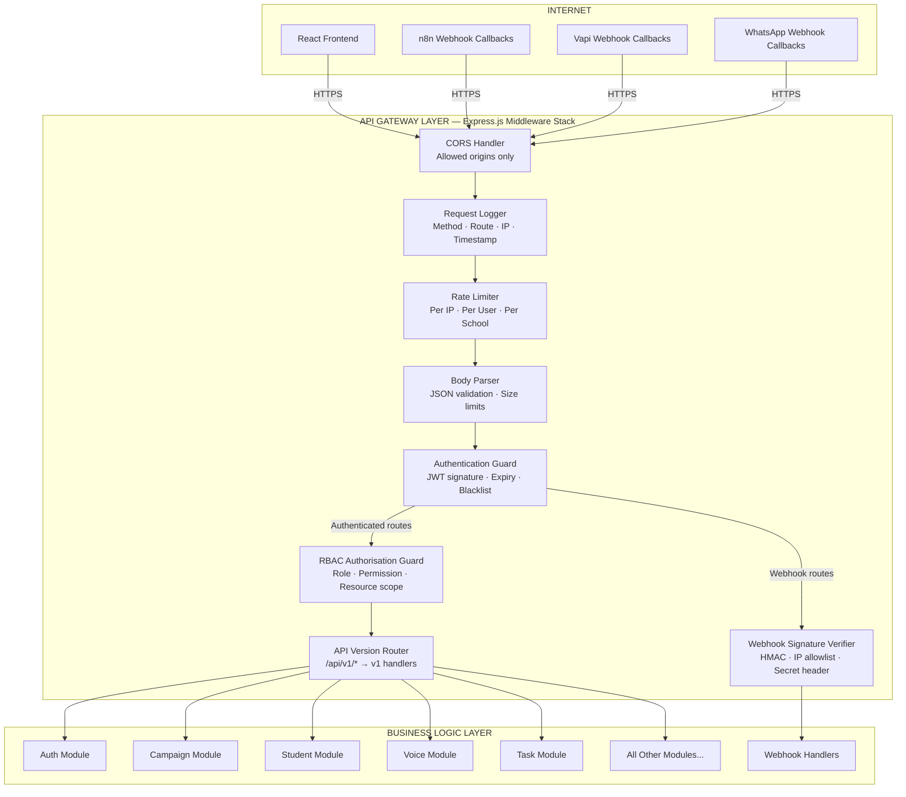

### 24.3 Gateway Responsibilities

#### Request Routing

Every inbound HTTP request is routed by the API version router. All routes are mounted under `/api/v1/`. The gateway is the only component that knows the URL structure. Business logic modules expose service functions, not HTTP routes directly.

| Route Prefix | Module |
|---|---|
| `/api/v1/auth/*` | Auth Module |
| `/api/v1/students/*` | Student Module |
| `/api/v1/parents/*` | Parent Module |
| `/api/v1/fees/*` | Fee Module |
| `/api/v1/admissions/*` | Admission Module |
| `/api/v1/campaigns/*` | Campaign Module |
| `/api/v1/calls/*` | Voice Module |
| `/api/v1/tasks/*` | Task Module |
| `/api/v1/notifications/*` | Notification Module |
| `/api/v1/settings/*` | Settings Module |
| `/api/v1/reports/*` | Report Module |
| `/api/v1/webhooks/*` | Webhook Module |

#### Authentication Validation

The gateway validates the JWT on every protected route before the request reaches any module handler. This validation includes:
- Signature verification using the RS256 public key
- Expiry check (`exp` claim)
- `schoolId` claim presence (all authenticated users belong to a school)
- Token blacklist check (for revoked tokens post-logout)

Validation failures return `401` before any module code executes.

#### Rate Limiting

Rate limiting is enforced at the gateway layer, not inside individual modules. Modules must not implement their own rate limiting — this is a gateway concern.

| Limit Type | Implementation |
|---|---|
| Per-IP global limit | Applied before authentication |
| Per-user limit | Applied after authentication |
| Per-school campaign limit | Applied to campaign creation routes only |
| Webhook endpoint limit | Applied to all `/api/v1/webhooks/*` routes |

#### API Versioning

The gateway owns API versioning. Version `v1` is the current version. When breaking changes are required, `v2` routes are added in parallel. The gateway routes both simultaneously. Clients are migrated over a defined period before `v1` is deprecated.

#### Request Logging

Every request is logged at the gateway layer before reaching any module. This produces a complete, unfiltered audit trail of all API traffic independent of what the modules do.

#### Future: Reverse Proxy and Load Balancer

In the current MVP, Nginx acts as the reverse proxy, routing external HTTPS traffic to the Express.js process. When horizontal scaling is required:
1. A load balancer (Nginx upstream block or cloud load balancer) is placed in front of multiple Express.js instances
2. The API Gateway middleware stack remains unchanged — it runs identically on each instance
3. Session state is not stored in the gateway — the gateway is stateless by design

#### Future: Dedicated API Gateway

When SchoolOS AI scales to 100+ schools, the current Express.js middleware gateway can be extracted and replaced with a dedicated API gateway (Kong, AWS API Gateway, or Nginx with advanced plugins) without touching any business logic module. The interface contract (route prefixes, request/response format, authentication header) remains identical.

### 24.4 Gateway Middleware Execution Order

The middleware stack executes in strict order. This order is not arbitrary — each layer depends on the output of the layer before it.

```
1. CORS Handler         → Sets response headers for browser preflight
2. Request Logger       → Records arrival before any processing can fail
3. Rate Limiter         → Rejects abusive traffic before any computation
4. Body Parser          → Parses and size-validates the request body
5. Auth Guard           → Validates identity before RBAC can check permissions
6. RBAC Guard           → Checks permissions after identity is established
7. Version Router       → Routes to the correct versioned handler
8. Module Handler       → Business logic executes last
```

---

## 25. Internal Backend Module Architecture

### 25.1 Overview

The backend is not a monolith — it is a structured collection of independent, domain-owned modules. Each module is a vertical slice: it owns its own router, service layer, data model, and validators. No module reaches into another module's internals.

```mermaid
graph TD
    subgraph GATEWAY["API Gateway Layer — Section 24"]
        GW[Request Router + Middleware]
    end

    subgraph AUTH["Auth Module"]
        AM[auth.router → auth.service → auth.validators]
    end

    subgraph STUDENT["Student Module"]
        SM[student.router → student.service → student.model]
    end

    subgraph PARENT["Parent Module"]
        PM[parent.router → parent.service → parent.model]
    end

    subgraph ADMISSION["Admission Module"]
        ADM[admission.router → admission.service → admission.model]
    end

    subgraph FEE["Fee Module"]
        FM[fee.router → fee.service → fee.model]
    end

    subgraph CAMPAIGN["Campaign Module"]
        CM[campaign.router → campaign.service → campaign.model]
    end

    subgraph COMMUNICATION["Communication Module"]
        COMM[audience.builder · template.engine · variable.engine · reply.processor]
    end

    subgraph VOICE["Voice Module"]
        VM[call.router → call.service → call.model]
    end

    subgraph TASK["Task Module"]
        TM[task.router → task.service → task.model]
    end

    subgraph NOTIFICATION["Notification Module"]
        NM[notification.router → notification.service → notification.model]
    end

    subgraph SETTINGS["Settings Module"]
        SET[settings.router → settings.service → settings.model]
    end

    subgraph REPORT["Report Module"]
        RM[report.router → report.service]
    end

    subgraph AUDIT["Audit Module"]
        AUM[audit.service → audit.model]
    end

    subgraph ROLE["Role Module"]
        RLM[roles.config → permission.guard]
    end

    subgraph WEBHOOK["Webhook Module"]
        WH[webhook.router → whatsapp.handler · vapi.handler · n8n.handler]
    end

    subgraph SCHEDULER["Scheduler Module"]
        SCH[campaign.sweep · token.cleanup · reminder.check]
    end

    subgraph SHARED["Shared Services — Available to all modules"]
        DB[(MongoDB)]
        N8N[n8n Client]
        VAPI[Vapi Client]
        OAI[OpenAI Client]
        WA[WhatsApp Client]
    end

    GW --> AUTH
    GW --> STUDENT
    GW --> PARENT
    GW --> ADMISSION
    GW --> FEE
    GW --> CAMPAIGN
    GW --> VOICE
    GW --> TASK
    GW --> NOTIFICATION
    GW --> SETTINGS
    GW --> REPORT
    GW --> WEBHOOK
    CAMPAIGN --> COMMUNICATION
    WEBHOOK --> VOICE
    WEBHOOK --> CAMPAIGN
    WEBHOOK --> TASK
    WEBHOOK --> NOTIFICATION
    AUTH --> ROLE
    ALL_MODULES --> AUM
    ALL_MODULES --> SHARED
```

### 25.2 Module Specifications

---

#### Auth Module

**Purpose:** Manages user identity — registration, login, token issuance, refresh, and logout.

**Responsibilities:**
- Validate credentials against hashed passwords in MongoDB
- Issue and sign access tokens and refresh tokens
- Rotate refresh tokens on each use
- Invalidate refresh tokens on logout
- Handle password reset flow with time-limited tokens

**Dependencies:** MongoDB (`users` collection), bcrypt, JWT library
**Ownership:** Backend team
**Communication Flow:** Called by the frontend login and refresh flows. No other module calls the Auth module directly. All other modules use the RBAC guard (Role Module) to validate the token that Auth issued.

---

#### Student Module

**Purpose:** Manages the master student records — enrolment, personal data, academic year, grade, section.

**Responsibilities:**
- CRUD operations on student records
- Search and filter students by grade, section, status
- Link students to parent records
- Provide student data to the Campaign Module for audience resolution
- Scoped strictly to `schoolId`

**Dependencies:** MongoDB (`students` collection), Parent Module (for contact resolution)
**Ownership:** Backend team
**Communication Flow:** Campaign Module queries student data through the Audience Builder in the Communication Module — never by importing Student Module service functions directly.

---

#### Parent Module

**Purpose:** Manages parent and guardian contact records, including primary phone number for WhatsApp and voice calls.

**Responsibilities:**
- CRUD operations on parent records
- Link parents to one or more students
- Validate phone number format and uniqueness within school
- Provide contact data to the Communication Engine

**Dependencies:** MongoDB (`parents` collection)
**Ownership:** Backend team
**Communication Flow:** Parent records are read by the Audience Builder. Inbound WhatsApp messages are matched to parent records in the Webhook Module.

---

#### Admission Module

**Purpose:** Manages the complete admission inquiry lifecycle from initial inquiry to enrolment or rejection.

**Responsibilities:**
- Create and manage admission inquiry records
- Track admission stage (inquiry → application → visit → enrolled / rejected)
- Record contact attempts and outcomes
- Provide inquiry lists to Campaign Module for follow-up campaigns
- Flag uncontacted inquiries for automated voice follow-up

**Dependencies:** MongoDB (`admissions` collection)
**Ownership:** Backend team
**Communication Flow:** Campaign Module queries admissions by stage and contact status via the Audience Builder.

---

#### Fee Module

**Purpose:** Manages student fee records, payment status, due dates, and overdue tracking.

**Responsibilities:**
- CRUD operations on fee records
- Track payment status (unpaid, partial, paid, overdue)
- Calculate overdue days and escalation level
- Provide overdue fee lists to Campaign Module for fee reminder campaigns
- Record payment events

**Dependencies:** MongoDB (`fees` collection), Student Module (for student identity)
**Ownership:** Backend team
**Communication Flow:** Campaign Module queries fees by status and due date via the Audience Builder. Fee data is included in template variable resolution.

---

#### Campaign Module

**Purpose:** The Campaign Module is the central orchestrator of all outbound communication. It owns the campaign lifecycle and delegates execution to the Communication Module and n8n.

**Responsibilities:**
- Create campaign records with initial `draft` status
- Invoke the Communication Module to resolve the audience and render templates
- Write campaign recipients to MongoDB
- Transition campaign to `queued` and trigger the Campaign Queue
- Receive delivery status updates from the Webhook Module
- Transition campaign through all lifecycle states
- Produce campaign summary statistics

**Dependencies:** MongoDB (`campaigns`, `campaign_recipients`), Communication Module, n8n Client, Audit Module
**Ownership:** Backend team — Campaign Engine lead
**Communication Flow:** Triggered by API request (frontend). Triggers Communication Module for audience/template work. Triggers n8n via the campaign queue mechanism. Receives callbacks via Webhook Module, which invokes Campaign Module to update state.

---

#### Communication Module

**Purpose:** The Communication Module is the intelligence layer for constructing outbound messages. It transforms campaign criteria into deliverable payloads.

**Responsibilities:**
- Audience Builder: translate segment criteria into MongoDB queries and return recipient lists
- Variable Engine: substitute template placeholders with per-recipient values
- Template Engine: load, validate, and render approved message templates
- Reply Processor: receive inbound messages and classify intent via OpenAI
- Delivery Tracker: update per-recipient delivery status
- Retry Handler: identify failed recipients and signal the Campaign Module for re-queue

**Dependencies:** MongoDB (all collections for audience resolution), OpenAI Client (reply classification), Campaign Module (reports delivery status back)
**Ownership:** Backend team — Communication Engine lead
**Communication Flow:** Invoked exclusively by the Campaign Module. Never invoked directly from a router.

---

#### Voice Module

**Purpose:** Manages the complete AI voice call lifecycle — initiation, in-progress tracking, outcome processing, and transcript storage.

**Responsibilities:**
- Accept manual call requests from the frontend via the API
- Construct the call script from templates and student/parent context
- Initiate calls via the Vapi Client
- Receive call result webhooks (transcript, intent, summary) from the Webhook Module
- Store call records and transcripts in MongoDB
- Trigger task creation for follow-up actions
- Enforce call budget limits per school per day

**Dependencies:** MongoDB (`calls` collection), Vapi Client, OpenAI Client (for intent classification verification), Task Module, Audit Module
**Ownership:** Backend team — AI Voice lead
**Communication Flow:** Manual calls: Frontend → API → Voice Module → Vapi. Campaign calls: n8n → Vapi (direct, authorised by backend campaign record). Call results: Vapi → Webhook Module → Voice Module → Task Module.

---

#### Task Module

**Purpose:** Creates and manages actionable tasks for school staff. Tasks are the primary operational output of AI analysis.

**Responsibilities:**
- Create task records from multiple sources (AI calls, reply classification, manual creation, system alerts)
- Assign tasks to the correct user based on task type and role mapping
- Track task status through its lifecycle (open → in_progress → completed / cancelled)
- Surface tasks via the tasks API endpoint (scoped to the requesting user's role)
- Generate notifications when tasks are created or assigned

**Dependencies:** MongoDB (`tasks` collection), Notification Module
**Ownership:** Backend team
**Communication Flow:** Invoked by Voice Module (call outcomes), Communication Module (reply classification), and directly via API (manual task creation). Invokes Notification Module after task creation.

---

#### Notification Module

**Purpose:** Generates and serves in-app notifications to platform users.

**Responsibilities:**
- Create notification records on system events
- Serve unread notification lists and counts via polling API
- Mark notifications as read
- Support notification types: campaign complete, campaign failed, reply received, task assigned, call completed, system error

**Dependencies:** MongoDB (`notifications` collection)
**Ownership:** Backend team
**Communication Flow:** Invoked by Campaign Module, Task Module, Voice Module, and Webhook Module. Never invokes other modules — it is a terminal consumer of events.

---

#### Settings Module

**Purpose:** The centralised configuration store for all school-level settings. Every module that needs configuration reads from the Settings Module — never from hardcoded values or environment variables.

**Responsibilities:**
- Serve school profile, academic session configuration, and operational settings
- Store and serve WhatsApp template configurations
- Store and serve voice script configurations
- Serve AI and automation settings (call limits, reminder rules)
- Validate and persist settings changes

**Dependencies:** MongoDB (`settings` collection)
**Ownership:** Backend team — Admin lead
**Communication Flow:** All modules that need configuration call the Settings Module service function at runtime. Settings are not cached in MVP — they are read from MongoDB on each request that requires them. Redis caching of settings is planned (see Section 27).

---

#### Report Module

**Purpose:** Generates operational reports and analytics for school administrators.

**Responsibilities:**
- Aggregate campaign delivery statistics (sent, delivered, read, replied) across date ranges
- Aggregate voice call statistics (initiated, answered, no-answer, outcomes)
- Aggregate admission funnel metrics (inquiries, visits, enrolled, rejected)
- Aggregate fee collection summaries
- Aggregate task completion rates

**Dependencies:** MongoDB (read-only aggregation queries across all collections)
**Ownership:** Backend team
**Communication Flow:** Invoked only by the frontend via authenticated, RBAC-protected API routes. Performs aggregation pipeline queries — does not modify any data.

---

#### Audit Module

**Purpose:** Writes an immutable record of every significant system event. The Audit Module is a write-only terminal — it accepts events from all other modules and persists them. It never modifies or deletes records.

**Responsibilities:**
- Accept audit events from every module that performs write operations
- Persist audit records with full context (user, role, school, before/after state, IP)
- Serve audit log queries to Admin users via the Report Module

**Dependencies:** MongoDB (`audit_logs` collection)
**Ownership:** Backend team — Security lead
**Communication Flow:** Invoked by all write-capable modules at the completion of every write operation. The Audit Module is the only module that all other modules are permitted to invoke directly. This is the single deliberate exception to the module independence rule — audit writes must be synchronous and cannot be skipped.

---

#### Role Module

**Purpose:** Defines the permission matrix for all user roles and provides the permission guard middleware consumed by the API Gateway.

**Responsibilities:**
- Define the complete permission list for each role (Admin, Reception, Teacher)
- Provide the `requirePermission(permissionName)` middleware factory used by all routers
- Validate that the requesting user's JWT role and permissions match the route requirement
- Provide a permissions lookup endpoint for the frontend to conditionally render UI elements

**Dependencies:** No database dependency — permissions are defined in code (`roles.config.ts`)
**Ownership:** Backend team — Security lead
**Communication Flow:** The Role Module is consumed by the API Gateway middleware. It is not invoked by business logic modules.

---

#### Webhook Module

**Purpose:** The Webhook Module is the secure inbound port for all callbacks from external services. It validates, authenticates, and dispatches webhook payloads to the appropriate business logic module.

**Responsibilities:**
- Verify webhook authenticity (HMAC signatures, shared secrets, IP allowlists)
- Dispatch WhatsApp delivery status updates to the Campaign Module
- Dispatch inbound WhatsApp replies to the Communication Module (Reply Processor)
- Dispatch Vapi call results to the Voice Module
- Dispatch n8n campaign completion events to the Campaign Module
- Log every inbound webhook with full payload to `automation_logs`

**Dependencies:** MongoDB (`automation_logs`), Campaign Module, Voice Module, Communication Module, Task Module
**Ownership:** Backend team — Integration lead
**Communication Flow:** Receives external HTTP POST from Vapi, WhatsApp API, and n8n. Validates and dispatches internally. Never initiates outbound calls.

---

#### Scheduler Module

**Purpose:** Triggers time-based operations within the backend process. Complements n8n's scheduling for lightweight, fast-path jobs that do not require n8n's execution overhead.

**Responsibilities:**
- Campaign Status Sweep: every 5 minutes, scan for campaigns that have been in `queued` state for more than 10 minutes without an n8n start signal and re-trigger them
- Token Cleanup: daily midnight, purge expired refresh token records from MongoDB
- Reminder Check: daily 8am, identify fee due dates and trigger n8n reminder workflows

**Dependencies:** MongoDB, n8n Client
**Ownership:** Backend team — DevOps lead
**Communication Flow:** Internal to the backend process. Triggers n8n webhooks and Campaign Module functions on schedule.

---

## 26. File Storage Architecture

### 26.1 Current State — MVP

**No external file storage is required in MVP.**

All data in SchoolOS AI MVP is structured data stored in MongoDB. Student records, fee records, campaign data, transcripts, and call summaries are all text or structured documents — not binary files.

When file storage becomes necessary (student photos, documents, receipts), the architecture below will be implemented without changes to the existing system.

### 26.2 File Storage Requirements (Future)

| File Type | Source | Size Estimate | Retention |
|---|---|---|---|
| Student Photos | Admin upload | 50–200KB each | Permanent |
| Admission Documents | Scanned uploads | 500KB–5MB each | 5 years |
| Transfer Certificates | Scanned uploads | 500KB–2MB each | Permanent |
| Birth Certificates | Scanned uploads | 500KB–2MB each | Permanent |
| Fee Receipts | System generated (PDF) | 50–200KB each | 7 years |
| School Documents | Admin upload | Variable | As configured |
| Voice Recordings | Vapi call recordings | 1–5MB each | 1 year |
| Call Attachments | AI-generated summaries | 10–50KB each | 1 year |
| Report Cards | System generated (PDF) | 100–500KB each | Permanent |

### 26.3 Technology Options

| Provider | Best For | When to Choose |
|---|---|---|
| **Cloudinary** | Images, transformations, CDN | When student photos need automatic resizing, optimisation, and CDN delivery |
| **AWS S3** | Documents, scalable object storage | When scale, compliance (encryption at rest, audit), and durability are the primary drivers |
| **MinIO** | Self-hosted S3-compatible | When regulatory requirements demand data sovereignty and cloud storage is not permissible |

**Architecture Decision:** The backend will abstract the storage provider behind a `FileStorageService` interface. The application code never calls Cloudinary, S3, or MinIO SDKs directly. Only `FileStorageService` does. Switching providers requires only a new adapter implementation — zero changes to business logic.

### 26.4 Upload Flow

```mermaid
sequenceDiagram
    actor User as Admin / Staff
    participant FE as React Frontend
    participant BE as Backend API
    participant FS as FileStorageService
    participant S3 as Storage Provider<br/>S3 / Cloudinary / MinIO
    participant DB as MongoDB

    User->>FE: Select file to upload (e.g. student photo)
    FE->>BE: POST /api/files/upload-url { fileType, entityType, entityId }
    BE->>BE: Validate JWT, RBAC, file type allowlist
    BE->>FS: generatePresignedUploadUrl({ fileType, entityId })
    FS->>S3: Request presigned PUT URL (expires in 5 minutes)
    S3-->>FS: { uploadUrl, fileKey }
    FS-->>BE: { uploadUrl, fileKey }
    BE-->>FE: { uploadUrl, fileKey }

    Note over FE,S3: Frontend uploads directly to storage — backend never touches the file bytes

    FE->>S3: PUT [uploadUrl] — file bytes uploaded directly
    S3-->>FE: 200 OK

    FE->>BE: POST /api/files/confirm { fileKey, entityType, entityId }
    BE->>FS: verifyUpload(fileKey)
    FS->>S3: HEAD [fileKey] — confirm object exists
    S3-->>FS: Object metadata
    FS-->>BE: { size, contentType, url }
    BE->>DB: UPDATE entity { photoUrl: fileKey }
    BE->>DB: INSERT file_record { fileKey, entityId, uploadedBy, size, type }
    BE-->>FE: 200 { fileUrl: signedReadUrl }
    FE->>FE: Display uploaded file
```

### 26.5 Presigned URL Architecture

Files are never proxied through the backend. The backend issues short-lived presigned URLs for both upload and download. This:
- Eliminates server-side file handling bandwidth
- Keeps the backend stateless for file operations
- Allows direct client-to-storage transfers at full network speed
- Means the backend never holds file bytes in memory

| URL Type | TTL | Purpose |
|---|---|---|
| Presigned Upload URL | 5 minutes | One-time upload permission |
| Presigned Read URL | 1 hour | Serve file to authenticated user |
| Public URL | Permanent | Profile photos displayed in the UI (non-sensitive) |

### 26.6 File Security

- **Upload validation:** Backend validates file type (MIME type + extension) and file size limit before issuing a presigned URL
- **Path isolation:** All files are stored under tenant-scoped paths: `/{schoolId}/{entityType}/{entityId}/{fileKey}`
- **No public access by default:** All buckets are private. Read access requires a presigned URL
- **Sensitive documents:** Admission documents and certificates use short-lived presigned URLs. They are never publicly accessible
- **Storage record:** Every file upload creates a `file_records` collection entry — files are never orphaned from their owner entity
- **Deletion policy:** Files are soft-deleted (marked deleted in `file_records`) before hard deletion from storage, preventing accidental data loss

### 26.7 MongoDB File Record Schema

```
FileRecord {
  _id: ObjectId
  schoolId: ObjectId
  fileKey: String              // Storage provider object key
  fileType: String             // student_photo, admission_doc, certificate, receipt
  entityType: String           // student, admission, fee
  entityId: ObjectId           // The record this file belongs to
  originalFilename: String
  contentType: String          // MIME type
  sizeBytes: Number
  uploadedBy: ObjectId         // userId
  status: Enum [active, deleted]
  deletedAt: ISODate
  createdAt: ISODate
}
```

---

## 27. Cache Layer — Future

### 27.1 Redis Is Not Part of MVP

**The current architecture queries MongoDB directly for all read operations.** No cache layer exists in MVP. This section documents the planned Redis integration that will be introduced when query performance or throughput targets require it. The architecture is designed so that Redis can be introduced without modifying any module interface.

### 27.2 Why Redis Will Be Needed

As the platform grows to multiple schools and concurrent users, certain read patterns will become hot paths:
- Dashboard statistics are read every page load by every user
- School settings are read on almost every API request
- Student lists are read during every campaign audience resolution
- Notification counts are polled every 30 seconds per user

Without caching, these queries generate significant read load on MongoDB Atlas.

### 27.3 Cache Architecture (Future)

```mermaid
graph TD
    subgraph BE["Backend API"]
        A[Request Handler]
        B[CacheService<br/>Redis Adapter]
    end

    subgraph CACHE["Redis Cache Layer"]
        C[(Redis)]
    end

    subgraph DATA["MongoDB Atlas"]
        D[(Primary Data Store)]
    end

    A --> B
    B -->|Cache HIT| C
    C -->|Return cached value| A
    B -->|Cache MISS| D
    D -->|Return value| B
    B -->|Write to cache with TTL| C
    B -->|Return value| A
```

### 27.4 Cache Namespaces and TTLs

| Cache Namespace | Data Cached | TTL | Invalidation Trigger |
|---|---|---|---|
| `settings:{schoolId}` | Complete school settings document | 10 minutes | On any settings update |
| `students:{schoolId}:list:{filters}` | Paginated student list for specific filters | 2 minutes | On student create/update/delete |
| `campaign:stats:{campaignId}` | Campaign delivery statistics | 30 seconds | On delivery status update |
| `notifications:unread:{userId}` | Unread notification count | 30 seconds | On notification create/read |
| `dashboard:stats:{schoolId}` | Dashboard summary statistics | 5 minutes | On fee/admission/campaign events |
| `sessions:{refreshTokenHash}` | Refresh token validity | Matches token TTL | On logout or token rotation |

### 27.5 Cache Introduction Strategy

Redis will be introduced behind the `CacheService` abstraction:

1. Create `CacheService` with two methods: `get(key)` and `set(key, value, ttl)`
2. In MVP, `CacheService` is a no-op — it always returns `null` on `get` and does nothing on `set`
3. When Redis is introduced, the `CacheService` implementation is replaced with a Redis-backed adapter
4. No module code changes are required — modules only call `CacheService.get()` and `CacheService.set()`

This means Redis can be enabled on a per-namespace basis with feature flags, allowing gradual rollout.

### 27.6 Cache Invalidation Rules

- **Write-through invalidation:** When any module performs a write operation, it calls `CacheService.invalidate(key)` for all affected cache keys
- **TTL-based expiry:** All cache entries have a TTL — stale data is never served indefinitely
- **Explicit invalidation on settings change:** Settings cache is immediately invalidated on any settings write, ensuring all subsequent requests use fresh configuration

---

## 28. Campaign Queue Architecture

### 28.1 Why a Queue Layer Is Required

**This is the most critical architectural addition in Version 1.1.**

In Version 1.0, the Backend sends campaigns directly to n8n via a webhook trigger. For small campaigns (< 50 recipients) this is acceptable. For campaigns of 500–1,000+ recipients, direct dispatch creates the following failure modes:

| Failure Mode | Without Queue | With Queue |
|---|---|---|
| n8n temporarily unavailable | Campaign trigger lost — silent failure | Campaign waits in queue, retried automatically |
| Backend restarts mid-campaign | n8n execution context is lost | Campaign queue survives restarts in MongoDB |
| 1,000 campaigns triggered simultaneously | n8n overloaded — rate limits exceeded | Queue controls concurrency — max N campaigns run simultaneously |
| n8n partially processes a batch | No safe recovery point | Queue tracks batch progress — resume from last checkpoint |
| Network timeout on webhook call | Entire campaign may be lost | Queue-based retry handles transient failures |

The Campaign Queue is not a separate infrastructure component in MVP — it is implemented using MongoDB as a persistent queue store, with the backend Scheduler Module acting as the queue processor. The interface is designed so that a proper message queue (Redis Queue, Bull, or BullMQ) can replace the MongoDB-backed queue without changing the Campaign Module.

### 28.2 Queue Architecture Overview

```mermaid
graph TD
    subgraph TRIGGER["Campaign Trigger Layer"]
        A[Frontend: User clicks Send]
        B[Backend API: POST /api/campaigns/trigger]
        C[Campaign Module: Resolve audience + render templates]
    end

    subgraph QUEUE["Campaign Queue Layer — MongoDB Backed"]
        D[(campaign_queue collection)]
        E[Queue Processor<br/>Backend Scheduler — runs every 60s]
        F{Queue entry status}
    end

    subgraph EXECUTION["n8n Execution Layer"]
        G[n8n: Receive campaign webhook]
        H[n8n: Process recipients in batches]
        I[n8n: Report delivery status per recipient]
    end

    subgraph OUTCOMES["Outcome Layer"]
        J[Backend: Update campaign_recipients]
        K[Backend: Update campaign status]
        L[Backend: Generate notification]
    end

    A --> B
    B --> C
    C -->|INSERT campaign_queue entry| D
    B -->>|"200 { status: queued }"| A
    E -->|Poll queue every 60s| D
    D --> F
    F -->|pending| E
    F -->|processing| E
    E -->|POST webhook to n8n| G
    E -->|UPDATE entry status: processing| D
    G --> H
    H -->|POST /webhook/delivery-status per recipient| J
    J --> K
    H -->|POST /webhook/campaign-complete| K
    K -->|INSERT notification| L
    E -->|On n8n failure: UPDATE entry status: failed, retry_count +1| D
```

### 28.3 Queue Entry Schema

```
CampaignQueueEntry {
  _id: ObjectId
  schoolId: ObjectId
  campaignId: ObjectId
  channel: Enum [whatsapp, voice]
  priority: Enum [high, normal, low]    // high = fee reminder, normal = general, low = archive
  status: Enum [pending, processing, completed, failed, dead_letter]
  payload: {
    recipients: [ { recipientId, phone, renderedMessage } ]
    n8nWorkflowId: String
  }
  batchSize: Number                     // Number of recipients per n8n execution
  retryCount: Number
  maxRetries: Number                    // Default: 3
  lastAttemptAt: ISODate
  nextRetryAt: ISODate
  n8nExecutionId: String
  errorDetails: String
  createdAt: ISODate
  processedAt: ISODate
}
```

### 28.4 Queue Types

#### WhatsApp Campaign Queue

Handles all WhatsApp message delivery campaigns. Recipients are split into batches of 50 (configurable) before being sent to n8n. This prevents any single n8n execution from holding thousands of recipients in memory.

```mermaid
flowchart TD
    A[Campaign: 1000 parents] --> B[Campaign Module: Resolve all 1000 recipients]
    B --> C[Queue Layer: Split into 20 batches of 50]
    C --> D[INSERT 20 queue entries — status: pending]
    E[Scheduler: runs every 60s] --> F{Pick next pending entry}
    F -->|Concurrency limit: max 3 active| G[POST to n8n with batch of 50]
    G --> H[n8n delivers 50 messages with rate limiting]
    H --> I[n8n reports 50 delivery statuses]
    I --> J{All batches complete?}
    J -->|No| F
    J -->|Yes| K[Campaign: status = completed]
```

#### Voice Campaign Queue

Handles AI voice call campaigns. Voice calls are more expensive and slower than WhatsApp messages. The Voice Queue enforces stricter concurrency limits and respects the school's daily call budget.

```mermaid
flowchart TD
    A[Voice Campaign: 100 parents] --> B[Campaign Module: Resolve 100 recipients]
    B --> C[Voice Queue: Split into batches of 10]
    C --> D[INSERT 10 queue entries — priority based on campaign type]
    E[Scheduler] --> F{Check daily call budget}
    F -->|Budget remaining| G[Pick 1 pending voice queue entry]
    F -->|Budget exhausted| H[Pause queue until next day]
    G --> I[POST to n8n with 10 call recipients]
    I --> J[n8n initiates calls sequentially via Vapi]
    J --> K[Each call result webhook → Backend]
    K --> L[Backend decrements daily call budget]
    K --> M[Update recipient status]
```

#### Retry Queue

When an n8n execution fails for a batch (network error, n8n restart, WhatsApp API error), the queue entry is placed in the retry queue with exponential backoff.

```mermaid
flowchart TD
    A[n8n execution fails for batch] --> B[n8n: POST /webhook/batch-failed to Backend]
    B --> C[Backend: UPDATE queue entry status: failed, retry_count +1]
    C --> D{retry_count <= maxRetries?}
    D -->|Yes| E[Calculate next retry time: exponential backoff]
    E --> F[UPDATE queue entry: status: pending, nextRetryAt]
    F --> G[Queue Processor picks it up after nextRetryAt]
    D -->|No| H[UPDATE queue entry: status: dead_letter]
    H --> I[INSERT admin notification: batch permanently failed]
    I --> J[Admin can manually re-trigger from dead letter view]
```

#### Priority Queue

Not all campaigns are equally urgent. The queue processor selects entries in priority order.

| Priority | Campaign Types | Processing Order |
|---|---|---|
| `high` | Fee reminders, urgent notices, exam alerts | Processed first |
| `normal` | PTM reminders, general broadcasts, admission follow-ups | Processed second |
| `low` | Archival campaigns, historical re-sends, test campaigns | Processed last |

Priority is set when the campaign is created and stored on the queue entry. The queue processor always selects the highest-priority `pending` entry when concurrency slots are available.

#### Failure Queue (Dead Letter)

When a batch exceeds `maxRetries` without successful execution, it enters the `dead_letter` status. The Campaign Module:
1. Marks the affected campaign recipients as `permanently_failed`
2. Inserts an admin notification flagging the dead letter batch
3. Updates the campaign statistics to reflect the permanent failure count
4. Provides an Admin UI action to manually re-queue the dead letter batch after investigation

### 28.5 Queue Concurrency Control

```
WhatsApp Queue:  max 3 concurrent n8n executions
Voice Queue:     max 1 concurrent n8n execution (Vapi rate limit)
Retry Queue:     max 1 concurrent n8n execution (conservative — already failed once)
Total:           max 5 concurrent n8n executions from the queue processor
```

This prevents n8n from being overwhelmed and prevents Vapi and WhatsApp API rate limits from being breached.

### 28.6 How 1,000+ Parent Campaigns Are Processed Safely

```
Step 1: Campaign triggered → 1,047 recipients resolved
Step 2: Campaign Module creates 1,047 campaign_recipient records
Step 3: Queue Layer splits into 21 batches (20 × 50 + 1 × 47)
Step 4: 21 queue entries created with status: pending
Step 5: Backend returns 200 immediately — frontend shows "Campaign queued"

Step 6: Queue Processor (next 60s tick):
  - Sees 3 available concurrency slots
  - Sends batches 1, 2, 3 to n8n simultaneously
  - Updates their status to: processing

Step 7: n8n processes batch 1 (50 messages with rate limiting ~2/sec = ~25 minutes)
  - Each delivery status POSTed back to backend
  - Backend updates 50 campaign_recipient records
  - Batch 1 completes → queue entry: completed

Step 8: Queue Processor (next tick):
  - Slot freed, sends batch 4
  - Continues until all 21 batches are completed

Step 9: Campaign Module detects all batches completed
Step 10: Campaign status → completed
Step 11: Notification generated: "1,047 messages delivered — 1,041 delivered, 6 failed"
Step 12: Frontend polling picks up completed status
```

**Total delivery time for 1,047 messages:** ~8 hours at safe WhatsApp rate limits. This is intentional — WhatsApp enforces message rate limits per phone number per day. Exceeding these limits results in the number being banned.

---

## 29. Real-Time Update Strategy

### 29.1 Current MVP Strategy: TanStack Query Polling

The current MVP uses TanStack Query's `refetchInterval` to poll the backend API for updates on:
- Active campaign status (every 5 seconds while `status = running`)
- Unread notification count (every 30 seconds)
- Task list (every 60 seconds while the task panel is open)
- Dashboard statistics (every 5 minutes)

### 29.2 Why Polling Was Selected for MVP

| Rationale | Detail |
|---|---|
| **Implementation simplicity** | Polling requires no server-side state, no connection management, and no infrastructure change. It works with the existing REST API. |
| **Debuggability** | Polling failures are visible as standard HTTP errors. WebSocket failures are more complex to diagnose. |
| **TanStack Query lifecycle management** | TanStack Query automatically pauses polling when the browser window loses focus, resumes on focus, and applies backoff on network errors — behaviour that must be custom-built with WebSockets. |
| **MVP usage volume** | At single-school MVP scale (< 20 concurrent users), 5-second polling generates approximately 240 requests/minute total — well within Express.js capacity. |
| **No redesign required for upgrade** | The polling calls go to the same REST endpoints that Socket.IO events will reference. Replacing polling with event listeners is additive — the endpoints remain. |

### 29.3 Polling Limitations

| Limitation | Impact |
|---|---|
| **Latency:** Up to 5 seconds for campaign status updates | Acceptable for MVP — staff are not watching millisecond-level delivery |
| **Background traffic:** Polling continues even when no campaigns are running | Wasteful but low-cost at MVP scale |
| **User experience gap:** The "Campaign running" status bar updates in jumps, not smoothly | Acceptable for MVP — a progress bar with smooth Socket.IO updates is a future enhancement |
| **Scalability ceiling:** 1,000 concurrent users polling at 5-second intervals = 12,000 requests/minute | This ceiling is well above MVP scale — but is the trigger for Socket.IO migration |

### 29.4 Future Strategy: Socket.IO Migration

```mermaid
graph TD
    subgraph CURRENT["MVP — Polling"]
        A[Frontend TanStack Query] -->|GET every 5s| B[Backend REST API]
        B -->|JSON response| A
    end

    subgraph FUTURE["Post-MVP — Socket.IO"]
        C[Frontend Socket.IO Client] -->|WS connect on login| D[Backend Socket.IO Server]
        D -->|Emit: campaign:status:updated| C
        D -->|Emit: notification:created| C
        D -->|Emit: task:assigned| C
        D -->|Emit: reply:received| C
    end
```

**Migration Path — No Redesign Required:**

1. Install `socket.io` package on backend, initialise the Socket.IO server on the HTTP server
2. Add `socket.io-client` to the frontend
3. Create an `useSocket` hook that connects on login and disconnects on logout
4. Each module that currently has polling hooks gets an additional Socket.IO event listener
5. When a Socket.IO event is received, the relevant TanStack Query cache is invalidated — triggering an immediate refetch
6. Polling intervals are increased from 5 seconds to 60 seconds (fallback only)
7. The REST polling endpoints remain — they serve as a fallback for clients that cannot maintain a WebSocket connection

**No module business logic changes.** The backend simply emits an event at the point where it currently relies on the frontend's next poll to discover the change.

### 29.5 Socket.IO Event Contract (Future Reference)

| Event Name | Payload | Trigger |
|---|---|---|
| `campaign:status:updated` | `{ campaignId, status, stats }` | Campaign Module on state transition |
| `notification:created` | `{ notificationId, type, title }` | Notification Module on insert |
| `task:assigned` | `{ taskId, title, assignedTo }` | Task Module on task creation |
| `reply:received` | `{ messageId, parentName, preview }` | Communication Module on inbound reply |
| `call:completed` | `{ callId, intent, summary }` | Voice Module on call result webhook |

---

## 30. AI Prompt Management Architecture

### 30.1 Purpose

SchoolOS AI is not a static chatbot. Its AI voice agents and reply classification systems depend on prompts and knowledge that must evolve as the school's needs change. A school may need to:
- Change the tone of the AI caller (formal, friendly, bilingual)
- Update the knowledge base with new fee structures
- Modify the script for a new admission season
- Roll back a prompt that produced incorrect call outcomes

**Hardcoded prompts are an anti-pattern for a production AI system.** This section defines the architecture for managing AI prompts and knowledge as first-class, versioned, auditable system assets.

### 30.2 AI Prompt Lifecycle

```mermaid
stateDiagram-v2
    [*] --> draft : Admin creates new prompt or uploads knowledge
    draft --> review : Admin submits for review
    review --> published : Admin approves prompt
    review --> draft : Review rejected — returned for revision
    published --> archived : New version published or manually archived
    archived --> [*]
    draft --> archived : Admin discards draft
```

### 30.3 Prompt Library Architecture

```mermaid
graph TD
    subgraph MANAGEMENT["Prompt Management — Admin UI"]
        A[Prompt Editor<br/>Rich text + variable preview]
        B[Knowledge Base Uploader<br/>PDF · DOCX · TXT]
        C[Prompt Test Runner<br/>Simulate call with test parent data]
        D[Version History Viewer<br/>Diff between versions]
        E[Rollback Action<br/>Revert to previous published version]
    end

    subgraph BACKEND["Backend — Settings Module + AI Module"]
        F[Prompt CRUD API]
        G[Knowledge Processor<br/>Extract text → chunk → embed]
        H[Prompt Validator<br/>Check for required variables]
        I[Prompt Publisher<br/>Activate version, archive previous]
    end

    subgraph STORAGE["Storage — MongoDB"]
        J[(prompts collection)]
        K[(knowledge_chunks collection)]
        L[(prompt_history collection)]
    end

    subgraph RUNTIME["Runtime — AI Voice Engine"]
        M[Vapi: Fetch active prompt for schoolId]
        N[OpenAI: Fetch relevant knowledge chunks]
        O[Call Script Builder<br/>Compose prompt + context + knowledge]
    end

    A --> F
    B --> G
    F --> H
    H --> I
    I --> J
    I --> L
    G --> K
    M --> J
    N --> K
    M --> O
    N --> O
```

### 30.4 Prompt Types

| Prompt Type | Used By | Purpose |
|---|---|---|
| `voice_agent_system` | Vapi + OpenAI | The system instruction that defines the AI caller's persona, rules, and tone |
| `voice_agent_opening` | Vapi | The opening sentence the AI says when the parent answers |
| `fee_reminder_script` | Voice Campaign | The script for fee reminder AI calls |
| `admission_followup_script` | Voice Campaign | The script for admission follow-up AI calls |
| `reply_classifier_system` | OpenAI | The system prompt for classifying incoming WhatsApp reply intent |
| `call_summary_system` | OpenAI | The prompt for generating post-call summaries |

### 30.5 Prompt Document Schema

```
Prompt {
  _id: ObjectId
  schoolId: ObjectId
  type: String             // voice_agent_system, fee_reminder_script, etc.
  name: String             // Human-readable name
  version: Number          // Auto-incremented on each publish
  status: Enum [draft, published, archived]
  body: String             // The prompt text with {{variable}} placeholders
  variables: [String]      // Required variables this prompt references
  publishedAt: ISODate
  publishedBy: ObjectId
  createdAt: ISODate
  createdBy: ObjectId
}
```

### 30.6 Knowledge Base Architecture

The Knowledge Base allows school administrators to upload documents (fee schedules, admission FAQs, school policies) that the AI caller can reference when parents ask questions.

**Knowledge Processing Pipeline:**

```
Admin uploads PDF → Backend extracts text → Text split into chunks of ~500 tokens
→ Each chunk stored as a knowledge_chunk document
→ At call time: parent's question is matched against chunks (keyword or embedding similarity)
→ Top 3 relevant chunks are included in the AI's context window
→ AI answers based on provided context — it does not hallucinate
```

**Knowledge Chunk Schema:**

```
KnowledgeChunk {
  _id: ObjectId
  schoolId: ObjectId
  sourceDocumentId: ObjectId
  sourceFilename: String
  chunkIndex: Number
  content: String          // ~500 token text chunk
  tags: [String]           // Admin-assigned tags: fees, admissions, transport, etc.
  createdAt: ISODate
}
```

### 30.7 Why Prompts Are Stored in MongoDB

| Reason | Detail |
|---|---|
| **Version control** | Every prompt version is a separate document — history is queryable and auditable |
| **Per-school customisation** | Each school has its own prompt set. Scoped by `schoolId`. |
| **Runtime configurability** | Prompts can be updated by an admin without code deployment |
| **Rollback** | Publishing a previous version is an atomic document status update — no code change |
| **Auditability** | Every prompt change is written to the audit log — who changed what, when |
| **A/B testing (future)** | Multiple published versions can be tested against different user segments without code changes |

### 30.8 Prompt Versioning and Rollback

When a new prompt version is published:
1. The current `published` prompt version is updated to `archived`
2. The new draft version is updated to `published`
3. A `prompt_history` record is written linking old and new versions
4. The audit log records the publish event with the full prompt body before and after

To roll back:
1. Admin selects a previous version from version history
2. Backend sets that version back to `published`
3. Current published version is `archived`
4. The rollback is audited — reason for rollback is required

---

## 31. Global Settings Architecture

### 31.1 Purpose

Every module in SchoolOS AI that has configurable behaviour reads its configuration from the centralised Settings Module. No module has hardcoded defaults that bypass the settings system. No module reads configuration from environment variables that should be school-configurable.

This ensures that:
- A school administrator can change behaviour without a code deployment
- Configuration changes are audited (who changed what setting, when)
- Future multi-school SaaS serves different configurations to different schools from the same codebase

### 31.2 Settings Architecture

```mermaid
graph TD
    subgraph UI["Settings Pages — Admin Only"]
        A[School Information]
        B[Academic Sessions]
        C[WhatsApp Templates]
        D[Voice Scripts]
        E[Fee Settings]
        F[Reminder Rules]
        G[AI Settings]
        H[Automation Settings]
        I[Branding]
    end

    subgraph BACKEND["Settings Module"]
        J[GET /api/v1/settings]
        K[PATCH /api/v1/settings/:section]
        L[SettingsService.get(schoolId, section)]
        M[Audit: Record every settings change]
    end

    subgraph CONSUMERS["Modules That Read Settings"]
        N[Campaign Module — reads reminder rules]
        O[Voice Module — reads call limits + scripts]
        P[Communication Module — reads templates]
        Q[Fee Module — reads fee configuration]
        R[Scheduler Module — reads automation settings]
        S[Notification Module — reads notification rules]
    end

    subgraph DB["MongoDB settings collection"]
        T[(settings document per school)]
    end

    A --> K
    B --> K
    C --> K
    D --> K
    E --> K
    F --> K
    G --> K
    H --> K
    I --> K
    K --> M
    K --> T
    J --> L
    L --> T
    N --> L
    O --> L
    P --> L
    Q --> L
    R --> L
    S --> L
```

### 31.3 Settings Categories

#### School Information

| Setting | Type | Example |
|---|---|---|
| `schoolName` | String | "Delhi Public School Rohini" |
| `schoolAddress` | String | Full address |
| `schoolPhone` | String | Main contact number |
| `schoolEmail` | String | Admin email |
| `schoolLogo` | String | File key (future) |
| `principalName` | String | For formal communications |

#### Academic Sessions

| Setting | Type | Example |
|---|---|---|
| `currentSession` | String | "2025-2026" |
| `sessionStartDate` | ISODate | April 1, 2025 |
| `sessionEndDate` | ISODate | March 31, 2026 |
| `grades` | Array | ["Nursery", "KG", "1", ..., "12"] |
| `sections` | Array | ["A", "B", "C", "D"] |

#### Working Days and Timing

| Setting | Type | Example |
|---|---|---|
| `workingDays` | Array | ["Monday", "Tuesday", "Wednesday", "Thursday", "Friday"] |
| `schoolStartTime` | String | "08:00" |
| `schoolEndTime` | String | "14:30" |
| `whatsappSendWindow.start` | String | "08:00" |
| `whatsappSendWindow.end` | String | "20:00" |

#### WhatsApp Templates

Each approved WhatsApp message template is stored here by its WhatsApp template ID and the approved message body. The Communication Module reads these templates — it never fetches them from the WhatsApp API at runtime.

#### Fee Settings

| Setting | Type | Example |
|---|---|---|
| `lateFeePercentage` | Number | 2 (percent per month) |
| `reminderDaysBeforeDue` | Number | 7 |
| `escalationThresholdDays` | Number | 30 (days overdue before escalation) |
| `feeReceipt.prefix` | String | "RCP" |

#### Reminder Rules

| Setting | Type | Example |
|---|---|---|
| `feeReminder.autoEnabled` | Boolean | true |
| `feeReminder.schedule` | String | "daily 8am" |
| `feeReminder.maxRemindersPerCycle` | Number | 3 |
| `ptmReminder.daysBefore` | Number | 3 |
| `admissionFollowup.contactAfterDays` | Number | 7 |

#### AI Settings

| Setting | Type | Example |
|---|---|---|
| `voice.dailyCallLimit` | Number | 50 |
| `voice.callWindowStart` | String | "09:00" |
| `voice.callWindowEnd` | String | "18:00" |
| `voice.language` | String | "en-IN" |
| `voice.agentPersona` | String | "professional" |
| `ai.replyClassificationEnabled` | Boolean | true |
| `ai.autoTaskCreation` | Boolean | true |

#### Automation Settings

| Setting | Type | Example |
|---|---|---|
| `automation.campaignConcurrencyLimit` | Number | 3 |
| `automation.batchSize` | Number | 50 |
| `automation.retryAttempts` | Number | 3 |
| `automation.retryBackoffMinutes` | Array | [5, 15, 60] |

#### Branding

| Setting | Type | Example |
|---|---|---|
| `branding.primaryColour` | String | "#1A56DB" |
| `branding.whatsappSignature` | String | "Regards,\nDPS Rohini Admin" |

### 31.4 Settings Document Schema

```
Settings {
  _id: ObjectId
  schoolId: ObjectId           // One settings document per school
  schoolInfo: Object
  academicSession: Object
  workingDays: Object
  whatsappTemplates: [Object]
  voiceScripts: [Object]
  holidayCalendar: [Object]
  ptmSettings: Object
  feeSettings: Object
  reminderRules: Object
  automationSettings: Object
  aiSettings: Object
  branding: Object
  updatedAt: ISODate
  updatedBy: ObjectId
}
```

---

## 32. Multi-Tenant Ready Architecture

### 32.1 Overview

Although SchoolOS AI MVP serves a single school, **every architectural decision has been made with multi-tenancy as a non-negotiable constraint.** Adding a second school to the system requires no schema changes, no code changes, and no infrastructure redesign.

Multi-tenancy is implemented as **logical isolation** — all tenants share the same MongoDB cluster and the same backend application, but their data is partitioned and isolated by `schoolId` at the query layer.

### 32.2 The schoolId Contract

**Every collection document must contain `schoolId`.** This is not optional. There are no exceptions.

| Why | Detail |
|---|---|
| **Data isolation** | All queries are filtered by `schoolId`. A query that does not include `schoolId` is a bug — it may return data belonging to another school. |
| **Future sharding** | MongoDB Atlas sharding uses `schoolId` as the shard key — data for each school is co-located on the same shard. |
| **Audit isolation** | Audit logs are scoped to `schoolId` — schools cannot see each other's audit trail. |
| **Settings isolation** | Each school has its own settings document — templates, prompts, and rules are school-specific. |
| **RBAC isolation** | JWT tokens contain `schoolId` — a user cannot authenticate as a different school. |

### 32.3 Tenant Isolation Architecture

```mermaid
graph TD
    subgraph TENANTS["Schools (Tenants)"]
        A[School A - Delhi Public School]
        B[School B - St. Xavier's]
        C[School C - Ryan International]
    end

    subgraph AUTH["JWT Layer"]
        D[Token A: schoolId = schoolA_id]
        E[Token B: schoolId = schoolB_id]
        F[Token C: schoolId = schoolC_id]
    end

    subgraph BACKEND["Single Backend Instance"]
        G[All Queries automatically filtered by schoolId from JWT]
    end

    subgraph DATA["Single MongoDB Cluster — Logical Partitions"]
        H[(schoolId: schoolA_id — School A data)]
        I[(schoolId: schoolB_id — School B data)]
        J[(schoolId: schoolC_id — School C data)]
    end

    A --> D --> G
    B --> E --> G
    C --> F --> G
    G --> H
    G --> I
    G --> J
```

### 32.4 Isolation Enforcement Layers

**Layer 1 — JWT:** Every authenticated JWT contains `schoolId`. This is set at login and cannot be modified by the client.

**Layer 2 — Middleware:** A `schoolScope` middleware extracts `schoolId` from the JWT and attaches it to `req.schoolId`. Every module handler reads `req.schoolId` from the request — it never trusts a `schoolId` passed in the request body.

**Layer 3 — Query Layer:** Every MongoDB query in every service function must include `{ schoolId: req.schoolId }` in the filter. This is enforced by code review — any query without `schoolId` is a blocking review finding.

**Layer 4 — Mongoose Plugins (Future):** A Mongoose plugin can be implemented that automatically appends `schoolId` to every query and every document insert, enforcing isolation at the ODM layer regardless of whether the developer remembered to add it.

### 32.5 Future Domain Routing

In the future, each school will access SchoolOS AI via a subdomain:
- `dps-rohini.schoolos.ai`
- `xaviers.schoolos.ai`
- `ryan.schoolos.ai`

The domain-to-schoolId mapping is stored in a `schools` collection. Nginx routes all subdomains to the same backend. The backend reads the `Host` header and resolves the `schoolId` for unauthenticated requests (e.g., the login page). After login, the JWT carries the `schoolId`.

### 32.6 School Onboarding Flow (Future)

```mermaid
flowchart TD
    A[New School Signs Up] --> B[Create schools record]
    B --> C[Create first Admin user record]
    C --> D[Create default settings document for schoolId]
    D --> E[Create default role configurations]
    E --> F[Admin logs in — schoolId bound to their JWT]
    F --> G[Admin configures school profile and settings]
    G --> H[Admin invites Reception and Teacher users]
    H --> I[System is operational for new school]
    I --> J[All data isolated by schoolId automatically]
```

### 32.7 Resource Isolation

| Resource Type | Isolation Mechanism |
|---|---|
| Student records | `schoolId` field on every document |
| Campaign data | `schoolId` field — campaigns are not visible across schools |
| WhatsApp messages | `schoolId` field — message history is school-scoped |
| AI voice calls | `schoolId` field — call records are school-scoped |
| Settings | One settings document per `schoolId` |
| AI Prompts | `schoolId` field — each school has its own prompt library |
| Templates | `schoolId` field — each school has its own approved templates |
| Users | `schoolId` field — users belong to exactly one school |
| Audit logs | `schoolId` field — audit trails are school-scoped |
| n8n workflows | Single n8n instance, campaigns identified by `campaignId` which carries `schoolId` |

---

## 33. Standard Event Flow

### 33.1 Purpose

Every user action in SchoolOS AI follows a predictable, standard flow through the system layers. This chapter documents that canonical flow and provides multiple concrete examples. Understanding this flow is required for every engineer who builds or tests any feature.

### 33.2 The Canonical Event Flow

```mermaid
flowchart TD
    A[Staff member performs action in UI] --> B[Frontend validates input format]
    B --> C[Frontend: POST/PUT/DELETE to Backend API]
    C --> D[API Gateway: Authenticate JWT]
    D --> E[API Gateway: Check RBAC permission]
    E --> F[Backend Module: Validate business rules]
    F --> G[Backend Module: Execute business logic]
    G --> H[Campaign Engine or relevant engine]
    H --> I[Campaign Queue: Enqueue work]
    I --> J[Backend returns 200 immediately]
    J --> K[Frontend shows success state]
    K --> L[n8n picks up queued work]
    L --> M[n8n executes workflow]
    M --> N[WhatsApp or Vapi delivers]
    N --> O[External service sends delivery webhook]
    O --> P[n8n forwards to Backend webhook endpoint]
    P --> Q[Backend: Update MongoDB]
    Q --> R[Backend: Generate notification if required]
    R --> S[Frontend: Polling picks up new state]
    S --> T[Dashboard updates — operation visible to staff]
```

### 33.3 Event Flow: Send Fee Reminder (Complete End-to-End)

```mermaid
flowchart LR
    A[Reception Staff] -->|Clicks Send Fee Reminder| B[React Frontend]
    B -->|POST /api/v1/campaigns| C[API Gateway]
    C -->|JWT valid, permission: campaign.create| D[Campaign Module]
    D -->|audience resolution| E[Communication Module]
    E -->|query students with unpaid fees| F[(MongoDB)]
    F -->|47 recipients| E
    E -->|render 47 personalised messages| D
    D -->|INSERT campaign + 47 recipients| F
    D -->|INSERT 1 queue entry| G[(campaign_queue)]
    D -->|200 OK, campaignId, status: queued| B
    B -->|"47 parents queued"| A
    H[Queue Processor - 60s tick] -->|picks up queue entry| G
    H -->|POST /webhook/start-campaign| I[n8n]
    I -->|50 recipients batch| J[WhatsApp API]
    J -->|delivers 47 messages| K[Parent Devices]
    K -->|read receipts| J
    J -->|delivery webhooks| I
    I -->|POST /webhook/delivery-status ×47| C
    C -->|Webhook Module - signature verified| D
    D -->|UPDATE 47 campaign_recipients| F
    D -->|UPDATE campaign: completed| F
    D -->|INSERT notification| L[Notification Module]
    L -->|INSERT notification record| F
    M[Frontend polling - 5s] -->|GET /api/v1/campaigns/:id| C
    C -->|campaign: completed, 45 delivered, 2 failed| B
    B -->|Campaign complete summary| A
```

### 33.4 Event Flow: Incoming Parent Reply

```mermaid
flowchart TD
    A[Parent sends WhatsApp reply] --> B[WhatsApp Cloud API]
    B -->|Webhook POST| C[n8n: incoming message handler]
    C -->|POST /api/v1/webhooks/whatsapp/incoming| D[API Gateway]
    D -->|Webhook signature verified| E[Webhook Module]
    E -->|match phone to parent| F[(MongoDB)]
    F -->|parent + last campaign context| E
    E -->|POST /openai classify intent| G[OpenAI]
    G -->|intent: fee_inquiry, confidence: 0.94| E
    E -->|INSERT message record| F
    E -->|UPDATE campaign_recipient: replied| F
    E -->|invoke Task Module| H[Task Module]
    H -->|INSERT task: respond to fee inquiry| F
    H -->|invoke Notification Module| I[Notification Module]
    I -->|INSERT notification: reply from parent| F
    J[Frontend polling - 30s] -->|GET /api/v1/notifications/unread| D
    D -->|1 new notification| J
    J -->|Bell badge: 1| K[Reception Staff]
    K -->|Opens notification| J
    J -->|Shows: Reply from Mrs. Sharma - fee inquiry| K
    K -->|Opens task| J
    J -->|Shows task: Respond to Mrs. Sharma about fee amount| K
```

### 33.5 Event Flow: Manual AI Voice Call

```mermaid
flowchart TD
    A[Reception Staff] -->|Clicks Call Parent on student profile| B[Frontend]
    B -->|POST /api/v1/calls/manual| C[API Gateway]
    C -->|JWT valid, permission: call.initiate| D[Voice Module]
    D -->|check daily call budget| E[(Settings - call limit)]
    E -->|budget: 45/50 used| D
    D -->|fetch parent + student context| F[(MongoDB)]
    F -->|parent phone, student name, fee balance| D
    D -->|fetch active voice script| G[(MongoDB - prompts)]
    G -->|rendered call script| D
    D -->|INSERT call record: status initiating| F
    D -->|POST /vapi/calls| H[Vapi]
    H -->|dial parentPhone| I[Parent Phone]
    D -->|200 callId: cl_abc123| B
    B -->|"Call initiated to Mrs. Sharma..."| A
    I -->|answers| H
    H -->|stream voice via ElevenLabs| J[ElevenLabs]
    J -->|audio| I
    I -->|verbal response| H
    H -->|transcribe + reason via OpenAI| K[OpenAI]
    K -->|next dialogue step| H
    I -->|conversation ends| H
    H -->|POST /api/v1/webhooks/vapi/call-result| C
    C -->|Webhook Module - HMAC verified| D
    D -->|UPDATE call: completed, transcript, summary, intent| F
    D -->|check if intent requires task| L{followUpRequired?}
    L -->|Yes: intent = callback_requested| M[Task Module]
    M -->|INSERT task: Call back Mrs. Sharma before 3pm| F
    D -->|UPDATE daily call count: 46/50| E
    D -->|INSERT notification: Call completed| N[Notification Module]
    N -->|INSERT notification| F
    O[Frontend polling] -->|GET /api/v1/calls/cl_abc123| C
    C -->|call: completed, summary, intent| B
    B -->|Display call summary to Reception| A
```

### 33.6 Event Flow: Admin Changes Settings

```mermaid
flowchart TD
    A[Admin] -->|Changes daily call limit from 50 to 100| B[Frontend]
    B -->|PATCH /api/v1/settings/aiSettings| C[API Gateway]
    C -->|JWT valid, RBAC: settings.update — Admin only| D[Settings Module]
    D -->|validate new value: 100 within allowed range| D
    D -->|read current settings for audit before-state| E[(MongoDB)]
    D -->|UPDATE settings: voice.dailyCallLimit = 100| E
    D -->|invoke Audit Module| F[Audit Module]
    F -->|INSERT audit_log: before=50, after=100, userId, timestamp| E
    D -->|invoke Cache Invalidation - future| G[CacheService]
    G -->|invalidate: settings:schoolId| H[(Redis - future)]
    D -->|200 updated settings| B
    B -->|Settings saved — Call limit updated to 100| A
    I[Voice Module - next call request] -->|SettingsService.get: aiSettings| D
    D -->|reads from MongoDB or Redis| E
    D -->|returns: voice.dailyCallLimit = 100| I
```

---

## 34. Architecture Decision Records — Expanded Format

This section expands the ADRs from Section 21 using the full enterprise ADR template. All ADR-001 through ADR-008 decisions from Section 21 are preserved. This section adds the expanded format and introduces new ADRs for decisions documented in Version 1.1.

---

### ADR-009: MongoDB-Backed Campaign Queue over External Message Queue

**Decision:** Use MongoDB as the persistent backing store for the Campaign Queue in MVP, with the interface designed for future migration to a dedicated message queue (BullMQ / Redis Queue).

**Context:** Campaign delivery for 500–1,000 recipients cannot be handled with a simple HTTP webhook to n8n. A durable queue is required.

**Problem:** Introducing a dedicated message queue (RabbitMQ, Redis, BullMQ) in MVP adds infrastructure complexity, operational overhead, and deployment dependencies. However, no queue at all is a reliability risk.

**Options Considered:**

| Option | Pros | Cons |
|---|---|---|
| Direct n8n webhook (no queue) | Simple, no new infrastructure | Single point of failure, no retry on n8n downtime, no concurrency control |
| MongoDB-backed queue | Uses existing infrastructure, persistent, survives restarts | Not as performant as Redis at high volume, polling-based |
| Redis + BullMQ | Purpose-built queue, high performance, rich monitoring | Adds new infrastructure, operational overhead, not needed at MVP scale |
| RabbitMQ | Mature, feature-rich | Most complex, excessive for MVP |

**Chosen Solution:** MongoDB-backed queue with a `campaign_queue` collection and a backend Scheduler polling it every 60 seconds.

**Reason:**
- MongoDB is already in the infrastructure — no new service to deploy, monitor, or maintain
- The interface is designed with an abstraction layer so BullMQ can replace the MongoDB implementation without module changes
- Polling every 60 seconds introduces maximum 60-second delay before a campaign starts — acceptable for school communications
- MongoDB's atomic `findOneAndUpdate` prevents double-processing of the same queue entry

**Consequences:**
- Maximum 60-second delay before campaign begins after trigger
- MongoDB `campaign_queue` collection adds modest write load
- At very high campaign volume (> 100 campaigns/hour), queue polling may become a bottleneck — this is the trigger for BullMQ migration

**Future Impact:** BullMQ migration path is a configuration change in the `QueueService` adapter — zero business logic changes. The migration milestone is when concurrent campaign volume regularly exceeds 50 campaigns/hour.

---

### ADR-010: Prompts Stored in MongoDB, Not Hardcoded

**Decision:** All AI prompts and call scripts are stored as versioned documents in MongoDB, managed via the Settings Module, and editable by Admin users without code deployment.

**Context:** AI prompts are not static. Schools need to customise the tone, language, and content of their AI callers. Hardcoded prompts require a developer and a deployment cycle for every change.

**Problem:** Where should AI prompts live — in code, in environment variables, or in the database?

**Options Considered:**

| Option | Pros | Cons |
|---|---|---|
| Hardcoded in code | Simple, version-controlled with code | Requires developer + deployment for every change |
| Environment variables | No deployment needed | No versioning, no audit, not per-school |
| MongoDB documents | Versioned, auditable, per-school, no deployment needed | Slightly more complex query at runtime |

**Chosen Solution:** MongoDB `prompts` collection with full version history and approval workflow.

**Reason:**
- School administrators must be able to change their AI caller's script without involving a developer
- Each school needs its own prompt — multi-tenancy requires per-school configuration
- Prompt history and rollback are compliance requirements — schools are accountable for what their AI said
- A/B testing of prompts requires multiple versions to co-exist

**Consequences:**
- Every AI call requires a database read to fetch the active prompt (mitigated by future Redis caching)
- Prompt validation at publish time must be robust — a broken prompt deployed to production can break all voice calls
- A prompt test runner must exist in the Admin UI before any prompt can be published

**Future Impact:** Prompt management will become a significant Admin feature as the AI becomes more capable. The MongoDB-backed approach supports advanced features (A/B testing, multi-language prompts, seasonal scripts) without schema changes.

---

### ADR-011: Settings Centralised in One Collection per School

**Decision:** All school-configurable settings are stored in a single `settings` document per school in MongoDB, read by all modules via the Settings Module service.

**Context:** Initial design had settings scattered across multiple collections (fee settings in `fee_config`, reminder settings in `automation_config`, etc.).

**Problem:** Scattered settings create update coordination problems — changing the school's operating hours requires updates across multiple collections.

**Options Considered:**

| Option | Pros | Cons |
|---|---|---|
| One settings document per school | Single source of truth, atomic updates, easy cache invalidation | Large document may have many fields |
| Settings per module (scattered) | Each module owns its settings | Multiple collections to update, hard to show the admin a complete settings view |
| Environment variables | Simple | Not per-school, not admin-configurable |

**Chosen Solution:** One `settings` document per `schoolId` with all settings namespaced by category.

**Reason:**
- A single document per school is atomically updated — no cross-collection consistency issues
- Cache invalidation is trivial — one cache key per school for the entire settings document
- The Admin settings UI reads one API endpoint to render all settings — no joins required
- All modules share the same `SettingsService.get(schoolId, section)` interface

**Consequences:**
- The settings document grows as new modules add new settings — this is expected and acceptable
- Settings validation must be per-section to avoid one invalid field blocking a full settings save
- Different admin roles may have permission to edit different settings sections — the Settings Module must enforce per-section RBAC

**Future Impact:** As SchoolOS AI adds modules (Hostel, Transport, Library), each module adds its own settings section to the existing document — zero schema migration required.

---

### ADR-012: File Storage Behind an Abstraction Interface

**Decision:** All file storage operations go through a `FileStorageService` interface. The application never calls Cloudinary, S3, or MinIO SDKs directly.

**Context:** File storage is not required in MVP, but the architecture must be prepared for it. The wrong decision now locks the codebase into a specific provider.

**Problem:** Which cloud storage provider should SchoolOS AI use, and how can it remain flexible?

**Options Considered:**

| Option | Pros | Cons |
|---|---|---|
| Direct SDK calls (Cloudinary/S3) | Faster to implement | Provider lock-in — migration requires touching every upload/download call |
| `FileStorageService` abstraction | Provider-agnostic — swap by changing the adapter | Slightly more code upfront |
| Store files in MongoDB (GridFS) | No external dependency | Not designed for large files, poor CDN support |

**Chosen Solution:** `FileStorageService` interface with adapters for each provider.

**Reason:**
- The storage provider decision is not permanent — regulatory, cost, or performance requirements may require migration
- An abstraction costs one extra file per provider and pays dividends every time a provider changes
- Presigned URLs are a common pattern across S3, Cloudinary, and MinIO — the interface design is portable

**Consequences:**
- Slightly more code to implement the abstraction layer upfront
- All file operations must go through `FileStorageService` — no shortcuts to direct SDK calls

**Future Impact:** Switching from Cloudinary to S3 for cost reasons, or to MinIO for compliance reasons, requires only a new adapter implementation. No module, no route, no frontend code changes.

---

### ADR-013: Multi-Tenancy via Logical Isolation, Not Physical Separation

**Decision:** All schools share one MongoDB cluster and one backend application instance. Data isolation is enforced at the query layer via `schoolId` on every document.

**Context:** Multi-school SaaS can be implemented via physical separation (separate database per school) or logical isolation (one database, all schools partitioned by `schoolId`).

**Problem:** Physical separation is safe but operationally expensive. Logical isolation is efficient but requires consistent discipline.

**Options Considered:**

| Option | Pros | Cons |
|---|---|---|
| Separate DB per school | Maximum isolation, simple per-school backup/restore | Prohibitively expensive at scale, operational nightmare |
| Separate schema per school (SQL) | Good isolation | Not applicable — MongoDB is schemaless |
| Logical isolation via schoolId | Cost-efficient, scales well | Requires discipline — one missed filter is a data leak |
| Hybrid: shared cluster, separate database per school | Balance | Still operationally complex |

**Chosen Solution:** Logical isolation via `schoolId` on every document, enforced by middleware and reinforced by Mongoose plugin (future).

**Reason:**
- MongoDB Atlas charges per cluster, not per database — one cluster serving 100 schools is economically identical to one school
- All queries already filter by `schoolId` — the discipline is built into the development workflow
- Atlas sharding by `schoolId` provides physical data co-location without separate clusters
- A future Mongoose plugin can enforce `schoolId` injection automatically, reducing human error risk

**Consequences:**
- A query without `schoolId` is a critical security bug — code review must check this on every PR
- Backup/restore for a single school requires a query-based export, not a database dump
- A Mongoose plugin for automatic `schoolId` injection is a high-priority post-MVP task

**Future Impact:** When regulatory requirements demand physical data separation (GDPR, data residency), the architecture can be upgraded to separate Atlas projects per region without changing the application code — the `schoolId` partitioning already provides the logical boundary.

---

## 35. Engineering Principles

These principles are the permanent foundation of SchoolOS AI engineering. They are not guidelines — they are constraints. Every architectural decision, every code review, and every feature design must be evaluated against these principles.

### 35.1 Ownership Principles

| # | Principle | Meaning |
|---|---|---|
| P-01 | **Backend owns business logic** | No business rule, validation, or decision exists in the frontend, n8n, or any external service. The backend is the single source of truth for what is allowed. |
| P-02 | **Frontend owns presentation** | The frontend renders data. It does not compute, validate business rules, or call external services. It is a rendering layer. |
| P-03 | **Automation owns workflows** | Long-running, retryable, and scheduled work belongs to n8n. The backend never blocks on operations that take more than a few hundred milliseconds. |
| P-04 | **MongoDB owns persistence** | All application state is persisted in MongoDB. No application state lives exclusively in memory, in n8n, or in any external service. |
| P-05 | **AI assists users — it does not replace them** | AI voice calling, reply classification, and task generation assist school staff. They do not make irreversible decisions without human review. |

### 35.2 Architecture Principles

| # | Principle | Meaning |
|---|---|---|
| P-06 | **No module directly depends on external providers** | The Campaign Module does not import the Twilio SDK. The Voice Module does not import the Vapi SDK. All external integrations go through shared `clients/` adapters. Swapping a provider means changing one adapter file. |
| P-07 | **Everything is modular** | Each domain is a self-contained module with its own router, service, and model. Modules communicate through service interfaces, not direct imports. |
| P-08 | **Everything is replaceable** | Every technology choice has a defined replacement path. MongoDB can be replaced by the data layer abstraction. n8n can be replaced by a different workflow engine. Twilio can be replaced by WhatsApp Cloud API. No part of the system is locked in without a migration path. |
| P-09 | **Everything is auditable** | Every write operation, authentication event, and configuration change produces an immutable audit record. If something happened in SchoolOS AI, it is recorded. |
| P-10 | **Everything is testable** | Modules have no hidden dependencies, no global state, and no side effects outside their defined outputs. This makes them unit-testable in isolation. |
| P-11 | **schoolId on every record** | No data record exists without a `schoolId`. Cross-tenant data leakage is architecturally prevented at the query layer. |
| P-12 | **Frontend never calls external services** | All external API integrations are owned by the backend. Frontend API keys do not exist. |

### 35.3 Data Principles

| # | Principle | Meaning |
|---|---|---|
| P-13 | **Audit logs are immutable** | Audit records are never updated or deleted. They are written once and read-only thereafter. |
| P-14 | **Secrets never leave the server** | API keys, JWT secrets, database credentials, and webhook secrets live in environment variables on the server. They are never returned in API responses, never logged, and never present in frontend code. |
| P-15 | **User-facing errors are human-readable** | Technical error details (stack traces, error codes, database errors) are logged server-side. Users see clear, actionable, non-technical messages. |

### 35.4 Scalability Principles

| # | Principle | Meaning |
|---|---|---|
| P-16 | **The backend is stateless** | No request depends on server-side session state. All context is carried in the JWT. This makes horizontal scaling a matter of adding instances behind a load balancer. |
| P-17 | **Queues decouple producers from consumers** | The Campaign Module does not wait for n8n to finish. It queues work and returns immediately. This decoupling allows each layer to scale independently. |
| P-18 | **Pagination is non-negotiable** | No list endpoint returns unbounded result sets. Every list API is paginated. Loading thousands of records into backend memory is a bug. |
| P-19 | **Indexes are defined at application start** | MongoDB indexes are not created ad hoc. All required indexes are defined in `mongodb.ts` and created at application startup. A query without an index on a large collection is a bug. |

### 35.5 AI Principles

| # | Principle | Meaning |
|---|---|---|
| P-20 | **AI outputs are verified before action** | AI classifications (intent, outcome) are used to generate tasks and suggestions — not to take irreversible actions automatically. A human confirms before any consequential action. |
| P-21 | **Prompts are versioned and audited** | AI prompts are not changed casually. Every change is versioned, audited, and reversible. Prompt rollback must always be possible. |
| P-22 | **AI calls are budget-controlled** | Every school has a daily call limit enforced by the backend before any call is initiated. The AI voice system cannot exceed the school's configured budget. |

---

## 36. Architecture Quality Review

### 36.1 Purpose

This section provides a formal architecture quality validation checklist. Before any major feature addition, module change, or infrastructure change is approved, it must be evaluated against this checklist. All items must be checked for the architecture to be considered production-ready.

### 36.2 Architecture Validation Checklist

#### Modularity

- [x] Every feature domain is implemented as an isolated module with its own router, service, and model
- [x] No module imports service functions from another module directly
- [x] Shared concerns (authentication, logging, rate limiting) are implemented as shared middleware, not per-module logic
- [x] The Communication Module, Campaign Engine, and Voice Engine are independent — each can be modified without touching the others
- [x] New modules can be added by creating a new folder and registering a router — no existing code modifications required

#### Scalability

- [x] All data records contain `schoolId` — the system is logically partitioned for multi-tenancy
- [x] The backend is stateless — horizontal scaling requires only a load balancer
- [x] Campaign processing uses a queue layer — large campaigns do not block the backend request cycle
- [x] Database indexes are defined for all high-frequency query patterns
- [x] All list endpoints are paginated — no unbounded result sets
- [x] n8n is independently scalable — additional workers increase campaign throughput without backend changes
- [x] MongoDB Atlas supports horizontal sharding by `schoolId` when volume requires it

#### Security

- [x] JWT-based authentication with RS256 signing and 15-minute access token TTL
- [x] Refresh token rotation on every use — stolen tokens are invalidated
- [x] RBAC enforced at the API Gateway layer before any business logic executes
- [x] All data queries are scoped to `schoolId` from the JWT — cross-tenant access is structurally impossible
- [x] Webhook inputs are verified via HMAC signature + IP allowlist before processing
- [x] API keys and secrets never exposed to the frontend
- [x] Rate limiting applied at the gateway layer for all endpoint categories
- [x] Passwords hashed with bcrypt at cost factor 12

#### Maintainability

- [x] Standard API response envelope used across all endpoints — consistent error and success format
- [x] API is versioned at `/api/v1/` — breaking changes can be introduced without breaking existing clients
- [x] All external service integrations are behind `clients/` adapters — providers can be swapped without module changes
- [x] File storage is behind a `FileStorageService` abstraction — storage provider is replaceable
- [x] Cache layer is behind a `CacheService` abstraction — Redis can be introduced without module changes
- [x] Project folder structure is defined and enforced — every engineer knows where code belongs

#### Auditability

- [x] Every write operation produces an immutable audit log record with before/after state
- [x] Every authentication event (login, logout, failed attempt) is logged
- [x] Every campaign creation, execution, and outcome is logged
- [x] Every AI call is logged with transcript and intent
- [x] Every settings change is audited with the identity of the admin who made the change
- [x] Every webhook received is logged to `automation_logs`
- [x] Audit records are never deleted and never modified

#### Queue-Based Processing

- [x] Large campaigns (> 50 recipients) use the Campaign Queue — they are never sent synchronously
- [x] The Campaign Queue survives backend restarts (MongoDB-persisted)
- [x] Queue concurrency is controlled — max concurrent n8n executions defined per channel
- [x] Retry logic with exponential backoff is implemented for all delivery failure types
- [x] Dead letter handling exists for permanently failed batches — admin can review and re-trigger
- [x] Voice campaigns have budget enforcement — daily call limits respected before queue processing

#### Future SaaS Ready

- [x] `schoolId` is on every collection document — zero schema migration required for multi-school SaaS
- [x] JWT payload carries `schoolId` — domain-based routing is a future Nginx configuration
- [x] Settings are per-school — each school has an isolated configuration document
- [x] AI prompts are per-school — each school has its own prompt library
- [x] WhatsApp templates are per-school — each school has its own approved template set
- [x] The `schools` collection and school onboarding flow are defined architecturally (see Section 32)
- [x] User roles are scoped to `schoolId` — a user cannot act across school boundaries

#### AI Ready

- [x] AI voice calling is integrated as a first-class system feature — not a bolt-on
- [x] Prompts are stored in MongoDB as versioned, auditable documents — not hardcoded
- [x] Knowledge Base architecture is defined for school-specific AI context
- [x] AI call outcomes drive automated task creation — AI assistsoperations
- [x] Reply classification via OpenAI converts inbound WhatsApp messages into actionable tasks
- [x] Prompt rollback is architecturally supported — a faulty prompt can be reverted in seconds
- [x] Daily call budget enforcement prevents runaway AI call costs

#### Multi-Tenant Ready

- [x] Logical isolation via `schoolId` on every document
- [x] `schoolId` injected from JWT — client cannot override it
- [x] Future Mongoose plugin path defined for automatic `schoolId` enforcement
- [x] MongoDB Atlas sharding by `schoolId` is the defined scale path
- [x] Domain-based routing architecture is defined for future subdomain-per-school

#### Production Ready

- [x] Docker containers defined for all services — reproducible deployments
- [x] Nginx reverse proxy with SSL termination and security headers
- [x] Environment variables for all secrets — no hardcoded credentials
- [x] Log retention policy defined — audit logs permanent, operational logs time-bounded
- [x] Campaign status sweep job handles stuck campaigns — no campaign is silently lost
- [x] Token cleanup job runs nightly — expired tokens are purged
- [x] Error handling strategy covers all failure modes with defined retry or escalation paths
- [x] User-facing errors are human-readable — internal errors never exposed to users

### 36.3 Architecture Debt Register

Items in this register are architectural decisions that are consciously deferred from MVP and must be addressed before the platform reaches the defined scale trigger.

| # | Debt Item | Deferred In | Scale Trigger | Resolution |
|---|---|---|---|---|
| D-01 | Redis cache layer not implemented | MVP | > 50 concurrent users OR > 10 schools | Implement `CacheService` with Redis adapter |
| D-02 | Campaign queue backed by MongoDB polling | MVP | > 50 campaigns/hour concurrent | Migrate to BullMQ + Redis |
| D-03 | Socket.IO not implemented — polling used | MVP | > 200 concurrent users OR user experience feedback | Add Socket.IO server + frontend hooks |
| D-04 | Mongoose schoolId plugin not implemented | MVP | Before first multi-school onboarding | Implement automatic `schoolId` injection plugin |
| D-05 | File storage not implemented | MVP | First feature requiring file upload | Implement FileStorageService + S3/Cloudinary adapter |
| D-06 | Dead letter queue admin UI not built | MVP | First campaign with permanent delivery failures | Build dead letter review and re-trigger UI |
| D-07 | AI prompt test runner not built | MVP | Before first AI prompt customisation by Admin | Build test runner in Admin Settings UI |
| D-08 | Knowledge Base processing pipeline not built | MVP | Before first knowledge document upload | Implement text extraction + chunking pipeline |

---

*End of Document — Version 1.1*

---

**Document Control**

| Field | Value |
|---|---|
| Document ID | 02_System_Architecture |
| Version | 1.1.0 |
| Status | Approved |
| Created | 2026-06-27 |
| Revised | 2026-06-27 |
| Project | SchoolOS AI |
| Classification | Internal Engineering — Permanent Blueprint |
| Review Cycle | On architectural change only |
| Version History | 1.0.0 — Initial architecture · 1.1.0 — Architecture Review Enhancement (13 new sections) |
