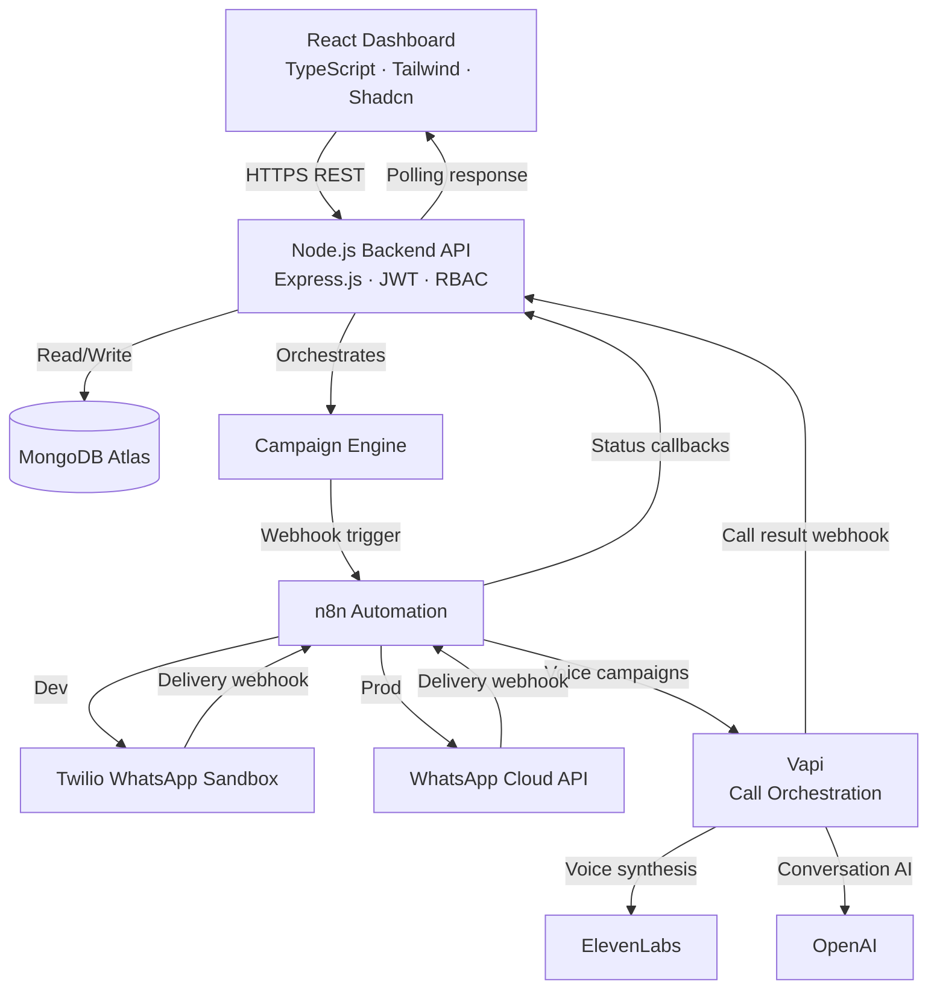
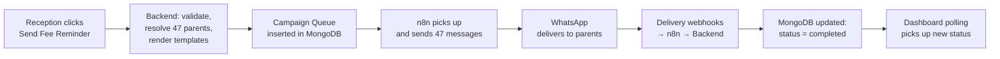
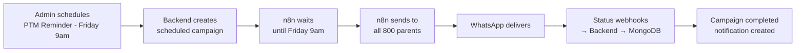
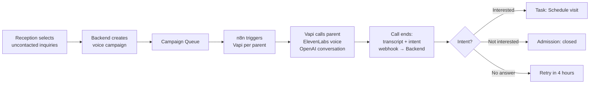
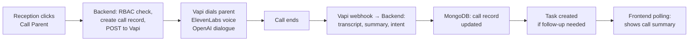
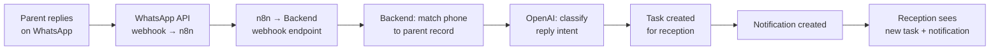
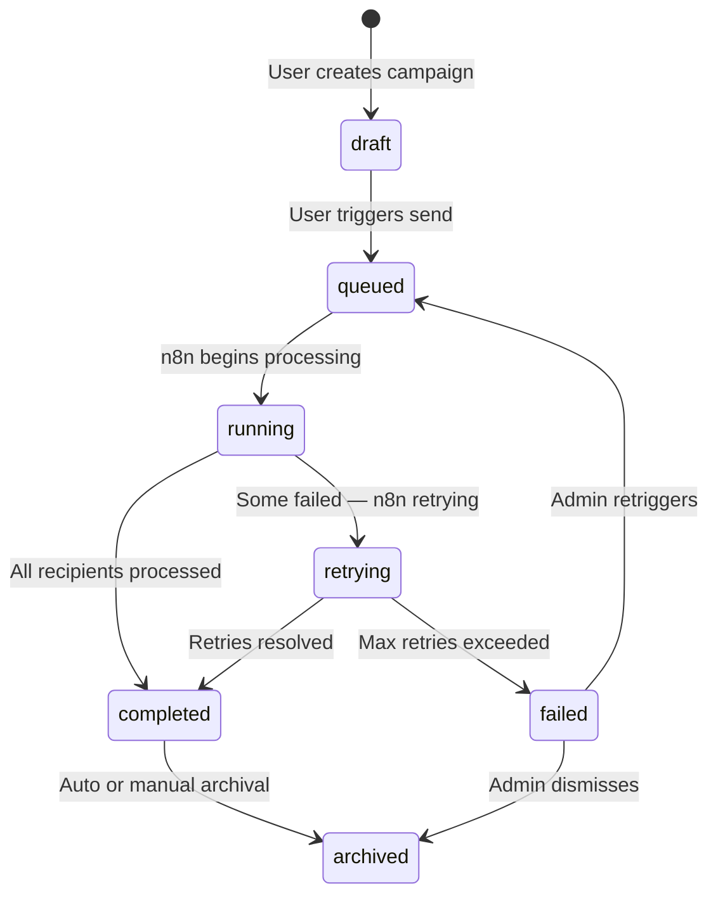

# 02 — System Architecture
### SchoolOS AI · Developer Quick Reference
**Version:** 1.0.0 · **Audience:** Developers, AI Assistants, New Contributors
**Read time:** ~15 minutes · **Detailed blueprint:** `02_System_Architecture.md`

---

## Table of Contents

1. [System Overview](#1-system-overview)
2. [Technology Stack](#2-technology-stack)
3. [Core Components](#3-core-components)
4. [High-Level Data Flows](#4-high-level-data-flows)
5. [Backend Responsibilities](#5-backend-responsibilities)
6. [Automation Responsibilities](#6-automation-responsibilities)
7. [Campaign Architecture](#7-campaign-architecture)
8. [User Roles](#8-user-roles)
9. [Key Engineering Decisions](#9-key-engineering-decisions)
10. [Future Scope](#10-future-scope)
11. [References](#11-references)

---

## 1. System Overview

SchoolOS AI is a **School Operating System** — not an ERP. Every entity (student, fee, inquiry) is a live operational object that can trigger automated workflows, AI voice calls, and WhatsApp campaigns automatically.

**Architecture philosophy:**
- Backend owns all business logic — frontend only renders
- Every outbound communication is a campaign (consistent lifecycle, retry, audit)
- Long-running work is delegated to n8n — backend never blocks
- Frontend never calls external APIs directly — always via backend



---

## 2. Technology Stack

| Layer | Technology | Chosen Because |
|---|---|---|
| **Frontend** | React + Vite + TypeScript | Component model, type safety, fast dev builds |
| **Styling** | Tailwind CSS + Shadcn UI | Utility-first, accessible components out of the box |
| **State / Data** | TanStack Query + React Router | Server state management, polling, caching built-in |
| **Backend** | Node.js + Express.js | JavaScript across full stack, large ecosystem, fast iteration |
| **Database** | MongoDB Atlas | Flexible document model, managed hosting, native sharding for multi-tenancy |
| **Automation** | n8n (self-hosted) | Visual workflows, retry logic, scheduling — without custom code |
| **Messaging (Dev)** | Twilio WhatsApp Sandbox | No WhatsApp approval required in development |
| **Messaging (Prod)** | WhatsApp Cloud API (Meta) | Direct Meta integration, lower cost at scale |
| **AI Voice** | Vapi + ElevenLabs + OpenAI | Vapi orchestrates calls, ElevenLabs generates voice, OpenAI handles conversation |
| **Auth** | JWT + Refresh Tokens + RBAC | Stateless, horizontally scalable, short-lived access tokens |
| **Deployment** | Docker + Nginx + VPS + GitHub | Containerised, reverse proxy with SSL, CI/CD via GitHub Actions |
| **Future** | Socket.IO, Redis | Real-time events and caching — not in MVP |

---

## 3. Core Components

| Component | Responsibility |
|---|---|
| **Frontend** | Render UI, send API requests, poll for updates. Zero business logic. |
| **Backend API** | Authentication, authorisation, validation, business logic, campaign orchestration, webhook ingestion. |
| **MongoDB** | Persist all application data. No logic, no stored procedures. |
| **Campaign Engine** | Create campaigns, resolve audience, render templates, manage campaign lifecycle state. |
| **Communication Engine** | Audience Builder, Variable Engine, Template Engine, Reply Processor, Delivery Tracker. |
| **n8n** | Execute campaign deliveries, schedule jobs, retry failed messages, trigger voice calls, handle inbound webhooks. |
| **WhatsApp Integration** | Deliver outbound messages via Twilio (dev) or WhatsApp Cloud API (prod). Receive delivery receipts and inbound replies. |
| **AI Voice Engine** | Orchestrate AI calls via Vapi. Generate voice via ElevenLabs. Handle conversation via OpenAI. Return transcript + intent to backend. |
| **Task Engine** | Create actionable tasks from AI call outcomes, parent replies, system alerts, or manual creation. |
| **Notification Engine** | Generate in-app notifications on campaign completion, replies, task assignments, errors. |
| **Authentication** | JWT issue, validation, refresh, RBAC permission checks on every route. |
| **Settings Module** | Single settings document per school. All modules read configuration from here — never hardcoded. |

---

## 4. High-Level Data Flows

### 4.1 Fee Reminder



### 4.2 PTM Reminder



### 4.3 Admission Follow-up Voice Call Campaign



### 4.4 Manual AI Call



### 4.5 Inbound Parent Reply



---

## 5. Backend Responsibilities

The backend is the **only** component that owns business logic. Everything else is a consumer or executor.

**Owns:**
- JWT authentication — issue, validate, refresh, revoke
- RBAC authorisation — every route checks permission before executing
- Input validation — business rules, not just format checking
- All MongoDB read and write operations
- Campaign creation, audience resolution, template rendering
- Campaign queue insertion — delegates execution to n8n
- Webhook ingestion — validates and dispatches all inbound callbacks (n8n, Vapi, WhatsApp)
- AI call initiation — backend calls Vapi, never the frontend
- Task creation from AI outcomes and reply classification
- Audit log writes — immutable record on every significant action
- Notification creation on system events
- Settings management — single source of configuration per school

**Does NOT own:**
- Long-running message delivery (→ n8n)
- WhatsApp transport (→ Twilio / WhatsApp Cloud API)
- Voice call execution (→ Vapi)
- Voice synthesis (→ ElevenLabs)
- Conversation AI (→ OpenAI via Vapi)
- UI rendering (→ Frontend)

**Standard API response envelope — used on every endpoint:**

```json
{ "success": true, "data": { ... }, "meta": { "page": 1, "total": 120 } }
{ "success": false, "error": { "code": "CAMPAIGN_NOT_FOUND", "message": "...", "statusCode": 404 } }
```

All routes versioned at `/api/v1/...`

---

## 6. Automation Responsibilities

n8n is the **execution engine**. It never makes product decisions — it only executes what the backend has already authorised and queued.

**Owns:**
- Campaign delivery — iterates recipient lists, sends messages with rate limiting
- WhatsApp sending via Twilio (dev) or WhatsApp Cloud API (prod)
- Scheduled execution — cron-based daily reminders, PTM notices, weekly reports
- Retry logic — exponential backoff on delivery failure (3 attempts: 5m, 15m, 1h)
- AI voice call triggering — sends calls to Vapi for campaign calls
- Inbound WhatsApp reply routing — forwards incoming messages to the backend webhook
- Automation logging — writes execution results to `automation_logs` in MongoDB
- Campaign status reporting — POSTs delivery status back to backend after each message

**Does NOT own:**
- Business logic
- Campaign state management (reports back to backend, which updates state)
- Direct MongoDB access for anything except automation logs

**n8n ↔ Backend communication:**
- Backend → n8n: `POST /webhook/send-campaign { campaignId, recipients[] }`
- n8n → Backend: `POST /api/v1/webhooks/n8n/delivery-status { recipientId, status }`
- n8n → Backend: `POST /api/v1/webhooks/n8n/campaign-complete { campaignId }`

---

## 7. Campaign Architecture

Every outbound communication — a single message or a 1,000-parent broadcast — is modelled as a **campaign**. This gives every communication a consistent lifecycle, delivery tracking, retry logic, and audit trail.



**Campaign Queue (how large campaigns are handled safely):**
- Backend splits recipient list into batches of 50
- Each batch is inserted as a `campaign_queue` entry in MongoDB
- Queue Processor (runs every 60s) picks up pending entries
- Max 3 concurrent n8n executions for WhatsApp, max 1 for voice calls
- Failed batches enter the retry queue with exponential backoff
- Permanently failed batches move to dead letter — admin can review and re-trigger

> Detail: `02_System_Architecture.md` §28, `06_n8n_Automation.md`

---

## 8. User Roles

MVP has three roles. RBAC is enforced at the API Gateway layer on every request.

| Role | Responsibilities | Key Restrictions |
|---|---|---|
| **Admin** | Full system access — school settings, user management, all campaigns, all reports, audit logs | None |
| **Reception** | Admissions, student contact management, WhatsApp campaigns, manual AI calls, task management | Cannot access settings, users, or audit logs |
| **Teacher** | Read own class student records, update own assigned tasks | No communication, financial, or campaign access |

**Permission flow:**

```
JWT extracted → role + permissions read → route permission checked → handler executes
```

All data queries are automatically scoped to `schoolId` from the JWT. Cross-school data access is structurally impossible.

> Detail: `02_System_Architecture.md` §13, `04_Backend_API.md`

---

## 9. Key Engineering Decisions

| Decision | Reason |
|---|---|
| **MongoDB over SQL** | Flexible document model for nested school data; native `schoolId` sharding for future multi-school SaaS |
| **n8n for automation** | Built-in retry, scheduling, and visual debugging — without writing a custom job queue system |
| **Everything is a campaign** | Consistent lifecycle, audit, retry, and reporting for all outbound communications regardless of type |
| **Queue-based campaign processing** | Backend never blocks — campaigns of 1,000+ recipients are batched and processed asynchronously |
| **Backend-first architecture** | All business logic centralised in one place — future mobile apps and integrations inherit correct behaviour automatically |
| **Frontend never calls external APIs** | API keys never exposed to the browser; audit logs always have user identity; provider swap requires zero frontend changes |
| **Twilio for development** | WhatsApp sandbox requires no Meta approval — faster dev iteration |
| **WhatsApp Cloud API for production** | Direct Meta integration, lower per-message cost, no Twilio intermediary overhead |
| **Polling instead of Socket.IO** | Simpler to implement and debug at MVP scale; TanStack Query handles polling lifecycle; Socket.IO is the defined upgrade path |
| **JWT with refresh token rotation** | Short-lived access tokens (15 min) limit blast radius of a stolen token; rotation detects token theft |
| **Prompts stored in MongoDB** | Per-school AI customisation, version history, rollback, and admin editability without code deployment |
| **Settings centralised per school** | All modules read one settings document — no hardcoded defaults, no scattered config collections |

---

## 10. Future Scope

These are planned but not part of MVP. No implementation details here.

**Real-time & Performance:**
- Socket.IO — replace polling with push events
- Redis — cache settings, dashboard stats, notification counts

**Platform Expansion:**
- Multi-School SaaS — `schoolId` is already on every record; zero schema migration needed
- Parent Portal — parent self-service for fees, attendance, messages
- Student App — student self-service for timetable and academic records
- Mobile Apps — React Native / Flutter consuming the existing backend API

**Communication Channels:**
- Email campaigns
- SMS campaigns
- Push notifications (Firebase)

**School Modules:**
- Transport management
- Library management
- Hostel management
- Payroll
- Finance and P&L

**AI Enhancements:**
- Knowledge Base — school-specific FAQ for AI callers
- Prompt A/B testing
- Multi-language voice agents

---

## 11. References

| Document | What It Covers |
|---|---|
| `01_Product_Bible.md` | Product vision, feature list, user stories, school operations context |
| `02_System_Architecture.md` | Full enterprise architecture blueprint — all components, ADRs, security, scaling, folder structure |
| `03_Database_Architecture.md` | Complete MongoDB schema — all collections, indexes, relationships |
| `04_Backend_API.md` | All API endpoints, request/response schemas, validation rules, error codes |
| `05_Communication_Engine.md` | Audience Builder, Template Engine, Variable Engine, Reply Processor implementation detail |
| `06_n8n_Automation.md` | All n8n workflows, trigger configurations, retry settings, credential setup |

---

*Read time: ~12 minutes · For architecture decisions and detailed component specs, see `02_System_Architecture.md`*
