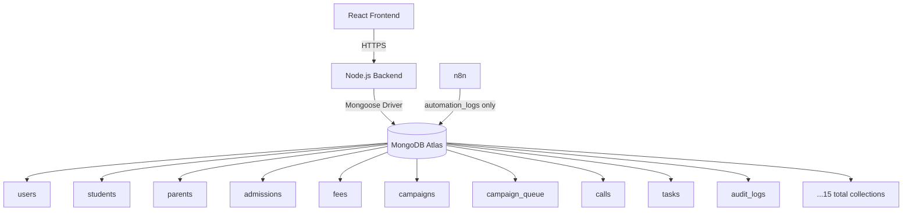
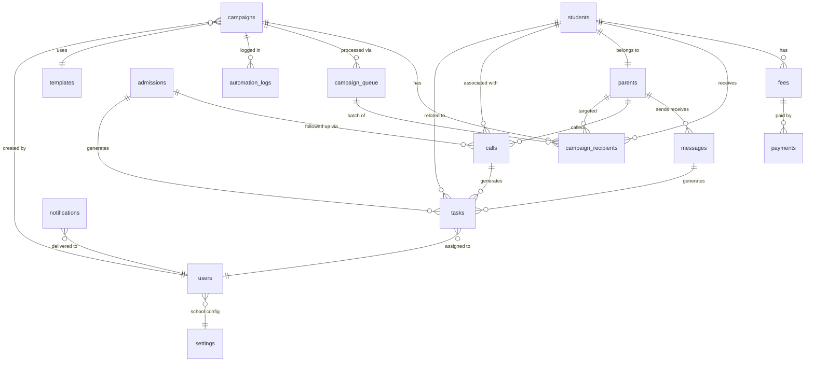
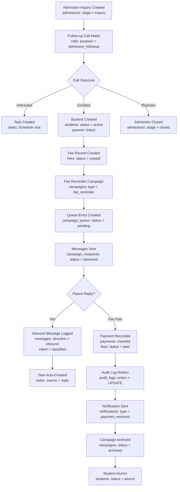

# 03 — Database Architecture
### SchoolOS AI · MongoDB Reference Document
**Version:** 1.0.0 · **Audience:** Backend Developers, AI Assistants, Contributors
**Read time:** ~15 minutes · **Database:** MongoDB Atlas

---

## Table of Contents

1. [Database Overview](#1-database-overview)
2. [Database Principles](#2-database-principles)
3. [Collection Overview](#3-collection-overview)
4. [Collection Details](#4-collection-details)
5. [Collection Relationships](#5-collection-relationships)
6. [Data Ownership](#6-data-ownership)
7. [Naming Conventions](#7-naming-conventions)
8. [Indexing Strategy](#8-indexing-strategy)
9. [Data Lifecycle](#9-data-lifecycle)
10. [Future Collections](#10-future-collections)
11. [References](#11-references)

---

## 1. Database Overview

**MongoDB Atlas** is the single source of truth for all SchoolOS AI data.

- Document model maps naturally to school data (students with nested contacts, campaigns with nested stats)
- Every collection is scoped to a `schoolId` — the foundation of multi-tenant architecture
- Atlas provides managed hosting, automated backups, and global replication
- Horizontal sharding by `schoolId` is the defined path when volume requires it



> **Rule:** Only the backend writes to MongoDB. n8n writes only to `automation_logs`. The frontend never connects to MongoDB.

---

## 2. Database Principles

- **Single source of truth** — MongoDB owns all application state. No other component caches authoritative data.
- **Backend writes only** — No frontend, no n8n workflow, no external service writes business data directly.
- **Every record belongs to a school** — `schoolId: ObjectId` is required on every collection document.
- **Soft delete, not hard delete** — Set `status: "deleted"` and `deletedAt`. Never remove documents.
- **Every important action is audited** — Write operations trigger an `audit_logs` entry with before/after state.
- **Reference only when necessary** — Embed related data when it is always needed together; use `ObjectId` references when data is large or shared.
- **Keep query-critical data together** — Avoid application-side joins. Use MongoDB aggregation pipelines where joins are needed.
- **Indexes are defined at startup** — No ad-hoc index creation in production. All indexes declared in `mongodb.ts`.
- **No stored procedures** — All business logic lives in the backend application layer.
- **`createdAt` and `updatedAt` on every document** — Set automatically via Mongoose timestamps.

---

## 3. Collection Overview

| # | Collection | Purpose |
|---|---|---|
| 1 | `users` | Platform user accounts (admin, reception, teacher) |
| 2 | `students` | Student master records |
| 3 | `parents` | Parent and guardian contact records |
| 4 | `admissions` | Admission inquiry lifecycle tracking |
| 5 | `fees` | Student fee records and payment status |
| 6 | `payments` | Individual payment transaction records |
| 7 | `campaigns` | Campaign definitions and lifecycle state |
| 8 | `campaign_queue` | Queue entries for n8n execution batches |
| 9 | `campaign_recipients` | Per-recipient delivery status within a campaign |
| 10 | `templates` | WhatsApp message and voice script templates |
| 11 | `messages` | Individual WhatsApp message records (inbound + outbound) |
| 12 | `calls` | AI voice call records and transcripts |
| 13 | `tasks` | Actionable tasks for school staff |
| 14 | `notifications` | In-app notification records per user |
| 15 | `audit_logs` | Immutable audit trail of all write operations |
| 16 | `settings` | School-level configuration (one document per school) |
| 17 | `automation_logs` | n8n workflow execution logs |

---

## 4. Collection Details

---

### 4.1 `users`

**Purpose:** Platform user accounts with hashed credentials and role assignment.

| Field | Type | Notes |
|---|---|---|
| `_id` | ObjectId | Primary key |
| `schoolId` | ObjectId | Ref: school |
| `name` | String | Full name |
| `email` | String | Unique per school |
| `passwordHash` | String | bcrypt hash — never returned in API responses |
| `role` | String | `admin` \| `reception` \| `teacher` |
| `status` | String | `active` \| `inactive` \| `deleted` |
| `refreshTokenHash` | String | Hashed refresh token — rotated on use |
| `lastLoginAt` | Date | |
| `createdAt` | Date | Auto |
| `updatedAt` | Date | Auto |

**Indexes:** `email + schoolId` (unique), `schoolId`, `status`

**Relationships:** → `audit_logs`, → `tasks` (assignee)

```json
{
  "_id": "64f1a2b3c4d5e6f7a8b9c0d1",
  "schoolId": "64f1a2b3c4d5e6f7a8b9c000",
  "name": "Priya Kapoor",
  "email": "priya@dpssrohini.com",
  "role": "reception",
  "status": "active",
  "lastLoginAt": "2026-06-27T08:30:00Z",
  "createdAt": "2026-01-15T10:00:00Z"
}
```

---

### 4.2 `students`

**Purpose:** Master record for every enrolled or formerly enrolled student.

| Field | Type | Notes |
|---|---|---|
| `_id` | ObjectId | Primary key |
| `schoolId` | ObjectId | |
| `admissionNumber` | String | Unique per school |
| `name` | String | |
| `dateOfBirth` | Date | |
| `gender` | String | `male` \| `female` \| `other` |
| `grade` | String | `"1"` – `"12"`, `"KG"`, `"Nursery"` |
| `section` | String | `"A"`, `"B"`, `"C"` |
| `academicSession` | String | `"2025-2026"` |
| `parentId` | ObjectId | Ref: `parents` |
| `status` | String | `active` \| `alumni` \| `transferred` \| `deleted` |
| `createdAt` | Date | |
| `updatedAt` | Date | |

**Indexes:** `schoolId + grade + section`, `schoolId + status`, `admissionNumber + schoolId` (unique)

**Relationships:** → `parents`, → `fees`, → `messages`, → `calls`, → `campaigns` (via audience resolution)

```json
{
  "_id": "64f1a2b3c4d5e6f7a8b9c0d2",
  "schoolId": "64f1a2b3c4d5e6f7a8b9c000",
  "admissionNumber": "DPS-2024-0042",
  "name": "Rahul Sharma",
  "grade": "8",
  "section": "A",
  "academicSession": "2025-2026",
  "parentId": "64f1a2b3c4d5e6f7a8b9c0d3",
  "status": "active"
}
```

---

### 4.3 `parents`

**Purpose:** Parent and guardian contact records. One parent may be linked to multiple students.

| Field | Type | Notes |
|---|---|---|
| `_id` | ObjectId | |
| `schoolId` | ObjectId | |
| `name` | String | |
| `phone` | String | Primary WhatsApp number |
| `alternatePhone` | String | Optional |
| `email` | String | Optional |
| `studentIds` | ObjectId[] | Refs: `students` |
| `whatsappOptIn` | Boolean | Consent for WhatsApp messages |
| `status` | String | `active` \| `deleted` |
| `createdAt` | Date | |
| `updatedAt` | Date | |

**Indexes:** `phone + schoolId` (unique), `schoolId + status`

**Relationships:** → `students`, → `messages`, → `calls`, → `campaign_recipients`

```json
{
  "_id": "64f1a2b3c4d5e6f7a8b9c0d3",
  "schoolId": "64f1a2b3c4d5e6f7a8b9c000",
  "name": "Sunita Sharma",
  "phone": "+919876543210",
  "studentIds": ["64f1a2b3c4d5e6f7a8b9c0d2"],
  "whatsappOptIn": true,
  "status": "active"
}
```

---

### 4.4 `admissions`

**Purpose:** Full lifecycle tracking of admission inquiries from first contact to enrolment or rejection.

| Field | Type | Notes |
|---|---|---|
| `_id` | ObjectId | |
| `schoolId` | ObjectId | |
| `childName` | String | |
| `parentName` | String | |
| `phone` | String | |
| `grade` | String | Applying for grade |
| `stage` | String | `inquiry` \| `application` \| `visit_scheduled` \| `enrolled` \| `rejected` \| `closed` |
| `source` | String | `walk_in` \| `phone` \| `website` \| `referral` |
| `contacted` | Boolean | Has any follow-up been made |
| `lastContactedAt` | Date | |
| `callOutcome` | String | From AI call: `interested` \| `not_interested` \| `no_answer` \| `callback_requested` |
| `notes` | String | Staff notes |
| `assignedTo` | ObjectId | Ref: `users` |
| `status` | String | `open` \| `closed` \| `deleted` |
| `createdAt` | Date | |
| `updatedAt` | Date | |

**Indexes:** `schoolId + stage`, `schoolId + contacted`, `schoolId + createdAt`

**Relationships:** → `users` (assignedTo), → `calls`, → `tasks`, → `campaigns`

```json
{
  "_id": "64f1a2b3c4d5e6f7a8b9c0d4",
  "schoolId": "64f1a2b3c4d5e6f7a8b9c000",
  "childName": "Aryan Mehta",
  "parentName": "Vikram Mehta",
  "phone": "+919812345678",
  "grade": "5",
  "stage": "inquiry",
  "source": "walk_in",
  "contacted": false,
  "status": "open",
  "createdAt": "2026-06-20T10:00:00Z"
}
```

---

### 4.5 `fees`

**Purpose:** One fee record per student per fee category per academic session.

| Field | Type | Notes |
|---|---|---|
| `_id` | ObjectId | |
| `schoolId` | ObjectId | |
| `studentId` | ObjectId | Ref: `students` |
| `parentId` | ObjectId | Ref: `parents` |
| `academicSession` | String | `"2025-2026"` |
| `feeType` | String | `tuition` \| `transport` \| `hostel` \| `misc` |
| `totalAmount` | Number | |
| `paidAmount` | Number | Running total of payments |
| `balanceAmount` | Number | `totalAmount - paidAmount` |
| `dueDate` | Date | |
| `status` | String | `unpaid` \| `partial` \| `paid` \| `overdue` |
| `overdueDays` | Number | Calculated field — days past due date |
| `reminderCount` | Number | How many reminders sent |
| `lastReminderAt` | Date | |
| `createdAt` | Date | |
| `updatedAt` | Date | |

**Indexes:** `schoolId + studentId`, `schoolId + status`, `schoolId + dueDate`, `schoolId + status + dueDate`

**Relationships:** → `students`, → `parents`, → `payments`, → `campaigns`

```json
{
  "_id": "64f1a2b3c4d5e6f7a8b9c0d5",
  "schoolId": "64f1a2b3c4d5e6f7a8b9c000",
  "studentId": "64f1a2b3c4d5e6f7a8b9c0d2",
  "parentId": "64f1a2b3c4d5e6f7a8b9c0d3",
  "academicSession": "2025-2026",
  "feeType": "tuition",
  "totalAmount": 45000,
  "paidAmount": 15000,
  "balanceAmount": 30000,
  "dueDate": "2026-07-10T00:00:00Z",
  "status": "partial",
  "overdueDays": 0,
  "reminderCount": 1
}
```

---

### 4.6 `payments`

**Purpose:** Individual payment transaction records. Each payment reduces the fee balance.

| Field | Type | Notes |
|---|---|---|
| `_id` | ObjectId | |
| `schoolId` | ObjectId | |
| `feeId` | ObjectId | Ref: `fees` |
| `studentId` | ObjectId | Ref: `students` |
| `amount` | Number | Amount paid in this transaction |
| `paymentMode` | String | `cash` \| `upi` \| `bank_transfer` \| `cheque` |
| `referenceNumber` | String | UPI/cheque/transfer reference |
| `receivedBy` | ObjectId | Ref: `users` |
| `receiptNumber` | String | System generated |
| `paidAt` | Date | |
| `createdAt` | Date | |

**Indexes:** `schoolId + feeId`, `schoolId + studentId`, `schoolId + paidAt`

**Relationships:** → `fees`, → `students`, → `users`

```json
{
  "_id": "64f1a2b3c4d5e6f7a8b9c0d6",
  "schoolId": "64f1a2b3c4d5e6f7a8b9c000",
  "feeId": "64f1a2b3c4d5e6f7a8b9c0d5",
  "studentId": "64f1a2b3c4d5e6f7a8b9c0d2",
  "amount": 15000,
  "paymentMode": "upi",
  "referenceNumber": "UPI123456789",
  "receiptNumber": "RCP-2026-0089",
  "paidAt": "2026-05-15T11:30:00Z"
}
```

---

### 4.7 `campaigns`

**Purpose:** Every outbound communication — WhatsApp or voice — is a campaign. Tracks the full lifecycle.

| Field | Type | Notes |
|---|---|---|
| `_id` | ObjectId | |
| `schoolId` | ObjectId | |
| `createdBy` | ObjectId | Ref: `users` |
| `type` | String | `fee_reminder` \| `ptm_reminder` \| `admission_followup` \| `holiday_notice` \| `general_broadcast` \| `voice_call` |
| `channel` | String | `whatsapp` \| `voice` |
| `status` | String | `draft` \| `queued` \| `running` \| `completed` \| `failed` \| `retrying` \| `archived` |
| `audience` | Object | `{ segment, filters, resolvedCount }` |
| `templateId` | ObjectId | Ref: `templates` |
| `scheduledAt` | Date | Null = send immediately |
| `startedAt` | Date | |
| `completedAt` | Date | |
| `stats` | Object | `{ total, delivered, failed, read, replied }` |
| `n8nExecutionId` | String | n8n execution reference |
| `createdAt` | Date | |
| `updatedAt` | Date | |

**Indexes:** `schoolId + status`, `schoolId + type + createdAt`, `schoolId + createdBy`

**Relationships:** → `users`, → `templates`, → `campaign_recipients`, → `campaign_queue`

```json
{
  "_id": "64f1a2b3c4d5e6f7a8b9c0d7",
  "schoolId": "64f1a2b3c4d5e6f7a8b9c000",
  "createdBy": "64f1a2b3c4d5e6f7a8b9c0d1",
  "type": "fee_reminder",
  "channel": "whatsapp",
  "status": "completed",
  "audience": { "segment": "grade", "filters": { "grade": "8" }, "resolvedCount": 47 },
  "scheduledAt": null,
  "stats": { "total": 47, "delivered": 45, "failed": 2, "read": 38, "replied": 6 },
  "completedAt": "2026-06-27T09:45:00Z"
}
```

---

### 4.8 `campaign_queue`

**Purpose:** Durable queue of n8n execution batches. Survives backend restarts. Enables concurrency control.

| Field | Type | Notes |
|---|---|---|
| `_id` | ObjectId | |
| `schoolId` | ObjectId | |
| `campaignId` | ObjectId | Ref: `campaigns` |
| `channel` | String | `whatsapp` \| `voice` |
| `priority` | String | `high` \| `normal` \| `low` |
| `status` | String | `pending` \| `processing` \| `completed` \| `failed` \| `dead_letter` |
| `batchIndex` | Number | Which batch number within the campaign |
| `batchSize` | Number | Number of recipients in this batch |
| `recipientIds` | ObjectId[] | Refs: `campaign_recipients` for this batch |
| `retryCount` | Number | Default 0, max 3 |
| `nextRetryAt` | Date | Calculated on failure |
| `n8nExecutionId` | String | Set when n8n accepts the batch |
| `errorDetails` | String | Last error message |
| `createdAt` | Date | |
| `processedAt` | Date | |

**Indexes:** `status + priority + nextRetryAt`, `campaignId`, `schoolId + status`

**Relationships:** → `campaigns`, → `campaign_recipients`

```json
{
  "_id": "64f1a2b3c4d5e6f7a8b9c0d8",
  "schoolId": "64f1a2b3c4d5e6f7a8b9c000",
  "campaignId": "64f1a2b3c4d5e6f7a8b9c0d7",
  "channel": "whatsapp",
  "priority": "high",
  "status": "completed",
  "batchIndex": 1,
  "batchSize": 47,
  "retryCount": 0,
  "processedAt": "2026-06-27T09:44:00Z"
}
```

---

### 4.9 `campaign_recipients`

**Purpose:** One record per recipient per campaign. Tracks individual delivery status.

| Field | Type | Notes |
|---|---|---|
| `_id` | ObjectId | |
| `schoolId` | ObjectId | |
| `campaignId` | ObjectId | Ref: `campaigns` |
| `parentId` | ObjectId | Ref: `parents` |
| `studentId` | ObjectId | Ref: `students` |
| `phone` | String | Snapshot at send time |
| `renderedMessage` | String | Final message after variable substitution |
| `status` | String | `pending` \| `sent` \| `delivered` \| `read` \| `failed` \| `permanently_failed` |
| `sentAt` | Date | |
| `deliveredAt` | Date | |
| `readAt` | Date | |
| `repliedAt` | Date | |
| `replyIntent` | String | OpenAI classification of reply |
| `failureReason` | String | WhatsApp/Vapi error code |
| `createdAt` | Date | |

**Indexes:** `campaignId + status`, `parentId + campaignId`, `schoolId + createdAt`

**Relationships:** → `campaigns`, → `parents`, → `students`

```json
{
  "_id": "64f1a2b3c4d5e6f7a8b9c0d9",
  "schoolId": "64f1a2b3c4d5e6f7a8b9c000",
  "campaignId": "64f1a2b3c4d5e6f7a8b9c0d7",
  "parentId": "64f1a2b3c4d5e6f7a8b9c0d3",
  "studentId": "64f1a2b3c4d5e6f7a8b9c0d2",
  "phone": "+919876543210",
  "renderedMessage": "Dear Sunita ji, Rahul's fee of ₹30,000 is due by 10 July. Please pay at the earliest.",
  "status": "read",
  "sentAt": "2026-06-27T09:01:00Z",
  "deliveredAt": "2026-06-27T09:01:12Z",
  "readAt": "2026-06-27T09:15:00Z"
}
```

---

### 4.10 `templates`

**Purpose:** Approved WhatsApp message templates and voice call scripts. All campaigns reference a template.

| Field | Type | Notes |
|---|---|---|
| `_id` | ObjectId | |
| `schoolId` | ObjectId | |
| `key` | String | Unique identifier e.g. `fee_reminder_v1` |
| `name` | String | Human-readable name |
| `channel` | String | `whatsapp` \| `voice` |
| `type` | String | `fee_reminder` \| `ptm_reminder` \| `general` \| `voice_script` |
| `body` | String | Message with `{{variable}}` placeholders |
| `variables` | String[] | All variables this template uses |
| `whatsappTemplateId` | String | Meta-approved template ID (production only) |
| `status` | String | `draft` \| `approved` \| `archived` |
| `language` | String | `en` \| `hi` \| `en-IN` |
| `createdBy` | ObjectId | Ref: `users` |
| `createdAt` | Date | |
| `updatedAt` | Date | |

**Indexes:** `schoolId + key` (unique), `schoolId + channel + status`

**Relationships:** → `campaigns`, → `users`

```json
{
  "_id": "64f1a2b3c4d5e6f7a8b9c0e0",
  "schoolId": "64f1a2b3c4d5e6f7a8b9c000",
  "key": "fee_reminder_v2",
  "name": "Fee Reminder — Standard",
  "channel": "whatsapp",
  "type": "fee_reminder",
  "body": "Dear {{parentName}}, {{studentName}} ka fee ₹{{feeAmount}} due date {{dueDate}} tak pending hai. Please pay karo. — {{schoolName}}",
  "variables": ["parentName", "studentName", "feeAmount", "dueDate", "schoolName"],
  "status": "approved",
  "language": "hi"
}
```

---

### 4.11 `messages`

**Purpose:** Individual WhatsApp message records — both outbound (campaigns) and inbound (parent replies).

| Field | Type | Notes |
|---|---|---|
| `_id` | ObjectId | |
| `schoolId` | ObjectId | |
| `parentId` | ObjectId | Ref: `parents` |
| `studentId` | ObjectId | Ref: `students` (optional) |
| `campaignId` | ObjectId | Ref: `campaigns` (null for inbound) |
| `direction` | String | `outbound` \| `inbound` |
| `channel` | String | `whatsapp` |
| `body` | String | Message text |
| `status` | String | `sent` \| `delivered` \| `read` \| `failed` (outbound) \| `received` (inbound) |
| `intent` | String | OpenAI classification (inbound only) |
| `externalMessageId` | String | WhatsApp message ID from Meta |
| `sentAt` | Date | |
| `deliveredAt` | Date | |
| `createdAt` | Date | |

**Indexes:** `schoolId + parentId + direction`, `campaignId`, `schoolId + createdAt`, `schoolId + direction + intent`

**Relationships:** → `parents`, → `campaigns`, → `tasks`

```json
{
  "_id": "64f1a2b3c4d5e6f7a8b9c0e1",
  "schoolId": "64f1a2b3c4d5e6f7a8b9c000",
  "parentId": "64f1a2b3c4d5e6f7a8b9c0d3",
  "campaignId": null,
  "direction": "inbound",
  "channel": "whatsapp",
  "body": "Bhai last date kya hai fee ki?",
  "status": "received",
  "intent": "fee_inquiry",
  "createdAt": "2026-06-27T10:30:00Z"
}
```

---

### 4.12 `calls`

**Purpose:** Every AI voice call record — manual and campaign. Stores transcript and outcome.

| Field | Type | Notes |
|---|---|---|
| `_id` | ObjectId | |
| `schoolId` | ObjectId | |
| `campaignId` | ObjectId | Ref: `campaigns` (null for manual) |
| `initiatedBy` | ObjectId | Ref: `users` (null for automated) |
| `type` | String | `manual` \| `campaign` |
| `purpose` | String | `fee_followup` \| `admission_followup` \| `ptm_reminder` \| `general` |
| `parentId` | ObjectId | Ref: `parents` |
| `studentId` | ObjectId | Ref: `students` |
| `phone` | String | Number called |
| `status` | String | `initiating` \| `ringing` \| `in_progress` \| `completed` \| `no_answer` \| `failed` |
| `vapiCallId` | String | Vapi's call identifier |
| `durationSeconds` | Number | |
| `transcript` | String | Full conversation transcript |
| `summary` | String | AI-generated summary |
| `intent` | String | `interested` \| `not_interested` \| `no_answer` \| `callback_requested` \| `objection` |
| `followUpRequired` | Boolean | |
| `createdAt` | Date | |
| `completedAt` | Date | |

**Indexes:** `schoolId + parentId`, `schoolId + status`, `schoolId + type + createdAt`, `campaignId`

**Relationships:** → `parents`, → `students`, → `campaigns`, → `tasks`

```json
{
  "_id": "64f1a2b3c4d5e6f7a8b9c0e2",
  "schoolId": "64f1a2b3c4d5e6f7a8b9c000",
  "campaignId": null,
  "initiatedBy": "64f1a2b3c4d5e6f7a8b9c0d1",
  "type": "manual",
  "purpose": "fee_followup",
  "parentId": "64f1a2b3c4d5e6f7a8b9c0d3",
  "studentId": "64f1a2b3c4d5e6f7a8b9c0d2",
  "phone": "+919876543210",
  "status": "completed",
  "vapiCallId": "vapi_call_abc123",
  "durationSeconds": 145,
  "summary": "Parent agreed to pay by Friday. Requested receipt via WhatsApp.",
  "intent": "callback_requested",
  "followUpRequired": true,
  "completedAt": "2026-06-27T11:00:00Z"
}
```

---

### 4.13 `tasks`

**Purpose:** Actionable items for school staff. Created automatically from AI outcomes, replies, or manually.

| Field | Type | Notes |
|---|---|---|
| `_id` | ObjectId | |
| `schoolId` | ObjectId | |
| `title` | String | |
| `description` | String | |
| `source` | String | `ai_call` \| `reply` \| `manual` \| `system_alert` |
| `sourceId` | ObjectId | Ref to the call, message, or campaign that created this task |
| `assignedTo` | ObjectId | Ref: `users` |
| `relatedStudentId` | ObjectId | Ref: `students` (optional) |
| `relatedParentId` | ObjectId | Ref: `parents` (optional) |
| `priority` | String | `high` \| `normal` \| `low` |
| `status` | String | `open` \| `in_progress` \| `completed` \| `cancelled` |
| `dueDate` | Date | |
| `completedAt` | Date | |
| `createdAt` | Date | |
| `updatedAt` | Date | |

**Indexes:** `schoolId + assignedTo + status`, `schoolId + status + createdAt`, `sourceId`

**Relationships:** → `users`, → `students`, → `parents`, → `notifications`

```json
{
  "_id": "64f1a2b3c4d5e6f7a8b9c0e3",
  "schoolId": "64f1a2b3c4d5e6f7a8b9c000",
  "title": "Call back Sunita Sharma — fee payment confirmed for Friday",
  "source": "ai_call",
  "sourceId": "64f1a2b3c4d5e6f7a8b9c0e2",
  "assignedTo": "64f1a2b3c4d5e6f7a8b9c0d1",
  "relatedParentId": "64f1a2b3c4d5e6f7a8b9c0d3",
  "priority": "high",
  "status": "open",
  "dueDate": "2026-06-28T15:00:00Z",
  "createdAt": "2026-06-27T11:01:00Z"
}
```

---

### 4.14 `notifications`

**Purpose:** In-app notifications for platform users. Polled by the frontend every 30 seconds.

| Field | Type | Notes |
|---|---|---|
| `_id` | ObjectId | |
| `schoolId` | ObjectId | |
| `userId` | ObjectId | Ref: `users` — who sees this |
| `type` | String | `campaign_complete` \| `campaign_failed` \| `reply_received` \| `task_assigned` \| `call_completed` \| `system_error` |
| `title` | String | Short heading |
| `body` | String | Full notification text |
| `relatedId` | ObjectId | Ref to the campaign, task, or call |
| `read` | Boolean | Default false |
| `readAt` | Date | |
| `createdAt` | Date | |

**Indexes:** `userId + read`, `userId + createdAt`, `schoolId + createdAt`

**Relationships:** → `users`, → `campaigns`, → `tasks`, → `calls`

```json
{
  "_id": "64f1a2b3c4d5e6f7a8b9c0e4",
  "schoolId": "64f1a2b3c4d5e6f7a8b9c000",
  "userId": "64f1a2b3c4d5e6f7a8b9c0d1",
  "type": "campaign_complete",
  "title": "Fee Reminder Sent",
  "body": "Fee reminder campaign completed — 45 delivered, 2 failed.",
  "relatedId": "64f1a2b3c4d5e6f7a8b9c0d7",
  "read": false,
  "createdAt": "2026-06-27T09:46:00Z"
}
```

---

### 4.15 `audit_logs`

**Purpose:** Immutable record of every write operation. Never updated. Never deleted.

| Field | Type | Notes |
|---|---|---|
| `_id` | ObjectId | |
| `schoolId` | ObjectId | |
| `userId` | ObjectId | Who performed the action |
| `userEmail` | String | Snapshot at time of action |
| `userRole` | String | Snapshot at time of action |
| `action` | String | `CREATE` \| `UPDATE` \| `DELETE` \| `LOGIN` \| `LOGOUT` \| `TRIGGER` |
| `resource` | String | Collection or system area affected |
| `resourceId` | ObjectId | The document affected |
| `before` | Object | State before change (updates only) |
| `after` | Object | State after change |
| `ip` | String | |
| `userAgent` | String | |
| `timestamp` | Date | |

**Indexes:** `schoolId + userId`, `schoolId + resource + timestamp`, `timestamp`

> Audit logs have **no update or delete operations**. They are insert-only.

```json
{
  "_id": "64f1a2b3c4d5e6f7a8b9c0e5",
  "schoolId": "64f1a2b3c4d5e6f7a8b9c000",
  "userId": "64f1a2b3c4d5e6f7a8b9c0d1",
  "userEmail": "priya@dpssrohini.com",
  "userRole": "reception",
  "action": "UPDATE",
  "resource": "admissions",
  "resourceId": "64f1a2b3c4d5e6f7a8b9c0d4",
  "before": { "stage": "inquiry" },
  "after": { "stage": "visit_scheduled" },
  "ip": "103.45.67.89",
  "timestamp": "2026-06-27T10:15:00Z"
}
```

---

### 4.16 `settings`

**Purpose:** One settings document per school. All modules read configuration from here at runtime.

| Field | Type | Notes |
|---|---|---|
| `_id` | ObjectId | |
| `schoolId` | ObjectId | Unique — one document per school |
| `schoolInfo` | Object | Name, address, phone, email, principalName |
| `academicSession` | Object | Current session, start/end dates, grades, sections |
| `workingDays` | Object | Days of week, school hours, WhatsApp send window |
| `whatsappTemplates` | Object[] | Approved template IDs and bodies |
| `voiceScripts` | Object[] | Active voice call scripts per purpose |
| `holidayCalendar` | Object[] | Date and name of each holiday |
| `ptmSettings` | Object | PTM date, time, reminder days before |
| `feeSettings` | Object | Late fee %, reminder days, escalation threshold |
| `reminderRules` | Object | Auto-reminder enabled, schedule, max reminders |
| `automationSettings` | Object | Batch size, concurrency limit, retry attempts |
| `aiSettings` | Object | Daily call limit, call window, language, persona |
| `branding` | Object | Primary colour, WhatsApp message signature |
| `updatedAt` | Date | |
| `updatedBy` | ObjectId | Ref: `users` |

**Indexes:** `schoolId` (unique)

```json
{
  "_id": "64f1a2b3c4d5e6f7a8b9c0e6",
  "schoolId": "64f1a2b3c4d5e6f7a8b9c000",
  "schoolInfo": {
    "name": "Delhi Public School Rohini",
    "phone": "+9111-27051234",
    "principalName": "Dr. Anita Gupta"
  },
  "feeSettings": {
    "lateFeePercentage": 2,
    "reminderDaysBeforeDue": 7,
    "escalationThresholdDays": 30
  },
  "aiSettings": {
    "dailyCallLimit": 50,
    "callWindowStart": "09:00",
    "callWindowEnd": "18:00",
    "language": "hi"
  },
  "automationSettings": {
    "batchSize": 50,
    "concurrencyLimit": 3,
    "retryAttempts": 3
  }
}
```

---

### 4.17 `automation_logs`

**Purpose:** n8n workflow execution logs. The only collection n8n writes to directly.

| Field | Type | Notes |
|---|---|---|
| `_id` | ObjectId | |
| `schoolId` | ObjectId | |
| `campaignId` | ObjectId | Ref: `campaigns` |
| `queueEntryId` | ObjectId | Ref: `campaign_queue` |
| `workflowName` | String | n8n workflow identifier |
| `n8nExecutionId` | String | n8n's own execution ID |
| `status` | String | `started` \| `completed` \| `failed` |
| `recipientsProcessed` | Number | |
| `recipientsSucceeded` | Number | |
| `recipientsFailed` | Number | |
| `errorDetails` | String | Error message if failed |
| `startedAt` | Date | |
| `completedAt` | Date | |
| `createdAt` | Date | |

**Indexes:** `campaignId`, `schoolId + createdAt`, `n8nExecutionId`

```json
{
  "_id": "64f1a2b3c4d5e6f7a8b9c0e7",
  "schoolId": "64f1a2b3c4d5e6f7a8b9c000",
  "campaignId": "64f1a2b3c4d5e6f7a8b9c0d7",
  "workflowName": "fee_reminder_campaign",
  "n8nExecutionId": "n8n_exec_xyz789",
  "status": "completed",
  "recipientsProcessed": 47,
  "recipientsSucceeded": 45,
  "recipientsFailed": 2,
  "startedAt": "2026-06-27T09:00:00Z",
  "completedAt": "2026-06-27T09:44:00Z"
}
```

---

## 5. Collection Relationships



---

## 6. Data Ownership

| Module | Owns Collections | Write Rule |
|---|---|---|
| **Backend — Auth** | `users` | Full CRUD |
| **Backend — Campaign Engine** | `campaigns`, `campaign_queue`, `campaign_recipients` | Full CRUD |
| **Backend — Communication Engine** | `messages`, `templates` | Full CRUD |
| **Backend — AI Voice** | `calls` | Full CRUD |
| **Backend — Task Engine** | `tasks` | Full CRUD |
| **Backend — Notification Engine** | `notifications` | Insert + Update (read status) |
| **Backend — Fee Module** | `fees`, `payments` | Full CRUD |
| **Backend — Admission Module** | `admissions` | Full CRUD |
| **Backend — Student Module** | `students`, `parents` | Full CRUD |
| **Backend — Settings Module** | `settings` | Full CRUD |
| **Backend — Audit Engine** | `audit_logs` | Insert only — no update, no delete |
| **n8n** | `automation_logs` | Insert only |

> **Rule:** No collection is owned by two modules. If a module needs data from another collection, it calls the owning module's service, not the database directly.

---

## 7. Naming Conventions

### Collection Names

| Rule | Example |
|---|---|
| Plural, snake_case | `campaign_recipients`, `audit_logs` |
| No abbreviations | `notifications` not `notifs` |
| Lowercase always | `automation_logs` not `AutomationLogs` |

### Field Names

| Rule | Example |
|---|---|
| camelCase | `schoolId`, `createdAt`, `feeType` |
| ObjectId references end in `Id` | `parentId`, `campaignId`, `assignedTo` (exception: user reference in context) |
| Boolean fields start with `is` or use clear adjectives | `read`, `contacted`, `whatsappOptIn` |
| Status fields always named `status` | `status: "active"` |
| Timestamps use Date type | `createdAt`, `updatedAt`, `deletedAt`, `completedAt` |

### Status Field Values

| Pattern | Correct Values |
|---|---|
| User / student / parent | `active`, `inactive`, `deleted` |
| Campaign | `draft`, `queued`, `running`, `completed`, `failed`, `retrying`, `archived` |
| Queue entry | `pending`, `processing`, `completed`, `failed`, `dead_letter` |
| Task | `open`, `in_progress`, `completed`, `cancelled` |
| Template | `draft`, `approved`, `archived` |
| Message (outbound) | `sent`, `delivered`, `read`, `failed` |
| Message (inbound) | `received` |
| Call | `initiating`, `ringing`, `in_progress`, `completed`, `no_answer`, `failed` |
| Fee | `unpaid`, `partial`, `paid`, `overdue` |
| Admission | `open`, `closed`, `deleted` |

### Required Fields on Every Document

| Field | Type | Rule |
|---|---|---|
| `_id` | ObjectId | Auto-generated by MongoDB |
| `schoolId` | ObjectId | Must be present — no exceptions |
| `createdAt` | Date | Auto via Mongoose timestamps |
| `updatedAt` | Date | Auto via Mongoose timestamps |
| `status` | String | Set at creation, never leave null |

---

## 8. Indexing Strategy

| Collection | Indexed Fields | Why |
|---|---|---|
| `users` | `email + schoolId` (unique), `schoolId + status` | Login lookup, user list queries |
| `students` | `schoolId + grade + section`, `schoolId + status`, `admissionNumber + schoolId` | Audience resolution, class lists, lookup by admission number |
| `parents` | `phone + schoolId` (unique), `schoolId + status` | Inbound reply matching by phone, contact list |
| `admissions` | `schoolId + stage`, `schoolId + contacted`, `schoolId + createdAt` | Stage-based filtering, uncontacted inquiry queries, date-range reports |
| `fees` | `schoolId + studentId`, `schoolId + status`, `schoolId + dueDate`, `schoolId + status + dueDate` | Per-student fee lookup, overdue queries, fee reminder audience |
| `campaigns` | `schoolId + status`, `schoolId + type + createdAt`, `schoolId + createdBy` | Dashboard lists, type-filtered reports, user activity |
| `campaign_queue` | `status + priority + nextRetryAt`, `campaignId`, `schoolId + status` | Queue processor pickup, retry scheduling, campaign-level queue view |
| `campaign_recipients` | `campaignId + status`, `parentId + campaignId`, `schoolId + createdAt` | Delivery stat aggregation, per-parent history, date-range queries |
| `messages` | `schoolId + parentId + direction`, `campaignId`, `schoolId + direction + intent` | Parent conversation history, campaign message lookup, reply intent analysis |
| `calls` | `schoolId + parentId`, `schoolId + status`, `schoolId + type + createdAt`, `campaignId` | Parent call history, status dashboard, call reports |
| `tasks` | `schoolId + assignedTo + status`, `schoolId + status + createdAt`, `sourceId` | User task lists, open task dashboard, source tracing |
| `notifications` | `userId + read`, `userId + createdAt`, `schoolId + createdAt` | Unread count polling, notification list, school-level reporting |
| `audit_logs` | `schoolId + userId`, `schoolId + resource + timestamp`, `timestamp` | User activity audit, resource-specific audit, time-range queries |
| `automation_logs` | `campaignId`, `schoolId + createdAt`, `n8nExecutionId` | Campaign execution history, n8n debug lookup |

---

## 9. Data Lifecycle



---

## 10. Future Collections

Collections planned for future modules. Not part of MVP.

- `transport_routes`
- `transport_students`
- `library_books`
- `library_issues`
- `hostel_rooms`
- `hostel_allocations`
- `payroll_records`
- `payroll_deductions`
- `finance_transactions`
- `finance_expenses`
- `parent_portal_sessions`
- `student_portal_sessions`
- `report_cards`
- `attendance_records`
- `timetable`
- `prompts` *(AI prompt management — defined in architecture, not yet implemented)*
- `knowledge_chunks` *(AI knowledge base — defined in architecture)*
- `file_records` *(File storage metadata — defined in architecture)*

---

## 11. References

| Document | What It Covers |
|---|---|
| `01_Product_Bible.md` | Product vision, feature list, school operations context |
| `02_System_Architecture.md` | Full enterprise architecture — component design, ADRs, security, scaling |
| `02_System_Architecture_Dev.md` | Developer quick reference — how all components communicate |
| `04_Backend_API.md` | API endpoints, request/response schemas, validation rules |
| `05_Communication_Engine.md` | Audience Builder, Template Engine, Variable Engine — how campaigns query this DB |
| `06_n8n_Automation.md` | n8n workflows and how they interact with `campaign_queue` and `automation_logs` |

---

*For Mongoose schema implementation, see `04_Backend_API.md`. This document covers data design only.*
