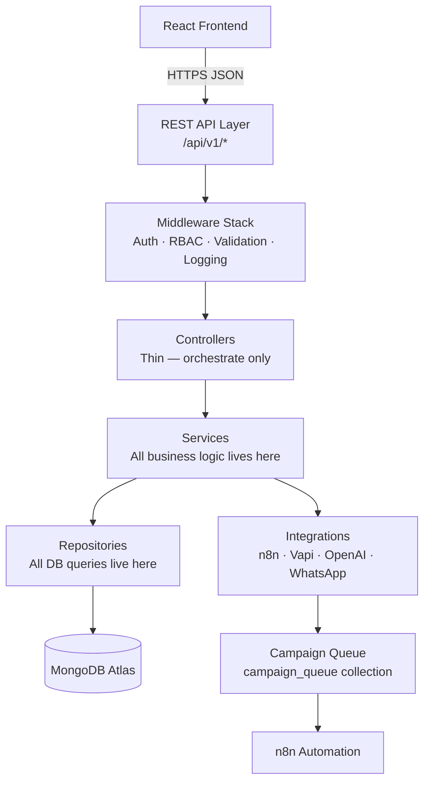
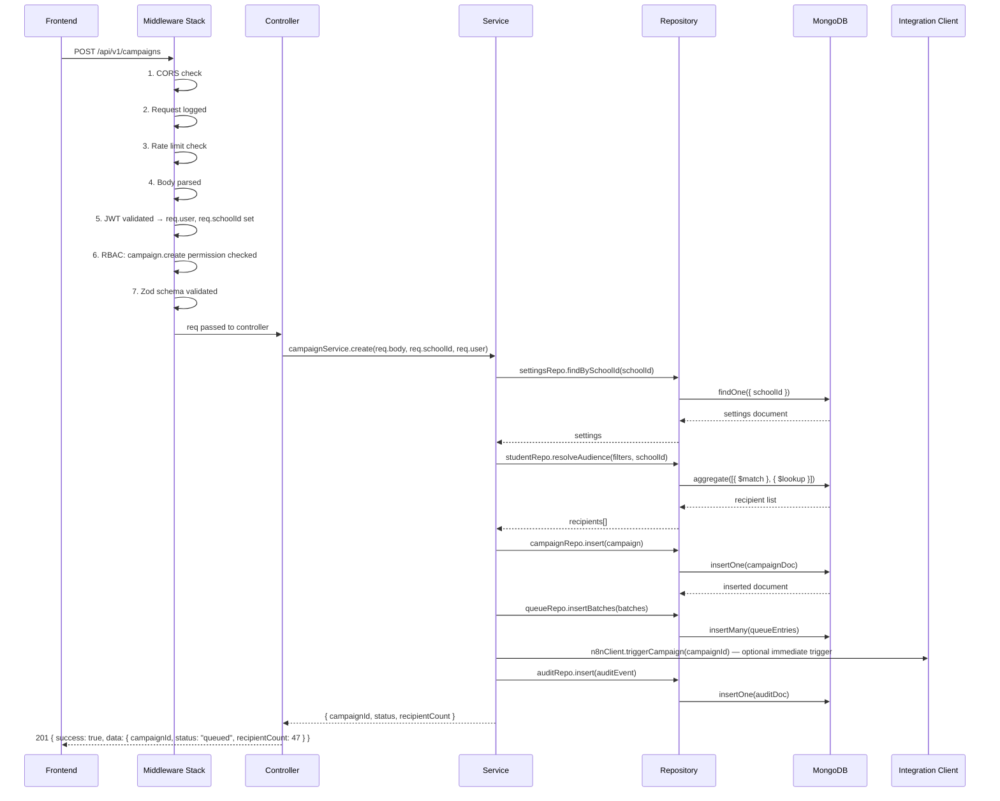

# 04 — Backend Architecture & API Guide
### SchoolOS AI · Backend Engineering Reference
**Version:** 1.0.0 · **Audience:** Backend Developers, AI Assistants, Contributors
**Read time:** ~15 minutes · **Stack:** Node.js · Express.js · MongoDB · TypeScript

---

## Table of Contents

1. [Backend Overview](#1-backend-overview)
2. [Backend Folder Structure](#2-backend-folder-structure)
3. [Backend Modules](#3-backend-modules)
4. [API Design Standards](#4-api-design-standards)
5. [API Module Overview](#5-api-module-overview)
6. [Middleware Architecture](#6-middleware-architecture)
7. [Service Layer](#7-service-layer)
8. [Repository Layer](#8-repository-layer)
9. [External Integrations](#9-external-integrations)
10. [Standard Request Flow](#10-standard-request-flow)
11. [Error Handling Strategy](#11-error-handling-strategy)
12. [Security Rules](#12-security-rules)
13. [Backend Development Rules](#13-backend-development-rules)
14. [References](#14-references)

---

## 1. Backend Overview

The backend is the **intelligence layer** of SchoolOS AI. It owns 100% of business logic and is the only component that directly reads from or writes to MongoDB.

### What the Backend Owns

- Authentication and session management
- Authorisation — RBAC permission checks on every route
- All business rules and validations
- All database operations (read, write, update, soft delete)
- Campaign creation, audience resolution, and queue insertion
- AI call initiation and outcome processing
- Webhook ingestion and dispatch
- Audit log generation
- API responses to the frontend

### What the Backend Does NOT Own

- UI rendering → Frontend
- Long-running message delivery → n8n
- WhatsApp transport → Twilio / WhatsApp Cloud API
- Voice call execution → Vapi
- Voice synthesis → ElevenLabs
- Conversation AI → OpenAI (via Vapi)



---

## 2. Backend Folder Structure

```
backend/
│
├── src/
│   │
│   ├── config/                  # Env vars, DB connection config, app constants
│   │   ├── env.ts               # Validated environment variables (dotenv + zod)
│   │   ├── database.ts          # MongoDB connection + index initialisation
│   │   └── constants.ts         # App-wide constants (statuses, enums, limits)
│   │
│   ├── routes/                  # Express routers — one file per module
│   │   ├── auth.routes.ts
│   │   ├── student.routes.ts
│   │   ├── parent.routes.ts
│   │   ├── admission.routes.ts
│   │   ├── fee.routes.ts
│   │   ├── payment.routes.ts
│   │   ├── campaign.routes.ts
│   │   ├── call.routes.ts
│   │   ├── task.routes.ts
│   │   ├── notification.routes.ts
│   │   ├── settings.routes.ts
│   │   ├── user.routes.ts
│   │   ├── report.routes.ts
│   │   └── webhook.routes.ts
│   │
│   ├── controllers/             # Request handlers — thin, no business logic
│   │   ├── auth.controller.ts
│   │   ├── student.controller.ts
│   │   ├── campaign.controller.ts
│   │   └── ...one per module
│   │
│   ├── services/                # All business logic — one service per module
│   │   ├── auth.service.ts
│   │   ├── student.service.ts
│   │   ├── campaign.service.ts
│   │   ├── communication.service.ts
│   │   ├── voice.service.ts
│   │   ├── fee.service.ts
│   │   ├── task.service.ts
│   │   ├── notification.service.ts
│   │   ├── settings.service.ts
│   │   ├── audit.service.ts
│   │   └── report.service.ts
│   │
│   ├── repositories/            # All MongoDB queries — services call repos, not Mongoose directly
│   │   ├── student.repository.ts
│   │   ├── campaign.repository.ts
│   │   ├── fee.repository.ts
│   │   ├── call.repository.ts
│   │   ├── task.repository.ts
│   │   └── ...one per collection
│   │
│   ├── models/                  # Mongoose schemas and models
│   │   ├── user.model.ts
│   │   ├── student.model.ts
│   │   ├── campaign.model.ts
│   │   └── ...one per collection
│   │
│   ├── middleware/              # Express middleware — applied in defined order
│   │   ├── authenticate.ts      # JWT validation
│   │   ├── authorize.ts         # RBAC permission check
│   │   ├── validate.ts          # Request body validation (Zod)
│   │   ├── requestLogger.ts     # Log every inbound request
│   │   ├── auditLogger.ts       # Write audit log on write operations
│   │   ├── rateLimiter.ts       # Per-route rate limiting
│   │   ├── errorHandler.ts      # Global error handler — last middleware
│   │   └── webhookVerifier.ts   # HMAC + IP validation for inbound webhooks
│   │
│   ├── validators/              # Zod schemas for every request body
│   │   ├── student.validators.ts
│   │   ├── campaign.validators.ts
│   │   ├── fee.validators.ts
│   │   └── ...one per module
│   │
│   ├── integrations/            # External service clients — one file per provider
│   │   ├── n8n.client.ts        # Webhook trigger to n8n
│   │   ├── vapi.client.ts       # Voice call initiation
│   │   ├── openai.client.ts     # Intent classification, summarisation
│   │   ├── twilio.client.ts     # Dev WhatsApp client
│   │   └── whatsapp.client.ts   # Production WhatsApp Cloud API client
│   │
│   ├── queues/                  # Campaign queue processor logic
│   │   ├── queue.processor.ts   # Polls campaign_queue, triggers n8n
│   │   └── queue.helpers.ts     # Batch splitting, priority sorting
│   │
│   ├── webhooks/                # Inbound webhook handlers — one per external source
│   │   ├── n8n.webhook.ts       # Delivery status, campaign complete
│   │   ├── vapi.webhook.ts      # Call results, transcripts
│   │   └── whatsapp.webhook.ts  # Inbound replies, delivery receipts
│   │
│   ├── jobs/                    # Scheduled backend cron jobs
│   │   ├── queueSweep.job.ts    # Every 60s — pick up pending queue entries
│   │   ├── campaignSweep.job.ts # Every 5min — detect stuck campaigns
│   │   └── tokenCleanup.job.ts  # Daily midnight — purge expired refresh tokens
│   │
│   ├── utils/                   # Pure utility functions — no side effects
│   │   ├── jwt.utils.ts
│   │   ├── pagination.utils.ts
│   │   ├── response.utils.ts    # Format success/error envelopes
│   │   └── date.utils.ts
│   │
│   ├── types/                   # TypeScript types and interfaces
│   │   ├── express.d.ts         # Extended Express Request (adds req.user, req.schoolId)
│   │   ├── campaign.types.ts
│   │   └── api.types.ts
│   │
│   └── app.ts                   # Express app setup, middleware registration, route mounting
│
├── server.ts                    # Entry point — starts HTTP server, connects DB, starts jobs
├── tests/                       # Unit and integration tests
├── .env                         # Local environment variables (gitignored)
├── .env.example                 # Template for required env vars
├── Dockerfile
├── tsconfig.json
└── package.json
```

---

## 3. Backend Modules

| Module | Responsibility |
|---|---|
| **Authentication** | Login, logout, token issue, token refresh, password reset |
| **Users** | Staff user accounts — create, update, deactivate, role assignment |
| **Students** | Student master records — CRUD, search, grade/section filtering |
| **Parents** | Parent contact records — CRUD, phone lookup, student linking |
| **Admissions** | Inquiry lifecycle — stage tracking, contact status, assignment |
| **Appointments** | PTM and visit scheduling — slots, booking, reminders |
| **Fees** | Fee records — creation, payment status, overdue tracking |
| **Payments** | Payment transaction recording — receipt generation |
| **Campaigns** | Campaign lifecycle — creation, queue insertion, status tracking |
| **Communication** | Audience resolution, template rendering, reply classification |
| **Voice Calls** | Manual and campaign call initiation, transcript storage, outcome processing |
| **Tasks** | Task creation from AI/replies/manual, assignment, status tracking |
| **Notifications** | In-app notification generation and read status management |
| **Settings** | School configuration — read and update all settings sections |
| **Audit Logs** | Immutable write on every significant action — read for Admin |
| **Reports** | Aggregated analytics — campaign stats, fee summaries, call outcomes |
| **Webhooks** | Inbound webhook validation and dispatch — n8n, Vapi, WhatsApp |
| **Scheduler** | Backend cron jobs — queue sweep, campaign sweep, token cleanup |

---

## 4. API Design Standards

### Base URL
```
/api/v1/{resource}
```

### Response Envelope — All responses use this format

```json
// Success
{
  "success": true,
  "data": { ... },
  "meta": { "page": 1, "pageSize": 20, "total": 120, "totalPages": 6 }
}

// Error
{
  "success": false,
  "error": {
    "code": "STUDENT_NOT_FOUND",
    "message": "No student found with the provided ID.",
    "statusCode": 404,
    "details": []
  }
}
```

### Pagination — All list endpoints

| Query Param | Default | Description |
|---|---|---|
| `page` | `1` | Page number |
| `pageSize` | `20` | Records per page (max 100) |

### Filtering — All list endpoints

| Pattern | Example |
|---|---|
| Filter by field | `?grade=8&section=A` |
| Filter by status | `?status=active` |
| Filter by date range | `?from=2026-06-01&to=2026-06-30` |
| Full-text search | `?search=Rahul` |

### Sorting

| Pattern | Example |
|---|---|
| Sort ascending | `?sortBy=name&order=asc` |
| Sort descending | `?sortBy=createdAt&order=desc` |
| Default sort | `createdAt: desc` on all list endpoints |

### ID References

- All IDs in URLs are MongoDB `ObjectId` strings
- Invalid ObjectId format → `400 INVALID_ID`
- Valid format but record not found → `404 NOT_FOUND`

### Soft Delete

- `DELETE` endpoints set `status: "deleted"` and `deletedAt: now()`
- Hard delete is never performed
- All list queries filter `{ status: { $ne: "deleted" } }` by default

---

## 5. API Module Overview

### 5.1 Authentication

| Method | Endpoint | Purpose | Auth Required |
|---|---|---|---|
| `POST` | `/api/v1/auth/login` | Login with email + password, receive tokens | No |
| `POST` | `/api/v1/auth/refresh` | Issue new access token using refresh token | No |
| `POST` | `/api/v1/auth/logout` | Invalidate refresh token | Yes |
| `POST` | `/api/v1/auth/forgot-password` | Trigger password reset email | No |
| `POST` | `/api/v1/auth/reset-password` | Reset password with signed token | No |
| `GET` | `/api/v1/auth/me` | Return current authenticated user | Yes |

---

### 5.2 Users

| Method | Endpoint | Purpose | Role |
|---|---|---|---|
| `GET` | `/api/v1/users` | List all staff users | Admin |
| `POST` | `/api/v1/users` | Create new staff user | Admin |
| `GET` | `/api/v1/users/:id` | Get user by ID | Admin |
| `PUT` | `/api/v1/users/:id` | Update user details or role | Admin |
| `DELETE` | `/api/v1/users/:id` | Deactivate user (soft delete) | Admin |

---

### 5.3 Students

| Method | Endpoint | Purpose | Role |
|---|---|---|---|
| `GET` | `/api/v1/students` | List students with filters (grade, section, status) | Admin, Reception, Teacher |
| `POST` | `/api/v1/students` | Create new student record | Admin, Reception |
| `GET` | `/api/v1/students/:id` | Get student by ID with parent and fee summary | Admin, Reception, Teacher |
| `PUT` | `/api/v1/students/:id` | Update student details | Admin, Reception |
| `DELETE` | `/api/v1/students/:id` | Soft delete student | Admin |
| `GET` | `/api/v1/students/:id/fees` | Get all fee records for a student | Admin, Reception |
| `GET` | `/api/v1/students/:id/calls` | Get voice call history for a student | Admin, Reception |
| `GET` | `/api/v1/students/:id/messages` | Get WhatsApp message history for a student | Admin, Reception |
| `GET` | `/api/v1/students/:id/campaigns` | Get campaigns that targeted this student | Admin, Reception |

---

### 5.4 Parents

| Method | Endpoint | Purpose | Role |
|---|---|---|---|
| `GET` | `/api/v1/parents` | List parents with filters | Admin, Reception |
| `POST` | `/api/v1/parents` | Create new parent record | Admin, Reception |
| `GET` | `/api/v1/parents/:id` | Get parent with linked students | Admin, Reception |
| `PUT` | `/api/v1/parents/:id` | Update parent contact details | Admin, Reception |
| `DELETE` | `/api/v1/parents/:id` | Soft delete parent | Admin |
| `GET` | `/api/v1/parents/:id/messages` | Full WhatsApp conversation history | Admin, Reception |

---

### 5.5 Admissions

| Method | Endpoint | Purpose | Role |
|---|---|---|---|
| `GET` | `/api/v1/admissions` | List inquiries with filters (stage, contacted, date) | Admin, Reception |
| `POST` | `/api/v1/admissions` | Create new admission inquiry | Admin, Reception |
| `GET` | `/api/v1/admissions/:id` | Get inquiry with call and task history | Admin, Reception |
| `PUT` | `/api/v1/admissions/:id` | Update inquiry stage, notes, or assignment | Admin, Reception |
| `DELETE` | `/api/v1/admissions/:id` | Soft delete inquiry | Admin |
| `PATCH` | `/api/v1/admissions/:id/stage` | Update stage only | Admin, Reception |
| `GET` | `/api/v1/admissions/stats` | Funnel stats — inquiries per stage | Admin |

---

### 5.6 Appointments

| Method | Endpoint | Purpose | Role |
|---|---|---|---|
| `GET` | `/api/v1/appointments` | List appointments with filters (date, type, status) | Admin, Reception |
| `POST` | `/api/v1/appointments` | Schedule new appointment (PTM or visit) | Admin, Reception |
| `GET` | `/api/v1/appointments/:id` | Get appointment details | Admin, Reception |
| `PUT` | `/api/v1/appointments/:id` | Reschedule or update appointment | Admin, Reception |
| `PATCH` | `/api/v1/appointments/:id/status` | Mark as completed or cancelled | Admin, Reception |
| `DELETE` | `/api/v1/appointments/:id` | Soft delete appointment | Admin |

---

### 5.7 Fees

| Method | Endpoint | Purpose | Role |
|---|---|---|---|
| `GET` | `/api/v1/fees` | List fee records with filters (status, grade, overdue) | Admin, Reception |
| `POST` | `/api/v1/fees` | Create fee record for a student | Admin |
| `GET` | `/api/v1/fees/:id` | Get fee record with payment history | Admin, Reception |
| `PUT` | `/api/v1/fees/:id` | Update fee amount or due date | Admin |
| `GET` | `/api/v1/fees/overdue` | List all overdue fees | Admin, Reception |
| `GET` | `/api/v1/fees/stats` | Summary — total, collected, outstanding | Admin |
| `POST` | `/api/v1/fees/:id/payments` | Record a payment against a fee | Admin, Reception |
| `GET` | `/api/v1/fees/:id/payments` | List all payments for a fee record | Admin, Reception |

---

### 5.8 Campaigns

| Method | Endpoint | Purpose | Role |
|---|---|---|---|
| `GET` | `/api/v1/campaigns` | List campaigns with filters (type, status, channel) | Admin, Reception |
| `POST` | `/api/v1/campaigns` | Create and trigger a new campaign | Admin, Reception |
| `GET` | `/api/v1/campaigns/:id` | Get campaign with delivery stats | Admin, Reception |
| `DELETE` | `/api/v1/campaigns/:id` | Archive campaign | Admin |
| `POST` | `/api/v1/campaigns/:id/retry` | Re-trigger failed campaign | Admin |
| `GET` | `/api/v1/campaigns/:id/recipients` | List per-recipient delivery status | Admin, Reception |
| `GET` | `/api/v1/campaigns/stats` | Aggregate campaign analytics | Admin |

---

### 5.9 Voice Calls

| Method | Endpoint | Purpose | Role |
|---|---|---|---|
| `POST` | `/api/v1/calls/manual` | Initiate a manual AI call to a parent | Admin, Reception |
| `GET` | `/api/v1/calls` | List calls with filters (type, status, date) | Admin, Reception |
| `GET` | `/api/v1/calls/:id` | Get call with full transcript and summary | Admin, Reception |
| `GET` | `/api/v1/calls/stats` | Call analytics — answered, no-answer, outcomes | Admin |
| `GET` | `/api/v1/calls/budget` | Remaining daily call budget for the school | Admin, Reception |

---

### 5.10 Tasks

| Method | Endpoint | Purpose | Role |
|---|---|---|---|
| `GET` | `/api/v1/tasks` | List tasks — scoped to role (own tasks for Reception/Teacher) | All |
| `POST` | `/api/v1/tasks` | Create task manually | Admin, Reception |
| `GET` | `/api/v1/tasks/:id` | Get task details with source reference | All |
| `PUT` | `/api/v1/tasks/:id` | Update task details | Admin, Reception |
| `PATCH` | `/api/v1/tasks/:id/status` | Update task status only | All |
| `DELETE` | `/api/v1/tasks/:id` | Soft delete task | Admin |

---

### 5.11 Notifications

| Method | Endpoint | Purpose | Role |
|---|---|---|---|
| `GET` | `/api/v1/notifications` | List notifications for authenticated user | All |
| `GET` | `/api/v1/notifications/unread-count` | Unread notification count — polled every 30s | All |
| `PATCH` | `/api/v1/notifications/:id/read` | Mark notification as read | All |
| `PATCH` | `/api/v1/notifications/read-all` | Mark all notifications as read | All |

---

### 5.12 Settings

| Method | Endpoint | Purpose | Role |
|---|---|---|---|
| `GET` | `/api/v1/settings` | Get complete settings document for school | Admin |
| `PATCH` | `/api/v1/settings/school-info` | Update school information | Admin |
| `PATCH` | `/api/v1/settings/academic-session` | Update academic session config | Admin |
| `PATCH` | `/api/v1/settings/fee-settings` | Update fee and reminder rules | Admin |
| `PATCH` | `/api/v1/settings/ai-settings` | Update call limits and AI config | Admin |
| `PATCH` | `/api/v1/settings/automation-settings` | Update batch size, concurrency, retry rules | Admin |
| `PATCH` | `/api/v1/settings/templates` | Update WhatsApp templates | Admin |
| `PATCH` | `/api/v1/settings/branding` | Update school branding settings | Admin |

---

### 5.13 Webhooks

| Method | Endpoint | Source | Purpose |
|---|---|---|---|
| `POST` | `/api/v1/webhooks/n8n/delivery-status` | n8n | Update per-recipient delivery status |
| `POST` | `/api/v1/webhooks/n8n/campaign-complete` | n8n | Mark campaign completed |
| `POST` | `/api/v1/webhooks/n8n/batch-failed` | n8n | Mark queue batch as failed, trigger retry |
| `POST` | `/api/v1/webhooks/vapi/call-result` | Vapi | Store transcript, intent, summary; trigger tasks |
| `POST` | `/api/v1/webhooks/whatsapp/incoming` | WhatsApp / n8n | Process inbound parent reply |
| `POST` | `/api/v1/webhooks/whatsapp/delivery` | WhatsApp / n8n | Update message delivery and read status |

> All webhook endpoints skip JWT auth but require `X-SchoolOS-Secret` header + IP allowlist check. See Section 12.

---

## 6. Middleware Architecture

Middleware executes in this fixed order for every request. Order is not configurable.

| Order | Middleware | Purpose | Applied To |
|---|---|---|---|
| 1 | `cors` | Set CORS headers, restrict allowed origins | All routes |
| 2 | `requestLogger` | Log method, route, IP, timestamp — before any processing | All routes |
| 3 | `rateLimiter` | Per-IP and per-user request limits | All routes (thresholds vary by endpoint) |
| 4 | `json parser` | Parse and size-validate JSON request body (max 1MB) | All routes |
| 5 | `authenticate` | Validate JWT signature and expiry, attach `req.user` and `req.schoolId` | Protected routes |
| 6 | `webhookVerifier` | Validate `X-SchoolOS-Secret` header and IP allowlist | Webhook routes only |
| 7 | `authorize(permission)` | Check `req.user.permissions` includes the required permission | Protected routes |
| 8 | `validate(schema)` | Validate request body against Zod schema, return 400 on failure | Write endpoints |
| 9 | Controller handler | Business logic via service + repository | Route handler |
| 10 | `auditLogger` | Write audit log after successful write operations | Write endpoints |
| 11 | `errorHandler` | Catch all thrown errors, format into standard error envelope | All routes (last) |

### Rate Limits by Endpoint Group

| Endpoint Group | Limit |
|---|---|
| `POST /api/v1/auth/login` | 5 requests / 15 min per IP |
| `POST /api/v1/auth/refresh` | 10 requests / min per user |
| `POST /api/v1/campaigns` | 20 requests / hour per school |
| `POST /api/v1/calls/manual` | 10 requests / hour per user |
| `POST /api/v1/webhooks/*` | 500 requests / min per IP (allowlisted IPs only) |
| All other authenticated routes | 200 requests / min per user |

---

## 7. Service Layer

Services own **all business logic**. Controllers call services. Services call repositories and integrations. Services never respond to HTTP directly.

| Service | Core Responsibilities |
|---|---|
| `AuthService` | Credential validation, token signing, refresh token rotation, password reset flow |
| `StudentService` | Student CRUD, grade/section validation against settings, status transition rules |
| `AdmissionService` | Stage transition rules, contact status updates, AI call outcome processing |
| `FeeService` | Balance calculation, overdue detection, reminder eligibility checks, receipt number generation |
| `CampaignService` | Campaign creation, audience resolution via CommunicationService, queue insertion, state machine transitions |
| `CommunicationService` | Audience Builder, Variable Engine, Template Engine, Reply Processor, Delivery Tracker — see `05_Communication_Engine.md` |
| `VoiceService` | Call initiation via VapiClient, budget check, call record creation, transcript + intent storage, task triggering |
| `TaskService` | Task creation from any source, assignee resolution by role, notification triggering post-creation |
| `NotificationService` | Notification record creation, unread count query, read status update |
| `SettingsService` | Settings read (all modules call this), per-section update, settings cache invalidation (future) |
| `AuditService` | Audit record insertion — called by `auditLogger` middleware and directly by services on critical writes |
| `ReportService` | MongoDB aggregation pipelines for campaign, fee, call, and admission analytics |
| `WebhookService` | Validates webhook payload structure, dispatches to the correct service based on event type |

### Service Rules

- Services receive plain objects — never `req` or `res`
- Services return plain objects or throw typed errors
- Services call repositories for all MongoDB access
- Services call integration clients for all external API access
- Services never import from other services directly — they receive dependencies as constructor arguments

---

## 8. Repository Layer

Repositories are the **only** layer that calls Mongoose models. Services never call Mongoose directly.

| Repository | Purpose |
|---|---|
| `UserRepository` | User CRUD, email+schoolId lookup, refresh token hash storage and lookup |
| `StudentRepository` | Student CRUD, grade/section filtering, audience queries for campaigns |
| `ParentRepository` | Parent CRUD, phone+schoolId lookup (inbound reply matching) |
| `AdmissionRepository` | Inquiry CRUD, stage and contact status filtering, funnel aggregation |
| `FeeRepository` | Fee CRUD, status filtering, overdue queries (dueDate < today + status != paid) |
| `PaymentRepository` | Payment inserts, fee-level payment aggregation |
| `CampaignRepository` | Campaign CRUD, status transitions, stats aggregation |
| `QueueRepository` | Campaign queue inserts, pending entry selection, status updates, dead-letter handling |
| `RecipientRepository` | Bulk insert campaign recipients, per-recipient status updates |
| `MessageRepository` | Message insert (inbound + outbound), parent conversation history queries |
| `CallRepository` | Call CRUD, transcript and summary updates, parent and campaign call history |
| `TaskRepository` | Task CRUD, assignee-scoped queries, status updates |
| `NotificationRepository` | Notification inserts, unread count query, read status updates |
| `AuditRepository` | Insert-only — no updates, no deletes |
| `SettingsRepository` | Single-document read and partial update per schoolId |
| `AutomationLogRepository` | Insert-only audit of n8n executions |

### Repository Rules

- Every repository method takes `schoolId` as a required parameter
- No repository method accepts raw user input — all values are validated before reaching the repository
- Repositories never contain business logic or conditional branching
- Repositories return Mongoose `lean()` results (plain objects, not Mongoose documents) unless document methods are needed

---

## 9. External Integrations

All external API calls go through integration clients in `src/integrations/`. No controller or service imports an SDK directly.

| Integration Client | Provider | Purpose |
|---|---|---|
| `n8n.client.ts` | n8n (self-hosted) | Trigger campaign workflows via webhook POST |
| `vapi.client.ts` | Vapi | Initiate AI voice calls, receive call status |
| `openai.client.ts` | OpenAI | Reply intent classification, call summary generation |
| `twilio.client.ts` | Twilio | Send WhatsApp messages in development / sandbox environment |
| `whatsapp.client.ts` | Meta WhatsApp Cloud API | Send WhatsApp messages in production |

### Integration Rules

- Integration clients wrap provider SDKs — services call client methods, never SDK methods directly
- All integration errors are caught in the client and re-thrown as typed `ExternalServiceError`
- Switching providers (e.g., Twilio → WhatsApp Cloud API) requires changing only the client file
- The active WhatsApp client is determined by `NODE_ENV` in `env.ts` — services never check environment directly

---

## 10. Standard Request Flow

Every API request in SchoolOS AI follows this flow. No exceptions.



---

## 11. Error Handling Strategy

All errors are thrown from services as typed error classes and caught by the `errorHandler` middleware.

| Error Class | HTTP Code | When Used | Example Code |
|---|---|---|---|
| `ValidationError` | `400` | Request body fails Zod schema | `INVALID_PHONE_FORMAT` |
| `AuthenticationError` | `401` | JWT missing, invalid, or expired | `TOKEN_EXPIRED` |
| `AuthorizationError` | `403` | User lacks required permission | `PERMISSION_DENIED` |
| `NotFoundError` | `404` | Resource does not exist for this schoolId | `STUDENT_NOT_FOUND` |
| `ConflictError` | `409` | Duplicate record violates unique constraint | `PHONE_ALREADY_EXISTS` |
| `BusinessRuleError` | `422` | Action violates a business rule | `DAILY_CALL_LIMIT_REACHED` |
| `ExternalServiceError` | `502` | n8n, Vapi, OpenAI, or WhatsApp API failure | `N8N_TRIGGER_FAILED` |
| `WebhookError` | `400` | Webhook payload invalid or signature mismatch | `INVALID_WEBHOOK_SIGNATURE` |
| `ServerError` | `500` | Unhandled runtime exception | `INTERNAL_SERVER_ERROR` |

### Error Response Examples

```json
// 400 Validation Error
{
  "success": false,
  "error": {
    "code": "VALIDATION_ERROR",
    "message": "The request contains invalid fields.",
    "statusCode": 400,
    "details": [
      { "field": "phone", "message": "Phone must be a 10-digit number" },
      { "field": "grade", "message": "Grade is required" }
    ]
  }
}

// 422 Business Rule Error
{
  "success": false,
  "error": {
    "code": "DAILY_CALL_LIMIT_REACHED",
    "message": "Your school has reached the daily AI call limit of 50 calls. Resets at midnight.",
    "statusCode": 422,
    "details": []
  }
}
```

### Error Handling Rules

- Services throw typed error instances — never plain `new Error()`
- The `errorHandler` middleware catches all errors and formats them into the standard envelope
- External service errors are caught in integration clients and re-thrown as `ExternalServiceError`
- Stack traces are logged server-side — never included in API responses
- Error codes are `SCREAMING_SNAKE_CASE` strings — stable identifiers the frontend can switch on

---

## 12. Security Rules

These are SchoolOS AI specific security requirements. For JWT and bcrypt internals, see `02_System_Architecture.md` §12 and §16.

| Rule | Implementation |
|---|---|
| **RBAC on every route** | `authorize("permission.name")` middleware applied to every protected route before the controller |
| **schoolId from JWT only** | `req.schoolId` is set from the verified JWT — never from the request body or query params |
| **Soft delete only** | No `deleteOne` or `deleteMany` calls in any repository — use `updateOne({ status: "deleted", deletedAt: now })` |
| **Audit on every write** | `auditLogger` middleware fires after every `POST`, `PUT`, `PATCH`, `DELETE` response with status 2xx |
| **Webhook verification** | All webhook routes use `webhookVerifier` middleware: check `X-SchoolOS-Secret` header + IP allowlist |
| **Environment variables** | All secrets in `.env`, validated at startup via Zod in `env.ts` — server refuses to start with missing vars |
| **Input validation** | Every write endpoint has a Zod schema in `validators/` — the `validate(schema)` middleware rejects invalid requests before the controller |
| **No secrets in responses** | `passwordHash`, `refreshTokenHash`, and any credential field must be excluded from all API responses |
| **Rate limiting** | `rateLimiter` middleware applied globally with per-endpoint overrides for sensitive routes |
| **NoSQL injection prevention** | All user-provided strings sanitised before inclusion in MongoDB queries — `$where`, `$regex` from user input rejected |

---

## 13. Backend Development Rules

Every backend engineer must follow these rules. These are enforced in code review.

### Architecture

- [ ] Controllers are thin — they extract request data, call one service method, and return the response. No logic inside controllers.
- [ ] All business logic lives in services. If it's a decision or a rule, it's in a service.
- [ ] All MongoDB access goes through repositories. Services never call Mongoose models directly.
- [ ] External API calls only happen in integration clients. Services never import Twilio, Vapi, or OpenAI SDKs.
- [ ] Modules are independent. A service may not import another module's service. Use dependency injection or the service registry.

### Data

- [ ] Every query includes `schoolId` from `req.schoolId`. Queries without `schoolId` are a critical bug.
- [ ] Every list query filters out `status: "deleted"` records by default.
- [ ] Every write operation is followed by an audit log entry.
- [ ] Repositories always return `lean()` objects unless Mongoose document methods are required.

### API

- [ ] Every write endpoint has a Zod validator applied before the controller.
- [ ] Every endpoint returns the standard success or error envelope.
- [ ] Every list endpoint supports pagination via `page` and `pageSize` query params.
- [ ] Soft delete only — no hard deletes in any repository or service.

### Security

- [ ] Never return `passwordHash`, `refreshTokenHash`, or secrets in API responses.
- [ ] Never trust `schoolId` from request body — always use `req.schoolId` from the JWT.
- [ ] Never skip `authorize()` middleware on a protected route.
- [ ] Webhook endpoints must use `webhookVerifier` middleware, not `authenticate`.

### Quality

- [ ] No `console.log` in production code — use the structured logger.
- [ ] No hardcoded strings for statuses or types — use constants from `src/constants/`.
- [ ] TypeScript strict mode — no `any` types without explicit justification in a comment.
- [ ] Every new service method has at least one unit test.

---

## 14. References

| Document | What It Covers |
|---|---|
| `01_Product_Bible.md` | Product vision, feature list, user stories — the "why" behind every API |
| `02_System_Architecture.md` | Full system architecture — JWT internals, RBAC flow, security model, campaign queue design |
| `02_System_Architecture_Dev.md` | Quick reference — how backend fits into the full system |
| `03_Database_Architecture.md` | MongoDB collection schemas, indexes, relationships — the data this API reads and writes |
| `05_Communication_Engine.md` | CommunicationService internals — Audience Builder, Template Engine, Variable Engine, Reply Processor |
| `06_n8n_Automation.md` | n8n workflow configurations — what the backend triggers and what webhooks it receives |

---

*For MongoDB collection schemas and example documents, see `03_Database_Architecture.md`. For request/response type definitions, see `src/types/` in the codebase.*
