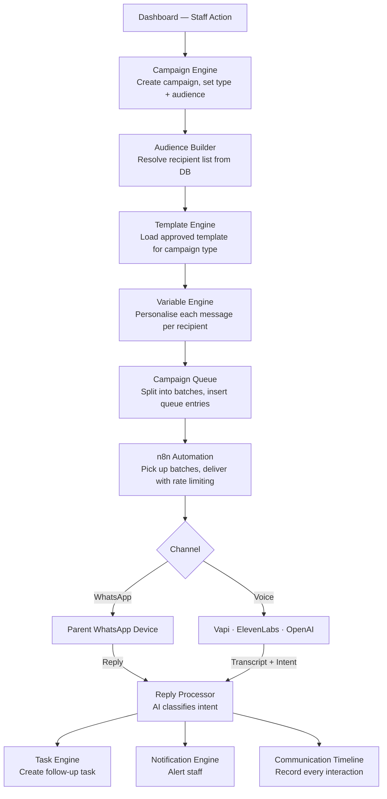
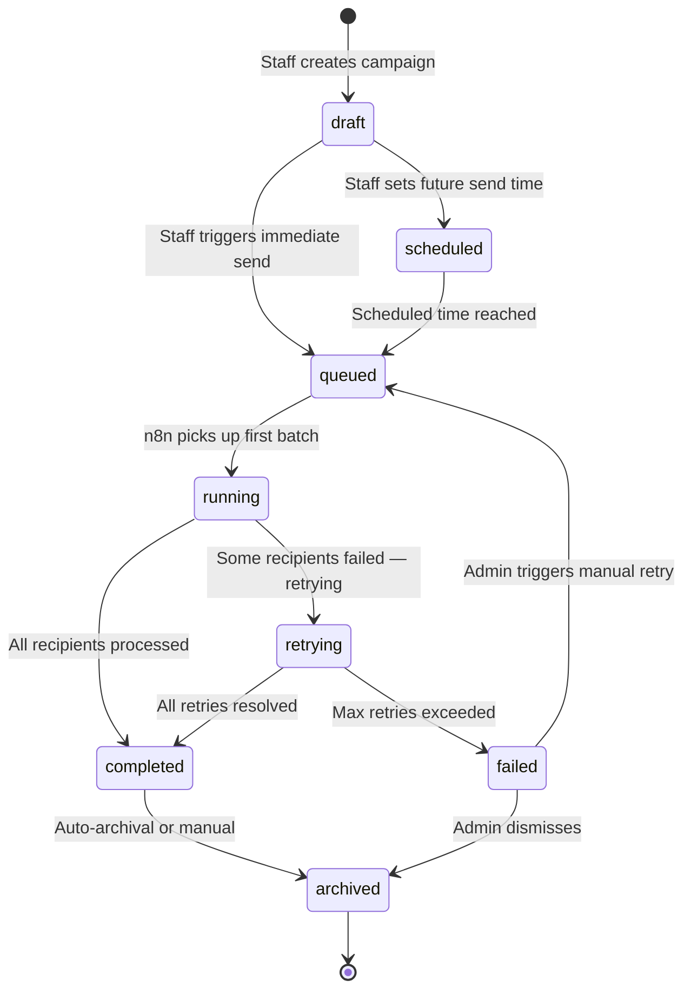
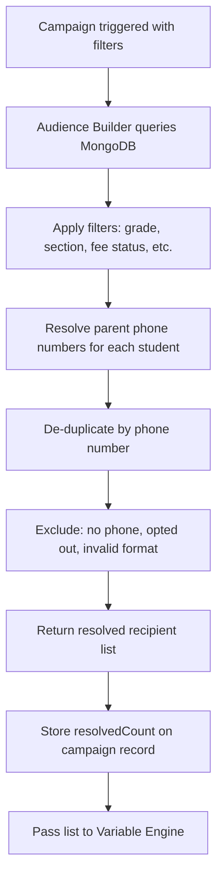
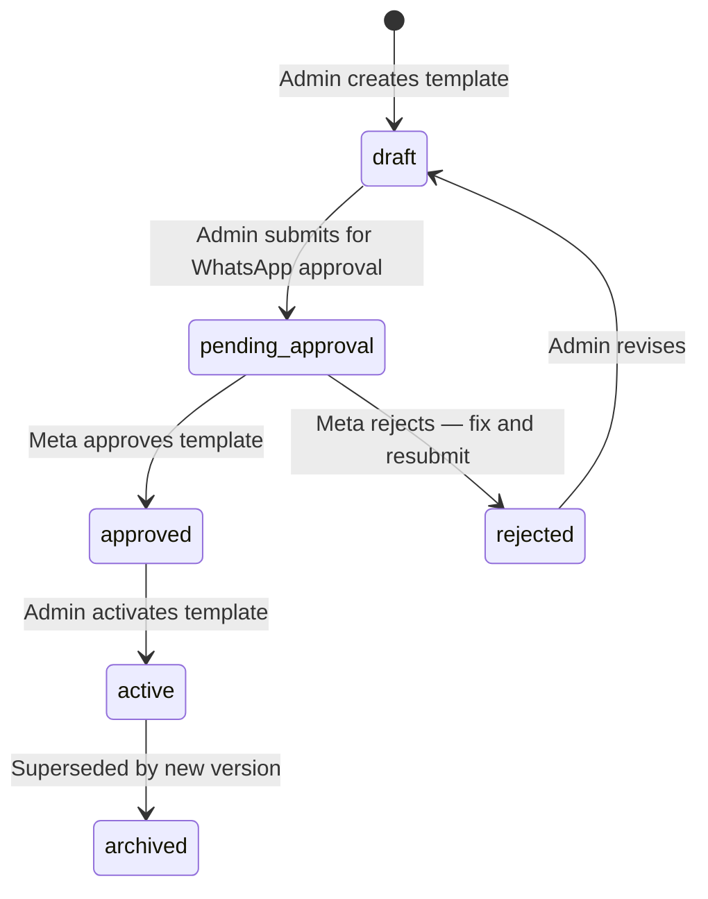
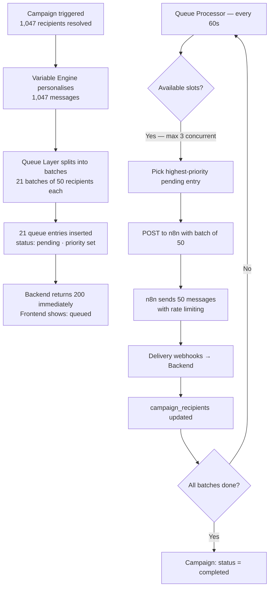
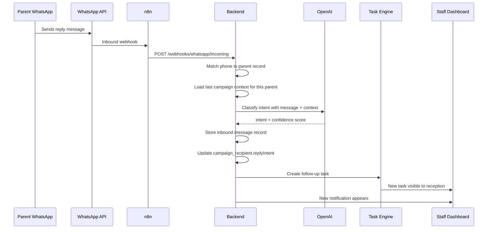
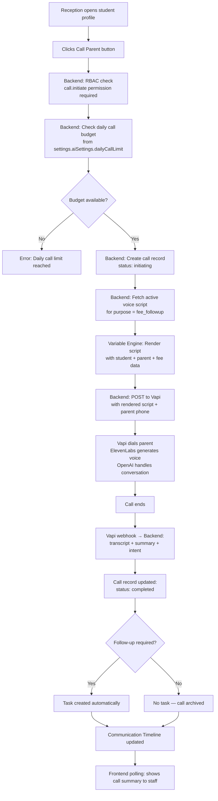

# 05 — Communication Engine
### SchoolOS AI · Communication Architecture Reference
**Version:** 1.0.0 · **Audience:** Backend Developers, Frontend Developers, AI Assistants
**Read time:** ~15 minutes · **Covers:** WhatsApp · AI Voice · Replies · Tasks

---

## Table of Contents

1. [Communication Engine Overview](#1-communication-engine-overview)
2. [Supported Communication Types](#2-supported-communication-types)
3. [Campaign Lifecycle](#3-campaign-lifecycle)
4. [Audience Builder](#4-audience-builder)
5. [Template Engine](#5-template-engine)
6. [Variable Engine](#6-variable-engine)
7. [Campaign Queue](#7-campaign-queue)
8. [Reply Processing](#8-reply-processing)
9. [Communication Timeline](#9-communication-timeline)
10. [Manual AI Calls](#10-manual-ai-calls)
11. [Dashboard Features](#11-dashboard-features)
12. [Future Scope](#12-future-scope)
13. [References](#13-references)

---

## 1. Communication Engine Overview

The Communication Engine is the core system that controls **every outbound and inbound communication** in SchoolOS AI. It is not a simple message sender — it is a complete workflow that handles audience selection, message personalisation, delivery, replies, and follow-up tasks.

**Purpose:** Connect schools to parents and leads through structured, trackable, AI-assisted communication.

**Goals:**
- Every communication is auditable — nothing is sent without a record
- Every communication is personalised — no generic blasts
- Every reply generates a follow-up — no message is ignored
- Every failure is recoverable — retries are built-in
- Every interaction is visible — complete per-student communication history

**Philosophy:** Every outbound communication — whether to 1 parent or 1,000 — is modelled as a **Campaign**. This gives every message a lifecycle, delivery tracking, retry logic, and an audit trail from the moment it is created until it is archived.



---

## 2. Supported Communication Types

| Communication Type | Channel | Audience | Trigger |
|---|---|---|---|
| **Fee Reminder** | WhatsApp | Parents of fee defaulters | Manual or auto-scheduled |
| **PTM Reminder** | WhatsApp | All parents | Manual or pre-scheduled |
| **Holiday Notice** | WhatsApp | All parents | Manual |
| **Admission Follow-up** | WhatsApp or Voice | Uncontacted inquiries | Manual or auto (7 days) |
| **General Broadcast** | WhatsApp | Any segment | Manual |
| **Manual AI Call** | Voice (Vapi) | Single parent | Manual — one click |
| **Campaign Voice Call** | Voice (Vapi) | Admission leads list | Campaign — MVP future |
| **Email Campaign** | Email | Any segment | Future |
| **SMS Campaign** | SMS | Any segment | Future |
| **Push Notification** | Mobile app | Any segment | Future |

---

## 3. Campaign Lifecycle

Every campaign — regardless of type or channel — passes through the same lifecycle states.



| State | Meaning | Owner |
|---|---|---|
| `draft` | Campaign created, not yet triggered | Backend |
| `scheduled` | Campaign will auto-trigger at a future time | n8n cron |
| `queued` | Audience resolved, batches inserted in queue, awaiting n8n | Backend |
| `running` | n8n is actively processing batches and sending messages | n8n → Backend |
| `completed` | All recipients are in a terminal state (delivered, read, failed) | n8n → Backend |
| `retrying` | One or more batches failed and are being retried by n8n | n8n |
| `failed` | Maximum retries exceeded — campaign needs admin attention | n8n → Backend |
| `archived` | Completed campaign moved to history | Backend scheduler |

---

## 4. Audience Builder

The Audience Builder resolves **who receives a campaign**. It queries MongoDB based on campaign filters and returns a recipient list. It never sends messages — it only builds lists.

### Supported Audience Segments

| Segment | Filter Criteria | Example Use Case |
|---|---|---|
| **All Parents** | All active parent records with WhatsApp opt-in | Holiday notice, school announcements |
| **All Students** | All active students (resolved to parent contact) | General broadcast |
| **By Grade** | `grade = "8"` | Class-specific PTM notice |
| **By Grade + Section** | `grade = "8" AND section = "A"` | Section-level communication |
| **Fee Defaulters** | `fees.status IN [unpaid, overdue]` | Fee reminder campaigns |
| **Overdue by N Days** | `fees.dueDate < today - N days` | Escalation reminder |
| **Admission Leads — Uncontacted** | `admissions.contacted = false` | Admission follow-up campaign |
| **Admission Leads — By Stage** | `admissions.stage = "inquiry"` | Stage-specific follow-up |
| **Custom Filter** | Admin-defined field filters | Special segments |
| **Manual Selection** | Staff picks specific students from list | Targeted follow-up |

### Audience Builder Rules

- Audience is resolved **at the moment the campaign is triggered** — not when it is created
- A recipient without a valid phone number is excluded and logged as `skipped`
- A recipient with `whatsappOptIn: false` is excluded from WhatsApp campaigns
- The resolved count is stored on the campaign record before queue insertion
- The same parent linked to multiple students appears **once** per campaign (de-duplicated by phone)



---

## 5. Template Engine

The Template Engine loads the correct approved message template for each campaign type and channel. Templates are stored in the `templates` collection and managed by Admin users.

### MVP Templates

| Template Key | Channel | Type | Variables Used |
|---|---|---|---|
| `fee_reminder_v1` | WhatsApp | Fee reminder | `parentName`, `studentName`, `grade`, `pendingFee`, `dueDate`, `schoolName` |
| `fee_reminder_overdue_v1` | WhatsApp | Overdue escalation | `parentName`, `studentName`, `overdueDays`, `pendingFee`, `schoolName` |
| `ptm_reminder_v1` | WhatsApp | PTM notice | `parentName`, `studentName`, `grade`, `ptmDate`, `ptmTime`, `schoolName` |
| `holiday_notice_v1` | WhatsApp | Holiday announcement | `parentName`, `holidayName`, `holidayDate`, `schoolName` |
| `admission_followup_v1` | WhatsApp | Admission inquiry | `parentName`, `childName`, `appliedGrade`, `schoolName` |
| `general_broadcast_v1` | WhatsApp | General message | `parentName`, `message`, `schoolName` |
| `admission_call_script_v1` | Voice | AI call script | `parentName`, `childName`, `appliedGrade`, `schoolName` |
| `fee_call_script_v1` | Voice | Fee follow-up call | `parentName`, `studentName`, `pendingFee`, `dueDate` |

### Template Lifecycle



### Template Rules

- **WhatsApp templates must be pre-approved by Meta** before use in production. In development (Twilio Sandbox), templates are not required.
- Each template has a version number — old versions are archived, not deleted
- Admin can preview a template with sample data before activating
- The Template Engine loads the **currently active** template for each campaign type — campaigns do not lock a specific version at creation time
- Templates support both English and Hindi (`language` field on template record)

---

## 6. Variable Engine

The Variable Engine **personalises every message** by replacing placeholder variables with real recipient data before the message enters the queue.

### Supported Variables

| Variable | Resolved From | Example Output |
|---|---|---|
| `{{parentName}}` | `parents.name` | "Sunita ji" |
| `{{studentName}}` | `students.name` | "Rahul" |
| `{{grade}}` | `students.grade` | "8" |
| `{{section}}` | `students.section` | "A" |
| `{{pendingFee}}` | `fees.balanceAmount` | "₹30,000" |
| `{{dueDate}}` | `fees.dueDate` | "10 July 2026" |
| `{{overdueDays}}` | Calculated: `today - fees.dueDate` | "12 days" |
| `{{ptmDate}}` | `settings.ptmSettings.date` | "15 July 2026" |
| `{{ptmTime}}` | `settings.ptmSettings.time` | "10:00 AM" |
| `{{holidayName}}` | Campaign input field | "Independence Day" |
| `{{holidayDate}}` | Campaign input field | "15 August 2026" |
| `{{appliedGrade}}` | `admissions.grade` | "Class 5" |
| `{{childName}}` | `admissions.childName` | "Aryan" |
| `{{schoolName}}` | `settings.schoolInfo.name` | "DPS Rohini" |
| `{{message}}` | Campaign input field | Custom message body |

### Variable Engine Rules

- Variables are replaced **before** the message enters the queue — n8n receives the fully rendered message
- If a required variable cannot be resolved for a recipient, that recipient is marked `skipped` and excluded from the batch
- The rendered message is stored on the `campaign_recipients` record as `renderedMessage` — what was stored is what was sent
- Variable resolution errors are logged per recipient — the campaign continues for remaining recipients

```mermaid
flowchart LR
    A[Template Body\nDear {{parentName}},\nRahul ka fee ₹{{pendingFee}}\ndue {{dueDate}} tak hai.] --> B[Variable Engine]
    C[Recipient Data\nparentName: Sunita ji\npendingFee: ₹30,000\ndueDate: 10 July] --> B
    B --> D[Rendered Message\nDear Sunita ji,\nRahul ka fee ₹30,000\ndue 10 July tak hai.]
    D --> E[Stored on campaign_recipient.renderedMessage]
    E --> F[Passed to Campaign Queue]
```

---

## 7. Campaign Queue

The Campaign Queue decouples campaign creation from message delivery. The backend creates the campaign and inserts queue entries — n8n handles the actual sending asynchronously.

### Why a Queue Exists

- Backend must respond to the frontend in milliseconds — it cannot wait for 1,000 messages to send
- WhatsApp and Vapi have rate limits — messages must be paced, not blasted
- n8n downtime must not lose campaigns — queue entries persist in MongoDB
- Failed batches must be retried without re-triggering the entire campaign

### Queue Flow



### Queue Types

| Queue Type | Channel | Concurrency Limit | Batch Size |
|---|---|---|---|
| **WhatsApp Queue** | WhatsApp | Max 3 concurrent n8n executions | 50 recipients |
| **Voice Queue** | Vapi | Max 1 concurrent n8n execution | 10 recipients |
| **Retry Queue** | Any | Max 1 concurrent n8n execution | Original batch size |
| **Priority Queue** | Any | Higher-priority entries processed first | — |

### Queue Priority

| Priority | Campaign Types |
|---|---|
| `high` | Fee reminders, urgent notices, exam alerts |
| `normal` | PTM reminders, admission follow-ups, general broadcasts |
| `low` | Test campaigns, archival re-sends |

### Retry Strategy

| Attempt | Delay | Trigger |
|---|---|---|
| 1st retry | 5 minutes | On first delivery failure |
| 2nd retry | 15 minutes | On second failure |
| 3rd retry | 60 minutes | On third failure |
| Dead letter | — | After 3rd retry fails — admin review required |

---

## 8. Reply Processing

When a parent replies to a WhatsApp message, the reply flows back through the system and is converted into an actionable outcome.

### Reply Flow



### Supported Reply Intents

| Intent | Example Reply | Automated Action |
|---|---|---|
| `fee_payment_promised` | "Kal tak bhar deta hoon" | Task: Follow up on promise — due tomorrow |
| `fee_already_paid` | "Maine kal hi bhar diya" | Task: Verify payment and update record |
| `fee_callback_requested` | "Mujhe call kar do please" | Task: Call parent — high priority |
| `admission_interested` | "Haan, humein interested hai" | Task: Schedule school visit |
| `admission_not_interested` | "Abhi nahi chahiye" | Update admission stage to `closed` |
| `meeting_requested` | "Principal se milna hai" | Task: Schedule appointment |
| `complaint` | "Mera baccha pareshan ho raha hai" | Task: Escalate to admin — high priority |
| `wrong_number` | "Mera koi baccha nahi hai wahan" | Task: Verify and correct contact number |
| `general_inquiry` | "Fee ki last date kya hai?" | Task: Reply with fee deadline |
| `other` | Unclassified reply | Task: Read and respond manually |

### Reply Processing Rules

- Every inbound message is stored in the `messages` collection regardless of intent classification
- OpenAI classification includes a confidence score — low-confidence results default to `other`
- A task is created for **every** inbound reply — no reply is silently ignored
- The reply is linked to the most recent campaign sent to that parent for context
- Multiple replies from the same parent in a short window are grouped into one task

---

## 9. Communication Timeline

Every student has a **single, chronological communication timeline** that records every interaction — outbound messages, inbound replies, voice calls, tasks created, and campaign outcomes.

This is the complete audit trail for any parent/student communication.

### Example Timeline — Rahul Sharma (Class 8A)

| Date | Time | Type | Channel | Direction | Status | Summary |
|---|---|---|---|---|---|---|
| 1 Jun 2026 | 09:01 | Fee Reminder | WhatsApp | Outbound | Read | ₹30,000 due 10 July |
| 3 Jun 2026 | 10:30 | Reply | WhatsApp | Inbound | Received | "Kal tak bhar deta hoon" — intent: fee_payment_promised |
| 3 Jun 2026 | 10:31 | Task | — | System | Open | Follow up on payment promise — due 4 Jun |
| 10 Jun 2026 | 09:00 | Fee Overdue | WhatsApp | Outbound | Delivered | Fee overdue by 0 days |
| 12 Jun 2026 | 11:00 | AI Call | Voice | Outbound | Completed | Parent promised payment by Friday — callback requested |
| 12 Jun 2026 | 11:01 | Task | — | System | Open | Call back parent before Friday |
| 15 Jun 2026 | 14:00 | PTM Reminder | WhatsApp | Outbound | Read | PTM on 20 June 10am |
| 20 Jun 2026 | 10:00 | Appointment | — | System | Completed | PTM attended — class teacher meeting |

### Timeline Access Rules

- Available on every student profile page — visible to Admin and Reception
- Teachers see only their own class students' timelines
- Timeline is read-only — no entry can be edited or deleted
- Timeline is used by the AI caller to avoid repeating recent communications

---

## 10. Manual AI Calls

In MVP, reception staff can initiate a single AI voice call to any parent directly from the student profile.

### Manual Call Workflow



### Manual Call Rules

- Only one call to the same parent within a 24-hour window (enforced by backend)
- Call is not initiated if the parent has `status: deleted` or an invalid phone number
- The daily call budget is per school, not per user — all staff share the limit
- The staff member who initiated the call is recorded on the call record (`initiatedBy`)
- The full transcript is visible on the student profile within 60 seconds of call completion

### Call Purpose Options

| Purpose | Voice Script Used | Auto-Task Type |
|---|---|---|
| `fee_followup` | `fee_call_script_v1` | Payment follow-up or callback |
| `admission_followup` | `admission_call_script_v1` | Visit scheduling or close |
| `general` | `general_call_script_v1` | Manual — depends on conversation |

> **MVP:** Manual calls only. Campaign voice calls (bulk AI calling for admission follow-ups) will be added post-MVP. Architecture is already designed — see `07_AI_Voice.md`.

---

## 11. Dashboard Features

Communication features available to staff in the SchoolOS AI dashboard.

| Feature | Available To | Description |
|---|---|---|
| **Send Campaign** | Admin, Reception | Create and trigger a new WhatsApp campaign with audience + template selection |
| **Campaign History** | Admin, Reception | View all past campaigns with delivery stats |
| **Campaign Detail** | Admin, Reception | Per-campaign recipient list with individual delivery status |
| **Retry Failed Campaign** | Admin | Re-trigger failed campaign or dead-letter batches |
| **Templates** | Admin | View, edit, and manage WhatsApp message templates |
| **Audience Builder** | Admin, Reception | Preview audience count before sending campaign |
| **Communication Timeline** | Admin, Reception | Per-student chronological communication history |
| **Call Parent** | Admin, Reception | Initiate one-click manual AI voice call from student profile |
| **Call History** | Admin, Reception | List of all AI calls with transcripts and outcomes |
| **Reply Inbox** | Admin, Reception | Inbound WhatsApp replies with AI intent classification |
| **Task List** | All roles | Tasks generated from AI calls, replies, and system alerts |
| **Notifications** | All roles | In-app alerts for campaign completion, replies, call outcomes |
| **Export Report** | Admin | Download campaign delivery report as CSV |

---

## 12. Future Scope

- Email campaigns — full campaign lifecycle for email delivery
- SMS campaigns — fallback or primary channel where WhatsApp is unavailable
- Push notifications — mobile app notifications for parent and student portals
- Parent mobile app — native app receiving campaign messages and push notifications
- Two-way WhatsApp Chat — dedicated inbox for ongoing parent conversations
- AI auto-replies — bot handles common parent queries without staff involvement
- Campaign A/B testing — test two templates with a subset, send winner to the rest
- Campaign analytics dashboard — open rates, reply rates, conversion tracking
- Communication insights — AI-generated weekly summary of parent engagement patterns
- Multi-language campaigns — same campaign sent in Hindi to some parents, English to others
- Scheduled recurring campaigns — auto-send fee reminders on the 1st of every month

---

## 13. References

| Document | What It Covers |
|---|---|
| `01_Product_Bible.md` | Product vision, school communication use cases, feature list |
| `02_System_Architecture.md` | How Communication Engine fits into the full system architecture |
| `03_Database_Architecture.md` | `campaigns`, `campaign_recipients`, `messages`, `templates`, `calls` collection schemas |
| `04_Backend_API.md` | Campaign API endpoints, CommunicationService and CampaignService responsibilities |
| `06_n8n_Automation.md` | n8n workflow implementation — how batches are processed and webhooks handled |
| `07_AI_Voice.md` | Voice call architecture — Vapi, ElevenLabs, OpenAI integration and call flow detail |

---

*For n8n workflow node configuration, see `06_n8n_Automation.md`. For voice call implementation detail, see `07_AI_Voice.md`.*
