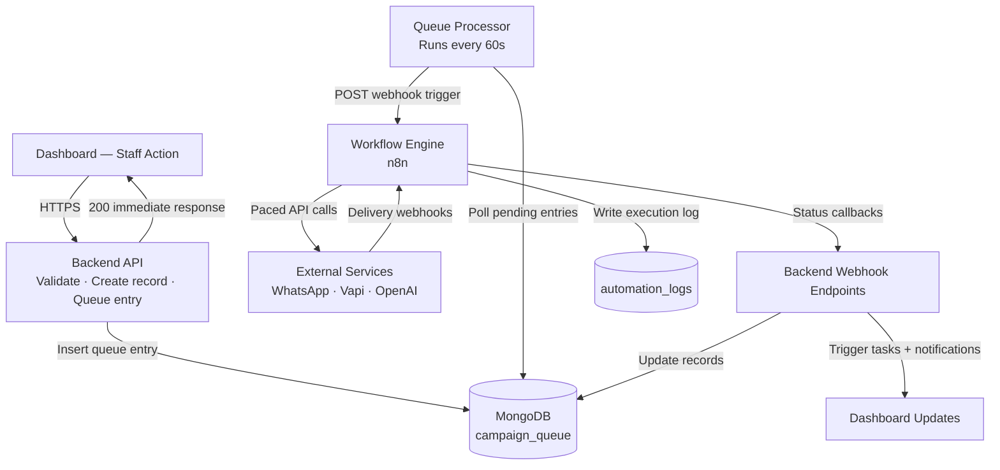
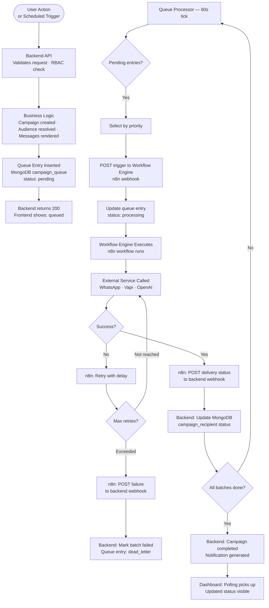
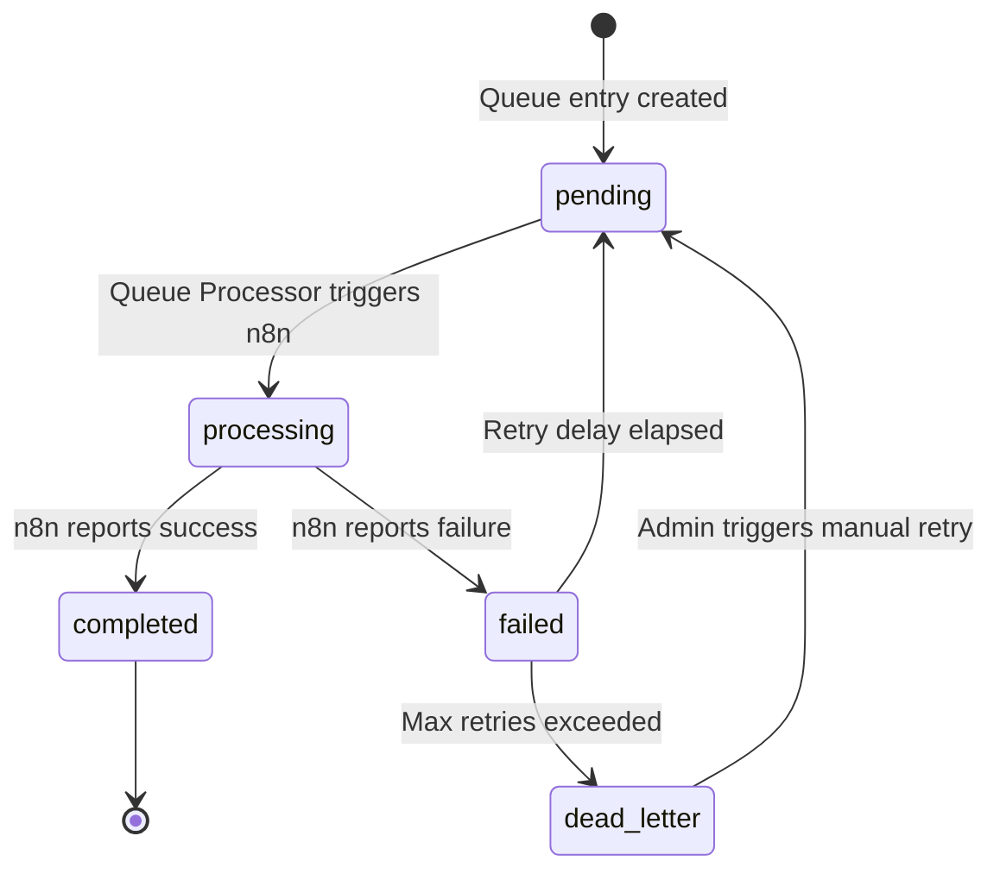
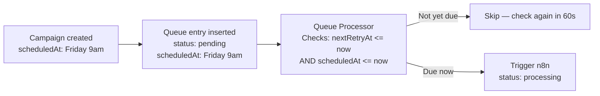
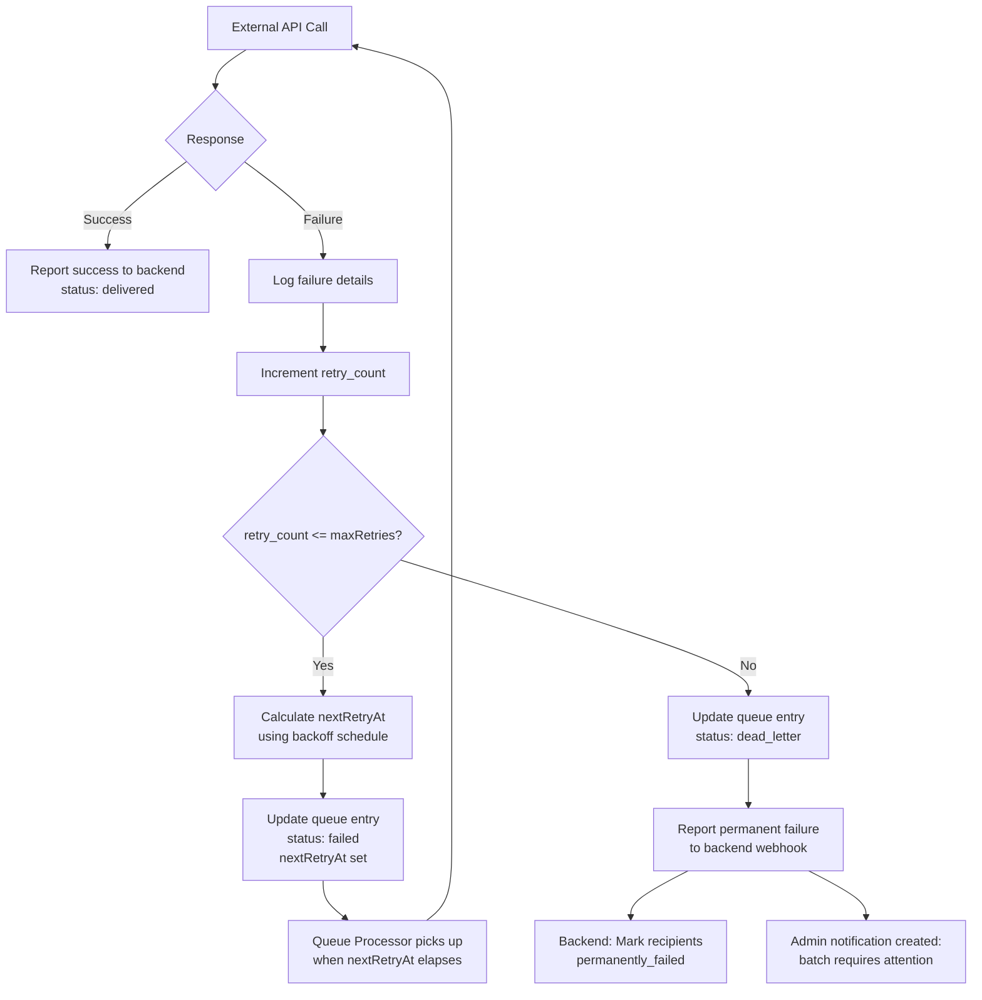
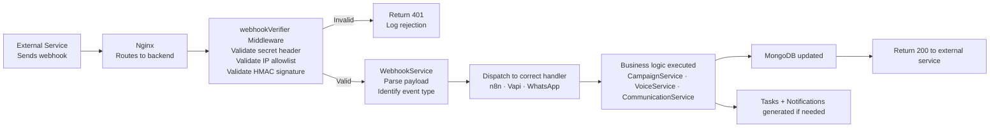

# 06 — Automation Framework
### SchoolOS AI · Automation Engineering Reference
**Version:** 1.0.0 · **Audience:** Automation Engineers, Backend Developers, AI Assistants
**Read time:** ~12 minutes · **Engine:** n8n (self-hosted)

---

## Table of Contents

1. [Automation Framework Overview](#1-automation-framework-overview)
2. [Automation Principles](#2-automation-principles)
3. [Standard Automation Lifecycle](#3-standard-automation-lifecycle)
4. [Queue Framework](#4-queue-framework)
5. [Scheduling Framework](#5-scheduling-framework)
6. [Retry Framework](#6-retry-framework)
7. [Webhook Framework](#7-webhook-framework)
8. [Monitoring Framework](#8-monitoring-framework)
9. [Logging Framework](#9-logging-framework)
10. [Workflow Standards](#10-workflow-standards)
11. [Workflow Naming Convention](#11-workflow-naming-convention)
12. [Automation Folder Structure](#12-automation-folder-structure)
13. [References](#13-references)

---

## 1. Automation Framework Overview

The Automation Framework defines **how every automation in SchoolOS AI is designed, triggered, executed, and monitored.** Individual workflow specifications (fee reminders, voice calls, etc.) follow the rules defined here.

**Purpose:** Decouple long-running and scheduled work from the backend request cycle, ensuring the backend stays responsive and every automation is reliable, retryable, and auditable.

**Why Automation Exists:**
- The backend must respond to the frontend in milliseconds — it cannot wait for 1,000 WhatsApp messages to send
- External APIs (WhatsApp, Vapi) have rate limits that require paced, controlled delivery
- Scheduled jobs (daily reminders, weekly reports) cannot run inside the HTTP request cycle
- Failed deliveries must be retried without human intervention

**Role of Each Component:**

| Component | Role in Automation |
|---|---|
| **Backend API** | Validates the action, creates the campaign/task record, inserts queue entry, returns 200 immediately |
| **MongoDB** | Persists queue entries, automation logs, and all business data — survives restarts |
| **Workflow Engine (n8n)** | Executes long-running work — message delivery, API calls, retries, scheduling |
| **External Services** | WhatsApp API, Vapi, ElevenLabs, OpenAI — the actual delivery and AI layer |
| **Webhook Layer** | Routes external service callbacks back to the backend for state updates |



> **Critical Rule:** The Workflow Engine never stores business data. It reads input from the backend, calls external services, and reports results back to the backend. MongoDB is the only store of truth.

---

## 2. Automation Principles

Every automation built for SchoolOS AI must satisfy all of the following principles. These are not guidelines — they are requirements.

- [x] **Backend starts every workflow** — No workflow triggers itself or is triggered by an external service directly. Every execution begins with a backend decision.
- [x] **Workflow engine never stores business data** — n8n writes only to `automation_logs`. All business state (campaign status, delivery status, call outcomes) is owned by MongoDB via the backend.
- [x] **Every workflow creates logs** — Workflow start, completion, failure, and each significant step is recorded in `automation_logs`.
- [x] **Every workflow supports retries** — No workflow is designed as fire-and-forget. Every delivery step has a defined retry count and delay strategy.
- [x] **Every workflow is idempotent** — Running the same workflow twice with the same input produces the same result without duplication. Duplicate webhook deliveries must be safe to receive.
- [x] **Every workflow updates the backend through APIs** — n8n never writes directly to MongoDB business collections. All updates go through backend webhook endpoints.
- [x] **Every workflow is auditable** — The `automation_logs` collection has a record of every execution. The `audit_logs` collection has a record of every resulting business state change.
- [x] **Every workflow follows the standard lifecycle** — Draft → Queued → Processing → Completed / Failed. No custom lifecycle states.
- [x] **Workflows are stateless** — No workflow stores execution state in memory between steps. All state is in MongoDB.
- [x] **Workflows are channel-agnostic** — The framework supports WhatsApp, Voice, Email, and SMS. Individual workflows declare which channel they use.

---

## 3. Standard Automation Lifecycle

Every automation — regardless of type — passes through the same lifecycle. This diagram is the canonical reference.



| Stage | Owner | What Happens |
|---|---|---|
| **User Action / Trigger** | Frontend or n8n cron | Staff clicks send, or scheduled time is reached |
| **Backend Validation** | Backend | JWT, RBAC, input validation, business rule checks |
| **Queue Entry Inserted** | Backend | Campaign, audience, and rendered messages persisted — queue entry created |
| **Queue Processing** | Queue Processor | Selects pending entries, triggers n8n, updates entry to `processing` |
| **Workflow Execution** | n8n | Iterates recipients, calls external APIs, respects rate limits |
| **External Service** | WhatsApp / Vapi / OpenAI | Actual delivery or call |
| **Webhook Callback** | n8n → Backend | Delivery status or call result posted to backend webhook endpoint |
| **MongoDB Update** | Backend | Business state updated — `campaign_recipients`, `campaigns`, `calls` |
| **Dashboard Update** | Frontend polling | TanStack Query picks up updated campaign status |

---

## 4. Queue Framework

The Queue Framework controls how automation work is ordered, paced, and isolated.

| Queue | Channel | Purpose | Concurrency Limit |
|---|---|---|---|
| **Campaign Queue** | WhatsApp | Processes outbound WhatsApp campaign batches | Max 3 concurrent n8n executions |
| **Voice Queue** | Vapi | Processes AI voice call campaigns — sequentially paced | Max 1 concurrent n8n execution |
| **Retry Queue** | Any | Re-processes failed batches with backoff delays | Max 1 concurrent n8n execution |
| **Scheduled Queue** | Any | Holds campaigns with a future `scheduledAt` time — triggered by n8n cron | N/A — triggered by cron |
| **Priority Queue** | Any | Higher-priority entries (`high` → `normal` → `low`) selected first within each queue type | Shares concurrency slots |
| **Dead Letter Queue** | Any | Permanently failed batches awaiting admin review and manual re-trigger | N/A — no auto-processing |

### Queue Entry States



### Queue Processor Rules

- Runs every 60 seconds via backend cron job (`queueSweep.job.ts`)
- Uses MongoDB `findOneAndUpdate` with atomic selection — prevents double-processing
- Checks concurrency limit before triggering n8n — will not exceed `settings.automationSettings.concurrencyLimit`
- Selects entries ordered by: `priority DESC`, `createdAt ASC`
- Updates queue entry to `processing` **before** calling n8n — prevents loss if n8n call times out

---

## 5. Scheduling Framework

The Scheduling Framework defines how automations are timed. Every automation falls into one of the following schedule types.

| Schedule Type | Trigger Mechanism | Example |
|---|---|---|
| **Immediate** | Backend inserts queue entry with `scheduledAt: null` — Queue Processor picks up on next tick | Staff clicks "Send Now" for a fee reminder |
| **Scheduled (One-time)** | Backend sets `scheduledAt` on queue entry — n8n cron checks for due entries every minute | PTM reminder scheduled for Friday 9am |
| **Recurring** | n8n cron node triggers on a repeating schedule — backend processes the trigger | Daily fee defaulter check at 8am |
| **Manual** | Staff clicks a "Run Now" button — same as immediate but from a scheduled context | Admin re-runs a previously scheduled campaign |
| **Event-Based (Future)** | A business event (fee payment, admission stage change) triggers a workflow automatically | Fee payment → trigger payment receipt WhatsApp |

### Scheduled Queue Flow



### Recurring Job Schedule (MVP)

| Job | Schedule | Handler |
|---|---|---|
| Daily fee reminder check | Every day at 08:00 | n8n cron → Campaign creation API |
| Queue sweep | Every 60 seconds | Backend cron job |
| Campaign status sweep | Every 5 minutes | Backend cron job |
| Token cleanup | Every day at 00:00 | Backend cron job |
| Automation log archival | Every Sunday at 02:00 | n8n cron |

---

## 6. Retry Framework

Every workflow step that calls an external service must implement retry logic. Failures are expected — the framework is designed to recover automatically.

### Retry Configuration

| Parameter | Default Value | Configurable Via |
|---|---|---|
| Max retry attempts | 3 | `settings.automationSettings.retryAttempts` |
| Retry delay — attempt 1 | 5 minutes | `settings.automationSettings.retryBackoffMinutes[0]` |
| Retry delay — attempt 2 | 15 minutes | `settings.automationSettings.retryBackoffMinutes[1]` |
| Retry delay — attempt 3 | 60 minutes | `settings.automationSettings.retryBackoffMinutes[2]` |
| Voice call retry delay | 4 hours | Fixed — respects parent availability window |
| Dead letter threshold | After attempt 3 fails | Moves to `dead_letter` status |

### Retry Flow



### Retry Rules

- Each **batch** has its own retry count — one batch failing does not block other batches
- Voice calls in `no_answer` state retry twice with a 4-hour delay between attempts
- WhatsApp delivery failures retry 3 times — if the number is unreachable after all retries, the recipient is marked `permanently_failed`
- A dead letter batch does **not** block the rest of the campaign — campaign can complete with some batches in dead letter
- Admin can manually re-trigger a dead letter batch from the Campaign Detail view

---

## 7. Webhook Framework

Webhooks are the mechanism by which external services report outcomes back to SchoolOS AI. The Webhook Framework defines how they are received, validated, and processed.

### Inbound Webhooks

| Webhook | Source | Backend Endpoint | Purpose |
|---|---|---|---|
| **WhatsApp Delivery Status** | n8n (from WhatsApp API) | `POST /webhooks/whatsapp/delivery` | Update message delivery and read status on `campaign_recipients` |
| **WhatsApp Inbound Reply** | n8n (from WhatsApp API) | `POST /webhooks/whatsapp/incoming` | Process parent reply — classify intent, create task, update timeline |
| **n8n Batch Delivery Status** | n8n | `POST /webhooks/n8n/delivery-status` | Per-recipient status update |
| **n8n Campaign Complete** | n8n | `POST /webhooks/n8n/campaign-complete` | Mark campaign completed, trigger notification |
| **n8n Batch Failed** | n8n | `POST /webhooks/n8n/batch-failed` | Mark queue batch as failed, trigger retry logic |
| **Voice Call Completed** | Vapi | `POST /webhooks/vapi/call-result` | Store transcript, summary, intent — trigger task if needed |
| **Payment Gateway (Future)** | Payment provider | `POST /webhooks/payment/received` | Record payment, update fee status, trigger receipt WhatsApp |

### Webhook Responsibilities



### Webhook Security Requirements

| Requirement | Implementation |
|---|---|
| **Secret header** | Every webhook sender must include `X-SchoolOS-Secret` matching the environment variable |
| **IP allowlist** | Webhook endpoints only accept requests from known source IPs (n8n VPS IP, Twilio ranges, Meta ranges, Vapi ranges) |
| **HMAC signature** | Where the provider supports it (Meta, Twilio), the signature is verified before processing |
| **Idempotency** | Duplicate webhook deliveries are safe — backend checks if the status is already in the target state before updating |
| **Logging** | Every inbound webhook is written to `automation_logs` before any processing — even if processing fails |

---

## 8. Monitoring Framework

The Monitoring Framework defines what operational data is tracked to ensure automation health. No dashboard design — only monitoring responsibilities.

### What Must Be Tracked

| Metric | Source | Alert Threshold |
|---|---|---|
| **Queue depth — pending entries** | `campaign_queue` | > 100 entries pending for > 10 min |
| **Queue depth — processing entries** | `campaign_queue` | Entry in `processing` for > 30 min without update |
| **Failed batch count** | `campaign_queue` | Any `dead_letter` entry — immediate admin notification |
| **Webhook failure rate** | `automation_logs` | > 5 webhook failures in 10 min |
| **n8n execution errors** | `automation_logs` | Any `status: failed` execution |
| **Retry count per campaign** | `campaign_queue.retryCount` | Any entry reaching `retryCount = 2` |
| **Campaign completion time** | `campaigns.startedAt → completedAt` | > 2x expected duration for campaign size |
| **Daily call budget utilisation** | `calls` count per `schoolId` per day | > 80% of `settings.aiSettings.dailyCallLimit` |
| **Average message delivery time** | `campaign_recipients.sentAt → deliveredAt` | > 5 minutes average |
| **Automation log write failures** | Backend error logs | Any failure to write `automation_logs` |

### Campaign Sweep Job

The Campaign Sweep Job (`campaignSweep.job.ts`) runs every 5 minutes and performs health checks:

- Finds campaigns with `status: running` where `updatedAt` is more than 30 minutes ago
- Finds queue entries with `status: processing` for more than 30 minutes (n8n may have crashed)
- Resets stale entries to `pending` for re-processing
- Logs all swept entries to `automation_logs` for visibility

---

## 9. Logging Framework

Every automation event is recorded in the `automation_logs` collection. Logs are the primary tool for debugging, auditing, and monitoring automation health.

### Log Event Types

| Event | When Written | Key Fields Logged |
|---|---|---|
| `workflow_started` | n8n begins execution of a batch | `workflowName`, `campaignId`, `queueEntryId`, `batchSize`, `startedAt` |
| `workflow_completed` | n8n reports all recipients in batch processed | `recipientsSucceeded`, `recipientsFailed`, `completedAt` |
| `workflow_failed` | n8n reports unrecoverable batch error | `errorDetails`, `retryCount`, `failedAt` |
| `retry_triggered` | Queue Processor re-queues a failed entry | `retryCount`, `nextRetryAt`, `triggeredBy: system` |
| `dead_letter_created` | Max retries exceeded — entry moved to dead letter | `retryCount`, `lastError`, `campaignId` |
| `webhook_received` | Any inbound webhook arrives at the backend | `source`, `eventType`, `payload` (truncated), `ip` |
| `webhook_validation_failed` | Webhook rejected by security middleware | `source`, `reason`, `ip` |
| `external_api_error` | n8n reports external API error (WhatsApp, Vapi) | `apiName`, `errorCode`, `errorMessage`, `recipientId` |
| `manual_retry` | Admin manually re-triggers a dead letter batch | `adminUserId`, `queueEntryId`, `triggeredAt` |
| `admin_action` | Admin changes campaign status or dismisses failure | `adminUserId`, `action`, `resourceId` |

### Logging Rules

- Logs are written **before** the action that might fail — a log always exists even if processing fails
- Log records are insert-only — no updates or deletes
- `automation_logs` retains records for 90 days, then purged by the archival job
- Sensitive data (message bodies, transcripts) is **not** stored in automation logs — only references (`campaignId`, `callId`)
- Failed webhook validation is always logged even if no further processing occurs

---

## 10. Workflow Standards

Every individual workflow specification must follow this standard template. This ensures all workflows are documented, implemented, and tested consistently.

| Section | Purpose | Required |
|---|---|---|
| **Workflow ID** | Unique identifier (e.g., `WF-001`) | Yes |
| **Workflow Name** | Human-readable name (e.g., "Fee Reminder Campaign") | Yes |
| **Purpose** | One sentence describing what this workflow does | Yes |
| **Trigger** | What starts this workflow: API webhook, cron, or manual | Yes |
| **Input Payload** | Fields the backend sends to the workflow | Yes |
| **Input Validation** | What the workflow validates before processing | Yes |
| **Processing Steps** | Numbered steps the workflow executes | Yes |
| **External Services Called** | WhatsApp, Vapi, OpenAI — which ones and why | Yes |
| **Rate Limits Applied** | Delays between API calls to respect provider limits | Yes |
| **Output / Callbacks** | What the workflow reports back to the backend and when | Yes |
| **Failure Handling** | What happens if each step fails | Yes |
| **Retry Configuration** | Max retries, delay schedule, dead letter behaviour | Yes |
| **Collections Updated** | Which MongoDB collections are modified as a result | Yes |
| **Notifications Generated** | What in-app notifications are created on completion or failure | Yes |
| **Acceptance Criteria** | Measurable conditions that confirm the workflow works correctly | Yes |

### Workflow Specification Example (Header Only)

```
# WF-001 — Fee Reminder Campaign

**Workflow ID:** WF-001
**Trigger:** Backend webhook POST → /n8n/webhooks/fee-reminder
**Channel:** WhatsApp
**Audience:** Fee defaulters (resolved by backend before trigger)
**Retry:** 3 attempts · 5m / 15m / 60m backoff
**Priority:** high

[...processing steps, callbacks, failure handling...]
```

---

## 11. Workflow Naming Convention

### Naming Rules

- Every workflow has a unique **Workflow ID** in the format `WF-NNN`
- IDs are sequential and permanent — a retired workflow's ID is never reused
- Workflow names use Title Case and describe the action, not the technology
- n8n workflow names match exactly: `WF-001 Fee Reminder Campaign`
- Workflow specification files use kebab-case: `WF-001-Fee-Reminder.md`

### Registered Workflow IDs (MVP)

| Workflow ID | Name | Channel | Status |
|---|---|---|---|
| `WF-001` | Fee Reminder Campaign | WhatsApp | Active |
| `WF-002` | PTM Reminder Campaign | WhatsApp | Active |
| `WF-003` | Holiday Notice Broadcast | WhatsApp | Active |
| `WF-004` | Admission Follow-up Campaign | WhatsApp + Voice | Active |
| `WF-005` | Manual AI Voice Call | Voice | Active |
| `WF-006` | Inbound Reply Processing | WhatsApp | Active |
| `WF-007` | Appointment Reminder | WhatsApp | Active |
| `WF-008` | General Broadcast | WhatsApp | Active |
| `WF-009` | Daily Fee Reminder Scheduler | Internal | Active |
| `WF-010` | Campaign Voice Call | Voice | Planned — Post MVP |
| `WF-011` | Payment Received Confirmation | WhatsApp | Planned — Post MVP |
| `WF-012` | Email Campaign | Email | Future |

### New Workflow Registration

Before implementing a new workflow:
1. Assign the next sequential `WF-NNN` ID
2. Create the workflow specification document in `automation/workflows/`
3. Register the workflow in this table with status `Planned`
4. Update status to `Active` once deployed

---

## 12. Automation Folder Structure

```
automation/
│
├── framework/                              # Automation framework documentation
│   ├── 06_Automation_Framework.md         # This document — the permanent foundation
│   ├── Queue_Framework.md                 # Queue implementation detail
│   ├── Retry_Framework.md                 # Retry configuration reference
│   ├── Webhook_Framework.md               # Webhook security and dispatch reference
│   └── Standards.md                       # Workflow specification template
│
├── workflows/                              # Individual workflow specifications
│   ├── WF-001-Fee-Reminder.md
│   ├── WF-002-PTM-Reminder.md
│   ├── WF-003-Holiday-Notice.md
│   ├── WF-004-Admission-Followup.md
│   ├── WF-005-Manual-Voice-Call.md
│   ├── WF-006-Reply-Processing.md
│   ├── WF-007-Appointment-Reminder.md
│   ├── WF-008-General-Broadcast.md
│   └── WF-009-Daily-Scheduler.md
│
├── n8n/                                    # n8n exported workflow JSON files
│   ├── WF-001-fee-reminder.json
│   ├── WF-002-ptm-reminder.json
│   ├── WF-003-holiday-notice.json
│   ├── WF-004-admission-followup.json
│   ├── WF-005-manual-voice-call.json
│   ├── WF-006-reply-processing.json
│   ├── WF-007-appointment-reminder.json
│   ├── WF-008-general-broadcast.json
│   └── WF-009-daily-scheduler.json
│
└── README.md                               # Index of all workflows and current status
```

**Structure Rules:**
- `framework/` is documentation only — describes how the automation system works
- `workflows/` contains one specification document per workflow — describes what a specific workflow does
- `n8n/` contains the exported n8n JSON for each workflow — version-controlled in GitHub
- n8n JSON files are exported every time a workflow is changed and committed — the repository is always the source of truth
- The `README.md` is the index — every new workflow is listed here with ID, name, status, and link to spec

---

## 13. References

| Document | What It Covers |
|---|---|
| `01_Product_Bible.md` | Product vision and communication use cases that automation fulfils |
| `02_System_Architecture.md` | How the automation layer fits into the full system — queue design, n8n role, webhook security |
| `03_Database_Architecture.md` | `campaign_queue` and `automation_logs` collection schemas used by this framework |
| `04_Backend_API.md` | Backend webhook endpoints that automation calls — `/webhooks/n8n/*`, `/webhooks/vapi/*`, `/webhooks/whatsapp/*` |
| `05_Communication_Engine.md` | Communication lifecycle that this automation framework executes — Campaign Engine, Queue, Reply Processing |
| `07_AI_Voice.md` | AI voice call architecture — `WF-005` and `WF-010` implementation detail |

---

*Individual workflow implementations are documented in `automation/workflows/WF-NNN-*.md`. This document defines the framework all workflows must follow.*
