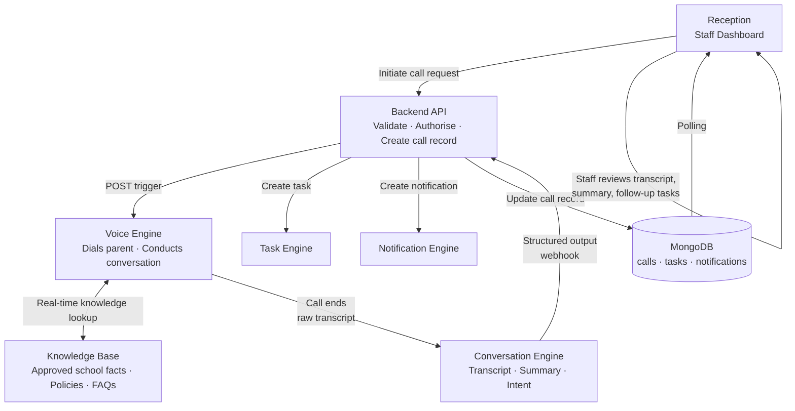
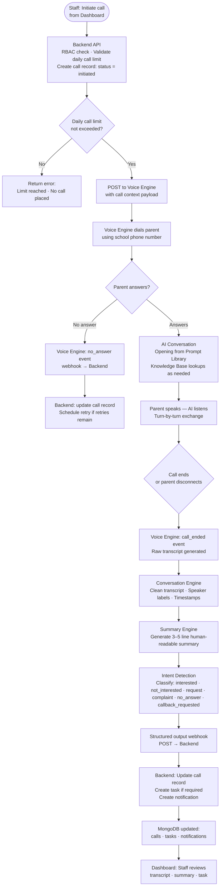
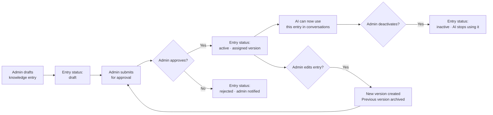
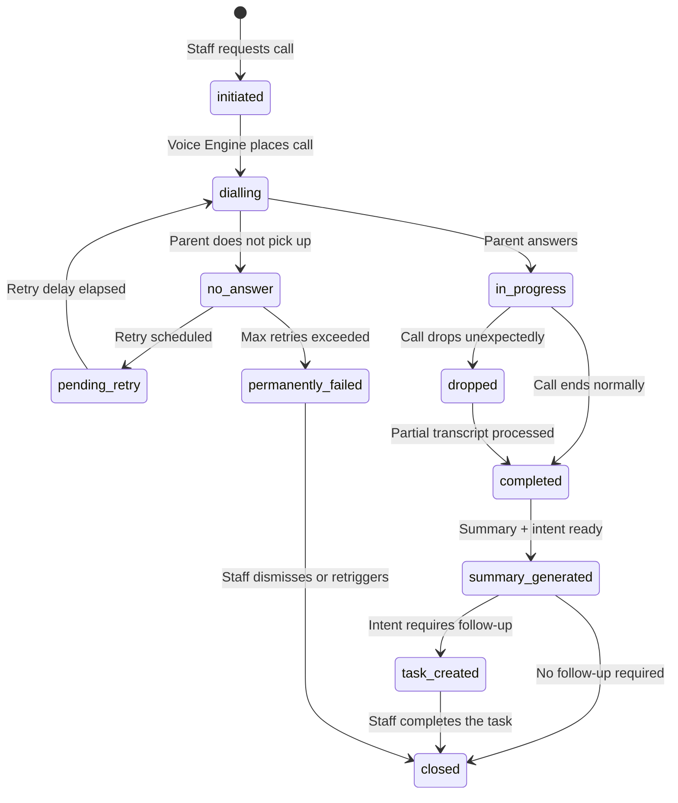

# 07 — AI Communication Platform
### SchoolOS AI · AI Architecture Reference
**Version:** 1.0.0 · **Audience:** Backend Developers, AI Engineers, AI Assistants, Contributors
**Read time:** ~12 minutes · **Stack:** Vapi · ElevenLabs · OpenAI · Node.js · MongoDB

---

## Table of Contents

1. [AI Communication Platform Overview](#1-ai-communication-platform-overview)
2. [AI Principles](#2-ai-principles)
3. [AI Components](#3-ai-components)
4. [Supported AI Operations](#4-supported-ai-operations)
5. [Standard AI Conversation Flow](#5-standard-ai-conversation-flow)
6. [Knowledge Framework](#6-knowledge-framework)
7. [Conversation Lifecycle](#7-conversation-lifecycle)
8. [AI Outputs](#8-ai-outputs)
9. [AI Safety](#9-ai-safety)
10. [Dashboard Features](#10-dashboard-features)
11. [Future Scope](#11-future-scope)
12. [References](#12-references)

---

## 1. AI Communication Platform Overview

The AI Communication Platform is the layer responsible for **AI-powered conversations between the school and parents**. It coordinates voice delivery, conversation logic, knowledge retrieval, transcript processing, and outcome routing — all within the boundaries set by the backend and approved by school administrators.

**Purpose:** Enable school staff to initiate intelligent, context-aware conversations with parents at scale — without replacing human judgement in any school decision.

**Architecture Philosophy:**
- The backend is always the authority — AI never acts without a backend-issued instruction
- AI communicates using only school-approved knowledge — no improvisation
- Every conversation produces a structured output (transcript, summary, intent, task) — nothing is lost
- Humans review outcomes — AI does not close loops unilaterally

### Role of Each Layer

| Layer | Role in AI Platform |
|---|---|
| **Dashboard** | Staff initiates calls, reviews transcripts, manages knowledge base, acts on tasks |
| **Backend** | Authorises every call, persists all data, routes outputs, generates tasks and notifications |
| **Workflow Engine (n8n)** | Triggers voice calls in campaign mode, routes webhooks, handles retry scheduling |
| **Voice Engine** | Conducts the live conversation using approved scripts and knowledge |
| **Knowledge Base** | Provides the AI with school-specific facts, policies, and approved answers |
| **Conversation Engine** | Classifies intent, generates transcript, produces structured summary |
| **Summary & Intent Engine** | Extracts actionable meaning from raw conversation — feeds Task Generator |

> **Critical Rule:** The AI never writes to MongoDB directly and never takes action on its own outcomes. All outputs are reported to the backend via webhook. The backend decides what records to create or update.

---

## 2. AI Principles

Every AI interaction in SchoolOS AI must satisfy all of the following principles without exception.

- [x] **AI assists humans — it never replaces them.** Staff initiate every call. Outcomes are reviewed by staff before action is taken.
- [x] **AI never makes school decisions.** Admission approvals, fee waivers, policy exceptions — these remain with school staff.
- [x] **Every conversation is logged.** No call happens without a corresponding `calls` record and `automation_logs` entry.
- [x] **Every call creates a transcript.** Even incomplete or failed calls produce whatever transcript was captured before the call ended.
- [x] **Every call creates a summary.** Structured summaries are generated from transcripts — staff never have to read full transcripts to understand what was discussed.
- [x] **Every interaction is auditable.** Every trigger, every outcome, and every staff action on an AI output is recorded in `audit_logs`.
- [x] **AI always uses approved knowledge.** The AI answers from the school's Knowledge Base. It does not invent answers or use general-world knowledge for school-specific queries.
- [x] **AI never directly modifies data.** Outcomes are reported to the backend. The backend decides what to update — not the AI.
- [x] **Every uncertain situation is escalated.** If the AI cannot confidently answer a parent's question, it acknowledges uncertainty and creates a follow-up task for staff.
- [x] **Human override is always available.** Staff can end any call, dismiss any AI-generated task, and manually update any record that the AI reported on.

---

## 3. AI Components

| Component | Responsibility |
|---|---|
| **Knowledge Base** | Stores school-approved facts, policies, FAQs, and admission details that the AI draws from during conversations |
| **Prompt Library** | Holds admin-approved, version-controlled conversation scripts for each call type — the AI never improvises its opening or core flow |
| **Voice Engine** | Conducts the live phone conversation — manages turn-taking, listens to the parent, and responds using approved scripts and knowledge |
| **Conversation Engine** | Processes the raw audio/text exchange into a structured transcript with speaker labels and timestamps |
| **Intent Detection** | Classifies what the parent expressed during the call — interest, objection, request, complaint, confirmation — from the transcript |
| **Summary Engine** | Generates a concise, human-readable call summary from the transcript for staff review |
| **Task Generator** | Converts detected intent into a follow-up task assigned to the appropriate staff member |
| **Notification Engine** | Creates in-app notifications for relevant staff when a call ends and its output is ready |
| **Call History** | Persists the complete conversation record — status, transcript, summary, intent, outcomes — linked to the parent and student |
| **Analytics** | Tracks call outcomes, intent distribution, conversion rates, and knowledge gaps across all AI conversations |

---

## 4. Supported AI Operations

| Operation | Initiated By | Purpose |
|---|---|---|
| **Manual Parent Call** | Staff — single click from parent profile | One-on-one AI conversation with a specific parent on any topic |
| **Admission Follow-up Call** | Staff — from Admissions module | AI calls a prospective parent to follow up on an inquiry, answer questions, gauge interest |
| **Fee Reminder Call** | Staff — from Fee module or campaign | AI calls a fee-defaulting parent to remind them of the outstanding amount and due date |
| **PTM Reminder Call** | Staff — from Campaigns module | AI calls parents to remind them of an upcoming Parent-Teacher Meeting |
| **General Follow-up Call** | Staff — from Tasks or Campaigns | AI calls a parent following a previous interaction, incomplete task, or unanswered WhatsApp |
| **Conversation Summary** | Automatic — post-call | AI generates a structured summary from the call transcript |
| **Intent Classification** | Automatic — post-call | AI identifies what the parent communicated: interested, not interested, request, complaint, no answer |
| **Task Creation** | Automatic — post-call | AI generates a follow-up task based on detected intent |
| **Notification Generation** | Automatic — post-call | AI triggers an in-app notification to relevant staff when a call completes |

> **Future Scope:** Campaign Voice Calls (automated AI calling a batch of parents without individual staff initiation) are defined in `06_Automation_Framework.md` as `WF-010` and are not part of MVP.

---

## 5. Standard AI Conversation Flow

### Stage Explanations

| Stage | What Happens |
|---|---|
| **Initiate** | Staff clicks "Call Parent" — backend validates RBAC, checks daily call limit, creates `calls` record |
| **Backend Authorisation** | Call limit checked against `settings.aiSettings.dailyCallLimit` — request rejected if exceeded |
| **Voice Engine Trigger** | Backend sends call context to the Voice Engine (parent phone, call type, prompt to use, knowledge scope) |
| **Dialling** | Voice Engine places the call using the school's registered number |
| **Conversation** | AI conducts the conversation using the assigned Prompt Library script and Knowledge Base answers |
| **Transcript Generation** | Raw exchange is transcribed with speaker labels and timestamps |
| **Summary Generation** | Summary Engine produces a 3–5 line human-readable summary of the call |
| **Intent Classification** | Intent Detection labels the parent's overall disposition and any specific requests |
| **Webhook to Backend** | Full structured output (transcript, summary, intent, call metadata) is POSTed to the backend |
| **Backend Processing** | Call record updated, task created if intent requires it, notification dispatched to relevant staff |
| **Staff Review** | Staff sees the call outcome in the Dashboard — transcript, summary, and any generated task |

---

## 6. Knowledge Framework

The Knowledge Base is the **single approved source of truth** the AI uses to answer parent questions. The AI does not use general world knowledge for school-specific queries.

### Knowledge Source and Upload

- Knowledge is created and managed entirely by school administrators in the Dashboard
- No external data sources — all knowledge is manually entered or uploaded by authorised staff
- Supported formats: structured text entries (policies, FAQs), free-text documents
- Each knowledge entry is tagged with a **category** and a **scope** (school-wide or admission/fee/PTM-specific)

### Knowledge Lifecycle

### Knowledge Versioning

- Every knowledge entry has a version number (`v1`, `v2`, ...)
- Editing an active entry creates a new version — the previous version is archived, not deleted
- The AI always uses the latest active version of each entry
- Admins can view the full version history of any entry for audit purposes

### Knowledge Categories (MVP)

| Category | Examples |
|---|---|
| **School Policies** | Uniform policy, attendance rules, discipline policy, code of conduct |
| **Admissions** | Admission process, eligibility criteria, required documents, seat availability |
| **Fees** | Fee structure, due dates, payment modes, late fee policy |
| **PTM** | Schedule, format, how to book a slot, what to bring |
| **Working Hours** | School hours, office hours, holiday closure schedule |
| **Holiday Calendar** | Upcoming holidays, exam schedule, event calendar |
| **General FAQs** | Transport, canteen, uniform suppliers, library, medical room |

> The AI answers only using knowledge entries with `status: active`. If a parent asks something outside the Knowledge Base, the AI acknowledges it cannot confirm the answer and creates a staff task to follow up.

---

## 7. Conversation Lifecycle

Every AI call — regardless of type — follows this lifecycle. Status transitions are owned by the backend.

### Lifecycle Status Definitions

| Status | Meaning |
|---|---|
| `initiated` | Backend has created the call record — Voice Engine not yet triggered |
| `dialling` | Voice Engine is attempting to reach the parent |
| `no_answer` | Parent did not pick up within the timeout window |
| `in_progress` | Parent answered — conversation is active |
| `completed` | Call ended normally — transcript captured |
| `dropped` | Call disconnected unexpectedly — partial transcript captured |
| `pending_retry` | Retry scheduled — `nextRetryAt` is set |
| `permanently_failed` | Max retries reached — admin attention required |
| `summary_generated` | Summary and intent classification are attached to the call record |
| `task_created` | Follow-up task generated and assigned to staff |
| `closed` | No further action required on this call |

---

## 8. AI Outputs

Every completed AI call produces the following outputs. All outputs are returned to the backend via a single structured webhook payload and persisted in MongoDB.

| Output | Description | Stored In |
|---|---|---|
| **Conversation Transcript** | Full verbatim record of the call with speaker labels (AI / Parent) and timestamps per turn | `calls.transcript` |
| **Call Summary** | 3–5 line human-readable summary of what was discussed and what the parent said | `calls.summary` |
| **Detected Intent** | Structured classification of the parent's disposition and any specific requests expressed during the call | `calls.intent` |
| **Follow-up Task** | A task record created when intent requires staff action — pre-filled with context from the call | `tasks` |
| **Notification** | In-app notification sent to the assigned staff member when the call outcome is ready for review | `notifications` |
| **Call Status** | Final lifecycle state of the call (`completed`, `no_answer`, `dropped`, `permanently_failed`) | `calls.status` |
| **Conversation History** | The complete call record (all of the above) linked to the parent and student for timeline view | `calls` (linked via `parentId`, `studentId`) |

### Intent Classification Values

| Intent | Meaning | Automated Action |
|---|---|---|
| `interested` | Parent expressed interest in admission or the discussed topic | Task: Schedule visit or follow-up |
| `not_interested` | Parent declined or is not pursuing | Admission/task closed |
| `callback_requested` | Parent asked to be called back at a different time | Task: Callback at requested time |
| `payment_promised` | Parent committed to making a payment | Task: Monitor payment by deadline |
| `complaint` | Parent expressed a grievance | Task: Escalate to admin |
| `information_provided` | Parent gave information the school needed (confirmed details, etc.) | Backend: Update relevant record |
| `no_answer` | Parent did not pick up | Retry if retries remain |
| `neutral` | Conversation ended without a clear outcome | No automatic task — call logged |

---

## 9. AI Safety

These are non-negotiable rules enforced at the architecture level. No workflow, no prompt, and no configuration change may override them.

| Safety Rule | Enforcement |
|---|---|
| **No hallucination** | AI answers from Knowledge Base only — if an answer is not in the Knowledge Base, the AI says so and creates a staff task |
| **No direct database updates** | AI reports outcomes via webhook to the backend — the backend decides what to write to MongoDB |
| **No financial commitments** | AI may state the fee amount and due date — it may not offer waivers, discounts, or payment extensions |
| **No admission decisions** | AI may provide information about the admissions process — it may not confirm or reject an admission |
| **No policy creation** | AI communicates existing approved policy — it may not create, modify, or imply new policies |
| **No call without backend authorisation** | Voice Engine is never triggered directly from the frontend or from n8n without a backend-validated call record |
| **Escalation on uncertainty** | If the AI cannot answer confidently, it explicitly tells the parent it will have a staff member follow up — creates task |
| **All conversations logged** | Every call — including failed dials, dropped calls, and no-answers — produces a call record |
| **Human override always available** | Staff can end any live call from the Dashboard, dismiss any AI-generated task, and manually update any call record |
| **Daily call limit enforced** | Backend enforces `settings.aiSettings.dailyCallLimit` per school per day — no override in code |

---

## 10. Dashboard Features

The following AI-related features are available to staff in the Dashboard. Feature availability is governed by role (Admin, Reception, Teacher).

| Feature | Available To | Purpose |
|---|---|---|
| **Call Parent** | Admin, Reception | Initiate a manual AI call to a specific parent from their profile or the Calls module |
| **View Transcript** | Admin, Reception | Read the full verbatim transcript of any completed call |
| **View Summary** | Admin, Reception | Read the AI-generated 3–5 line summary of any completed call |
| **Retry Call** | Admin, Reception | Re-trigger a call that resulted in no-answer or permanently-failed |
| **Conversation Timeline** | Admin, Reception | View all AI interactions with a specific parent in chronological order, linked to student record |
| **Knowledge Management** | Admin only | Create, edit, approve, and deactivate Knowledge Base entries |
| **Prompt Management** | Admin only | View, edit, and version-control the Prompt Library (approved conversation scripts) |
| **Call History** | Admin, Reception | View all calls placed, filtered by date, status, intent, call type |
| **Task List** | Admin, Reception, Teacher | View and action follow-up tasks generated from AI call outcomes |
| **AI Status** | Admin only | View daily call usage against the daily limit, active Knowledge Base entry count, and recent automation health |

---

## 11. Future Scope

The following are planned AI capabilities — none are part of MVP.

- **WhatsApp AI Chat** — AI-powered reply handling for inbound parent WhatsApp messages, going beyond intent classification to full conversational responses
- **Email AI** — AI-drafted email responses to parent inquiries, reviewed and approved by staff before sending
- **SMS AI** — AI-generated SMS content for campaigns and individual parent communication
- **Multilingual Voice** — AI voice calls conducted in Hindi, regional languages, or other configured languages based on parent preference
- **AI Appointment Booking** — AI negotiates and confirms PTM or visit slots with parents during the call, directly creating appointments after staff approval
- **Sentiment Analysis** — Real-time and post-call sentiment scoring of parent conversations to flag dissatisfied or at-risk families
- **Voice Cloning** — School principal or class teacher voice cloning for personalised AI calls
- **Predictive Follow-ups** — AI recommends which parents to call proactively based on engagement patterns and fee/admission signals
- **Real-time Translation** — Live translation layer enabling AI to speak in one language while the parent responds in another

---

## 12. References

| Document | What It Covers |
|---|---|
| `01_Product_Bible.md` | Product vision and the parent communication use cases this platform fulfils |
| `02_System_Architecture.md` | How the AI Communication Platform fits into the full system — AI role in the component map, ADR-005 (Vapi over Twilio Voice) |
| `03_Database_Architecture.md` | `calls`, `tasks`, `notifications`, `automation_logs` collection schemas used by this platform |
| `04_Backend_API.md` | Backend API endpoints — `/api/v1/calls`, `/api/v1/tasks`, `/api/v1/settings/ai`, `/webhooks/vapi/*` |
| `05_Communication_Engine.md` | Communication lifecycle that the AI Platform operates within — Campaign Engine, Reply Processing, Notification Engine |
| `06_Automation_Framework.md` | Automation rules governing AI call triggers, retry framework, logging, and queue management |

---

*Individual AI call workflows (Manual Call, Admission Follow-up, Fee Reminder Call) are documented in `automation/workflows/WF-005-*.md`. This document defines the platform architecture all AI workflows operate within.*
