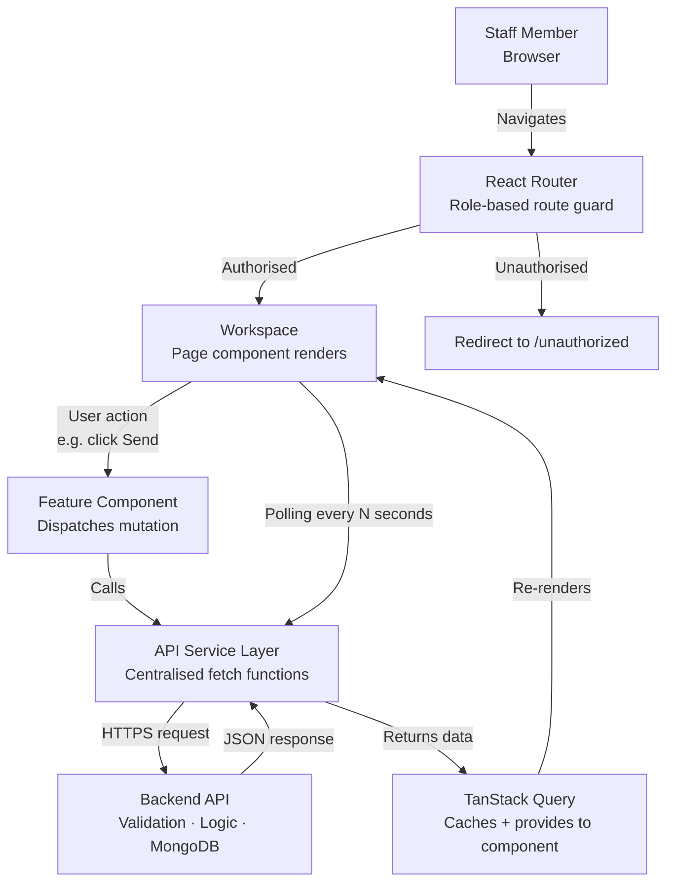
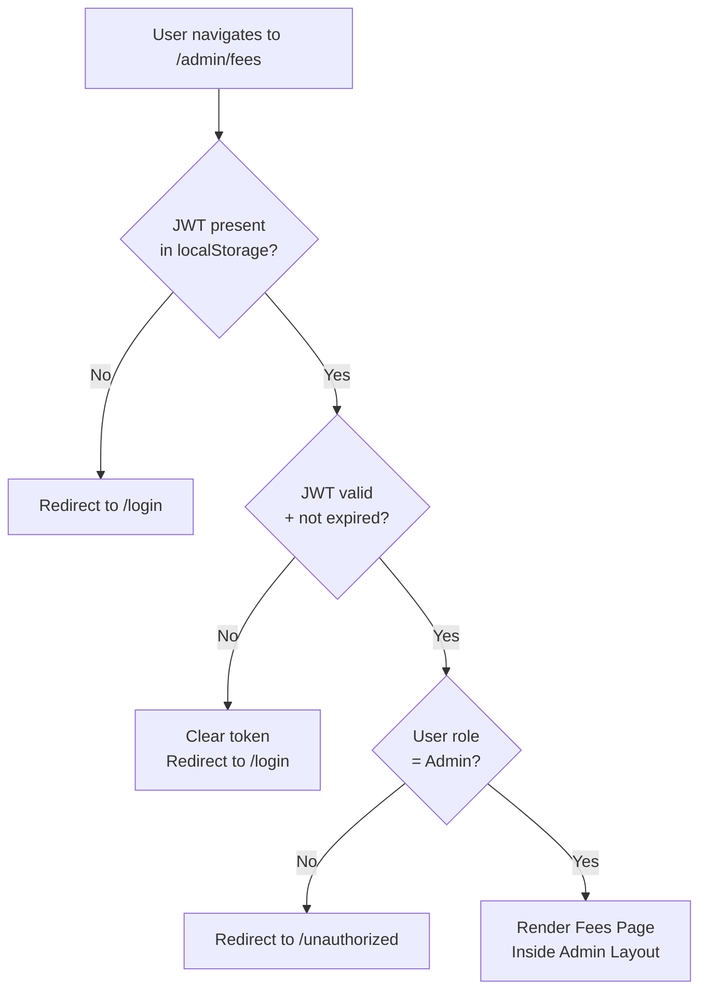
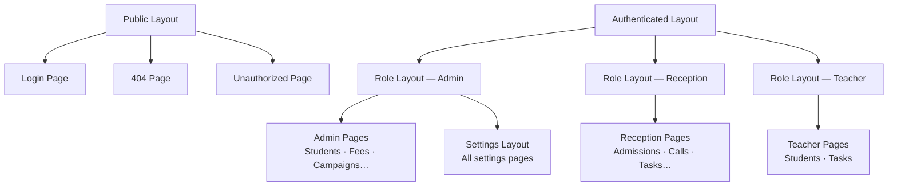
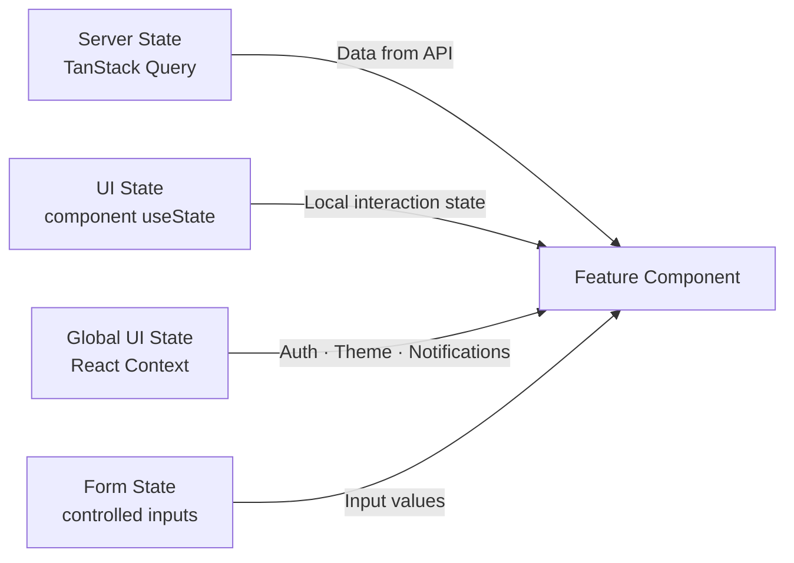
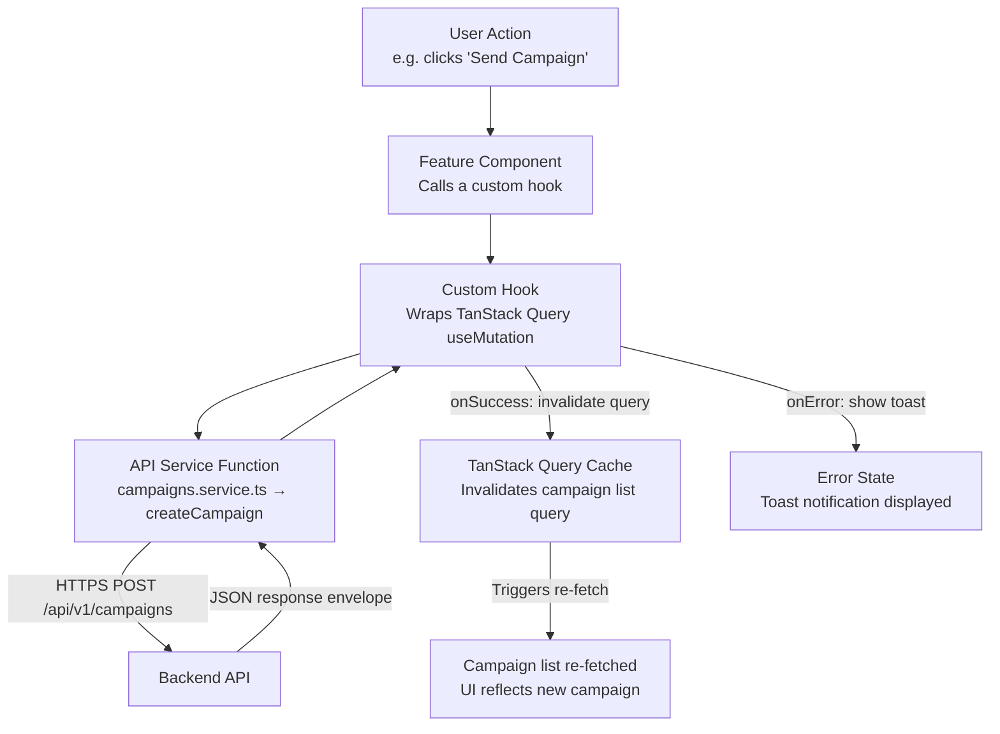
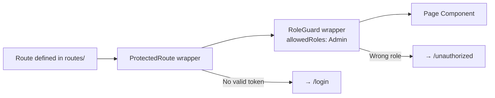

# 08 — Frontend Architecture
### SchoolOS AI · Frontend Engineering Reference
**Version:** 1.0.0 · **Audience:** Frontend Developers, AI Assistants, New Contributors
**Read time:** ~12 minutes · **Stack:** React · Vite · TypeScript · Tailwind CSS · Shadcn UI · TanStack Query · React Router

---

## Table of Contents

1. [Frontend Overview](#1-frontend-overview)
2. [Frontend Principles](#2-frontend-principles)
3. [Folder Structure](#3-folder-structure)
4. [Routing Architecture](#4-routing-architecture)
5. [Workspace Architecture](#5-workspace-architecture)
6. [Layout Architecture](#6-layout-architecture)
7. [Component Strategy](#7-component-strategy)
8. [State Management](#8-state-management)
9. [API Communication](#9-api-communication)
10. [Role-Based UI](#10-role-based-ui)
11. [UI Standards](#11-ui-standards)
12. [Future Scope](#12-future-scope)
13. [References](#13-references)

---

## 1. Frontend Overview

The SchoolOS AI frontend is a **pure rendering layer**. It displays data, collects user input, and sends requests to the backend. It owns no business logic, no validation beyond UX feedback, and no direct connection to external services.

**Purpose:** Provide school staff with a fast, role-aware workspace to manage students, fees, admissions, communications, and AI calls — all through a clean, opinionated interface.

**Architecture Philosophy:**
- The frontend is a client of the backend — not a partner in logic
- Every data operation goes through the backend API — never a shortcut
- Components render data they receive — they do not compute it
- Workspaces define what staff do, not what data exists

### Role of Each Layer

| Layer | Role in the Frontend |
|---|---|
| **React** | Renders UI, manages component lifecycle, handles user events |
| **React Router** | Enforces role-based route access, renders the correct workspace per role |
| **TanStack Query** | Fetches, caches, and polls server data — the only mechanism for server state |
| **API Services** | Centralised functions that call backend endpoints — components never call `fetch` directly |
| **Auth Context** | Stores the authenticated user's identity, role, and permissions — available globally |
| **Backend API** | The single source of truth — all reads and writes go here |



> **Critical Rule:** No component calls `fetch`, `axios`, or any HTTP method directly. All server communication is routed through API Service functions, consumed via TanStack Query hooks.

---

## 2. Frontend Principles

Every frontend decision in SchoolOS AI must respect these principles. They are not preferences — they are architectural constraints.

- [x] **UI never owns business logic** — validation, calculations, and decisions belong to the backend
- [x] **Backend owns validation** — the frontend may show inline UX feedback (empty field indicators), but the backend is the authority on whether data is valid
- [x] **Components remain reusable** — a component that renders a data table should not know it is on the Fees page
- [x] **Pages remain lightweight** — a page component composes layouts and features; it does not contain logic or UI markup itself
- [x] **Every page represents a workspace** — pages model what a staff member is doing, not what data is being shown
- [x] **API is the only data source** — no hardcoded data, no computed local data, no mock data in production components
- [x] **No direct database access** — the frontend has no database credentials, no MongoDB connection, and no direct cloud service calls
- [x] **State is predictable** — server state lives in TanStack Query; UI state lives in component `useState`; global UI state lives in Context
- [x] **Role drives visibility** — what a user can see and do is determined by their role, enforced at the route level and confirmed by the backend
- [x] **Loading, error, and empty states are always handled** — no component renders without a defined behaviour for all three conditions

---

## 3. Folder Structure

```
frontend/
└── src/
    ├── app/                    # App entry point — root providers, global config
    ├── layouts/                # Layout wrappers shared across pages
    ├── pages/                  # One file per route — composes layouts and features
    ├── routes/                 # Route definitions, protected route guards, role guards
    ├── features/               # Self-contained feature modules (Students, Fees, Campaigns…)
    ├── components/             # Shared, reusable UI components (Button, Table, Modal…)
    ├── services/               # API service functions — one file per backend domain
    ├── hooks/                  # Custom React hooks — data fetching, UI behaviour
    ├── contexts/               # React Context providers — Auth, Theme, Notification
    ├── utils/                  # Pure utility functions — formatting, date helpers, string ops
    ├── constants/              # Application-wide constants — route paths, role names, enums
    ├── assets/                 # Static files — logo, icons, fonts, images
    ├── styles/                 # Global CSS, Tailwind base overrides, animation tokens
    ├── types/                  # TypeScript type definitions and interfaces
    └── main.tsx                # Vite entry point — mounts the app
```

### Folder Responsibilities

| Folder | Responsibility |
|---|---|
| `app/` | Wraps the entire application with global providers (QueryClient, AuthProvider, Router, ThemeProvider) |
| `layouts/` | Reusable structural wrappers — sidebar, top bar, page shell — shared by multiple pages |
| `pages/` | One file per route — thin composition layer; no logic, no direct API calls |
| `routes/` | React Router route definitions, protected route components, and role-based access guards |
| `features/` | Domain-specific modules — each feature owns its own components, hooks, and service calls |
| `components/` | Design-system-level shared components — not tied to any feature or page |
| `services/` | One file per backend domain (`students.service.ts`, `fees.service.ts`) — all API calls live here |
| `hooks/` | Custom hooks that wrap TanStack Query calls or reusable UI behaviour |
| `contexts/` | Lightweight global state via React Context — Auth, active role, notification count |
| `utils/` | Pure functions with no side effects — date formatting, currency formatting, string truncation |
| `constants/` | Named constants for route paths, role identifiers, status values, and enums |
| `assets/` | Static files bundled by Vite — logo, illustrations, font files |
| `styles/` | Global Tailwind configuration overrides and CSS custom properties |
| `types/` | Shared TypeScript interfaces and type definitions mirroring backend response shapes |

### Feature Folder Pattern

Each feature in `features/` follows the same internal structure:

```
features/
└── students/
    ├── components/         # Components used only within this feature
    ├── hooks/              # TanStack Query hooks for this feature's data
    ├── types/              # Types specific to this feature
    └── index.ts            # Public exports from this feature
```

---

## 4. Routing Architecture

All routes are defined centrally in `routes/`. Every route that requires authentication passes through a `ProtectedRoute` guard. Every role-restricted route additionally passes through a `RoleGuard`.

### Route Table

| Path | Page | Auth Required | Roles Allowed |
|---|---|---|---|
| `/login` | Login | No | — |
| `/` | Redirect to workspace | Yes | All |
| `/admin` | Admin Workspace | Yes | Admin |
| `/admin/students` | Student Management | Yes | Admin |
| `/admin/fees` | Fee Management | Yes | Admin |
| `/admin/campaigns` | Campaigns | Yes | Admin |
| `/admin/calls` | AI Calls | Yes | Admin |
| `/admin/tasks` | Task Management | Yes | Admin |
| `/admin/reports` | Reports | Yes | Admin |
| `/admin/audit` | Audit Logs | Yes | Admin |
| `/admin/settings` | Settings | Yes | Admin |
| `/reception` | Reception Workspace | Yes | Reception |
| `/reception/admissions` | Admissions | Yes | Reception |
| `/reception/students` | Student Profiles | Yes | Reception |
| `/reception/fees` | Fee Records | Yes | Reception |
| `/reception/campaigns` | Campaigns | Yes | Reception |
| `/reception/calls` | AI Calls | Yes | Reception |
| `/reception/tasks` | Tasks | Yes | Reception |
| `/teacher` | Teacher Workspace | Yes | Teacher |
| `/teacher/students` | My Class Students | Yes | Teacher |
| `/teacher/tasks` | My Tasks | Yes | Teacher |
| `/profile` | User Profile | Yes | All |
| `/unauthorized` | Unauthorized | No | — |
| `*` | 404 Not Found | No | — |

### Protected Route Flow



- `ProtectedRoute` — checks for a valid JWT; redirects to `/login` if missing or expired
- `RoleGuard` — wraps `ProtectedRoute`; additionally checks the user's role matches the route's allowed roles
- On token expiry, the Auth Context triggers a silent refresh via the Refresh Token — if refresh fails, the user is logged out
- The backend re-validates the JWT on every API request — the frontend guard is a UX convenience, not a security boundary

---

## 5. Workspace Architecture

SchoolOS AI uses **Workspaces** instead of a generic dashboard. A Workspace is the complete operational environment for a specific role — it presents only the tools, data, and actions that role needs.

> A generic dashboard shows everything. A Workspace shows what you need to do your job.

### Workspace Table

| Workspace | Role | Purpose |
|---|---|---|
| **Admin Workspace** | Admin | Oversee the entire school — students, fees, staff, campaigns, AI calls, audit logs, settings, reports |
| **Reception Workspace** | Reception | Manage daily operations — admissions, student contact, fee tracking, WhatsApp campaigns, AI calls, tasks |
| **Teacher Workspace** | Teacher | View own class students, manage personal task list, update task outcomes |

### Workspace Responsibilities

**Admin Workspace:**
- Full visibility into all school data across all modules
- User management — create, deactivate, and assign roles to staff
- School settings — all configuration including AI call limits, template approval, knowledge base management
- Audit log access — view any action taken by any user
- Reports — campaign performance, fee collection summaries, call outcomes

**Reception Workspace:**
- Primary operational interface — the workspace used most frequently
- Admission management — inquiry intake, follow-up tracking, stage progression
- Student and parent contact management
- Fee records — view outstanding fees, record manual payments
- Campaign creation and management — WhatsApp, AI calls
- Task management — view, action, and close assigned tasks

**Teacher Workspace:**
- Scoped to own class students — cannot see other classes
- Read-only student profiles — attendance, academic notes (future)
- Task inbox — view AI-generated and manually assigned tasks, mark outcomes

---

## 6. Layout Architecture

Layouts are structural wrappers. A layout defines the shell of the page — sidebar, header, content area — without knowing what content it holds.

| Layout | Used When | Contains |
|---|---|---|
| **Public Layout** | Unauthenticated routes — `/login`, `/404`, `/unauthorized` | Centered card, school branding, no navigation |
| **Authenticated Layout** | All routes after login | Top bar with user profile, notification bell, role indicator |
| **Role Layout** | Role-specific workspaces — `/admin/*`, `/reception/*`, `/teacher/*` | Sidebar navigation filtered by role, workspace header, content area |
| **Modal Layout** | Any page-level overlay — confirmations, detail views, multi-step forms | Overlay backdrop, dismissable container, action footer |
| **Settings Layout** | `/admin/settings/*` | Secondary sidebar for settings categories, main content area |

### Layout Composition



---

## 7. Component Strategy

Components are organised by their scope of reuse and their relationship to business data.

| Component Type | Scope | Purpose |
|---|---|---|
| **UI Components** | Application-wide | Atomic design-system elements — Button, Badge, Avatar, Tooltip, Spinner — no business data awareness |
| **Shared Components** | Application-wide | Composite reusable elements built from UI components — DataTable, SearchInput, DateRangePicker, StatusBadge |
| **Layout Components** | Application-wide | Structural shells — Sidebar, TopBar, PageShell, ModalContainer |
| **Feature Components** | Feature-scoped | Domain-aware components — `StudentCard`, `CampaignStatusBadge`, `CallSummaryPanel` — live inside `features/` |
| **Page Components** | Route-scoped | One per route — composes layouts and feature components; contains no markup or business logic |
| **Modals** | On-demand | Dialog overlays for actions — `ConfirmDeleteModal`, `SendCampaignModal`, `CallSummaryModal` |
| **Forms** | Feature-scoped | Controlled form components for data input — `AdmissionForm`, `FeeRecordForm`, `TemplateForm` |
| **Tables** | Feature-scoped | Data list views — built on `SharedDataTable`, configured per feature |
| **Charts (Future)** | Feature-scoped | Visual data representations for reports and analytics — not in MVP |

### Reusability Rules

- A component that imports from `features/` is a Feature Component — it cannot be moved to `components/`
- A component that references a route path by name belongs in `routes/` or a page, not in `components/`
- UI and Shared Components must have zero knowledge of API response shapes — they accept typed props only
- Feature Components may import from `services/` and `hooks/` — they are the data-aware layer

---

## 8. State Management

SchoolOS AI uses three distinct state mechanisms. Each has a defined owner. Mixing them is an architectural violation.



| State Type | Owner | Examples | Tool |
|---|---|---|---|
| **Server State** | TanStack Query | Students list, campaign status, call records, fee data | `useQuery`, `useMutation` |
| **Local UI State** | Component `useState` | Dropdown open/closed, tab selection, modal visibility | React `useState` |
| **Global UI State** | React Context | Authenticated user, active role, notification count, theme | `AuthContext`, `ThemeContext` |
| **Form State** | Controlled inputs | Form field values before submission | React `useState` + form hook |
| **Authentication State** | Auth Context | JWT token, user profile, role, permissions | `AuthContext` |
| **Theme State** | Theme Context | Light mode (MVP), dark mode (future) | `ThemeContext` |

### State Rules

- **TanStack Query is the only mechanism for server data** — no `useEffect` + `fetch` combinations
- **Context is for lightweight global state only** — do not put API data or large objects into Context
- **Avoid prop drilling beyond two levels** — if a prop is passed through more than two components, use Context or lift to a feature-level hook
- **Server state is never duplicated in local state** — a component reads from TanStack Query cache, not a local copy
- **Mutations invalidate relevant queries** — after a successful write, the relevant `useQuery` cache is invalidated and data is re-fetched

### TanStack Query Configuration

| Setting | Value | Reason |
|---|---|---|
| `staleTime` | 30 seconds | Data is considered fresh for 30s — no unnecessary re-fetches |
| `refetchInterval` (campaign pages) | 10 seconds | Campaign status polling while campaigns are running |
| `refetchInterval` (call pages) | 5 seconds | Live call status updates |
| `retry` | 2 | Failed requests retry twice before showing an error state |
| `refetchOnWindowFocus` | true | Returning to the tab refreshes stale data |

---

## 9. API Communication

All communication between the frontend and backend follows a single path. Components never reach outside this path.



### API Communication Rules

- **No direct `fetch` or `axios` inside components** — components call hooks, hooks call service functions
- **One service file per backend domain** — `students.service.ts`, `fees.service.ts`, `campaigns.service.ts`, etc.
- **JWT is attached automatically** — a centralised Axios instance (or fetch wrapper) in `services/api.ts` attaches the `Authorization: Bearer <token>` header to every request
- **Token refresh is automatic** — on a 401 response, the API client silently attempts a token refresh; if successful, it retries the original request once
- **Error responses follow the backend envelope** — `{ success: false, error: { code, message, statusCode } }` — the service layer surfaces the `error.message` to the UI
- **Pagination is handled in the service layer** — page and limit parameters are passed by the hook, never hardcoded in components

### Standard API Response Handling

| Backend Response | Frontend Behaviour |
|---|---|
| `200` — success | TanStack Query stores data in cache, component re-renders |
| `400` — validation error | Error message from `error.message` shown inline or as toast |
| `401` — unauthorised | Silent token refresh attempted; on failure, user logged out |
| `403` — forbidden | Toast: "You do not have permission to perform this action" |
| `404` — not found | Empty state shown in component |
| `429` — rate limited | Toast: "Too many requests — please wait a moment" |
| `500` — server error | Toast: "Something went wrong — please try again" |

---

## 10. Role-Based UI

The frontend enforces role-based visibility at two levels: **route level** (what pages a user can visit) and **component level** (what actions a user can perform within a page).

### Workspace Access by Role

| Role | Accessible Workspaces | Accessible Modules |
|---|---|---|
| **Admin** | Admin Workspace | Students, Parents, Admissions, Fees, Campaigns, AI Calls, Tasks, Reports, Audit Logs, Settings, User Management |
| **Reception** | Reception Workspace | Admissions, Students, Parents, Fees, Campaigns, AI Calls, Tasks, Notifications |
| **Teacher** | Teacher Workspace | My Class Students (read-only), My Tasks |

### Component-Level Role Visibility

Within a page, certain actions are conditionally rendered based on role:

| Action | Admin | Reception | Teacher |
|---|---|---|---|
| Delete a student record | Yes | No | No |
| Send a campaign | Yes | Yes | No |
| Initiate an AI call | Yes | Yes | No |
| Manage school settings | Yes | No | No |
| View audit logs | Yes | No | No |
| Create a task | Yes | Yes | No |
| Close a task | Yes | Yes | Yes (own tasks) |

### Route Protection Implementation



- Role is read from `AuthContext` — populated from the JWT payload on login
- Backend validates role on every API call — a role change by an admin takes effect on the user's next token refresh
- Conditional rendering of UI elements uses a `usePermission` hook — it reads the current role from `AuthContext` and returns a boolean

---

## 11. UI Standards

SchoolOS AI follows a consistent visual and interaction language across all workspaces.

| Standard | Rule |
|---|---|
| **Design Language** | Apple-inspired — clean, spacious, high contrast, minimal decoration |
| **Liquid Glass** | Translucent card surfaces with subtle blur, depth, and shadow — applied to workspace panels and modals |
| **Touch Targets** | All interactive elements have a minimum 44×44px touch area — optimised for tablet use by reception staff |
| **Accessibility** | WCAG 2.1 AA compliance — all interactive elements are keyboard-navigable, all images have alt text, sufficient colour contrast |
| **Responsive Design** | Layout adapts to tablet (768px) and desktop (1280px+) — mobile is future scope |
| **Loading States** | Every data-fetching component shows a skeleton loader — never a blank space |
| **Error States** | Every component that can fail has an error state with a retry action |
| **Empty States** | Every list or table has an empty state with contextual guidance — not just "No data found" |
| **Confirmation Dialogs** | Destructive actions (delete, deactivate, send campaign) always require a confirmation modal before proceeding |
| **Toast Notifications** | Success, error, and warning feedback is shown as non-blocking toasts — max 3 visible at once, auto-dismiss after 4 seconds |
| **Consistent Naming** | UI labels match the backend domain language — "Campaign", "Admission", "Fee Record", not "Job", "Lead", "Invoice" |
| **No Hardcoded Colours** | All colours are Tailwind CSS tokens — never inline hex values in components |

---

## 12. Future Scope

The following are planned frontend capabilities — none are part of MVP.

- **Progressive Web App (PWA)** — installable on tablet and desktop, home screen shortcut, faster load via service worker cache
- **Dark Mode** — theme toggle with system preference detection; `ThemeContext` is already wired for this
- **Offline Mode** — read-only access to last-cached data when the network is unavailable
- **Real-Time Updates** — replace TanStack Query polling with Socket.IO push events for live campaign and call status
- **Socket.IO Integration** — backend event push for notifications, task assignments, and campaign completion
- **Parent Portal** — separate frontend application for parents to view fee status, attendance, and messages
- **Student Portal** — separate frontend for students to view timetable and academic information
- **Mobile Application** — React Native or Flutter app consuming the same backend API, sharing TypeScript types

---

## 13. References

| Document | What It Covers |
|---|---|
| `01_Product_Bible.md` | Product vision, feature list, and the staff workflows this frontend must support |
| `02_System_Architecture.md` | How the frontend fits into the full system — ADR-001 (React + Vite), ADR-003 (TanStack Query), ADR-007 (polling over Socket.IO) |
| `03_Database_Architecture.md` | MongoDB collection shapes that define the TypeScript types in `src/types/` |
| `04_Backend_API.md` | All API endpoints, response envelopes, error codes, and pagination format that the API service layer calls |
| `05_Communication_Engine.md` | Campaign and communication flows that the Campaigns and Calls pages present |
| `06_Automation_Framework.md` | Automation states that the frontend polls and displays — campaign queue status, call retry status |
| `07_AI_Communication_Platform.md` | AI call lifecycle, outputs, and dashboard features that the Calls workspace implements |

---

*Component specifications and feature implementation guides are documented in `frontend/docs/features/`. This document defines the architecture all frontend features are built within.*
