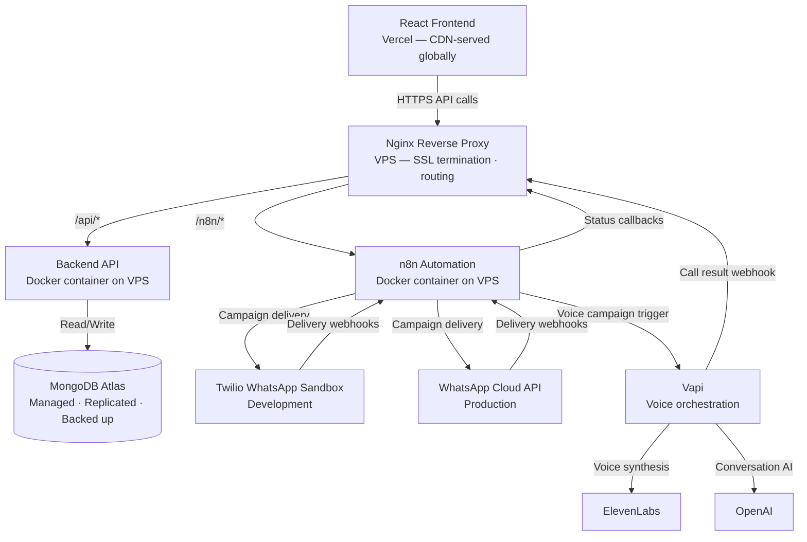
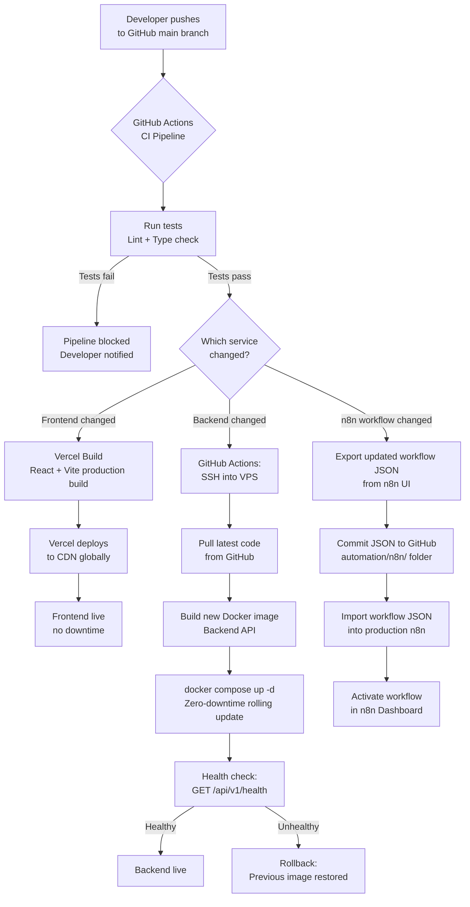
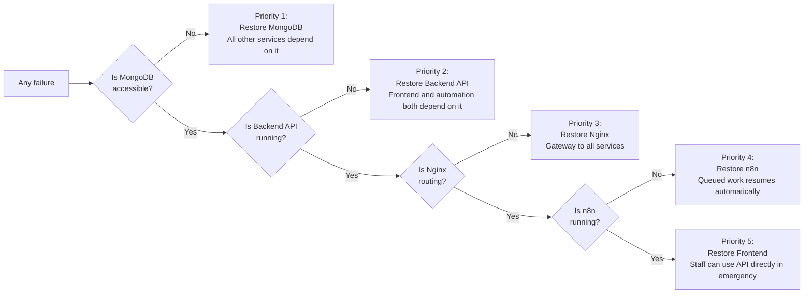

# 09 — Operations Guide
### SchoolOS AI · DevOps & Infrastructure Reference
**Version:** 1.0.0 · **Audience:** DevOps Engineers, Backend Developers, AI Assistants
**Read time:** ~12 minutes · **Stack:** Docker · Nginx · VPS · MongoDB Atlas · GitHub

---

## Table of Contents

1. [Operations Overview](#1-operations-overview)
2. [Infrastructure Overview](#2-infrastructure-overview)
3. [Environment Configuration](#3-environment-configuration)
4. [Deployment Architecture](#4-deployment-architecture)
5. [Monitoring Strategy](#5-monitoring-strategy)
6. [Logging Strategy](#6-logging-strategy)
7. [Backup & Recovery](#7-backup--recovery)
8. [Security Checklist](#8-security-checklist)
9. [Scaling Strategy](#9-scaling-strategy)
10. [Maintenance Tasks](#10-maintenance-tasks)
11. [Disaster Recovery](#11-disaster-recovery)
12. [References](#12-references)

---

## 1. Operations Overview

The Operations Guide defines how SchoolOS AI is deployed, monitored, secured, and maintained in production. It is the reference for every infrastructure decision made after the code is written.

**Purpose:** Ensure SchoolOS AI runs reliably for school staff with zero-downtime deployments, predictable recovery from failures, and a clear operational responsibility model.

**Production Philosophy:**
- Simple over complex — the smallest infrastructure that handles current load reliably
- Managed services where possible — MongoDB Atlas over self-hosted MongoDB; Vercel over self-managed static hosting
- Self-hosted where cost or control demands it — Backend API and n8n run on a VPS, not a cloud PaaS
- Every service has a defined owner and a defined recovery procedure

**Infrastructure Principles:**
- No secret values in code or version control — all secrets live in environment variables
- Every service is containerised — consistent behaviour across dev, staging, and production
- Every deployment is reversible — the previous version is always one step away
- Every failure has a documented manual fallback

**Operational Responsibilities:**

| Responsibility | Owner |
|---|---|
| Deployment execution | DevOps Engineer |
| Secret management | DevOps Engineer / Admin |
| Monitoring and alerting | DevOps Engineer |
| Database health | DevOps Engineer |
| Backup verification | DevOps Engineer |
| n8n workflow management | Automation Engineer |
| Knowledge Base management | School Admin (via Dashboard) |
| Security review | DevOps Engineer + Backend Lead |

---

## 2. Infrastructure Overview

| Service | Hosting | Notes |
|---|---|---|
| **Frontend** | Vercel | Static build deployed via Vercel CLI or GitHub integration; CDN-distributed globally; zero server management |
| **Backend API** | Docker on VPS | Containerised Node.js + Express; runs behind Nginx; single VPS for MVP |
| **n8n Automation** | Docker on VPS | Self-hosted n8n; shares VPS with backend; isolated Docker network |
| **MongoDB** | MongoDB Atlas (M10+) | Fully managed; multi-region replica set; automated backups; no self-hosted MongoDB |
| **File Storage (Future)** | Cloudflare R2 or AWS S3 | For student documents, report cards, media uploads — not in MVP |
| **Monitoring** | UptimeRobot + VPS metrics | HTTP uptime checks for all public endpoints; VPS CPU/memory/disk via provider dashboard |
| **Logging** | VPS file logs + MongoDB `automation_logs` | Backend and n8n logs written to container stdout; piped to rotating log files on VPS |
| **Backup** | MongoDB Atlas automated + manual VPS snapshot | Atlas handles DB backups; VPS snapshot covers environment files and n8n workflow exports |

### VPS Specifications (MVP)

| Resource | Minimum | Recommended |
|---|---|---|
| CPU | 2 vCPU | 4 vCPU |
| RAM | 4 GB | 8 GB |
| Storage | 40 GB SSD | 80 GB SSD |
| Bandwidth | 2 TB/month | 4 TB/month |
| OS | Ubuntu 22.04 LTS | Ubuntu 22.04 LTS |

---

## 3. Environment Configuration

All secrets and environment-specific values are stored in environment variable files — never committed to version control. Each environment (development, staging, production) has its own variable set.

| Category | Variables Owned | Purpose |
|---|---|---|
| **Frontend Variables** | `VITE_API_BASE_URL`, `VITE_APP_ENV` | Backend API URL and environment label for the React build |
| **Backend — Core** | `PORT`, `NODE_ENV`, `FRONTEND_URL` | Server port, environment mode, CORS allowed origin |
| **MongoDB** | `MONGODB_URI`, `MONGODB_DB_NAME` | Atlas connection string with credentials; database name |
| **JWT** | `JWT_SECRET`, `JWT_REFRESH_SECRET`, `JWT_EXPIRES_IN`, `JWT_REFRESH_EXPIRES_IN` | Signing secrets and token expiry durations for access and refresh tokens |
| **Twilio (Dev)** | `TWILIO_ACCOUNT_SID`, `TWILIO_AUTH_TOKEN`, `TWILIO_WHATSAPP_NUMBER` | Twilio sandbox credentials for WhatsApp in development |
| **WhatsApp Cloud API (Prod)** | `META_WHATSAPP_TOKEN`, `META_PHONE_NUMBER_ID`, `META_WEBHOOK_VERIFY_TOKEN` | Meta API credentials for WhatsApp in production |
| **OpenAI** | `OPENAI_API_KEY` | API key for intent classification, reply processing, and AI conversation |
| **Vapi** | `VAPI_API_KEY`, `VAPI_PHONE_NUMBER_ID`, `VAPI_WEBHOOK_SECRET` | Vapi API key, school phone number, and webhook HMAC secret |
| **ElevenLabs** | `ELEVENLABS_API_KEY`, `ELEVENLABS_VOICE_ID` | Voice synthesis API key and school voice ID |
| **n8n** | `N8N_WEBHOOK_BASE_URL`, `N8N_SCHOOLOS_SECRET` | n8n's externally accessible base URL; shared secret for backend-to-n8n webhook verification |
| **Webhook Security** | `WEBHOOK_SECRET_N8N`, `WEBHOOK_SECRET_VAPI`, `WEBHOOK_SECRET_META` | Per-provider HMAC secrets for inbound webhook verification |
| **Secrets Management** | All above | Stored in `.env.production` on VPS; never in GitHub; copied manually or via secure vault |

### Environment Files

| File | Location | Committed to Git |
|---|---|---|
| `.env.development` | Developer's local machine | No — listed in `.gitignore` |
| `.env.staging` | VPS staging environment | No |
| `.env.production` | VPS production environment | No |
| `.env.example` | Repository root | Yes — contains variable names, no values |

---

## 4. Deployment Architecture

### Deployment Flow Summary

| Step | Service | Trigger | Duration |
|---|---|---|---|
| Frontend deploy | Vercel | Push to `main` | ~2 minutes |
| Backend deploy | VPS via SSH | Push to `main` | ~3–5 minutes |
| n8n workflow deploy | Manual import | Workflow JSON committed | ~2 minutes |
| Database migration | Manual + script | Schema change required | Varies |
| Environment variable update | Manual on VPS | Secret rotation or new service | ~5 minutes + restart |

### Rollback Procedure

| Service | Rollback Method |
|---|---|
| Frontend | Vercel dashboard — one-click rollback to any previous deployment |
| Backend | `docker compose up` with the previous image tag |
| n8n workflows | Import the previous workflow JSON from GitHub history |
| Database | MongoDB Atlas point-in-time restore (Atlas M10+) |

---

## 5. Monitoring Strategy

Monitoring covers three layers: **uptime** (is the service reachable?), **health** (is the service working correctly?), and **business** (is the system doing its job?).

### Uptime Monitoring

| Endpoint | Check Frequency | Alert On |
|---|---|---|
| `GET /api/v1/health` — Backend | Every 1 minute | Non-200 response or timeout > 5s |
| Frontend URL | Every 5 minutes | Non-200 response |
| n8n UI | Every 5 minutes | Non-200 response |
| MongoDB Atlas | Atlas built-in + manual | Atlas sends alert on connection failures |

### Health Metrics to Track

| Metric | Source | Alert Threshold |
|---|---|---|
| **Backend API response time** | Nginx access logs | P95 > 2 seconds |
| **API error rate (5xx)** | Backend logs | > 1% of requests in 5 min |
| **Queue depth — pending** | `campaign_queue` | > 100 pending for > 10 min |
| **Queue depth — dead letter** | `campaign_queue` | Any `dead_letter` entry |
| **n8n execution failures** | `automation_logs` | Any `status: failed` execution |
| **Webhook failure rate** | `automation_logs` | > 5 failures in 10 min |
| **Daily AI call usage** | `calls` | > 80% of `dailyCallLimit` |
| **WhatsApp delivery rate** | `campaign_recipients` | < 80% delivered on a campaign |
| **VPS CPU usage** | VPS provider dashboard | > 80% sustained for > 5 min |
| **VPS memory usage** | VPS provider dashboard | > 85% sustained |
| **VPS disk usage** | VPS provider dashboard | > 80% |
| **MongoDB Atlas storage** | Atlas dashboard | > 75% of tier limit |

### Monitoring Tools (MVP)

| Tool | Purpose |
|---|---|
| UptimeRobot (free tier) | HTTP uptime checks for backend and frontend — email alert on downtime |
| MongoDB Atlas Alerts | Built-in Atlas monitoring for connection failures, slow queries, and storage |
| VPS Provider Dashboard | CPU, memory, disk, and network metrics for the VPS |
| n8n Execution History | In-built n8n log of all workflow executions and errors |

---

## 6. Logging Strategy

| Log Type | Source | Storage | Purpose |
|---|---|---|---|
| **Backend Logs** | Express.js application | VPS log files (rotating, 30-day retention) | Request/response logging, error traces, middleware events |
| **Automation Logs** | n8n workflows | `automation_logs` MongoDB collection (90-day retention) | Workflow execution history, delivery status, retry events |
| **Webhook Logs** | Backend webhook handlers | `automation_logs` + VPS log files | Inbound webhook received, validated, and dispatched events |
| **Communication Logs** | Backend — Campaign and Message services | `messages` collection (permanent) | Every outbound message — sent, delivered, read, failed |
| **Voice Logs** | Backend — Call service | `calls` collection (permanent) | Every AI call — transcript, summary, intent, status |
| **Audit Logs** | Backend — Audit middleware | `audit_logs` collection (permanent, insert-only) | Every user action, data change, admin event — immutable |
| **System Logs** | Docker + OS | VPS log files (rotating, 14-day retention) | Container start/stop, Nginx access and error logs, OS events |
| **n8n Execution Logs** | n8n built-in | n8n internal database (30-day retention) | Visual execution history per workflow — useful for debugging |

### Log Retention Summary

| Log | Retention | Location |
|---|---|---|
| Audit logs | Permanent | MongoDB `audit_logs` |
| Communication logs | Permanent | MongoDB `messages` |
| Voice logs | Permanent | MongoDB `calls` |
| Automation logs | 90 days | MongoDB `automation_logs` |
| Backend app logs | 30 days | VPS rotating log files |
| n8n execution logs | 30 days | n8n internal database |
| System / Nginx logs | 14 days | VPS rotating log files |

---

## 7. Backup & Recovery

### Database Backups

| Backup Type | Frequency | Retention | Method |
|---|---|---|---|
| MongoDB Atlas automated backup | Daily | 7 days | Atlas built-in — point-in-time restore available |
| MongoDB Atlas snapshot | Weekly | 4 weeks | Atlas manual snapshot trigger |
| Manual export (critical milestones) | Before major deployments | Indefinite | `mongodump` export to VPS + off-site storage |

### Environment & Configuration Backup

| Item | Backup Method | Frequency |
|---|---|---|
| `.env.production` | Encrypted copy stored in secure vault (Bitwarden, 1Password, or similar) | On every change |
| `docker-compose.yml` | Committed to private GitHub repository | On every change |
| Nginx configuration | Committed to private GitHub repository | On every change |
| SSL certificates | Let's Encrypt auto-renewal via Certbot | Every 90 days (automatic) |

### Automation Backup

| Item | Backup Method | Frequency |
|---|---|---|
| n8n workflow JSON files | Exported and committed to `automation/n8n/` in GitHub | After every workflow change |
| n8n credentials | Documented in secure vault (vault stores names and rotation dates — not raw values) | On every change |

### Documentation Backup

- All documentation files (`*.md`) are committed to the GitHub repository — version-controlled automatically
- Repository is the single source of truth for all engineering documentation

### Recovery Priority Order

| Priority | Service | Reason |
|---|---|---|
| 1 | MongoDB Atlas | All business data lives here — nothing works without it |
| 2 | Backend API | Frontend and automations both depend on it |
| 3 | Nginx | Gateway to all services |
| 4 | n8n Automation | Communication delivery — schools can operate manually short-term |
| 5 | Frontend | Staff can use backend directly via API tools in an emergency |

---

## 8. Security Checklist

- [x] **HTTPS everywhere** — Nginx terminates SSL; all traffic is encrypted; HTTP redirected to HTTPS
- [x] **JWT authentication** — all API routes require a valid JWT; refresh tokens are rotated on use
- [x] **Secrets in environment variables** — no credentials in code or version control; `.env` files are gitignored
- [x] **Input validation** — all API inputs validated at the backend; frontend validation is UX only
- [x] **Role-based access control** — every API route checks the user's role before executing
- [x] **Webhook verification** — all inbound webhooks verified by secret header + HMAC signature before processing
- [x] **Rate limiting** — API rate limiting applied at Nginx and backend middleware layers
- [x] **Audit logs** — every significant user action and data change is logged immutably in `audit_logs`
- [x] **Soft delete only** — no hard deletes; data is deactivated, never destroyed
- [x] **schoolId scoping** — every MongoDB query is scoped to the authenticated user's `schoolId` — cross-school data access is structurally prevented
- [x] **No secrets in frontend** — the React build contains no API keys; all external service calls go through the backend
- [x] **MongoDB Atlas IP allowlist** — Atlas only accepts connections from the VPS IP — no public access
- [x] **n8n behind Nginx** — n8n UI is not publicly accessible; protected by Nginx basic auth or VPN
- [x] **Regular secret rotation** — JWT secrets, API keys, and webhook secrets are rotated quarterly
- [x] **Backup encryption** — database exports and environment file backups are stored encrypted

---

## 9. Scaling Strategy

### Current State — Single School (MVP)

| Layer | Current Setup |
|---|---|
| Frontend | Vercel — scales automatically; no action needed |
| Backend | Single Docker container on single VPS |
| Automation | Single n8n instance on same VPS |
| Database | MongoDB Atlas M10 — shared cluster |
| External APIs | Twilio / WhatsApp / Vapi — metered per use |

### Future State — Multi-School SaaS

The `schoolId` field on every MongoDB document is the foundation for multi-tenancy. No schema migration is required when scaling to multiple schools — only infrastructure and configuration changes.

| Layer | Scaling Approach |
|---|---|
| **Backend** | Horizontal scaling — multiple backend containers behind a load balancer; stateless design means any container handles any request |
| **Automation** | Scale n8n horizontally or migrate to a managed queue (BullMQ + Redis) for higher throughput; concurrency limits increase per-tier |
| **Database** | MongoDB Atlas M30+ — dedicated cluster per region; database-level tenant isolation for enterprise schools |
| **File Storage** | Cloudflare R2 or AWS S3 — `schoolId`-prefixed bucket paths isolate school files |
| **Monitoring** | Centralised logging service (Datadog, Grafana Cloud, or Logtail) replacing VPS log files; per-school dashboards |
| **API Gateway** | Add a dedicated API gateway layer (Kong or AWS API Gateway) for rate limiting, auth offloading, and tenant routing |

---

## 10. Maintenance Tasks

| Frequency | Task | Owner | Purpose |
|---|---|---|---|
| **Daily** | Verify backup completion | DevOps | Confirm Atlas backup ran successfully |
| **Daily** | Check monitoring alerts | DevOps | Review any overnight alerts or anomalies |
| **Daily** | Review dead letter queue | DevOps / Admin | Identify permanently failed batches requiring admin attention |
| **Daily** | Check AI call limit usage | Admin | Confirm daily call budget not approaching limit unexpectedly |
| **Weekly** | Review n8n execution history | Automation Engineer | Identify recurring workflow failures or slow executions |
| **Weekly** | Check VPS resource usage | DevOps | CPU, memory, disk trending — plan capacity changes before limits hit |
| **Weekly** | Verify webhook delivery rates | DevOps | WhatsApp and Vapi webhooks landing correctly |
| **Weekly** | Audit log review (sample) | Admin | Spot-check audit logs for unexpected user actions |
| **Monthly** | Rotate API keys and secrets | DevOps | JWT secrets, provider API keys, webhook secrets |
| **Monthly** | Database index review | Backend Lead | Review slow query logs from Atlas — add or modify indexes |
| **Monthly** | Template review | Admin | Review and update WhatsApp templates as school needs change |
| **Monthly** | Knowledge Base review | Admin | Review and update AI Knowledge Base entries |
| **Monthly** | Log cleanup | DevOps | Confirm log rotation is working; manually clear oversized logs |
| **Monthly** | SSL certificate check | DevOps | Confirm auto-renewal is active; manually renew if needed |
| **Quarterly** | Security review | DevOps + Backend Lead | Review access controls, secret rotation status, dependency vulnerabilities |
| **Quarterly** | Queue cleanup | DevOps | Archive or delete resolved dead letter entries |
| **Quarterly** | Dependency audit | Backend Lead | Review and update npm packages for security patches |
| **Quarterly** | Disaster recovery drill | DevOps | Simulate a failure — verify backup restore works end to end |

---

## 11. Disaster Recovery

### Failure Scenarios and Response

| Failure | Detection | Response | Recovery Time |
|---|---|---|---|
| **Backend API down** | UptimeRobot alert — `/api/v1/health` failing | SSH to VPS — check container status — restart container — if image issue, rollback to previous image | < 10 minutes |
| **VPS unreachable** | UptimeRobot alert — all VPS-hosted services down | Contact VPS provider — if hardware failure, spin up new VPS from snapshot — redeploy all containers | 30–60 minutes |
| **MongoDB Atlas outage** | Atlas alert + backend 500 errors | Atlas handles failover to replica — if Atlas-wide outage, read operations continue from replica; write operations paused until resolved | Atlas SLA: < 4 hours |
| **MongoDB data corruption** | Unexpected data in application + Atlas alert | Stop all writes — identify corruption scope — restore from point-in-time backup or latest snapshot | 30–120 minutes depending on data volume |
| **n8n crash** | Queued campaigns stall — no delivery updates | SSH to VPS — restart n8n container — queue entries remain in `pending` — processing resumes automatically on restart | < 5 minutes |
| **Webhook failures** | `automation_logs` webhook rejection spike — monitoring alert | Verify provider IP allowlist — check HMAC secret rotation — manually re-queue affected batches | 10–30 minutes |
| **WhatsApp API outage** | Delivery rate drops to 0 — monitoring alert | Check Meta Status page — no action on our side — campaigns enter retry queue automatically — staff notified | Dependent on Meta SLA |
| **Vapi outage** | AI calls failing — call status stuck at `dialling` | Check Vapi status page — pause new calls — existing in-progress calls lost — staff notified to retry | Dependent on Vapi SLA |
| **OpenAI outage** | Intent classification failing — reply processing stalled | Intents default to `neutral` — tasks not auto-created — staff process replies manually until service restores | Dependent on OpenAI SLA |

### Recovery Priority

### Manual Fallbacks

| Service Down | Manual Alternative |
|---|---|
| WhatsApp campaign delivery | Reception calls parents directly using student contact records |
| AI voice calls | Reception places manual phone calls |
| Campaign scheduling | Staff note the campaign and trigger manually when service restores |
| Notification engine | Staff check relevant module pages directly — polling is not dependent on notifications |
| Frontend | Admin/DevOps accesses data via backend API using Postman or similar |

---

## 12. References

| Document | What It Covers |
|---|---|
| `01_Product_Bible.md` | Product vision and the operational requirements that infrastructure must support |
| `02_System_Architecture.md` | Full system component map — how all services connect and depend on each other |
| `03_Database_Architecture.md` | MongoDB collection schemas — critical for backup scope and restore validation |
| `04_Backend_API.md` | All API endpoints — used for health checks, webhook endpoint documentation, and smoke testing after deployment |
| `05_Communication_Engine.md` | Campaign and communication flows — defines what the queue, delivery, and webhook systems must support operationally |
| `06_Automation_Framework.md` | Automation framework — queue processing, retry rules, logging, and monitoring targets that operations must maintain |
| `07_AI_Communication_Platform.md` | AI voice call architecture — Vapi, ElevenLabs, and OpenAI operational dependencies |
| `08_Frontend_Architecture.md` | Frontend deployment model — Vercel configuration and environment variable requirements |

---

*This document covers operational architecture. For implementation details — deployment scripts, Docker Compose files, and CI/CD pipeline configuration — see the `ops/` folder in the repository.*
