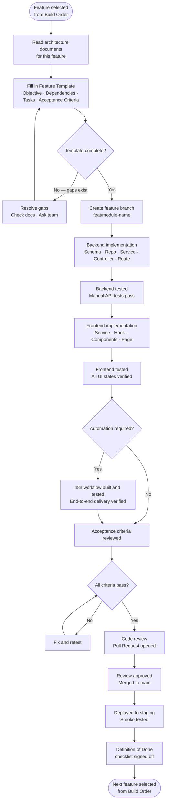

# 10 — Implementation Playbook
### SchoolOS AI · Execution Reference for Developers
**Version:** 1.0.0 · **Audience:** All Developers, AI Assistants, New Contributors
**Read time:** ~10 minutes · **Purpose:** Answers one question — "What should we build next?"

---

## Table of Contents

1. [Playbook Overview](#1-playbook-overview)
2. [Development Principles](#2-development-principles)
3. [Recommended Build Order](#3-recommended-build-order)
4. [Feature Template](#4-feature-template)
5. [Sprint Structure](#5-sprint-structure)
6. [Development Workflow](#6-development-workflow)
7. [Definition of Done](#7-definition-of-done)
8. [Testing Checklist](#8-testing-checklist)
9. [Git Workflow](#9-git-workflow)
10. [Project Milestones](#10-project-milestones)
11. [Daily Developer Checklist](#11-daily-developer-checklist)
12. [References](#12-references)

---

## 1. Playbook Overview

This playbook defines **how SchoolOS AI is built** — not what it will eventually become. It is the execution guide developers use every day to decide what to implement, how to implement it, and when it is done.

**Purpose:** Remove ambiguity from the development process. Every developer — whether it is day one or month six — should be able to open this playbook and know exactly what to do next.

**Development Philosophy:**

| Principle | What It Means in Practice |
|---|---|
| **Incremental development** | Ship one working feature before starting the next. A working fee module beats a half-built ERP. |
| **Feature-first implementation** | Every feature is fully implemented — backend, frontend, and automation — before moving on. No half-finished layers. |
| **Testing-first mindset** | Testing is not a phase after implementation. It is the last step of every feature and the gate before moving on. |
| **Architecture before code** | Every feature begins by reading the relevant architecture documents. No guessing the data model or API design. |
| **Definition of Done** | A feature is done when it passes every item on the Definition of Done checklist — not when the code compiles. |

---

## 2. Development Principles

These principles apply to every developer, every feature, every day.

- [x] **One feature at a time** — start, complete, and test one feature before starting the next
- [x] **Test before moving on** — a feature is not done until it is tested end-to-end; do not build on untested foundations
- [x] **Never build multiple workflows together** — one automation workflow per implementation cycle; workflows interact in complex ways when incomplete
- [x] **Keep commits small and meaningful** — one logical change per commit; commit messages explain the why, not the what
- [x] **Every feature references architecture documents** — check `04_Backend_API.md` before writing an endpoint; check `03_Database_Architecture.md` before writing a schema
- [x] **Every feature has acceptance criteria** — if you cannot write acceptance criteria before implementation, you do not understand the feature well enough yet
- [x] **Every feature is independently deployable** — a feature must not require another unfinished feature to function; use feature flags or stubs if needed
- [x] **Backend before frontend** — build and test the API endpoint before building the component that calls it
- [x] **No hardcoded values** — every configurable value (limits, keys, URLs) lives in environment variables or the `settings` collection
- [x] **Update documentation when behaviour changes** — if implementation differs from the architecture document, update the document — not the code

---

## 3. Recommended Build Order

Build in dependency order. Each module depends on the ones above it. Do not skip ahead.

| Priority | Module | Depends On | Why This Order |
|---|---|---|---|
| 1 | **Project Setup** | — | Repo, Docker, Nginx, CI/CD, environment files — nothing else starts without this |
| 2 | **Authentication** | Project Setup | Every other module requires authenticated users |
| 3 | **User Management** | Authentication | Staff must exist before any school operation can happen |
| 4 | **School Settings** | Authentication | All modules read from settings — must exist before feature config is used |
| 5 | **Students** | Users, Settings | Students are the core entity — most other modules reference them |
| 6 | **Parents** | Students | Parents are linked to students; contact data powers communication |
| 7 | **Reception Workspace** | Students, Parents | The primary operational interface — must have core data to display |
| 8 | **Teacher Workspace** | Students, Users | Scoped student view and task inbox for teachers |
| 9 | **Admissions** | Students, Parents | Inquiry → enrollment pipeline; depends on student and parent creation |
| 10 | **Fees** | Students, Parents | Fee records link to students; payment tracking links to parents |
| 11 | **Tasks** | Users, Students | Tasks require assignees (users) and context (students/parents) |
| 12 | **Notifications** | Users | In-app notifications require authenticated recipients |
| 13 | **WhatsApp Templates** | Settings | Templates must exist before any campaign can be sent |
| 14 | **Campaign Engine** | Students, Parents, Templates | Audience builder and campaign lifecycle depend on all contact data |
| 15 | **WF-001 Fee Reminder** | Campaign Engine, n8n | First automation workflow — validates the full automation pipeline |
| 16 | **WF-002 PTM Reminder** | Campaign Engine, n8n | Second workflow — reuses campaign infrastructure |
| 17 | **WF-003 Holiday Notice** | Campaign Engine, n8n | Third workflow — broadcast to all parents |
| 18 | **WF-006 Reply Processing** | WhatsApp, Tasks | Inbound reply handling requires task creation to be working |
| 19 | **Knowledge Base** | Settings, Authentication | Must be populated before AI calls can use school-specific knowledge |
| 20 | **AI Voice Calls — Manual** | Knowledge Base, Tasks | Manual call (WF-005) — validates the full AI call pipeline |
| 21 | **WF-004 Admission Follow-up** | Admissions, AI Calls | Combines campaign engine with AI voice |
| 22 | **Audit Logs UI** | Audit middleware (already active) | Middleware logs from day one; UI is added after core modules are stable |
| 23 | **Reports** | All modules | Reports aggregate data from all other modules — built last |
| 24 | **Performance & Polish** | All modules | Query optimisation, UI polish, loading states, edge case handling |

---

## 4. Feature Template

Every feature is planned and executed using this template before implementation begins. Fill it out completely — an incomplete template means the feature is not ready to build.

---

```
## Feature: [Feature Name]

### Objective
One sentence describing what this feature enables a user to do.

### Dependencies
List features that must be complete before this one can start.
- Feature A — [reason]
- Feature B — [reason]

### Documents Required
Read these before writing any code.
- 03_Database_Architecture.md — [relevant section]
- 04_Backend_API.md — [relevant section]
- 08_Frontend_Architecture.md — [relevant section]

### Backend Tasks
- [ ] Create/update Mongoose schema
- [ ] Create repository function(s)
- [ ] Create service function(s)
- [ ] Create controller(s)
- [ ] Register route(s) with middleware
- [ ] Write audit log entries for all mutations
- [ ] Handle all error cases

### Frontend Tasks
- [ ] Create API service function(s) in services/
- [ ] Create TanStack Query hook(s) in hooks/
- [ ] Build feature component(s) in features/
- [ ] Wire into page component
- [ ] Handle loading state
- [ ] Handle error state
- [ ] Handle empty state
- [ ] Add confirmation dialog for destructive actions

### Automation Tasks (if applicable)
- [ ] Create workflow specification document (WF-NNN)
- [ ] Build n8n workflow
- [ ] Test webhook trigger from backend
- [ ] Test status callback to backend
- [ ] Test retry logic
- [ ] Export workflow JSON to automation/n8n/

### Testing Checklist
- [ ] All backend endpoints return correct responses
- [ ] All frontend states (loading, error, empty, data) tested
- [ ] Role-based access tested — each role gets correct access
- [ ] Automation workflow tested end-to-end
- [ ] Audit log verified for all mutations
- [ ] Error handling tested — invalid input, missing records, auth failure

### Acceptance Criteria
Numbered list of measurable outcomes. The feature is done when all criteria pass.
1. A [role] can [action] and [expected outcome].
2. When [condition], the system [response].
3. [Edge case] is handled by [behaviour].

### Future Improvements
List known enhancements deferred to post-MVP.
- Enhancement A
- Enhancement B
```

---

## 5. Sprint Structure

Sprints are one week long. Each sprint targets one or two complete features from the Build Order table. Partial features do not count as sprint deliverables.

| Sprint | Goal | Deliverables | Exit Criteria |
|---|---|---|---|
| **Sprint 1** | Foundation | Project setup, Docker, Nginx, CI/CD, environment config | Backend API returns 200 on `/api/v1/health` in production |
| **Sprint 2** | Authentication | Login, JWT, refresh tokens, logout, RBAC middleware | Staff can log in, receive a token, access a protected route, and log out |
| **Sprint 3** | Users & Settings | User management CRUD, school settings document, admin settings UI | Admin can create a staff user; settings document is created on school setup |
| **Sprint 4** | Students & Parents | Student and parent CRUD, profile pages, search | Reception can create a student, link a parent, and view the profile |
| **Sprint 5** | Workspaces | Reception and Teacher workspace shells, navigation, role routing | Each role sees only their workspace on login |
| **Sprint 6** | Admissions | Admission inquiry, stage pipeline, follow-up tasks | Reception can track an inquiry from arrival to enrollment |
| **Sprint 7** | Fees | Fee records, outstanding view, manual payment entry | Reception can view and update a student's fee status |
| **Sprint 8** | Tasks & Notifications | Task creation, assignment, inbox, in-app notifications | A task created by the system appears in the assignee's task inbox |
| **Sprint 9** | WhatsApp Templates & Campaign Engine | Template management, campaign creation, audience builder | Admin can create a campaign, select an audience, and queue it |
| **Sprint 10** | WF-001 Fee Reminder | End-to-end WhatsApp fee reminder delivery and status reporting | A queued fee reminder campaign delivers messages and shows delivery status |
| **Sprint 11** | WF-002, WF-003 | PTM Reminder and Holiday Notice workflows | Both campaign types deliver and report status correctly |
| **Sprint 12** | WF-006 Reply Processing | Inbound WhatsApp reply classification and task creation | A parent reply creates a classified task in the staff inbox |
| **Sprint 13** | Knowledge Base & AI Setup | Knowledge Base CRUD, prompt library, AI settings | Admin can create and approve a knowledge entry; AI settings are configurable |
| **Sprint 14** | WF-005 Manual AI Call | Manual AI voice call end-to-end | Reception initiates a call; transcript, summary, and intent appear in Dashboard |
| **Sprint 15** | WF-004 Admission Follow-up | AI voice call campaign for admission inquiries | Admission follow-up call is initiated, retried on no-answer, and outcome logged |
| **Sprint 16** | Audit Logs, Reports & Polish | Audit log UI, basic reports, UX polish, edge cases | Admin can view audit history; reports show campaign and call summaries |

---

## 6. Development Workflow

Every feature — regardless of size — follows this workflow without exception.



### Workflow Rules

- **Never skip the Feature Template** — if the template cannot be filled, the feature is not understood
- **Backend is tested before frontend starts** — the API contract must be stable before components are built against it
- **Acceptance criteria are written before implementation** — not after
- **One pull request per feature** — do not bundle multiple features in one PR

---

## 7. Definition of Done

A feature is done when **every item** on this checklist is complete. Partial completion is not done.

**Backend:**
- [x] All planned endpoints implemented and returning correct responses
- [x] Input validation applied to all endpoints
- [x] RBAC middleware applied — each role gets correct access
- [x] All mutations write to `audit_logs`
- [x] All error cases handled and returning correct error codes

**Frontend:**
- [x] All feature components implemented
- [x] Loading state handled — skeleton or spinner visible while fetching
- [x] Error state handled — error message visible with retry option
- [x] Empty state handled — contextual message visible when no data
- [x] Confirmation dialog shown before all destructive actions
- [x] Role-based visibility correct — actions only shown to permitted roles

**Database:**
- [x] Schema matches `03_Database_Architecture.md`
- [x] Required indexes are present
- [x] `schoolId` present on all new documents
- [x] Soft delete used — no hard deletes

**Automation (if applicable):**
- [x] n8n workflow delivers correctly end-to-end
- [x] Retry logic tested — failure → retry → eventual success or dead letter
- [x] Status callbacks verified — backend receives and processes all callbacks
- [x] Automation log entries written for all workflow events
- [x] Workflow JSON exported and committed to `automation/n8n/`

**Quality:**
- [x] All acceptance criteria pass
- [x] No hardcoded values — all config in environment variables or settings
- [x] No console errors in the browser
- [x] No unhandled promise rejections in the backend
- [x] Git committed with a meaningful commit message
- [x] Architecture documents updated if implementation differs from spec

---

## 8. Testing Checklist

Use this checklist when testing any feature. Check every applicable row — skip only rows that are genuinely not relevant to the feature.

| Area | What to Test |
|---|---|
| **Backend — Endpoints** | Correct response on valid input · Correct error on invalid input · Correct error on missing auth · Correct error on wrong role |
| **Backend — Business Logic** | Edge cases (zero records, max records, duplicate data) · Correct `schoolId` scoping · Audit log written on every mutation |
| **Frontend — Data States** | Loading state visible during fetch · Error state visible on API failure · Empty state visible when no records |
| **Frontend — User Actions** | Form submits correctly · Confirmation dialog appears before destructive actions · Toast notification appears on success and failure |
| **Frontend — Role Access** | Admin sees admin-only actions · Reception sees reception-only actions · Teacher sees teacher-only actions |
| **Database** | New documents contain `schoolId` · Soft delete sets `deletedAt`, not removing the record · Indexes created correctly |
| **Automation** | Workflow triggered by backend correctly · External API called with correct payload · Status callback received and processed · Failed delivery retried · Permanent failure creates dead letter entry |
| **AI Calls** | Call initiated by backend · Transcript returned on completion · Summary generated · Intent classified · Task created if required · Call limit enforced |
| **WhatsApp** | Message delivered in dev (Twilio sandbox) · Delivery receipt received and processed · Inbound reply routed correctly |
| **Permissions** | A Reception user cannot access an Admin-only endpoint (test with a Reception JWT) · A Teacher cannot access student records outside their class |
| **Error Handling** | 400 on invalid input · 401 on missing token · 403 on wrong role · 404 on missing record · 500 returns a safe error message |
| **UI Validation** | Required fields show validation messages on empty submit · API error messages surface to the user correctly · Form resets after successful submission |

---

## 9. Git Workflow

### Branch Strategy

| Branch | Purpose |
|---|---|
| `main` | Production-ready code — always deployable |
| `staging` | Pre-production integration — tested before merging to main |
| `feat/[module-name]` | One branch per feature — e.g., `feat/fee-reminder-campaign` |
| `fix/[issue-description]` | Bug fixes — e.g., `fix/campaign-status-not-updating` |
| `chore/[description]` | Non-feature changes — dependency updates, config changes |

### Commit Standards

| Prefix | Use For | Example |
|---|---|---|
| `feat:` | New feature or capability | `feat: add fee reminder campaign endpoint` |
| `fix:` | Bug fix | `fix: campaign status not updating after n8n callback` |
| `chore:` | Maintenance, dependencies | `chore: update n8n workflow JSON for WF-001` |
| `docs:` | Documentation update | `docs: update backend API endpoint table` |
| `refactor:` | Code restructure without behaviour change | `refactor: extract campaign audience resolver to service` |
| `test:` | Adding or fixing tests | `test: add fee reminder acceptance criteria test` |

### Pull Request Rules

- Every feature merges via a Pull Request — no direct pushes to `main`
- PR title matches the feature name from the Build Order table
- PR description links to the Feature Template for that feature
- PR must pass CI checks (lint, type check) before review
- At least one reviewer approves before merge

### Version Tags

- Tag production releases: `v1.0.0`, `v1.1.0`, `v1.2.0`
- Patch fixes: `v1.0.1`, `v1.0.2`
- Tag on merge to `main` after successful staging verification
- Tag message includes the milestone name from §10

---

## 10. Project Milestones

Milestones mark logical completion points — not calendar dates. Each milestone is a stable, deployable state of the product.

| Milestone | Included Features | Exit Criteria |
|---|---|---|
| **M1 — Foundation** | Project setup · Authentication · Users · Settings | A staff member can log in and access their role-specific workspace |
| **M2 — Core Data** | Students · Parents · Admissions · Fees | Reception can manage the complete student and parent lifecycle |
| **M3 — Operations** | Tasks · Notifications · Workspaces polished | Staff receive tasks and notifications from system events; all workspaces are functional |
| **M4 — Communication Engine** | WhatsApp Templates · Campaign Engine · WF-001 Fee Reminder | A fee reminder campaign is sent to real parents and delivery status is tracked |
| **M5 — Full Automation** | WF-002 PTM · WF-003 Holiday · WF-006 Reply Processing | All core WhatsApp workflows are live; inbound replies create tasks automatically |
| **M6 — AI Communication** | Knowledge Base · Prompt Library · WF-005 Manual Call · WF-004 Admission Follow-up | Reception can initiate an AI call; transcript, summary, and follow-up task appear in the Dashboard |
| **M7 — Production Ready** | Audit Logs UI · Reports · Performance · Security review · Backup verified | All MVP features complete; monitoring active; backups verified; security checklist passed |
| **V1.0 — Version 1 Release** | All of the above | Stable, monitored, school-ready deployment with documented runbook |

---

## 11. Daily Developer Checklist

Start every development day with this checklist. It keeps work focused and the codebase clean.

**Morning:**
- [ ] Review the current feature from the Build Order — confirm it is still the right next step
- [ ] Read the relevant architecture document sections for today's work
- [ ] Check if any blocking dependencies are complete
- [ ] Open the Feature Template for the current feature — review today's tasks

**During Implementation:**
- [ ] Implement one task at a time — do not start the next task before the current one is working
- [ ] Test each backend endpoint before moving to the frontend
- [ ] Handle loading, error, and empty states as you build components — not at the end
- [ ] Do not hardcode any values — use environment variables or settings

**Before Ending the Day:**
- [ ] Test everything built today end-to-end
- [ ] Update the Feature Template checklist with completed items
- [ ] Commit with a meaningful commit message
- [ ] If implementation revealed a gap in architecture docs — note it and update the relevant document
- [ ] Identify what the first task is tomorrow — write it down before closing

---

## 12. References

| Document | What It Covers |
|---|---|
| `01_Product_Bible.md` | Product vision, feature list, and user stories that define what to build |
| `02_System_Architecture.md` | Full system architecture — consult before every feature for component boundaries |
| `03_Database_Architecture.md` | MongoDB schemas — consult before writing any schema, repository, or query |
| `04_Backend_API.md` | All API endpoints, request/response shapes, middleware order — consult before every backend feature |
| `05_Communication_Engine.md` | Campaign and communication lifecycle — consult before any Campaign or WhatsApp feature |
| `06_Automation_Framework.md` | Automation standards — consult before building any n8n workflow |
| `07_AI_Communication_Platform.md` | AI call architecture — consult before any voice call feature |
| `08_Frontend_Architecture.md` | Frontend structure, component strategy, state management — consult before any frontend feature |
| `09_Operations_Guide.md` | Deployment, monitoring, and environment configuration — consult before any infrastructure change |

---

*This playbook is a living document. Update §3 (Build Order) when new features are added, update §5 (Sprint Structure) when sprint scope changes, and update §10 (Milestones) when milestone definitions evolve. The playbook is wrong if it does not reflect how the team is actually working.*
