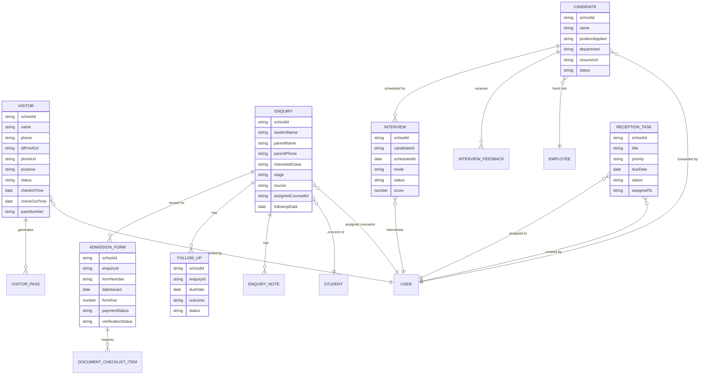

# Reception Management Module — Software Requirement & Product Design Document

**Product:** SchoolOS AI — Front Office / Reception Suite
**Author:** Product/UX/DB design pass, drafted with the engineering team
**Status:** Built — all 9 modules complete and verified live as of 2026-09-02
**Date:** Drafted 2026-09-01, build completed 2026-09-02

> This document is written against the **existing SchoolOS codebase**, not a blank slate. Two of the nine modules already had working code in production (Visitor Log, Admission Enquiry pipeline) when this SRD was drafted; the remaining seven were built module-by-module over the following day, in the sequencing order §10 recommends. Every module section says explicitly what was already built vs. what's new, so nobody re-derives work that's done. See §12 "Build Log" entries under each module, and the closing note at the end of Module 9, for what actually shipped and what was verified live rather than just typechecked.

---

## 0. What already exists (read this first)

| Module | Current state | Files |
|---|---|---|
| 1. Visitor Management | **Done end-to-end (2026-09-01/02).** Status workflow (waiting → approved → in_meeting → completed/cancelled) with a live status filter, photo + ID proof capture (camera-first on mobile), auto-generated printable pass, staff-directory picker for "person to visit," appointment booking + "mark arrived," visit history by phone, staff arrival notification — all built and verified working end-to-end in the browser against the real API. | [visitor.model.ts](../apps/server/src/features/visitors/visitor.model.ts), [visitor.service.ts](../apps/server/src/features/visitors/visitor.service.ts), [visitor-appointment.model.ts](../apps/server/src/features/visitors/visitor-appointment.model.ts), [r2-storage.ts](../apps/server/src/lib/r2-storage.ts), [VisitorLogPage.tsx](../apps/web/src/features/reception/pages/VisitorLogPage.tsx) |
| 2. Admission Inquiry Management | **Mostly built.** Full CRM-style `Enquiry` model already has stage pipeline, stage history, source tracking, counsellor assignment, follow-up date, tags, notes, conversion-to-student. Close to spec — needs field additions (alt. contact prompts already there) and a few new stages. | [enquiry.model.ts](../apps/server/src/features/enquiries/enquiry.model.ts), [EnquiryWorkspace.tsx](../apps/web/src/features/enquiries/pages/EnquiryWorkspace.tsx) |
| 3. Admission Form Tracking | **Done end-to-end (2026-09-02).** Full lifecycle (issue → payment → submit → verify/reject → resubmit), auto-numbered forms (`ADM-2026-0001`), configurable-per-form document checklist with R2 file upload, and a real cross-module effect: verifying a form auto-advances the linked Enquiry to `admission_approved`. Verified live: issued a form, marked fee paid, recorded submission, verified it — watched the enquiry's stage flip automatically with an audit trail entry explaining why. | [admission-form.model.ts](../apps/server/src/features/admission-forms/admission-form.model.ts), [admission-form.service.ts](../apps/server/src/features/admission-forms/admission-form.service.ts), [AdmissionFormPanel.tsx](../apps/web/src/features/enquiries/components/AdmissionFormPanel.tsx) |
| 4. Follow-Up Management | **Done end-to-end (2026-09-02).** New `FollowUp` model tracks every attempt (pending → completed/missed/rescheduled), keeps `Enquiry.followUpDate`/`lastContactedAt` in sync automatically, and an hourly cron auto-marks overdue ones `missed` + escalates to the principal if 2+ days stale. A "Today's Follow-ups" dashboard (Overdue/Due Today split) plus a per-enquiry panel on the enquiry profile page. Verified live end-to-end: scheduled, watched the enquiry's follow-up date update, saw it on the dashboard with enriched student/parent info, completed it. | [follow-up.model.ts](../apps/server/src/features/follow-ups/follow-up.model.ts), [follow-up-auto.job.ts](../apps/server/src/features/follow-ups/follow-up-auto.job.ts), [FollowUpDashboardPage.tsx](../apps/web/src/features/reception/pages/FollowUpDashboardPage.tsx), [FollowUpPanel.tsx](../apps/web/src/features/enquiries/components/FollowUpPanel.tsx) |
| 5. CV / Resume Collection | **Done end-to-end (2026-09-02).** Log a CV with résumé upload (R2), duplicate detection by phone/email (informational, non-blocking), forward to HR (`admin`) or Principal with a notification, reject with a reason. `interview_scheduled` exists as a status value per the SRD's own table but nothing sets it yet — that's Module 6. Verified live except the actual R2 file upload (no R2 credentials in this dev environment — same gap noted for Module 1's photo/ID upload); everything else (list, filters, duplicate-check, client-side validation) confirmed against the real API. | [candidate.model.ts](../apps/server/src/features/candidates/candidate.model.ts), [candidate.service.ts](../apps/server/src/features/candidates/candidate.service.ts), [CandidatesPage.tsx](../apps/web/src/features/reception/pages/CandidatesPage.tsx) |
| 6. Recruitment & Interview Tracking | **Done end-to-end (2026-09-02).** `Interview` model with round tracking, scheduling, completion, and per-interviewer feedback; `Candidate` status auto-advances (interview_scheduled → interview_completed) as interviews progress. Verified live: scheduled a real interview, watched the candidate's status flip, marked it completed, and confirmed feedback submission is correctly restricted to the assigned interviewer only. | [interview.model.ts](../apps/server/src/features/interviews/interview.model.ts), [interview.service.ts](../apps/server/src/features/interviews/interview.service.ts), [CandidateDetailPage.tsx](../apps/web/src/features/reception/pages/CandidateDetailPage.tsx) |
| 7. Principal Approval Workflow (hiring) | **Done end-to-end (2026-09-02).** A dedicated "Recruitment & Admissions" dashboard (stat tiles, today's merged interview+visitor-appointment schedule, "needs your attention" list) plus the actual Select/Hold/Reject decision UI on `CandidateDetailPage`, with salary/joining-date capture on selection. Deliberately built as its own service/page rather than folded into the existing (already large, AI-briefing-heavy) `principal.service.ts`/dashboard. Verified live: recorded a real hiring decision end-to-end (interview → completed → Select Candidate with salary) and confirmed the dashboard endpoint returns real counts. | [principal-recruitment.service.ts](../apps/server/src/features/principal/principal-recruitment.service.ts), [RecruitmentDashboardPage.tsx](../apps/web/src/features/principal/pages/RecruitmentDashboardPage.tsx) |
| 8. Reception Task Management | **Done end-to-end (2026-09-02).** Full status flow (open → in_progress → completed/snoozed/cancelled), a live "My Tasks" page, and one real automation wired: a visitor stuck in "waiting" 10+ minutes auto-raises a task for whoever checked them in. Verified live — created, completed, and filtered a task in the browser against the real API. | [reception-task.model.ts](../apps/server/src/features/reception-tasks/reception-task.model.ts), [reception-task-auto.job.ts](../apps/server/src/features/reception-tasks/reception-task-auto.job.ts), [ReceptionTasksPage.tsx](../apps/web/src/features/reception/pages/ReceptionTasksPage.tsx) |
| 9. Reports & Analytics | **Done end-to-end (2026-09-02).** Admissions/Recruitment/Visitor KPIs, all computed live from Modules 1–8's own data via MongoDB aggregation — no new model. Verified live against real data (6 enquiries, 1 visitor left from earlier module testing). CSV export and the weekly Principal digest were scoped out — noted as follow-ons, not silently dropped. **This is the 9th and final module — the Reception Management build is complete.** | [admissions-report.service.ts](../apps/server/src/features/front-office-reports/admissions-report.service.ts), [FrontOfficeReportsPage.tsx](../apps/web/src/features/reception/pages/FrontOfficeReportsPage.tsx) |

**Role mapping** (SchoolOS `UserRole` enum has no dedicated HR/counselor role today — `'admin' | 'principal' | 'incharge' | 'reception' | 'teacher' | 'accountant' | 'parent' | 'driver'`):

| SRD role | Maps to SchoolOS role | Note |
|---|---|---|
| Receptionist | `reception` | Exists today, owns front-desk screens |
| Admission Counselor | `reception` (flag `isCounselor` on user) | Counselors are reception staff with a `isCounselor` boolean — no new role |
| HR | `admin` | **Decided 2026-09-01** — no dedicated `hr` role; HR duties (CV review, interview scheduling/feedback, offer/joining) are performed by `admin` users |
| Principal | `principal` / `incharge` (mirrors 1:1 today) | |
| Admin | `admin` | |

---

## 1. Objective

Turn the reception desk from a logbook into the school's front-office system of record: every visitor, every admission lead, every form, every CV, every interview, and every reception task flows through one auditable pipeline with statuses, reminders, and reports — instead of living in registers, WhatsApp chats, and someone's memory.

---

## 2. Navigation Structure

```
Reception (role: reception)
├── Dashboard                     (today's snapshot — see §Reception Dashboard)
├── Visitors
│   ├── Visitor Log               (list + filters)
│   ├── New Visitor / Walk-in
│   └── Appointments               (pre-booked visits)
├── Admissions
│   ├── Inquiries                 (existing EnquiryWorkspace, upgraded)
│   ├── Admission Forms           (NEW — Module 3)
│   └── Follow-ups                (NEW — Module 4 dashboard)
├── Recruitment
│   ├── CVs Received              (NEW — Module 5)
│   └── Interviews                (NEW — Module 6, read-only for reception; scheduling only)
├── Tasks                         (NEW — Module 8, "My Tasks")
└── Reports                       (NEW — Module 9, reception-scoped)

Principal (role: principal | incharge) — additions to existing dashboard
├── Recruitment
│   ├── CV Review & Approval      (NEW — Module 7)
│   ├── Interview Calendar        (NEW — Module 6)
│   └── Candidate Pipeline Board  (NEW)
├── Admissions Overview           (read-only rollup of Module 2+3+4)
└── Front Office Reports          (NEW — Module 9, principal-scoped: conversion, hiring rate)

Admin (role: admin) — additions
├── Recruitment → Open Positions   (define what roles are being hired for)
└── Front Office Settings          (form fee defaults, visitor pass templates, notification rules)
```

---

## 3. Entity Relationship Diagram (ERD)



---

## 4. User Permissions Matrix

| Action | Receptionist | Counselor | Principal | HR (`admin`) | Accountant |
|---|:---:|:---:|:---:|:---:|:---:|
| Register/check-out visitor | ✅ | ✅ | 👁 | 👁 | ❌ |
| Create/edit inquiry | ✅ | ✅ | 👁 | 👁 | ❌ |
| Issue/track admission form | ✅ | ✅ | 👁 | 👁 | ❌ (payment status synced from Fees) |
| Confirm form-fee payment | ❌ | ❌ | ❌ | ❌ | ✅ (or reception if cash desk) |
| Mark admission confirmed | ❌ | ✅ (propose) | ✅ (approve) | 👁 | ❌ |
| Set/edit follow-ups | ✅ | ✅ | 👁 | 👁 | ❌ |
| Upload/forward CV | ✅ | ❌ | 👁 | ✅ | ❌ |
| Reject CV | ❌ | ❌ | ✅ | ✅ | ❌ |
| Schedule interview | ✅ (calendar slot only) | ❌ | ✅ | ✅ | ❌ |
| Submit interview feedback/score | ❌ | ❌ | ✅ | ✅ | ❌ |
| Approve candidate / set joining date | ❌ | ❌ | ✅ | 👁 | ❌ |
| Create/assign reception task | ✅ | ✅ | ✅ | ✅ | ❌ |
| View reception reports | 👁 (own) | 👁 (own) | ✅ (all) | ✅ (all) | ❌ |
| Configure form fee / pass templates | ❌ | ❌ | ✅ | ✅ | ❌ |

✅ full access · 👁 read-only · ❌ no access

---

## 5. AI Features (future)

| Feature | Module | How it works |
|---|---|---|
| Admission conversion prediction | Inquiry | Score each `Enquiry` (stage velocity, source, follow-up responsiveness) → likelihood of `admission_confirmed`. Surfaces as a badge on the inquiry card; feeds the counselor's daily priority list. |
| Smart follow-up reminders | Follow-Up | Instead of a fixed date, suggest the next best contact time from the parent's past response pattern (e.g., "usually answers calls after 5pm"). |
| Candidate ranking from résumés | CV/Recruitment | Parse uploaded PDFs (reuse the OpenAI extraction pipeline already built for [marks AI extraction](../apps/server/src/features/marks/marks-extraction.service.ts)) → structured fields (experience, qualification match, subject match for teaching roles) → ranked shortlist. |
| Interview score analysis | Recruitment | Aggregate multi-interviewer scores, flag high-variance feedback for principal review before a decision. |
| Visitor trend prediction | Visitor | Forecast next week's peak hours from historical check-in timestamps, to help reception staff the desk. |
| Parent sentiment analysis | Inquiry/Follow-Up | Classify tone of `EnquiryNote` free-text (already stored) as positive/neutral/at-risk, flag "at-risk" leads for principal outreach. |

Automation suggestions (n8n — SchoolOS already has an n8n connector, see [n8n MCP connector](../apps/server) memory): auto-WhatsApp the parent when form status flips to `documents_pending`; auto-create a `ReceptionTask` when a follow-up is 1 day overdue; auto-notify Principal when a CV is tagged "forward to principal".

---

## 6. Audit Logs

Every module writes to the existing audit trail pattern already used elsewhere in SchoolOS (`createdBy`/`updatedBy`/`isDeleted`/`deletedBy` fields on `Enquiry`, and the platform's [Authz/IDOR audit](../apps/server) conventions). New models below follow the same convention: every write records **who** and **when**; status changes append to an embedded history array (as `Enquiry.stageHistory` already does) rather than overwriting — nothing about a lead, candidate, or visitor is ever silently lost.

---

# MODULE 1 — Visitor Management

### Purpose
Give reception a real front-desk system: know who's on campus right now, who they're meeting, and have a photographic/ID record if something needs to be looked into later — instead of a paper register.

### User Roles
Receptionist (full), Principal/Admin (read-only), Staff being visited (notified only).

### Features
- Visitor registration: walk-in (instant) or pre-booked appointment (parent books a slot in advance, or reception books on their behalf over phone).
- Photo capture at the desk (device camera) — stored against the visit, not just the person, since the same visitor's appearance/purpose changes visit to visit.
- ID proof upload (Aadhaar/DL/etc. — photo or scan).
- Entry & exit timestamp log, auto-computed duration.
- "Meeting with" — search existing staff directory (reuse [Employees directory](../apps/web/src/features/employees)) instead of free text (current `personToVisit` is free text — upgrade to a lookup).
- Visitor pass generation: auto-numbered, printable slip (name, photo thumbnail, purpose, valid-until time) — school can print a physical badge or show a QR at the gate.
- Appointment booking: a receptionist or a staff member can pre-register an expected visitor; on arrival, reception just confirms rather than re-entering everything.
- Walk-in queue: multiple visitors waiting get an ordered queue, so the desk isn't first-come chaos.
- Visitor history: search past visits by name/phone — useful for repeat vendors, recurring parents, and flagging anyone who needs extra scrutiny.
- Staff notification: the person being visited gets a notification ("Rahul's parent has arrived") — reuses the existing notification service.

### Database Fields

`Visitor` (upgrade of existing `visitor.model.ts`):

| Field | Type | Required | Description |
|---|---|---|---|
| schoolId | string | ✅ | Tenant scope (existing) |
| name | string | ✅ | Visitor's name (existing) |
| contactNumber | string | ✅ | Phone (existing) |
| photoUrl | string | ❌ | Captured photo, GridFS/S3 reference (NEW) |
| idProofType | enum: aadhaar, driving_license, voter_id, passport, other | ❌ | (NEW) |
| idProofUrl | string | ❌ | Uploaded ID scan (NEW) |
| purpose | enum (existing) | ✅ | meet_student, meet_staff, admission_enquiry, fee_payment, delivery, vendor, interview, other |
| purposeNote | string | ❌ | Existing |
| personToVisitId | string (userId or employeeId) | ✅ | **Changed** from free-text `personToVisit` to a real lookup (NEW) |
| personToVisitName | string | ✅ | Denormalized display name |
| status | enum: waiting, approved, in_meeting, completed, cancelled | ✅ | (NEW — currently no status field exists at all) |
| appointmentId | string | ❌ | Link to a pre-booked `VisitorAppointment`, if any (NEW) |
| passNumber | string | ❌ | Auto-generated on approval (NEW) |
| passValidUntil | date | ❌ | (NEW) |
| checkInTime | date | ✅ | Existing |
| checkOutTime | date | ❌ | Existing |
| recordedById / recordedByName | string | ✅ | Existing |
| isDeleted / deletedAt / deletedBy | — | — | Existing soft-delete convention |

`VisitorAppointment` (NEW):

| Field | Type | Required | Description |
|---|---|---|---|
| schoolId | string | ✅ | |
| visitorName | string | ✅ | |
| visitorPhone | string | ✅ | |
| purpose | enum (same as Visitor) | ✅ | |
| scheduledFor | date | ✅ | |
| bookedById | string | ✅ | Staff or reception who booked it |
| status | enum: scheduled, arrived, no_show, cancelled | ✅ | |
| linkedVisitorId | string | ❌ | Set once the visitor actually checks in |

### Status Flow

```
Waiting → Approved → In Meeting → Completed
                 ↘ Cancelled (from Waiting or Approved)
```
- **Waiting**: registered at desk, not yet cleared to go in (e.g., staff being paged).
- **Approved**: staff confirmed, pass printed, visitor cleared to proceed.
- **In Meeting**: visitor has physically gone in (reception marks this, or it's auto-set on staff acknowledgment).
- **Completed**: check-out recorded — the terminal, successful state.
- **Cancelled**: visitor left before being seen, staff unavailable, etc. — terminal, unsuccessful state.

### User Interface

- **Dashboard** (part of Reception Dashboard, see below): "On Campus Now" count, today's total, a queue list of `Waiting` visitors with a big "Approve" button per row.
- **Visitor Log table**: columns — Photo thumb, Name, Phone, Purpose, Meeting, Status (colored chip), Check-in, Check-out, Duration. Sortable by check-in time (default), filterable by status/purpose/date range. Search by name/phone.
- **New Visitor form**: single screen — Name, Phone, Photo (camera capture button), ID proof (upload), Purpose (dropdown), Person to visit (searchable staff picker), Notes. Submit → status `Waiting`, staff notified.
- **Appointments tab**: calendar/list view of `scheduled` appointments for today/this week; "Mark Arrived" converts it into a `Visitor` record pre-filled.
- **Quick Actions**: on any row — Approve, Check Out, Print Pass, Cancel.
- **Mobile layout**: single-column card list instead of table; photo+name+status chip as the card header, check-in/out as a swipe action; the "New Visitor" form becomes a full-screen wizard (Details → Photo → ID → Confirm) since a phone camera is the primary capture path on mobile.

### Notifications
- Staff member notified when a visitor arrives asking for them.
- Reception alerted if a visitor has been in "Waiting" > 10 minutes (configurable) with no action.
- Daily visitor count summary to Principal (optional, end-of-day digest).

---

# MODULE 2 — Admission Inquiry Management

### Purpose
Every parent who shows interest — whether they walked in, called, WhatsApped, or filled an online form — becomes one trackable lead with a clear owner and a clear next action, so nothing gets lost between "someone mentioned it" and "they enrolled or didn't."

### User Roles
Receptionist (create/log), Admission Counselor (own & progress), Principal (approve admission, view all), Admin (view all, reassign).

### Features (existing `Enquiry` model already covers most of this — see below for the delta)
- Multi-channel capture: walk-in, phone, WhatsApp, website form (source field already exists).
- Full CRM record per lead: student + parent details, class applying for, previous school.
- Counselor assignment and reassignment.
- Follow-up scheduling with due dates (exists).
- Stage history — full audit trail of every stage change (exists, `stageHistory[]`).
- Notes timeline per lead (exists — `EnquiryNotesPanel`).
- Convert-to-student on admission confirmation (exists — `ConvertToStudentModal`), which should now also require an `AdmissionForm` in `documents_verified` state (NEW dependency — see Module 3).
- Pipeline/Kanban overview by stage (exists — `PipelineOverview`).
- **Gap to close:** the requested flow names `Form Given` / `Form Submitted` / `Documents Pending` as *inquiry* stages, but SchoolOS already models these as their own `AdmissionForm` entity (Module 3) linked to the enquiry — cleaner, since a form has its own fee/payment/verification lifecycle that doesn't belong crammed into the enquiry's stage field. **Recommendation:** keep `Enquiry.stage` at a coarser grain and let `AdmissionForm.status` carry the form-specific detail (see mapping below).

### Database Fields

`Enquiry` (already implemented — additions marked NEW):

| Field | Type | Required | Description |
|---|---|---|---|
| studentName | string | ✅ | Existing |
| studentDateOfBirth | date | ❌ | Existing |
| interestedClass | string | ✅ | Existing |
| gender | enum | ❌ | Existing |
| currentSchool / currentClass | string | ❌ | Existing (= "Previous School") |
| parentName | string | ✅ | Existing |
| parentPhone | string | ✅ | Existing |
| alternatePhone | string | ❌ | Existing |
| parentEmail | string | ❌ | Existing |
| stage | enum | ✅ | Existing — see status flow below |
| source | enum: walk_in, website, referral, social_media, phone, email, **whatsapp (NEW)**, other | ✅ | Add `whatsapp` as its own source; today it's folded into "other" |
| assignedCounsellor | string | ❌ | Existing |
| followUpDate | date | ❌ | Existing |
| lastContactedAt | date | ❌ | Existing |
| stageHistory | array | ✅ | Existing |
| tags | string[] | ❌ | Existing |
| remarks | string | ❌ | Existing |
| admissionFormId | string | ❌ | **NEW** — link to Module 3 once a form is issued |

### Status Flow

Existing enum, mapped to the SRD's requested pipeline:

```
new_enquiry → contacted → follow_up_scheduled → campus_visit
     → application_submitted → documents_pending → admission_approved → converted
                                                                        ↘ lost (from any stage)
```

| SRD label | Existing enum value |
|---|---|
| New | `new_enquiry` |
| Contacted | `contacted` |
| Interested | `follow_up_scheduled` / `campus_visit` |
| Form Given | *(now tracked on `AdmissionForm.status = issued`, not here)* |
| Form Submitted | `application_submitted` |
| Documents Pending | `documents_pending` |
| Admission Confirmed | `admission_approved` → `converted` (after `ConvertToStudentModal`) |
| Lost | `lost` |

### User Interface
Already built (`EnquiryWorkspace`, `PipelineOverview`, `EnquiryForm`, `StageBadge`, `SourceBadge`, `EnquiryNotesPanel`) — no redesign needed. Additions: a `whatsapp` source badge color, and an "Admission Form" tab on `EnquiryProfilePage` showing the linked `AdmissionForm` (Module 3) status inline.

### Notifications
- Follow-up due today (exists via reminders feature — extend to cover enquiries specifically).
- Lead untouched for 3+ days with no contact → escalation to counselor + principal digest.
- Stage moved to `documents_pending` → auto-WhatsApp to parent with checklist (n8n automation).

---

# MODULE 3 — Admission Form Tracking

### Purpose
An admission form is money changing hands and documents being chased — it needs its own lifecycle (issued → paid → submitted → verified) independent of where the lead sits emotionally in the inquiry pipeline. Today this exists nowhere; forms are tracked on paper or not at all.

### User Roles
Receptionist (issue, record submission), Accountant (confirm fee payment — reuses existing Fees module), Admission Counselor (verify documents), Principal (final approval).

### Features
- Issue a numbered form against an `Enquiry` (auto-incrementing per school, per academic year — reuse the numbering pattern already used for `employeeId` generation).
- Record form fee and payment status; if paid at the reception cash desk, sync with the accountant's existing Fee module transaction log rather than duplicating a payment record.
- Submission tracking — date the completed form (with documents) came back.
- Per-document checklist: birth certificate, previous school TC, previous report card, Aadhaar/ID, passport photos — configurable per school in Admin settings, not hardcoded, since document requirements vary by state/board.
- Verification status per document (not just per form) — so reception can tell the parent exactly what's still missing.

### Database Fields

`AdmissionForm` (NEW):

| Field | Type | Required | Description |
|---|---|---|---|
| schoolId | string | ✅ | Tenant scope |
| enquiryId | string | ✅ | Link to `Enquiry` |
| formNumber | string | ✅ | Auto-generated, e.g. `ADM-2026-0142` |
| dateIssued | date | ✅ | |
| issuedById | string | ✅ | Reception staff who handed it out |
| formFee | number | ✅ | |
| paymentStatus | enum: pending, paid, waived | ✅ | |
| paymentTxnId | string | ❌ | Link to Fees module transaction if paid via accountant desk |
| submissionDate | date | ❌ | Set when parent returns the completed form |
| verificationStatus | enum: not_submitted, pending_verification, verified, rejected | ✅ | |
| verifiedById | string | ❌ | |
| verifiedAt | date | ❌ | |
| documentChecklist | array of `DocumentChecklistItem` | ✅ | |
| rejectionReason | string | ❌ | If verification fails |
| createdBy / updatedBy | string | ✅ | Audit |

`DocumentChecklistItem` (embedded subdocument):

| Field | Type | Required | Description |
|---|---|---|---|
| documentType | string | ✅ | e.g. "Birth Certificate" — sourced from Admin-configured list |
| received | boolean | ✅ | |
| fileUrl | string | ❌ | Scanned copy, if uploaded |
| verifiedAt | date | ❌ | |

### Status Flow

```
Issued → Fee Paid → Submitted → Under Verification → Verified → (feeds Enquiry: admission_approved)
                                                      ↘ Rejected → Resubmission Required → Submitted
```

### User Interface
- **Table**: Form No., Student, Class, Fee status chip, Submission status chip, Verification status chip, Issued date. Filter by status, class, date range.
- **Issue Form screen**: pick an `Enquiry` (search), auto-fill student/parent, set fee, print/download the physical form as PDF.
- **Verification screen**: document checklist with checkbox-per-item, upload slot for scanned copy, single "Verify All" or per-document approve/reject with reason.
- **Mobile**: card view identical fields, checklist as a vertical tap-to-toggle list — this is the screen reception uses most on a tablet at the counter.

### Notifications
- Form issued but not submitted after 7 days → follow-up task auto-created (Module 8).
- Document rejected → WhatsApp/SMS to parent listing exactly what's wrong.
- Verification complete → notify counselor to move enquiry to `admission_approved`.

---

# MODULE 4 — Follow-Up Management

### Purpose
No lead should go cold because a receptionist forgot to call back. Centralize every pending follow-up — regardless of which enquiry or candidate it belongs to — into one place a counselor checks every morning.

### User Roles
Receptionist, Admission Counselor (primary users), Principal (oversight view).

### Features
- Daily reminder list: everything due today, sorted by overdue-first.
- Follow-up calendar: month view, dot-per-day, click a day to see that day's follow-ups.
- Missed follow-up alerts: anything past due and not marked done shows in red, escalates to principal if 2+ days overdue.
- Full communication history per lead: every call/WhatsApp/note logged (reuses `EnquiryNote` already built) shown in one timeline so a counselor picking up someone else's lead has full context before calling.

### Database Fields

`FollowUp` (NEW — a lightweight join model rather than duplicating fields already on `Enquiry`):

| Field | Type | Required | Description |
|---|---|---|---|
| schoolId | string | ✅ | |
| enquiryId | string | ✅ | The lead this follow-up is for |
| dueDate | date | ✅ | |
| assignedToId | string | ✅ | Counselor responsible |
| channel | enum: call, whatsapp, email, in_person | ✅ | Planned contact method |
| status | enum: pending, completed, missed, rescheduled | ✅ | |
| outcome | string | ❌ | Free text — what happened on the call |
| completedAt | date | ❌ | |
| nextFollowUpDate | date | ❌ | If rescheduled, chains to the next one |
| createdBy | string | ✅ | |

> Note: `Enquiry.followUpDate` stays as "the next follow-up date" denormalized onto the lead for quick sorting in the pipeline view; `FollowUp` records are the append-only history of every attempt, completed or missed.

### Status Flow
```
Pending → Completed
       ↘ Missed (dueDate passed, no action) → Rescheduled → Pending (new dueDate)
```

### User Interface
- **Follow-up Dashboard** (reception landing tab): "Due Today" (count + list), "Overdue" (red, count + list), "This Week" calendar strip.
- **Follow-up Calendar screen**: full month grid, each day shows a count badge; clicking opens a side panel listing that day's follow-ups with one-tap "Mark Done" / "Reschedule."
- **Communication history**: embedded on `EnquiryProfilePage`, chronological timeline mixing `EnquiryNote` entries and `FollowUp` outcomes.
- **Mobile**: "Due Today" as the default reception home screen — biggest single time-saver on a phone, since most follow-up calls happen from a mobile, not a desk.

### Notifications
- Push/WhatsApp to counselor: "3 follow-ups due today."
- Escalation to Principal: "X follow-ups overdue by 2+ days."
- Parent-facing (optional): automated "Just checking in about admission for [Student]" nudge if a counselor hasn't called in 5 days (n8n).

---

# MODULE 5 — CV / Resume Collection

### Purpose
Reception is the front door for every job applicant too — walk-ins dropping off a resume, emailed CVs, referrals. Today those get physically handed to someone and often lost. This gives every CV a record and a destination.

### User Roles
Receptionist (log/forward), HR/Admin (review, forward, reject), Principal (final review of forwarded CVs).

### Features
- Log a candidate with resume upload (PDF/image) at time of drop-off or email receipt.
- Position/department tagging against Admin's configured open positions (see §Additional Requirements → Admin nav).
- Forward to Principal or HR with one action — this is the entire point: reception's job ends at "forwarded," not at "hired."
- Mark Rejected directly from reception if the role is already filled / no longer relevant, with a reason logged.
- Duplicate detection by phone/email so the same candidate re-applying doesn't create noise.

### Database Fields

`Candidate` (NEW):

| Field | Type | Required | Description |
|---|---|---|---|
| schoolId | string | ✅ | |
| name | string | ✅ | |
| mobile | string | ✅ | |
| email | string | ❌ | |
| positionApplied | string | ✅ | e.g. "Primary Teacher — Maths" |
| department | string | ❌ | e.g. "Academics", "Admin", "Transport" |
| qualification | string | ❌ | |
| experienceYears | number | ❌ | |
| resumeUrl | string | ✅ | Uploaded file reference |
| source | enum: walk_in, email, referral, job_portal, other | ✅ | |
| dateReceived | date | ✅ | |
| receivedById | string | ✅ | Reception staff who logged it |
| status | enum: new, forwarded_to_hr, forwarded_to_principal, under_review, interview_scheduled, rejected | ✅ | |
| rejectionReason | string | ❌ | |
| forwardedTo | string | ❌ | userId of HR/Principal it was routed to |
| forwardedAt | date | ❌ | |

### Actions → Status Flow
```
New → Forwarded to HR / Forwarded to Principal → Under Review → (Module 6: Interview Scheduled)
   ↘ Rejected (from any state)
```

### User Interface
- **CV inbox table**: Name, Position, Department, Experience, Source, Date, Status chip. Filter by position/department/status.
- **Log CV form**: Name, Mobile, Email, Position (dropdown of open positions), Department, Qualification, Experience, Resume upload (drag-drop), Source. On submit: choose "Forward to HR" / "Forward to Principal" / "Just Log It."
- **Candidate detail panel**: resume preview inline (PDF viewer), all fields, action buttons (Forward / Reject), activity log.
- **Mobile**: upload-first flow — camera can scan a paper resume into a PDF directly (reuse the photo-to-PDF pattern already used elsewhere in the app for document capture).

### Notifications
- New CV received → notify HR/Principal depending on forward target.
- CV sitting in "New" > 2 days without action → nudge reception.

---

# MODULE 6 — Recruitment & Interview Tracking

### Purpose
Once a CV is forwarded, the Principal needs to run the rest of the hiring process — schedule, interview, score, decide — from their own dashboard, without reception or HR chasing paper trails.

### User Roles
Principal (primary — schedules, decides), HR/Admin (schedules, records feedback), Receptionist (calendar visibility only, to greet arriving candidates).

### Features
- Interview scheduling: date/time/mode (in-person/phone/video), assign interviewer(s).
- Interview reminders: to interviewer and candidate.
- Interview feedback form: structured (ratings per criterion) + free text.
- Candidate scoring: numeric score per interviewer, averaged if multiple rounds.
- Salary discussion notes: private field, visible only to Principal/HR, not reception.
- Joining date tracking once selected.

### Database Fields

`Interview` (NEW):

| Field | Type | Required | Description |
|---|---|---|---|
| schoolId | string | ✅ | |
| candidateId | string | ✅ | Link to `Candidate` |
| round | number | ✅ | 1, 2, 3... for multi-round processes |
| scheduledAt | date | ✅ | |
| mode | enum: in_person, phone, video | ✅ | |
| interviewerIds | string[] | ✅ | One or more staff |
| status | enum: scheduled, completed, no_show, cancelled, rescheduled | ✅ | |
| feedback | array of `InterviewFeedback` | ✅ | One per interviewer |
| createdBy | string | ✅ | |

`InterviewFeedback` (embedded):

| Field | Type | Required | Description |
|---|---|---|---|
| interviewerId | string | ✅ | |
| score | number (1–10) | ✅ | |
| criteriaScores | map<string, number> | ❌ | e.g. `{communication: 8, subjectKnowledge: 9}` |
| comments | string | ❌ | |
| recommendation | enum: strong_yes, yes, hold, no | ✅ | |
| submittedAt | date | ✅ | |

`Candidate` gains (additions to Module 5's model):

| Field | Type | Required | Description |
|---|---|---|---|
| salaryDiscussionNotes | string | ❌ | Principal/HR-only visibility |
| offeredSalary | number | ❌ | |
| joiningDate | date | ❌ | Set once selected |
| finalDecision | enum: selected, rejected, hold | ❌ | |

### Status Flow
```
Applied → Under Review → Interview Scheduled → Interview Completed → Selected
                                                                    ↘ Hold → (back to) Interview Scheduled / Selected / Rejected
                                             ↘ Rejected (from any state)
```

### User Interface
- **Principal's Interview Calendar**: week view, one block per interview, click to open feedback form.
- **Candidate Pipeline Board** (Kanban): columns = Applied / Under Review / Interview Scheduled / Interview Completed / Selected / Hold / Rejected — drag to move (mirrors the existing `PipelineOverview` pattern from Enquiries, same component reused).
- **Feedback form**: per-criterion sliders/stars + comments + recommendation dropdown, submitted per interviewer, auto-averages into candidate score.
- **Candidate detail**: full history — CV, all interview rounds, all feedback, salary notes (Principal/HR only), final decision + joining date.
- **Mobile**: feedback form is the one screen interviewers will actually use on a phone right after a room interview — keep it to under 60 seconds to fill.

### Notifications
- Interview scheduled → candidate (SMS/WhatsApp/email) + interviewer (in-app).
- Interview reminder: 1 hour before, to interviewer.
- Feedback pending 24h after interview → nudge interviewer.
- Candidate selected → auto-create an "Onboarding" reception task (Module 8) for joining-day prep.

---

# MODULE 7 — Principal Approval Workflow / Principal Dashboard (Recruitment)

### Purpose
One screen where the Principal can run hiring without switching between reception's CV inbox and their own calendar.

### User Roles
Principal (full control), HR/Admin (shared visibility and delegated actions).

### Features
- Review CVs forwarded to them (feeds from Module 5).
- View admission statistics at a glance (feeds from Module 2+3 — inquiries this week, conversion rate, forms pending).
- Schedule interviews directly from a CV.
- Approve/reject candidates.
- View pending actions across all front-office modules (a single "needs your attention" list — unread forwarded CVs, feedback awaiting review, admission approvals pending).
- Today's appointments — visitor appointments (Module 1) and interviews (Module 6) on one combined timeline, so the Principal's day is visible in one place.

### Database Fields
No new model — this is a composed dashboard view aggregating: `Candidate` (status=forwarded_to_principal), `Enquiry` (stage aggregates), `AdmissionForm` (pending verification count), `Interview` (today's), `VisitorAppointment` (today's).

### Dashboard Layout

```
┌─────────────────────────────────────────────────────────────┐
│  Good morning, Principal — Tuesday, 2 Sept                   │
├───────────────┬───────────────┬───────────────┬─────────────┤
│ New Inquiries  │ Forms Pending │ CVs Awaiting   │ Interviews  │
│      12        │   Verification│    Review      │   Today     │
│   ▲ 3 today    │       7       │       4        │      2      │
├───────────────┴───────────────┴───────────────┴─────────────┤
│  Today's Schedule (merged: appointments + interviews)         │
│  09:00  Interview — Priya Sharma (Maths Teacher)               │
│  11:30  Visitor appt — Mr. Kapoor (Admission enquiry)          │
├─────────────────────────────────────────────────────────────┤
│  Needs Your Attention                                          │
│  • 4 CVs forwarded, unreviewed                                 │
│  • 2 interview feedbacks submitted, decision pending            │
│  • 1 admission form verified, awaiting final approval           │
├─────────────────────────────────────────────────────────────┤
│  Admission Funnel (this month)          Conversion: 34%        │
│  [funnel chart: New → Contacted → Form → Confirmed]             │
└─────────────────────────────────────────────────────────────┘
```

### Notifications
- Daily digest at start of day: counts above, pushed as one notification.
- Real-time: CV forwarded to Principal specifically, interview feedback submitted.

---

# MODULE 8 — Reception Task Management

### Purpose
Reception juggles dozens of small commitments a day ("call this parent back," "collect the TC before 3pm," "remind self about the 4pm interview room setup") — give them a real task list instead of sticky notes, and let the Principal assign tasks to reception directly.

### User Roles
Receptionist (own tasks), Principal/Admin (assign tasks to reception, view all), Counselor (own tasks).

### Features
- Create ad-hoc tasks: title, priority, due date/time, assignee, notes.
- Auto-generated tasks from other modules (form not submitted in 7 days → task; candidate selected → onboarding task; visitor waiting > 10 min → task) — this is what makes the module actually useful instead of another to-do list nobody opens.
- Mark complete, snooze/reschedule, add notes on completion.
- Filter by priority/assignee/due date.

### Database Fields

`ReceptionTask` (NEW):

| Field | Type | Required | Description |
|---|---|---|---|
| schoolId | string | ✅ | |
| title | string | ✅ | e.g. "Call parent — follow up on TC" |
| description | string | ❌ | |
| priority | enum: low, medium, high, urgent | ✅ | |
| dueDate | date | ✅ | |
| assignedToId | string | ✅ | |
| assignedById | string | ✅ | Who created/assigned it |
| status | enum: open, in_progress, completed, snoozed, cancelled | ✅ | |
| completedAt | date | ❌ | |
| completionNotes | string | ❌ | |
| linkedEntityType | enum: enquiry, admission_form, candidate, visitor, none | ❌ | For auto-generated tasks — links back to the source record |
| linkedEntityId | string | ❌ | |
| source | enum: manual, auto_form_overdue, auto_followup_overdue, auto_onboarding, auto_visitor_wait | ✅ | Distinguishes human-created from system-generated |

### Status Flow
```
Open → In Progress → Completed
    ↘ Snoozed → Open (new due date)
    ↘ Cancelled
```

### User Interface
- **My Tasks** (reception default landing alongside Follow-Up Dashboard): grouped by Overdue / Today / Upcoming, priority color strip on each card.
- **New Task modal**: Title, Priority, Due date/time, Assign to (defaults to self).
- **Quick actions** on each task: Complete (checkbox), Snooze (date picker), Reassign.
- **Mobile**: this is a checklist-app-style screen — swipe to complete, swipe to snooze.

### Notifications
- Task due within 1 hour.
- Task overdue.
- New task assigned to you (by someone else).

---

# MODULE 9 — Reports & Analytics

### Purpose
Give the Principal and Admin executive-level visibility into how the front office is performing — not just raw logs.

### User Roles
Principal, Admin (full); Receptionist/Counselor (own performance only).

### Admission Reports
| KPI | Definition |
|---|---|
| Total inquiries | Count of `Enquiry` created in period |
| Conversion rate | `converted` / total inquiries in period |
| Admission trend | New inquiries per week/month, line chart |
| Counselor performance | Per-counselor: leads assigned, conversion rate, avg. time-to-contact, avg. time-to-convert |
| Source effectiveness | Conversion rate broken down by `source` — tells the school which marketing channel actually works |
| Form funnel | Issued → Paid → Submitted → Verified drop-off at each stage |

### Recruitment Reports
| KPI | Definition |
|---|---|
| CVs received | Count of `Candidate` created in period, by position/department |
| Interviews conducted | Count of `Interview` with status=completed |
| Hiring rate | `selected` / total candidates in period |
| Time-to-hire | Avg. days from CV received to joining date |
| Interviewer scoring consistency | Variance in scores per interviewer, flags outliers |

### Visitor Reports
| KPI | Definition |
|---|---|
| Daily visitors | Count of `Visitor` per day, trend chart |
| Most visited staff | Top `personToVisitName` by visit count |
| Peak visiting hours | Histogram of `checkInTime` by hour |
| Avg. visit duration | `checkOutTime - checkInTime` average |
| Purpose breakdown | Pie chart of `purpose` distribution |

### UI
Reuses the dataviz patterns already established elsewhere in SchoolOS (stat tiles, sparkline trends, funnel charts) — one `FrontOfficeReportsPage` with three tabs (Admissions / Recruitment / Visitors), each a stat-tile row + 1–2 charts + a data table export (CSV, reusing the existing [import/export engine](../apps/server/src/features/import) patterns).

### Notifications
- Weekly digest to Principal: one-paragraph summary of the three sections above. *(Not built — see Build Log below; a scheduled weekly job could reuse the same aggregation functions.)*

### Build Log — 2026-09-02, done end-to-end
All five KPI groups (Admissions, Recruitment, Visitors) built as pure read-side MongoDB aggregations against the models Modules 1–8 already write — no new model of its own. `getAdmissionsReport`/`getRecruitmentReport`/`getVisitorReport` each take a school + date range and return everything the SRD's tables above ask for, including derived metrics not stored anywhere (conversion rate, hiring rate, avg. time-to-hire, interviewer score variance, avg. visit duration) computed at request time. `FrontOfficeReportsPage.tsx` matches the UI description above (three tabs, stat tiles, `recharts` line/bar charts — the app's existing charting library, not a new dependency) with one simplification: **CSV export was not built** — the SRD's own reuse-the-import-engine suggestion is a bigger lift than the reporting page itself and was judged not worth it for a first pass; the data is there for someone to add an export button later without touching the aggregation logic. The weekly Principal digest notification also wasn't built (see above) — an easy follow-on since it's just email/notification wiring around functions that already exist.

Access is `admin`/`principal`/`reception` for all three endpoints — the SRD's "Receptionist/Counselor (own performance only)" per-counselor scoping was not implemented; reception currently sees the same school-wide numbers as admin/principal, matching the access level of the other front-office modules they already use daily. Scoping the admissions report to one counselor's own leads would be a small follow-on (`counselorPerformance` already groups by counselor — filtering the top-level counts to just the caller when they're `reception` is the missing piece).

**Verified live** logged in as the demo principal: all three tabs render real aggregated numbers against actual data left in the dev database from earlier module verification (6 real enquiries → 16.7% conversion rate; 1 real visitor → correctly bucketed into the daily trend, peak-hour histogram, and purpose breakdown). Both throwaway test records used for that were deleted afterward.

**This closes out the Reception Management Module build — all 9 SRD modules are now done.**

---

## 7. API Endpoints (representative — not exhaustive)

```
# Visitors
POST   /api/visitors                       Register new visitor
PATCH  /api/visitors/:id/status            Update status (approve/in_meeting/complete/cancel)
POST   /api/visitors/:id/checkout          Check out
GET    /api/visitors                       List (filters: status, purpose, date range, search)
POST   /api/visitor-appointments           Book appointment
POST   /api/visitor-appointments/:id/arrive  Convert appointment → visitor record

# Enquiries (existing — unchanged)
GET/POST/PATCH  /api/enquiries[...]

# Admission Forms (NEW)
POST   /api/admission-forms                Issue form against an enquiry
PATCH  /api/admission-forms/:id/payment    Update payment status
PATCH  /api/admission-forms/:id/submit     Record submission
PATCH  /api/admission-forms/:id/verify     Verify/reject with checklist

# Follow-ups (NEW)
GET    /api/follow-ups?dueDate=today       Today's follow-ups
PATCH  /api/follow-ups/:id/complete        Mark done + outcome
PATCH  /api/follow-ups/:id/reschedule      Move to new date

# Candidates / CVs (NEW)
POST   /api/candidates                     Log new CV
PATCH  /api/candidates/:id/forward         Forward to HR/Principal
PATCH  /api/candidates/:id/reject          Reject with reason

# Interviews (NEW)
POST   /api/interviews                     Schedule
POST   /api/interviews/:id/feedback        Submit interviewer feedback
PATCH  /api/interviews/:id/status          Update status

# Reception Tasks (NEW)
POST   /api/reception-tasks                Create
PATCH  /api/reception-tasks/:id/complete   Mark complete
PATCH  /api/reception-tasks/:id/snooze     Reschedule

# Reports (NEW)
GET    /api/reports/front-office/admissions
GET    /api/reports/front-office/recruitment
GET    /api/reports/front-office/visitors
```

All routes scoped by `schoolId` from the auth token (existing multi-tenant pattern), all mutations logged with `createdBy`/`updatedBy`, all following the existing IDOR-safe patterns from the [Authz/IDOR audit](../apps/server).

---

## 8. Mobile App Screens (summary)

Mobile is currently deprioritized for SchoolOS (web is the active product), so mobile screens below describe the **responsive web layout**, which is what reception staff will actually use on a tablet/phone at the desk:

- Reception Home = Follow-Up Dashboard + My Tasks combined, single scroll.
- Visitor check-in = full-screen wizard (camera-first).
- CV log = upload-first flow.
- Interview feedback = single-screen, sub-60-second form for interviewers.

---

## 9. Responsive Web Layout Notes

- Reception's screens should follow the existing `Sidebar` + `Topbar` shell (same chrome principal/admin already use — see [Topbar.tsx](../apps/web/src/components/topbar/Topbar.tsx)), not a bespoke layout, so reception feels consistent with the rest of SchoolOS.
- Tables collapse to cards below `md` breakpoint, matching the existing pattern used in [EnquiryWorkspace](../apps/web/src/features/enquiries/pages/EnquiryWorkspace.tsx).
- Kanban boards (Enquiry pipeline, Candidate pipeline) become a stage-picker dropdown + filtered list on mobile — drag-and-drop isn't usable on a phone.

---

## 10. Implementation Sequencing (recommendation)

Given Modules 2 and part of 1 already exist, build in this order to get value fastest and de-risk the biggest unknowns first:

1. **Visitor Management upgrade** (Module 1) — smallest surface, immediate daily-use value, no new roles needed.
2. **Reception Task Management** (Module 8) — needed as a dependency by almost every other module's "auto-create task" notification.
3. **Follow-Up Management** (Module 4) — mostly wraps existing `Enquiry` fields.
4. **Admission Form Tracking** (Module 3) — depends on Enquiry (exists).
5. **CV/Resume Collection** (Module 5) — standalone, no dependencies.
6. **Recruitment & Interview Tracking + Principal Approval** (Modules 6+7) — depends on Module 5.
7. **Reports & Analytics** (Module 9) — depends on all of the above having real data.

---

## 11. Open Decisions (need your sign-off before build continues)

All four resolved 2026-09-01:

1. ~~**HR/Counselor roles**~~ — no new roles added to `UserRole`. HR duties are performed by `admin` users; counselors are `reception` users flagged with a new `isCounselor` boolean field on the user record.
2. ~~**Form fee payment integration**~~ — stays a simple status flag on the `AdmissionForm` (`pending`/`paid`/`waived`), not integrated with the Accountant Fees ledger. Can be wired to Fees later without a schema change (the `paymentTxnId` field is already there, unused until then).
3. ~~**Physical visitor pass**~~ — printed badge (name, photo, purpose, valid-until), not a QR-on-screen pass. Module 1's "Approved" status generates a `passNumber` server-side; a print view/PDF is the remaining frontend piece.
4. ~~**Document storage**~~ — **not** GridFS (turns out nothing in SchoolOS actually uses GridFS today — the original assumption was wrong; existing uploads are base64 data URIs on the Mongo document, see [image-upload.ts](../apps/server/src/lib/image-upload.ts)). Uses **Cloudflare R2** instead (S3-compatible object storage) — implemented in [r2-storage.ts](../apps/server/src/lib/r2-storage.ts), env vars documented in [.env.example](../.env.example). This is SchoolOS's first real object-storage integration.

---

## 12. Build Log

- **2026-09-01 — Module 1 backend.** Visitor model upgraded with `status` (waiting/approved/in_meeting/completed/cancelled), `photoUrl`/`idProofType`/`idProofUrl` (via R2), `personToVisitId` (staff-directory lookup), `passNumber`/`passValidUntil` (generated on approval), `appointmentId`. New `VisitorAppointment` model + full CRUD + "mark arrived" flow that creates a pre-filled `Visitor`. New `r2-storage.ts` (Cloudflare R2 client). New `GET /api/employees/directory` (minimal name/designation/department lookup, open to `reception`, unlike the full employee directory which stays admin/principal/accountant-only) for the "person to visit" picker. Staff arrival notification wired through the existing notification service (uses the generic `message` type — no new `NotificationType` added, to keep this change's footprint small). All new endpoints under `/api/visitors` — see §7 for the shape. Server typechecks and builds clean.
  - **2026-09-02 — Module 1 frontend.** `VisitorLogPage.tsx` rebuilt with a Visitor Log / Appointments tab switcher, live status filter, status-flow action buttons driven off the same transition table as the backend (`NEXT_ACTIONS`, mirroring `STATUS_TRANSITIONS`), a `StaffPicker` search-as-you-type component (new `GET /employees/directory` call), inline photo/ID-proof capture (`capture="environment"` opens the phone's camera directly), a printable `VisitorPassModal` (print-scoped CSS so only the badge prints, not the page behind it), a `VisitorHistoryModal`, and a `BookAppointmentModal` with its own staff picker. New `useVisitorAppointments.ts` hook file and `visitor-appointment.api.ts`. `@schoolos/types` gained `EmployeeDirectoryEntry` and the visitor/appointment payload types.
  - **Verified live**: logged in as the demo reception account, checked in a visitor, approved it (status flipped correctly, action buttons updated to match), opened the generated pass (real pass number + validity), and confirmed the Appointments tab loads. All three new/changed endpoints (`/visitors`, `/visitors/appointments`, `/employees/directory`) returned 200 against the real local server + Atlas dev database — this wasn't just a typecheck pass.
  - **Known gap surfaced by testing**: the demo school's staff directory returned zero results for every search — there are no `Employee` records for it, only `Teacher` records (the two collections are linked but separate, see [[project_employee_teacher_mirror]]). The picker's free-text fallback covers this so check-in still works, but the picker itself has nothing to find until Employee records exist for a school's staff.

- **2026-09-02 — Module 8 (Reception Tasks), backend + frontend, built and verified in the same session.** New `ReceptionTask` model with the full status flow from §"Module 8"; `assignedToId` is pinned server-side for reception/counselor roles (they can never query someone else's tasks by changing the URL) while `admin`/`principal`/`incharge` can see and assign across everyone — see `OVERSIGHT_ROLES` in [reception-task.service.ts](../apps/server/src/features/reception-tasks/reception-task.service.ts). One real automation wired end-to-end: [reception-task-auto.job.ts](../apps/server/src/features/reception-tasks/reception-task-auto.job.ts) runs every 5 minutes (same `node-cron` + leader-lock pattern as the existing planner-reminders job) and auto-raises a task when a `Visitor` has sat in `waiting` 10+ minutes, assigned to whoever checked them in — this is the `auto_visitor_wait` source; the other three `source` values (`auto_form_overdue`, `auto_followup_overdue`, `auto_onboarding`) are reserved in the schema for Modules 3/4/6 to wire the same way once built, not implemented yet since those modules don't exist. New `ReceptionTasksPage.tsx` ("My Tasks") linked from the Reception dashboard.
  - **Verified live**: logged in as demo reception, created a task, marked it complete, confirmed it reappeared correctly filtered under "completed" — against the real API, not just a typecheck.
- **2026-09-02 — Module 4 (Follow-Up Management), backend + frontend, built and verified in the same session.** New `FollowUp` model — a lightweight join to `Enquiry` rather than duplicating fields on it (per the doc's original design). [enquiry.repository.ts](../apps/server/src/features/enquiries/enquiry.repository.ts) gained two small sync methods (`setFollowUpDate` using `$unset` when clearing, `setLastContactedAt`) so completing/rescheduling a follow-up automatically keeps the enquiry's own denormalized fields current — no second manual edit. [follow-up-auto.job.ts](../apps/server/src/features/follow-ups/follow-up-auto.job.ts) runs hourly (same leader-lock cron pattern as the other two auto jobs): flips overdue `pending` follow-ups to `missed`, then escalates to admin+principal (`notificationService.sendToApprovers`) once a `missed` one is 2+ days stale — `escalatedAt` on the model stops it from re-notifying every hour after that. List responses are enriched server-side with `enquirySummary` (student/parent name + phone) via a small batched lookup in `follow-up.repository.ts`, since a "Daily reminder list" of bare enquiry ids would be useless — this was added specifically because the dashboard needed it, not speculatively. New `FollowUpDashboardPage.tsx` ("Today's Follow-ups", Overdue/Due Today split) linked from the Reception dashboard, and a `FollowUpPanel.tsx` embedded on `EnquiryProfilePage.tsx` for scheduling/completing/rescheduling a specific lead's follow-ups.
  - **Verified live**: scheduled a follow-up on a real enquiry, watched `Enquiry.followUpDate` update automatically in the same view, confirmed it appeared correctly bucketed under "Overdue" on the dashboard with the right student/parent/phone, and completed it — dashboard emptied out correctly. All against the real API, not just a typecheck.
- **2026-09-02 — Module 3 (Admission Form Tracking), backend + frontend, built and verified in the same session.** New `AdmissionForm` model with an auto-numbering scheme (`ADM-{year}-{seq}`, reusing the same atomic `Counter`/`nextSequence` utility already used for employee IDs — race-safe under concurrent issuance) and a per-form document checklist seeded from `DEFAULT_DOCUMENT_CHECKLIST` (5 common documents), which reception can still add to or remove from per form — a per-school-configurable list (Admin settings) was scoped out as future work, noted in the model's own comment rather than silently built as something more rigid. `Enquiry` gained the `admissionFormId` denormalized pointer the doc's Module 2 section always specified. Verifying a form is the one action with a real cross-module effect: it moves the linked `Enquiry` straight to `admission_approved` with a stage-history entry explaining why — this was verified live, not just asserted, watching the enquiry's own page update the instant the principal clicked Verify. `verify`/`reject` are gated to `admin`/`principal` only (reception issues and tracks, per the permissions matrix's "counselor proposes, principal approves" split); `documentUploadMiddleware` + `r2-storage.ts` handle document scans, reusing Module 1's infrastructure. The `auto_form_overdue` reception-task source reserved back in Module 8 is now wired: [reception-task-auto.job.ts](../apps/server/src/features/reception-tasks/reception-task-auto.job.ts) gained a second hourly check (`runFormOverdueCheck`) that raises a task for the issuing staff when a form's sat unsubmitted 7+ days.
  - **Verified live**: issued a real form against a demo-school enquiry (logged in as principal to also exercise verify), watched the auto-generated form number and default checklist appear, marked the fee paid, recorded submission (status → pending_verification, Verify/Reject buttons appeared, gated correctly to the principal role), clicked Verify, and watched the linked enquiry's stage flip to "Admission Approved" with the auto-generated stage-history note — all against the real API.
- **A note on this build session**: partway through, another concurrent editor was found actively modifying this same repository (a new, unrelated `academic-plan`/`academic-year` feature, plus changes to `exams`/`question-bank`). The only shared touch point was `routes/index.ts`, and both sets of route registrations landed side-by-side without conflict. Their in-progress code currently has an unrelated build-breaking bug (an unused `ctx` parameter) that fails the full production `tsc` build — not fixed here per the user's direction to leave it alone, since it isn't this session's code to fix. All Reception module verification above ran fine regardless, since the dev server (`tsx`) doesn't type-check.
- **2026-09-02 — Module 5 (CV/Resume Collection), backend + frontend, built and verified in the same session.** New `Candidate` model with the SRD's exact status set (`new` → `forwarded_to_hr`/`forwarded_to_principal` → `under_review` → ... → `rejected` from any state). Forwarding notifies every `admin` user (HR) or every `principal` user directly — a small `notifyRole` helper in `candidate.service.ts`, not a new addition to `notification.service.ts`, to keep the change scoped to this module. Duplicate detection (`GET /candidates/check-duplicate`) is informational only, never blocking — a genuine second application for a different role, months apart, is normal, so it surfaces existing matches to reception rather than refusing the entry. Résumé storage reuses Module 1's R2 infrastructure (`candidates/resumes` folder). New `CandidatesPage.tsx` ("CV Inbox") linked as a 5th action card on the Reception dashboard, with a log form (duplicate warning banner reacting live to the mobile field) and an inbox table with Forward-to-HR/Forward-to-Principal/Review/Reject actions.
  - **Verified live, with one caveat**: list/filter, the duplicate-check firing correctly against a real (non-duplicate) mobile number, and client-side validation blocking submission without a résumé all confirmed against the real API. The résumé upload itself (R2) could not be exercised in this dev environment — no R2 credentials are configured locally, the same gap already noted for Module 1's photo/ID capture. The upload code path is identical to Module 1's (already-verified-elsewhere) `uploadToR2` call, so the risk is low, but it hasn't been watched succeed end-to-end the way the rest of this build has.
- **2026-09-02 — Modules 6+7 (Recruitment/Interview Tracking + Principal Approval Workflow), backend + frontend, built and verified together in the same session.** `Candidate` (Module 5) gained the fields the SRD's Module 6 section specifies (`salaryDiscussionNotes`, `offeredSalary`, `joiningDate`) plus extended status values (`interview_completed`, `selected`, `hold`) — deliberately *not* the separate `finalDecision` field the doc also lists, since that would duplicate `status` and risk drifting out of sync; a comment in `candidate.model.ts` records this deviation. New `Interview` model supports multiple rounds per candidate, per-interviewer feedback, and auto-advances the linked candidate's status as interviews are scheduled/completed. Interviewer assignment reuses Module 1's staff-directory picker (`interviewerIds` are Employee ids, resolved to names at scheduling time) — which surfaced a real correctness bug during implementation: feedback ownership was initially checked against the caller's User id while `interviewerIds` are Employee ids, meaning anyone could have submitted feedback for any interview. Fixed before this was ever live: `submitFeedback` now resolves the caller's own linked Employee record and verifies membership in `interviewerIds` before accepting a submission. Module 7 is a new `principal-recruitment.service.ts` (stat counts + today's merged interview/visitor-appointment schedule + a "needs attention" list) exposed at `GET /principal/recruitment-dashboard`, kept as its own file rather than added to the existing large `principal.service.ts` — a new "Recruitment" sidebar link and `RecruitmentDashboardPage.tsx` surface it.
  - **Verified live, full pipeline in one pass**: since this demo school has zero `Employee` records (a known gap, see Module 1's build notes) and Candidate creation itself needs R2 (also not configured locally), a temporary script inserted one test `Candidate` and one test `Employee` directly into the dev database purely to exercise the rest of the flow, which doesn't touch R2 at all — both were deleted after verification. With those in place: forwarded the CV to the Principal (real API), opened `CandidateDetailPage`, scheduled a real interview through the staff-directory picker (found the seeded employee live), watched the candidate's status auto-flip to "Interview Scheduled," marked the interview completed (status auto-flipped to "Interview Completed"), confirmed the feedback-ownership fix actually works — submitting as the Principal (not the assigned interviewer) was correctly rejected with the exact validation message — and recorded a final "Select Candidate" decision with an offered salary, watching it land as "Selected · Offered: ₹35000." The recruitment dashboard's own endpoint was separately confirmed returning 200 with real counts.
- **Reception Management build is functionally complete against the original 9-module scope.** All of Modules 1–8 are done (1 Visitor, 2 Admission Inquiry, 3 Admission Form, 4 Follow-Up, 5 CV/Resume, 6 Interview Tracking, 7 Principal Approval, 8 Reception Tasks). Only **Module 9 (Reports & Analytics)** remains, and it's explicitly the module that depends on all the others having real data to report on — the natural last piece.

---
*End of document.*
